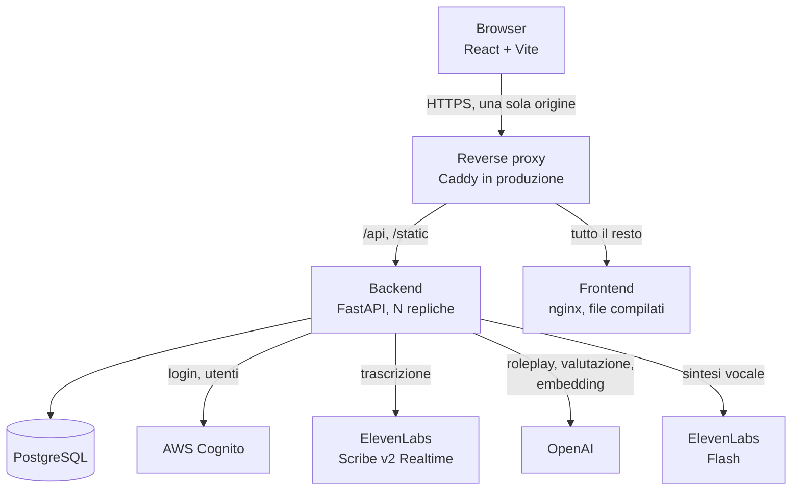
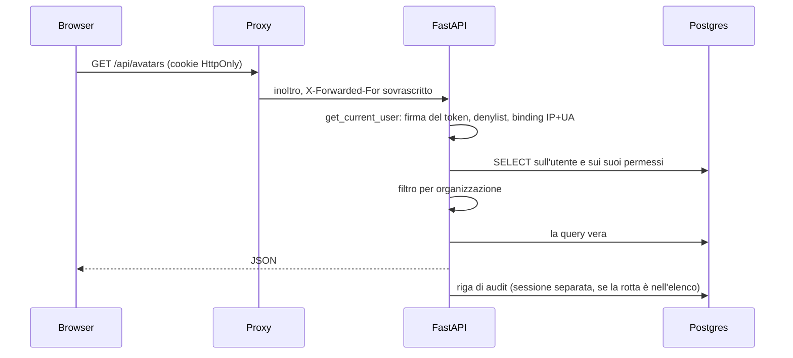

# Architettura

Cosa gira, chi parla con chi, e cosa succede nei primi secondi di vita del
backend. Questo documento risponde alla domanda "dove sta la roba"; il
dimensionamento, le repliche e il deploy stanno invece in
[infrastruttura.md](infrastruttura.md).

## I pezzi

Il browser vede **un solo indirizzo**. Non è estetica: i cookie di sessione
sono `HttpOnly` e `Secure`, e con due origini diverse non funzionerebbero. Una
sola origine significa anche nessun CORS da gestire in produzione.

| Pezzo | Tecnologia | Dove |
| --- | --- | --- |
| Frontend | React 19, Vite, Tailwind, React Router, TanStack Query | [frontend/src/](../frontend/src/) |
| Backend | FastAPI, SQLAlchemy, Pydantic | [backend/](../backend/) |
| Database | PostgreSQL, senza estensioni | schema in [backend/models.py](../backend/models.py) |
| Identità | AWS Cognito | [backend/cognito_service.py](../backend/cognito_service.py) |
| Voce in entrata | ElevenLabs Scribe v2 Realtime | [backend/elevenlabs_service.py](../backend/elevenlabs_service.py) |
| Cervello | OpenAI (roleplay, valutazione, embedding) | [backend/openai_service.py](../backend/openai_service.py) |
| Voce in uscita | ElevenLabs Flash | [backend/elevenlabs_tts_service.py](../backend/elevenlabs_tts_service.py) |

Nessuna chiave dei fornitori esterni sta nel browser: tutte le chiamate a
OpenAI ed ElevenLabs partono dal backend, anche quelle in tempo reale
della chiamata vocale.

## Il database è l'unica memoria condivisa

Il backend gira in più repliche identiche, e nessuna sa cosa hanno fatto le
altre. Tutto quello che una richiesta scrive e un'altra legge sta quindi in
tabella e non nella memoria del processo:

| Cosa | Tabella | Perché non in RAM |
| --- | --- | --- |
| Sessioni vocali | `voice_sessions` | Il POST che apre la chiamata e il WebSocket che la usa sono due richieste, e finiscono su repliche diverse |
| Tentativi di accesso falliti, e le chiamate al modello contate per persona | `login_attempts` | Quattro contatori in memoria concederebbero quattro volte i tentativi, e quattro volte le chiamate a pagamento |
| Token revocati e binding di sessione | `revoked_jti`, `token_session` | Un logout deve valere su tutte le repliche |

L'unica eccezione voluta è il tetto alle chiamate contemporanee
([voice_capacity.py](../backend/voice_capacity.py)): quello descrive il
processo, non l'installazione, quindi resta in memoria. Il ragionamento
completo su questa distinzione sta in
[infrastruttura.md](infrastruttura.md), sezione 2.

Nessun Redis, nessuna coda, nessun broker: le frequenze in gioco sono basse e
i lock distribuiti li offre già Postgres con gli advisory lock.

## L'avvio del backend

Tutto in [backend/main.py](../backend/main.py), nell'ordine in cui accade.

**1. `prepare_schema()`, all'import.** Prima ancora che l'app esista. Crea le
tabelle mancanti e porta uno schema già esistente al passo, dietro un advisory
lock così quattro container che partono insieme non eseguono lo stesso DDL nello
stesso istante. Vedi [dati-e-schema.md](dati-e-schema.md).

**2. I middleware**, registrati in quest'ordine e quindi eseguiti al contrario
(l'ultimo registrato è il più interno):

| Middleware | Cosa fa |
| --- | --- |
| `CORSMiddleware` | Origini ammesse da `ALLOWED_ORIGINS`, con le credenziali abilitate perché i cookie viaggino |
| `AuditMiddleware` | Registra le azioni che cambiano qualcosa. Sta **dentro** il CORS di proposito: una preflight OPTIONS non è un'azione, e una richiesta cross origin rifiutata non va registrata come tale |
| `AuthorshipMiddleware` | Il più interno, quindi quando si arriva al database l'attore della richiesta è già a disposizione: `created_by` e `updated_by` si scrivono da soli |

**3. Il `lifespan`.** Scrive nei log il conto delle connessioni disponibili (il
tetto di Postgres diviso il picco di un processo, cioè quante repliche ci
stanno davvero) e avvia il ciclo di pulizia periodica di
[housekeeping.py](../backend/housekeeping.py), che applica le finestre di
conservazione da dentro l'applicazione invece che da un cron esterno.

**4. I router**, uno per area. Il prefisso dice già chi può entrare:

| Prefisso | Router | Chi |
| --- | --- | --- |
| `/api/auth` | [auth.py](../backend/routers/auth.py) | Tutti, anche non autenticati |
| `/api/avatars` | [avatars.py](../backend/routers/avatars.py) | Autenticati |
| `/api/chat` | [chat.py](../backend/routers/chat.py) | Autenticati, solo sulle proprie conversazioni |
| `/api/voice` | [voice.py](../backend/routers/voice.py) | Autenticati |
| `/api/simulations` | [simulations.py](../backend/routers/simulations.py) | Autenticati |
| `/api/comparison` | [comparison.py](../backend/routers/comparison.py) | Autenticati, gli admin anche su altri |
| `/api/training` | [training.py](../backend/routers/training.py) | Utenti per i propri percorsi, admin per comporli e assegnarli |
| `/api/notifications` | [notifications.py](../backend/routers/notifications.py) | Autenticati |
| `/api/admin/...` | [admin.py](../backend/routers/admin.py), [admin_avatars.py](../backend/routers/admin_avatars.py), [admin_simulations.py](../backend/routers/admin_simulations.py), [admin_voices.py](../backend/routers/admin_voices.py), [organizations.py](../backend/routers/organizations.py), [audit_logs.py](../backend/routers/audit_logs.py) | Admin, con il tenant che li confina |

**5. `/static`**, che serve i ritratti degli avatar dal disco del backend.

**6. Le due rotte di salute**, fuori da `/api` perché non le chiama mai il
browser: `GET /` dice che il processo risponde ed è quella dell'healthcheck del
compose, `GET /health` dice che questa replica ha ancora un posto nel pool e un
database che risponde, ed è quella su cui il proxy decide dove mandare le
chiamate. Perché siano due, e cosa succede quando rispondono male tutte
insieme, sta in [docker-e-ambienti.md](docker-e-ambienti.md).

## La configurazione

Ogni variabile si legge una volta sola, nel modulo che la riguarda, e **senza
valore di ripiego**: se manca, il processo non parte e dice quale manca. Un
default scritto nel codice è un valore che nessuno ha scelto e che si scopre
sbagliato in produzione.

Le uniche due eccezioni sono dichiarate dove stanno: l'intervallo della pulizia
periodica (che è una frequenza, non una promessa fatta a qualcuno) e gli
interruttori di diagnostica della voce, che spenti valgono spento.

Non esiste un elenco delle variabili, ed è voluto: l'avvio che fallisce
nominando quella mancante non può invecchiare, un elenco sì.

## Il percorso di una richiesta qualunque

Il filtro per organizzazione non è un dettaglio di ogni endpoint: nasce da un
punto solo, `resolve_admin_scope`, descritto in
[organizzazioni-e-ruoli.md](organizzazioni-e-ruoli.md).

## Dove leggere il seguito

- Come il browser parla col server, nelle tre forme che usa:
  [comunicazione-frontend-backend.md](comunicazione-frontend-backend.md).
- Cosa succede prima che una richiesta arrivi a un endpoint:
  [autenticazione.md](autenticazione.md).
- Cosa gira periodicamente e per quanto restano i dati:
  [sicurezza-e-privacy.md](sicurezza-e-privacy.md).
