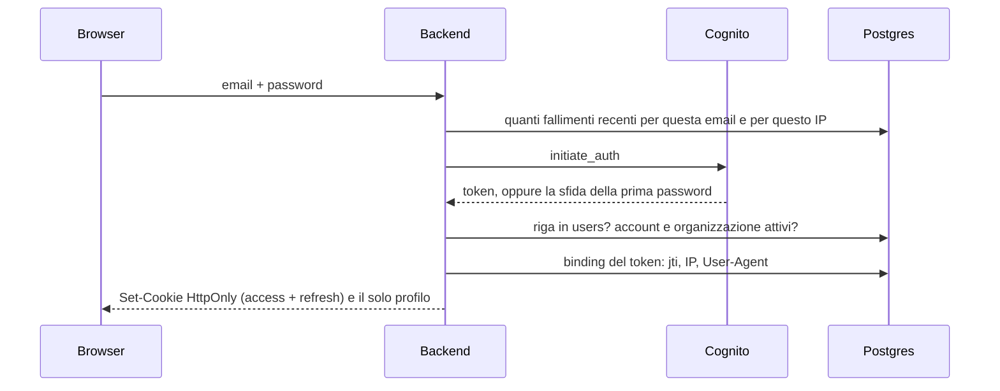
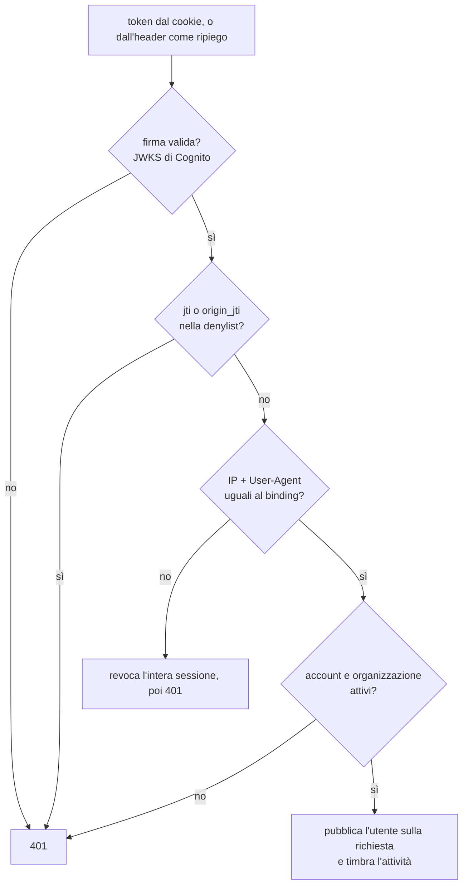

# Autenticazione

Chi entra, con cosa resta dentro, e cosa lo butta fuori. Le password non le
custodisce l'applicazione: le tiene AWS Cognito, e quello che sta qui è il
giro dei token e le difese costruite attorno.

## Il login

`POST /api/auth/login` in [backend/routers/auth.py](../backend/routers/auth.py).

Cinque cose che succedono in quel giro, e il perché di ognuna.

**Il limite ai tentativi.** Due secchielli su finestra scorrevole di quindici
minuti, contati su Postgres e non in memoria
([rate_limit.py](../backend/rate_limit.py)): cinque fallimenti per **email**,
che protegge un account dal tentativo a raffica anche distribuito, e dieci per
**IP**, che limita un client che prova molti account. Un accesso riuscito
svuota solo il secchiello dell'email: svuotare anche quello dell'IP lascerebbe
a un attaccante il modo di azzerarlo entrando in un account suo.

**Un solo messaggio di errore**, sempre lo stesso: "Credenziali non valide".
Email inesistente, password sbagliata, account non confermato, utente senza
riga nel database, tutti uguali. Un messaggio diverso per caso permetterebbe di
scoprire quali indirizzi esistono. Il motivo vero finisce nei log del server.

**Il controllo di sbarramento prima dei cookie.** Un account sospeso o dentro
un'organizzazione sospesa non ottiene una sessione, anche se la password era
giusta: risponde 403 dicendo quale delle due cose è, perché chi è arrivato fin
lì la password la sa già. Senza questo controllo il login riuscirebbe, con
tanto di data di accesso e riga nel registro, e la richiesta subito dopo
verrebbe rifiutata con un 401 che nessuno sa leggere.

**I token viaggiano solo in cookie**, mai nel corpo della risposta: `HttpOnly`
(JavaScript non li vede, quindi un XSS non li ruba), `Secure`, `SameSite=Lax`.
Il cookie di refresh ha in più il percorso ristretto a `/api/auth`, così viaggia
solo sulle due rotte che lo usano davvero.

| Cookie | Durata | Percorso |
| --- | --- | --- |
| `skilllab_access_token` | 60 minuti | `/` |
| `skilllab_refresh_token` | 30 giorni | `/api/auth` |

**La data di accesso si scrive solo qui**, non al rinnovo del token: ruotare un
token non è un accesso, e contarlo terrebbe una scheda dimenticata aperta a
sembrare qualcuno che sta lavorando. Quanto a "visto vivo l'ultima volta", c'è
una colonna apposta, scritta a intervalli da ogni richiesta autenticata
([activity.py](../backend/activity.py)).

## La prima password

Un utente creato da un amministratore riceve da Cognito una password
temporanea. Al primo accesso Cognito risponde con la sfida
`NEW_PASSWORD_REQUIRED`, e il frontend mostra il form della nuova password.

I requisiti sono controllati **due volte di proposito**: nel backend
(`validate_password_strength`) e nella lista che l'utente vede mentre scrive
nella [modale di accesso](../frontend/src/components/AuthModal.tsx). Entrambi devono
rispecchiare la policy del pool Cognito, che è la sola a decidere davvero:
dodici caratteri, maiuscola, minuscola, numero e un simbolo fra quelli che
Cognito riconosce come tali.

Completata la sfida, il giro è identico al login, sbarramento compreso: la
password è appena stata impostata, ma un account bloccato non ottiene comunque
i cookie.

## Cosa succede a ogni richiesta

Tutto in `get_current_user`
([auth_dependency.py](../backend/auth_dependency.py)), che è la porta unica di
ogni rotta protetta. Nell'ordine:

Le tre difese che stanno in mezzo meritano ciascuna la sua riga.

### La denylist: il logout che vale davvero

Un JWT è valido finché non scade, e Cognito da solo lascerebbe vivere un token
rubato per i suoi sessanta minuti anche dopo il logout. Quindi il logout scrive
il `jti` in `revoked_jti` ([token_denylist.py](../backend/token_denylist.py)),
e ogni richiesta lo controlla.

Non solo il `jti`: anche l'`origin_jti`, che è condiviso da **tutti** gli access
token nati dallo stesso refresh token. Revocando quello muore la sessione
intera, non solo il token in mano.

### Il session binding: il cookie che non si porta via

Al login, e a ogni rinnovo, il backend registra in `token_session` il contesto
per cui il token è stato emesso: `jti`, IP e User-Agent
([token_sessions.py](../backend/token_sessions.py)). A ogni richiesta i due
valori vengono confrontati.

Se non combaciano, o se il token non ha nessun binding, il token **e tutta la
sessione** finiscono nella denylist e la richiesta prende 401. Anche il
proprietario legittimo viene buttato fuori, ed è voluto: meglio un accesso in
più da rifare che una sessione rubata che continua.

Una nota che riguarda il deploy: la metà IP del binding legge il primo valore
di `X-Forwarded-For`. Il proxy davanti deve **sovrascriverlo**, non accodarlo,
altrimenti quella metà si può falsificare. La metà User-Agent regge comunque.

### Lo stato dell'account, a ogni richiesta

Sospendere un account o un'organizzazione ha effetto **immediato**, non alla
scadenza del token, perché `access_denied_reason` gira su ogni richiesta. Il
super admin non appartiene a nessuna organizzazione, quindi la seconda regola
non lo tocca mai.

La regola sta in [account_status.py](../backend/account_status.py) e non dentro
la dipendenza che la usa, perché se la chiedono anche l'accesso, prima di
consegnare i cookie, e il registro delle sessioni vocali, che serve l'unica
rotta senza dipendenza di autenticazione (vedi
[chiamata-vocale.md](chiamata-vocale.md)). Quel modulo non importa il client di
Cognito, così chi ha bisogno solo della regola non si porta dietro la rete.

## Il rinnovo

`POST /api/auth/refresh` è il punto in cui una sessione si allunga, ed è per
questo il punto che va difeso di più: chi ha rubato entrambi i cookie
proverebbe proprio qui a farsi emettere un token nuovo, legato al **suo**
contesto.

Per questo il controllo del binding avviene **prima** di chiedere a Cognito un
token nuovo, sul vecchio access token, di cui si verifica la firma ignorando la
scadenza. Se non torna, non viene emesso niente: la sessione va nella denylist
e il refresh token viene revocato anche a monte su Cognito.

Dopo l'emissione c'è un secondo controllo, contro l'**ancora di sessione**
(l'`origin_jti` registrato al login, che porta il contesto del primo accesso).
Fallito quello, stesso trattamento.

Se il rinnovo viene rifiutato, i cookie vengono cancellati **sulla risposta di
errore stessa**: gli header messi sulla `Response` iniettata da FastAPI si
perderebbero sollevando un'eccezione.

## Il logout

Tre cose, tutte best effort perché il logout deve riuscire comunque:

1. il refresh token viene revocato su Cognito, così non emette più niente;
2. il `jti` e l'`origin_jti` finiscono nella denylist, così l'access token in
   mano smette di funzionare subito;
3. i cookie vengono cancellati, che è l'unica cosa che il browser può fare da
   solo visto che sono `HttpOnly`.

Un guasto di rete su uno dei primi due passi non deve lasciare l'utente
intrappolato dentro la sessione.

## La scadenza per inattività

Trenta minuti senza attività chiudono la sessione, e la logica sta nel browser
([useIdleLogout.ts](../frontend/src/hooks/useIdleLogout.ts)).

Il pezzo interessante è la sincronia fra schede. L'attività viene condivisa
attraverso `localStorage` con una scrittura al massimo ogni cinque secondi, e
il controllo gira a intervalli invece di azzerare un timer a ogni movimento del
mouse. Così usare una scheda tiene viva la sessione in tutte, la scheda che
scade lo comunica alle altre, e nessuna ripete la chiamata di logout.

C'è anche un controllo quando la scheda torna in primo piano, perché i timer
delle schede in secondo piano vengono rallentati o congelati dal browser.

## L'account di sviluppo

Esiste un super admin locale (`admin` / `admin`) che non passa da Cognito e non
ha `jti`, quindi salta binding e denylist. Serve a lavorare senza un pool
configurato. Non può cambiare la propria password.

**Vive solo dove `DEV_ADMIN_LOGIN` vale esattamente `1`.** Qualunque altro
valore, e soprattutto l'assenza della variabile, lo spegne: la coppia
`admin` / `admin` torna a essere una coppia qualunque che Cognito rifiuta, il
suo token finto non viene più riconosciuto, e l'utente non viene nemmeno
creato all'avvio. È l'unico patto che rende innocuo un `.env` incompleto, ed
è lo stesso di `VOICE_STT_DEBUG`: si accende per scelta, mai per
dimenticanza. All'avvio, se è acceso, il backend lo scrive nei log.

Sul server va spento, perché chi conosce quella coppia entra come super admin
di tutte le organizzazioni e Cognito non vede passare niente, quindi
l'accesso non lascia traccia dove verrebbe cercata.

L'ordine però conta, perché è anche l'unico super admin che nasce da solo:
alla prima installazione si entra con lui, si crea dalla gestione utenti un
super admin vero, che riceve le credenziali per email da Cognito, si prova
che entri davvero, e solo allora si porta `DEV_ADMIN_LOGIN` a 0 e si riavvia.
Spegnendolo prima si resta chiusi fuori dalla propria installazione.

Su un'installazione dove l'utente finto è già stato creato, spegnere la
variabile non cancella la sua riga: la rende soltanto non spendibile.
