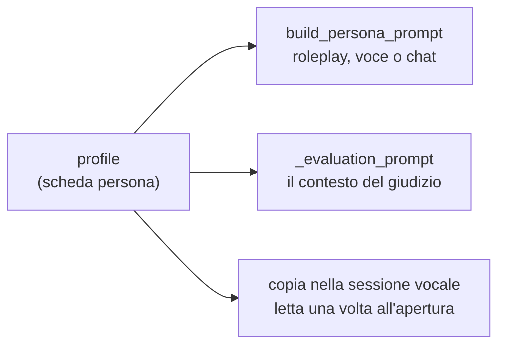

# Avatar e scheda persona

Un avatar non è un'immagine con un nome: **è una persona simulata**, e la sua
scheda è quello che il modello legge prima di ogni battuta. Da lì nascono sia
il roleplay sia il metro con cui la conversazione viene poi giudicata.

## Cosa contiene un avatar

| Campo | Cosa è |
| --- | --- |
| `profile` | La scheda persona, in JSON. È il cuore: senza, l'avatar non esiste |
| `name` | Derivato da `NOME` e `COGNOME` della scheda, non scritto a parte |
| `category_id` | La categoria in cui è raggruppato, una riga di `avatar_categories` |
| `description`, `image_url` | Come si presenta nella galleria |
| `organization_id` | Il tenant a cui appartiene: si vede solo lì dentro |
| `voice_id` | La voce Cartesia con cui parla al telefono |
| `deleted_at` | La data di archiviazione, NULL finché è attivo |

Il grado di difficoltà mostrato nella galleria non è una colonna: è il campo
`GRADO_DIFFICOLTA` della scheda, l'unico che si può mostrare senza rivelare
niente.

## Le categorie

Sono un'anagrafica, non una stringa scritta sull'avatar: una riga di
`avatar_categories` con nome e colore, che il super admin crea e
rinomina dal pulsante "Categorie" della pagina avatar
([AvatarCategoriesModal](../frontend/src/components/AvatarCategoriesModal.tsx)).
Rinominarne una la cambia su ogni avatar che la porta, invece di lasciare in
giro il nome vecchio.

Una categoria appartiene a **un'organizzazione sola**, come gli avatar che
raggruppa: due tenant possono averne una che si chiama allo stesso modo senza
che sia la stessa, e nessuno vede quelle di un altro. Ogni organizzazione
nasce con la sua "Clienti", altrimenti il suo primo avatar non si potrebbe
creare.

Il legame è tenuto insieme da una chiave esterna **composta**,
`(category_id, organization_id)` verso `(id, organization_id)`: senza,
cambiare categoria a un avatar potrebbe spostarlo nel tenant di un'altra, che
è una fuga di dati travestita da modifica anagrafica. Il router dà un 400
prima di arrivarci, ma a garantirlo è il vincolo.

Il colore non è un colore libero ma il nome di una tinta fra quelle di
`AVATAR_CATEGORY_COLORS`: le classi che disegnano la pastiglia sono scritte a
mano in [categoryStyles.ts](../frontend/src/components/categoryStyles.ts),
perché una classe Tailwind composta a runtime non finirebbe nel CSS compilato.

**Una categoria si elimina solo se non la usa nessuno**, archiviati compresi:
il server risponde 409 e non tocca niente. Un avatar senza categoria non può
esistere, e sceglierne una al posto dell'amministratore vorrebbe dire
spostargli il gruppo di nascosto.

## La scheda persona

La riempie a mano il super admin da `/app/admin/avatars`
([AvatarAdminPage](../frontend/src/components/AvatarAdminPage.tsx)), ed è
organizzata in sezioni:

| Sezione | Cosa descrive |
| --- | --- |
| Anagrafica | Chi è: età, provenienza, famiglia, residenza |
| Lavoro e situazione finanziaria | Professione, redditi, patrimonio, e quanto ne capisce di banca, investimenti, mutui |
| Storia e vita personale | Eventi, paure, obiettivi, aspirazioni |
| Personalità | Estroversione, empatia, pazienza, fiducia, propensione al conflitto e al rischio, capacità di ascolto, espressi in percentuali |
| Stato emotivo | Emozione iniziale e intensità, e cosa lo calma o lo irrita |
| Stile | Lunghezza delle risposte, velocità del parlato, ironia, dialetto, formalità |
| Scenario | Tipo di caso, vera causa del problema, obiezioni previste, obiettivo nascosto, fatti immutabili, segreti, cosa non rivelare spontaneamente |

**I campi che non si applicano restano vuoti.** Non zero, non "/": un valore
messo per riempire viene letto dal modello come un dato vero. Il codice si
difende comunque, normalizzando i marcatori più comuni (`/`, `-`, `n/d`,
`n/a`) a vuoto, ma il confronto è sull'intera cella, così un legittimo "8/10"
resta intatto.

**La scheda non esce mai dal server** verso chi si allena. Contiene la vera
causa del problema e l'obiettivo nascosto, cioè la soluzione dell'esercizio.
L'API di chi studia la toglie, e l'export dei dati personali la esclude
esplicitamente.

## Da scheda a prompt

[persona_prompt.py](../backend/persona_prompt.py) è puro templating di
stringhe: nessuna chiamata a modelli, nessun accesso al database. Entra la
scheda, esce il prompt di sistema del roleplay.

Due cose lo governano.

**Solo i campi valorizzati entrano.** `profile_section` scrive una riga
`- etichetta: valore` per ogni campo che ha un valore, e salta gli altri: un
prompt con dieci righe vuote insegna al modello che quelle cose non contano.

**Il canale cambia il mezzo, non la persona.** Lo stesso avatar risponde al
telefono e in chat, e la scheda è la stessa. Cambia solo la cornice:

| | Telefono (`voice`) | Chat (`text`) |
| --- | --- | --- |
| Il mezzo | "Stai parlando al telefono" | "Stai scrivendo nella chat" |
| Chi apre | L'operatore risponde, poi tocca all'avatar | L'operatore saluta, poi tocca all'avatar |
| Tratti dello stile | Velocità del parlato inclusa | Velocità del parlato tolta, non vuol dire niente per iscritto |
| Regole di realismo | Esitazioni, ripetizioni, non sovrapporsi | Messaggi brevi, uno alla volta, niente formattazione |
| Intercalari | "guardi", "senta", "aspetti un attimo" | Le versioni che funzionano scritte |

In tutti e due i casi **è l'operatore ad aprire**, e c'è una regola esplicita
contro lo scambio di ruolo: qualunque cosa dica l'operatore, anche se saluta in
modo informale, l'avatar resta il cliente.

Il prompt insiste su un punto sopra tutti: l'avatar **non deve aiutare**
l'operatore a superare la simulazione. Non è un assistente e non è un tutor, è
una persona con un problema.

C'è un'anteprima del prompt nella scheda dell'avatar
([PersonaPromptPreview](../frontend/src/components/PersonaPromptPreview.tsx)),
che chiama `POST /api/admin/avatars/prompt-preview`: si vede esattamente cosa
il modello leggerà, per canale, prima di salvare.

## Il ritratto

Un file caricato oppure un segnaposto generato. Il file caricato viene
riconosciuto **dai suoi byte iniziali**, non dal nome né dal tipo dichiarato
dal browser: quelle immagini finiscono servite da `/static`, quindi va escluso
tutto ciò che un browser potrebbe eseguire, e un SVG può contenere script.
Passano PNG, JPEG e WebP, con un tetto di 2 MB, e l'estensione salvata è quella
che la firma dimostra.

Senza file, il backend genera un SVG con le iniziali e una delle palette
predefinite.

## La voce

Il campo `voice_id` è un id di voce Cartesia. Se manca si usa quella di default
dalla configurazione.

Si assegnano dall'interfaccia (l'elenco delle voci arriva da
`/api/admin/voices`, con anteprima) oppure dalla riga di comando con
[assign_voices.py](../backend/assign_voices.py), che elenca le voci
disponibili e le associa per nome dell'avatar.

## Archiviare, non cancellare

Un avatar non si cancella: si archivia (`deleted_at` valorizzato).

Il motivo è che le conversazioni giocate contro quella persona devono
continuare a esistere con il loro avatar, e una vecchia trascrizione deve poter
essere rivalutata contro la scheda su cui è stata giocata.

Le tre funzioni che governano la cosa stanno in
[routers/avatars.py](../backend/routers/avatars.py) e vale la pena distinguerle,
perché fanno cose diverse:

| Funzione | Cosa fa |
| --- | --- |
| `_visible_avatars` | Filtro per **tenant**. Gli archiviati passano di qui: chi ha studiato con loro deve continuare a raggiungere le proprie trascrizioni |
| `active_avatars` | Toglie gli archiviati. Si usa dove il catalogo viene **offerto**: galleria, filtro delle categorie, selezione |
| `ensure_trainable` | Rifiuta di **iniziare** qualcosa di nuovo su un archiviato, con un 409 e non un 404: l'avatar esiste, semplicemente non ci si allena più |

Una conversazione già aperta quando l'avatar viene archiviato si può finire. È
solo l'inizio di una nuova che viene bloccato.

L'archiviazione è reversibile con `restore`. L'unico modo perché un avatar
sparisca davvero è la cancellazione dell'organizzazione a cui appartiene, dove
se ne va il tenant intero.

## Dove va a finire la scheda

Nella valutazione la scheda entra come **chiave di correzione**: dice quale
fosse davvero il caso, che è l'unico modo per distinguere una diagnosi vera da
un'ipotesi plausibile. Il prompt però mette in chiaro che quel contesto non è
parte della conversazione, e che l'operatore non va premiato per cose che non
ha detto né penalizzato per informazioni che il cliente non gli ha mai dato.
Vedi [valutazione.md](valutazione.md).

Nella chiamata vocale la scheda viene **fotografata all'apertura della
sessione** e portata in memoria dalla pipeline: il percorso caldo di ogni turno
resta così senza query sull'avatar. Vedi
[chiamata-vocale.md](chiamata-vocale.md).
