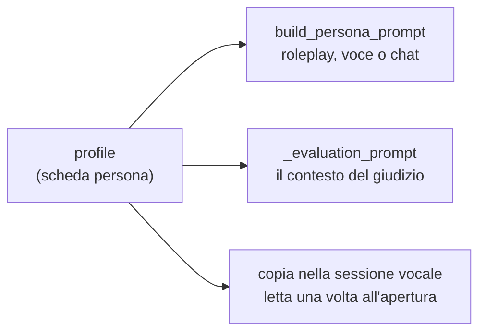

# Avatar e scheda persona

Un avatar non è un'immagine con un nome: **è una persona simulata**, e la sua
scheda è quello che il modello legge prima di ogni battuta. Da lì nascono sia
il roleplay sia il metro con cui la conversazione viene poi giudicata.

## Cosa contiene un avatar

| Campo | Cosa è |
| --- | --- |
| `profile` | La scheda persona, in JSON. È il cuore: senza, l'avatar non esiste |
| `name` | Derivato da `NOME` e `COGNOME` della scheda, non scritto a parte |
| `category_id` | La categoria in cui è raggruppato, una riga di `avatar_categories` |
| `description`, `image_url` | Come si presenta nella galleria |
| `organization_id` | Il tenant a cui appartiene: si vede solo lì dentro |
| `voice_id` | La voce Cartesia con cui parla al telefono |
| `deleted_at` | La data di archiviazione, NULL finché è attivo |

Il grado di difficoltà mostrato nella galleria non è una colonna: è il campo
`GRADO_DIFFICOLTA` della scheda, l'unico che si può mostrare senza rivelare
niente.

## Le categorie

Sono un'anagrafica, non una stringa scritta sull'avatar: una riga di
`avatar_categories` con nome e colore, che il super admin crea e
rinomina dal pulsante "Categorie" della pagina avatar
([AvatarCategoriesModal](../frontend/src/components/AvatarCategoriesModal.tsx)).
Rinominarne una la cambia su ogni avatar che la porta, invece di lasciare in
giro il nome vecchio.

Una categoria appartiene a **un'organizzazione sola**, come gli avatar che
raggruppa: due tenant possono averne una che si chiama allo stesso modo senza
che sia la stessa, e nessuno vede quelle di un altro. Ogni organizzazione
nasce con la sua "Clienti", altrimenti il suo primo avatar non si potrebbe
creare.

Il legame è tenuto insieme da una chiave esterna **composta**,
`(category_id, organization_id)` verso `(id, organization_id)`: senza,
cambiare categoria a un avatar potrebbe spostarlo nel tenant di un'altra, che
è una fuga di dati travestita da modifica anagrafica. Il router dà un 400
prima di arrivarci, ma a garantirlo è il vincolo.

Il colore non è un colore libero ma il nome di una tinta fra quelle di
`AVATAR_CATEGORY_COLORS`: le classi che disegnano la pastiglia sono scritte a
mano in [categoryStyles.ts](../frontend/src/components/categoryStyles.ts),
perché una classe Tailwind composta a runtime non finirebbe nel CSS compilato.

**Una categoria si elimina solo se non la usa nessuno**, archiviati compresi:
il server risponde 409 e non tocca niente. Un avatar senza categoria non può
esistere, e sceglierne una al posto dell'amministratore vorrebbe dire
spostargli il gruppo di nascosto.

## La scheda persona

La riempie a mano il super admin da `/app/admin/avatars`
([AvatarAdminPage](../frontend/src/components/AvatarAdminPage.tsx)), ed è
organizzata in sezioni:

| Sezione | Cosa descrive |
| --- | --- |
| Anagrafica | Chi è: età, provenienza, famiglia, residenza |
| Lavoro e situazione finanziaria | Professione, redditi, patrimonio, e quanto ne capisce di banca, investimenti, mutui |
| Storia e vita personale | Eventi, paure, obiettivi, aspirazioni |
| Personalità | Estroversione, empatia, pazienza, fiducia, propensione al conflitto e al rischio, capacità di ascolto, espressi in percentuali |
| Stato emotivo | Emozione iniziale e intensità, e cosa lo calma o lo irrita |
| Stile | Lunghezza delle risposte, velocità del parlato, ironia, dialetto, formalità |
| Scenario | Tipo di caso, vera causa del problema, obiezioni previste, obiettivo nascosto, fatti immutabili, segreti, cosa non rivelare spontaneamente |

**I campi che non si applicano restano vuoti.** Non zero, non "/": un valore
messo per riempire viene letto dal modello come un dato vero. Il codice si
difende comunque, normalizzando i marcatori più comuni (`/`, `-`, `n/d`,
`n/a`) a vuoto, ma il confronto è sull'intera cella, così un legittimo "8/10"
resta intatto.

**La scheda non esce mai dal server** verso chi si allena. Contiene la vera
causa del problema e l'obiettivo nascosto, cioè la soluzione dell'esercizio.
L'API di chi studia la toglie, e l'export dei dati personali la esclude
esplicitamente.

## La bozza scritta dal modello

Settanta campi compilati a mano sono mezz'ora per ogni scenario nuovo, e non
è la mezz'ora delle cose che contano: quelle sono lo scenario, la vera causa
e l'obiettivo nascosto, e si scrivono in cinque minuti. Il resto è inventare
una data di nascita, la professione del coniuge e sette percentuali di
personalità che devono stare in piedi insieme.

Da `POST /api/admin/avatars/draft` ([persona_draft.py](../backend/persona_draft.py))
si ottiene una scheda intera a partire da un caso raccontato a parole. **È lo
stesso giro del simulatore**: una fonte scritta da una persona, una passata
del modello di ragionamento, una revisione umana, e solo dopo la
pubblicazione (vedi [simulatore.md](simulatore.md)). Passa da
`eval_json_completion`, quindi si porta dietro i modelli di riserva e il tempo
lungo della valutazione.

**Le due fonti non chiedono la stessa cosa al modello**, e sono due prompt
diversi perché sono due lavori diversi:

| Fonte | Cosa fa il modello |
| --- | --- |
| Un caso raccontato | Inventa attorno al caso un cliente completo, con l'unico vincolo che i dettagli non si contraddicano fra loro |
| Una conversazione vera, già anonimizzata da chi la incolla | **Ricava** dal testo come parla, cosa lo ha portato a scrivere, cosa lo irrita e cosa ha dichiarato, e inventa solo il contorno |

Nel secondo caso inventare al posto di leggere è l'errore, ed è scritto nel
prompt insieme all'istruzione di sostituire comunque i nomi che dovessero
essere rimasti nella trascrizione.

**Qui non si salva niente.** La rotta non tocca il database: entra un testo,
esce un dizionario che torna al form di chi l'ha chiesto. Una scheda generata
diventa un avatar solo con il salvataggio, che è un'altra richiesta, esattamente
come le cinquanta domande di una simulazione non si pubblicano da sole.

**Cosa il modello non può scrivere.** Le chiavi che non appartengono alla
scheda vengono buttate, le percentuali prendono la forma `60%`, il grado la
forma `8/10`, i valori a scelta tornano sull'elenco chiuso quando ci
somigliano. E i marcatori di vuoto valgono vuoto, qui come nel prompt: il
modello è istruito a lasciare vuoto un campo che non si applica, e la
normalizzazione è la rete sotto.

Se manca uno fra scenario, vera causa, emozione iniziale e obiettivo nascosto,
la risposta è **fallita** e si passa al modello di riserva, come per un JSON
illeggibile. Sono i quattro campi per cui vale la pena generare una scheda:
consegnarla senza vorrebbe dire farla completare a mano proprio dove costa di
più.

Che ogni campo generato sia un campo che il prompt del roleplay legge davvero
non è affidato all'attenzione di chi ne aggiunge uno: lo verifica un test, che
riempie la scheda di sentinelle e le cerca nel prompt reso su tutti e due i
canali. L'unica eccezione, dichiarata nel test, è il grado di difficoltà, che
non entra nel prompt perché non è una cosa che il personaggio sa di sé, è la
targhetta che lo studente legge in galleria.

### Come la bozza entra nella scheda

Il form riceve la proposta e la fa entrare con una regola sola
([applyDraft](../frontend/src/components/avatarForm.ts)): **scrive nei campi
vuoti e in quelli che aveva scritto lei, mai in quelli scritti a mano.**

Le due metà servono a due cose diverse, e senza una delle due la funzionalità
avrebbe un vicolo cieco. Senza la prima, rigenerare da un caso raccontato
meglio non cambierebbe niente, perché la scheda è già piena della bozza di
prima e bisognerebbe svuotare settanta campi a mano per riprovare. Senza la
seconda, una rigenerazione porterebbe via le correzioni appena fatte, cioè la
parte per cui la revisione umana esiste.

Da qui la memoria di quali campi vengono dalla bozza, che vive nel form aperto
e non nel database: toccare un campo lo fa uscire da quell'elenco, e da quel
momento è intoccabile. Riaprire la scheda di un avatar salvato la azzera, ed è
giusto, perché a quel punto ogni campo è roba che qualcuno ha deciso di
tenere.

Dopo l'inserimento il form lo dice con parole precise, quanti campi sono stati
riempiti e quanti sono stati lasciati stare, e ricorda che è una proposta da
rileggere. Non è un messaggio di successo: la scheda in quel momento è piena
di roba che non ha scritto nessuno.

**Il testo che si incolla arriva a OpenAI**, ed è un destinatario in più
rispetto a prima: vedi [gdpr.md](gdpr.md), sezione 6.

## Da scheda a prompt

[persona_prompt.py](../backend/persona_prompt.py) è puro templating di
stringhe: nessuna chiamata a modelli, nessun accesso al database. Entra la
scheda, esce il prompt di sistema del roleplay.

Tre cose lo governano.

**Solo i campi valorizzati entrano.** `profile_section` scrive una riga
`- etichetta: valore` per ogni campo che ha un valore, e salta gli altri: un
prompt con dieci righe vuote insegna al modello che quelle cose non contano.

**Un'etichetta da sola non è un'istruzione.** Vale per la lunghezza delle
risposte, che è il campo con la conseguenza più visibile: scritto come
"Lunghezza media delle risposte: Media", lasciava al modello il compito di
decidere quanto duri una risposta media, e la risposta cresceva fino al
monologo. Al telefono è il difetto peggiore, perché mezzo minuto di avatar è
mezzo minuto in cui chi si sta addestrando sta zitto ad ascoltare.
`_regola_lunghezza` traduce quindi l'etichetta in una misura:

| Scheda | Di norma | Tetto | Prima battuta |
| --- | --- | --- | --- |
| Breve | Una frase, al massimo due | Venti parole | Quaranta parole |
| Media, e ogni scheda che non lo dice | Due o tre frasi | Quaranta parole | Sessanta parole |
| Lunga | Quattro o cinque frasi | Settanta parole | Novanta parole |

La battuta di apertura ha il tetto doppio perché presentarsi, dire nome e
cognome ed esporre il motivo della chiamata non sta in una frase.

La regola compare due volte di proposito: distesa nello stile, e in una riga
secca fra le **regole ferree**. Lo stile scritto in cima si diluisce man mano
che la conversazione cresce, la regola ferrea sta in fondo al prompt, cioè nel
punto che il modello pesa di più. Per lo stesso motivo la sezione dello stile
esce anche a scheda muta: prima viveva appesa ai campi compilati, e un avatar
senza tratti di conversazione restava senza le regole del mezzo proprio nel
caso in cui parlava di più.

**Il canale cambia il mezzo, non la persona.** Lo stesso avatar risponde al
telefono e in chat, e la scheda è la stessa. Cambia solo la cornice:

| | Telefono (`voice`) | Chat (`text`) |
| --- | --- | --- |
| Il mezzo | "Stai parlando al telefono" | "Stai scrivendo nella chat" |
| Chi apre | L'operatore risponde, poi tocca all'avatar | L'operatore saluta, poi tocca all'avatar |
| Tratti dello stile | Velocità del parlato inclusa | Velocità del parlato tolta, non vuol dire niente per iscritto |
| Regole di realismo | Esitazioni, ripetizioni, non sovrapporsi | Messaggi brevi, uno alla volta, niente formattazione |
| Limite di lunghezza | "Ogni tua risposta sta in…", misurato in parole dette | "Ogni tuo messaggio sta in…", stessa misura |
| Intercalari | "guardi", "senta", "aspetti un attimo" | Le versioni che funzionano scritte |

In tutti e due i casi **è l'operatore ad aprire**, e c'è una regola esplicita
contro lo scambio di ruolo: qualunque cosa dica l'operatore, anche se saluta in
modo informale, l'avatar resta il cliente.

Il prompt insiste su un punto sopra tutti: l'avatar **non deve aiutare**
l'operatore a superare la simulazione. Non è un assistente e non è un tutor, è
una persona con un problema.

C'è un'anteprima del prompt nella scheda dell'avatar
([PersonaPromptPreview](../frontend/src/components/PersonaPromptPreview.tsx)),
che chiama `POST /api/admin/avatars/prompt-preview`: si vede esattamente cosa
il modello leggerà, per canale, prima di salvare.

## Il ritratto

Un file caricato oppure un segnaposto generato. Il file caricato viene
riconosciuto **dai suoi byte iniziali**, non dal nome né dal tipo dichiarato
dal browser: quelle immagini finiscono servite da `/static`, quindi va escluso
tutto ciò che un browser potrebbe eseguire, e un SVG può contenere script.
Passano PNG, JPEG e WebP, con un tetto di 2 MB, e l'estensione salvata è quella
che la firma dimostra.

Senza file, il backend genera un SVG con le iniziali e una delle palette
predefinite.

## La voce

Il campo `voice_id` è un id di voce Cartesia. Se manca si usa quella di default
dalla configurazione.

Si assegnano dall'interfaccia (l'elenco delle voci arriva da
`/api/admin/voices`, con anteprima) oppure dalla riga di comando con
[assign_voices.py](../backend/assign_voices.py), che elenca le voci
disponibili e le associa per nome dell'avatar.

## Archiviare, non cancellare

Un avatar non si cancella: si archivia (`deleted_at` valorizzato).

Il motivo è che le conversazioni giocate contro quella persona devono
continuare a esistere con il loro avatar, e una vecchia trascrizione deve poter
essere rivalutata contro la scheda su cui è stata giocata.

Le tre funzioni che governano la cosa stanno in
[routers/avatars.py](../backend/routers/avatars.py) e vale la pena distinguerle,
perché fanno cose diverse:

| Funzione | Cosa fa |
| --- | --- |
| `_visible_avatars` | Filtro per **tenant**. Gli archiviati passano di qui: chi ha studiato con loro deve continuare a raggiungere le proprie trascrizioni |
| `active_avatars` | Toglie gli archiviati. Si usa dove il catalogo viene **offerto**: galleria, filtro delle categorie, selezione |
| `ensure_trainable` | Rifiuta di **iniziare** qualcosa di nuovo su un archiviato, con un 409 e non un 404: l'avatar esiste, semplicemente non ci si allena più |

Una conversazione già aperta quando l'avatar viene archiviato si può finire. È
solo l'inizio di una nuova che viene bloccato.

L'archiviazione è reversibile con `restore`. L'unico modo perché un avatar
sparisca davvero è la cancellazione dell'organizzazione a cui appartiene, dove
se ne va il tenant intero.

## Dove va a finire la scheda

Nella valutazione la scheda entra come **chiave di correzione**: dice quale
fosse davvero il caso, che è l'unico modo per distinguere una diagnosi vera da
un'ipotesi plausibile. Il prompt però mette in chiaro che quel contesto non è
parte della conversazione, e che l'operatore non va premiato per cose che non
ha detto né penalizzato per informazioni che il cliente non gli ha mai dato.
Vedi [valutazione.md](valutazione.md).

Nella chiamata vocale la scheda viene **fotografata all'apertura della
sessione** e portata in memoria dalla pipeline: il percorso caldo di ogni turno
resta così senza query sull'avatar. Vedi
[chiamata-vocale.md](chiamata-vocale.md).
