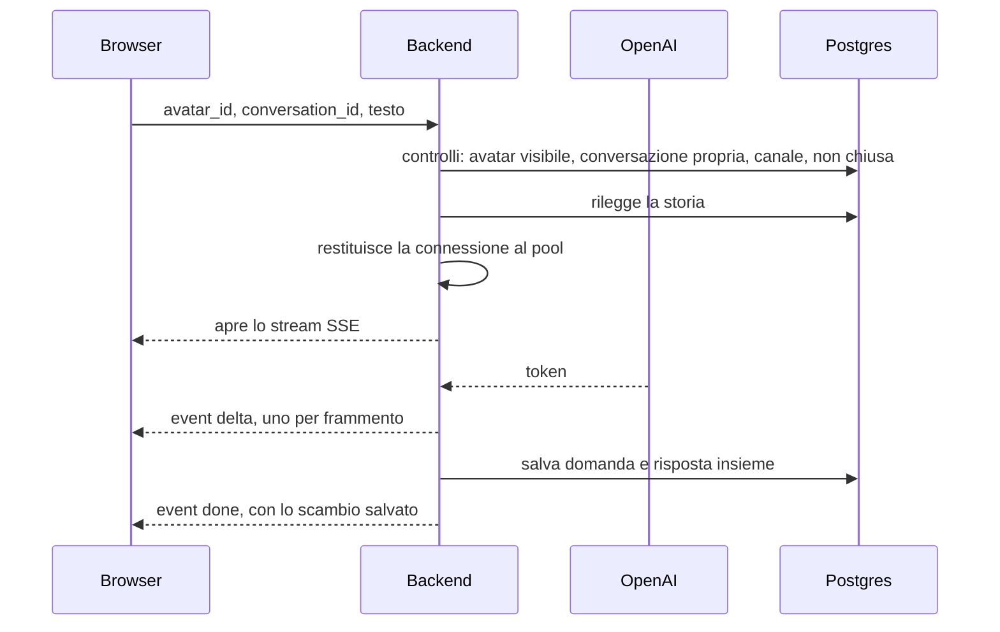

# La chat testuale

Lo stesso avatar, per iscritto. È il canale più semplice dei due, e il
confronto con la chiamata dice bene cosa è essenziale e cosa era della voce:
qui c'è solo il modello, niente trascrizione e niente sintesi.

## Il canale si fissa alla nascita

Una conversazione nasce `voice` o `text` e non cambia più. Quel campo non è
un'etichetta: decide chi può scriverci dentro.

| Tentativo | Risposta |
| --- | --- |
| Continuare al telefono una conversazione nata in chat | 409, "questa conversazione è una chat" |
| Scrivere dentro la trascrizione di una chiamata | 409, "questa conversazione è una chiamata" |
| Scrivere in una conversazione chiusa | 409, "avviane una nuova" |

Il motivo è che una trascrizione di telefonata non è una chat in cui si può
continuare a scrivere: sono due registrazioni di due contatti diversi, e
mescolarle renderebbe illeggibile sia l'una sia l'altra.

Quello che invece **è** condiviso è tutto il resto: le stesse tabelle, la
stessa scheda persona, gli stessi criteri di valutazione. Il canale cambia solo
la cornice del prompt (vedi [avatar-e-persona.md](avatar-e-persona.md)) e una
nota al valutatore.

## Un messaggio, dall'invio al salvataggio

`POST /api/chat/message` in [routers/chat.py](../backend/routers/chat.py).

Le cose che vale la pena sapere sono quattro.

**I controlli stanno prima dello stream.** Avatar sconosciuto, conversazione di
qualcun altro, canale sbagliato, conversazione chiusa: sono errori HTTP
normali, con il loro codice, perché lo stream non è ancora aperto. Dopo
l'apertura, un guasto può viaggiare solo come evento `error` dentro lo stream.

**Non viene salvato niente finché la risposta non è finita.** Se la
generazione fallisce a metà, nella trascrizione non resta mezzo scambio, e il
client lo sa e invita a rimandare. I due messaggi vengono scritti nello stesso
commit, con la risposta datata un millisecondo dopo la domanda: la trascrizione
si rilegge ordinata per data, e l'ordine deve essere quello vero.

**Una risposta vuota è un errore.** Un turno senza testo lascerebbe l'operatore
davanti a niente a cui rispondere, quindi diventa un `error` e non un messaggio
salvato.

**La connessione al database torna al pool prima dell'attesa.** Il generatore
gira dopo che l'handler è finito e dura quanto la risposta del modello: fino a
lì la sessione terrebbe ferma una connessione senza usarla. Si usa `commit` e
non `close`, perché tutti e due restituiscono la connessione ma `close`
**annulla** la transazione in corso, e quella sessione non sempre è solo
nostra. La funzione che salva riceve quindi solo degli id e rifà le proprie
query.

## Come il browser legge lo stream

Il formato è Server-Sent Events, letto a mano perché un `EventSource` sa fare
solo GET. Il dettaglio del parsing sta in
[comunicazione-frontend-backend.md](comunicazione-frontend-backend.md).

Sullo schermo il testo compare mentre nasce, e alla fine la bolla provvisoria
viene sostituita dallo scambio salvato, che porta gli id veri dei messaggi:
sono quelli a cui le citazioni della valutazione e le note del docente si
attaccheranno.

## Chiudere una conversazione

`POST /api/chat/conversation/{id}/end` chiude una chat, ed è definitivo come
riagganciare. È idempotente: chiuderne una già chiusa restituisce quella che
c'è.

Esiste solo per il canale scritto. Le chiamate le chiude da sé la pipeline
vocale quando il socket cade: lì il momento della fine è un fatto, non una
decisione.

## L'elenco e la rilettura

`GET /api/chat/avatar/{id}/conversations` dà l'elenco per un avatar, ordinato
per ultimo aggiornamento, e per ognuna il numero di messaggi e l'anteprima
dell'ultimo. Le due informazioni si prendono in **due query in tutto**, non in
due per riga: un COUNT raggruppato e un `DISTINCT ON` per l'ultimo messaggio di
ciascuna.

`GET /api/chat/conversation/{id}` dà la trascrizione intera, e con lei viaggia
la revisione del docente. Le note sono appuntate su singoli messaggi, ed è
rileggendo la conversazione che insegnano qualcosa: separarle dalla
trascrizione le renderebbe inutili.

**Rinominare una conversazione non è attività.** Il titolo si cambia con una
PATCH che riscrive `updated_at` con il valore che aveva già: quella colonna
ordina l'elenco e data ogni contatto, e senza questa accortezza
l'aggiornamento automatico della colonna porterebbe in cima una conversazione
solo perché le è stato cambiato il nome.

Il titolo di partenza è progressivo per categoria ("Reclamo 3"), generato da
[conversation_titles.py](../backend/conversation_titles.py).

### La ricerca, in due posti che sono uno solo

L'elenco compare in due forme: la colonna della chat
([ChatSidebar](../frontend/src/components/ChatSidebar.tsx)) e il pannello che
la espande a schermo intero
([ExpandedConversationsPanel](../frontend/src/components/ExpandedConversationsPanel.tsx)),
dove c'è lo spazio per l'anteprima, i badge e lo stato di ogni riga.

**Il filtro è uno solo per tutte e due**, casella e stato compresi: sono la
stessa lista vista da due distanze, e due ricerche separate vorrebbero dire
cercare una conversazione nella colonna, espandere per leggerla meglio, e
ritrovarsi davanti di nuovo tutte le altre. Il taglio lo fa `matchesSearch` di
[tableSearch.ts](../frontend/src/components/tableSearch.ts), lo stesso
confronto senza accenti e senza maiuscole delle tabelle di amministrazione, su
titolo e anteprima dell'ultimo messaggio.

Nella colonna la casella **compare da sei conversazioni in su**: sotto quella
misura l'elenco si legge intero senza scorrere, e un campo in più sarebbe solo
qualcosa da scavalcare. Resta però a vista finché una ricerca è scritta, anche
se i risultati sono pochi, altrimenti restringere l'elenco porterebbe via il
campo da cui si cancella quello che si è cercato.

Le due liste vuote **non dicono la stessa frase**: "nessuna conversazione
corrisponde alla ricerca" è una notizia diversa da "nessuna conversazione
presente", e la seconda al posto della prima si legge come uno storico
sparito.

## Cancellare

Il router della chat **non ha** un endpoint di cancellazione. Cancellare una
conversazione è un'azione da amministratore e sta in
[routers/admin.py](../backend/routers/admin.py): una persona non deve poter far
sparire il proprio esercizio andato male, altrimenti il percorso formativo
diventa una collezione di soli successi.
