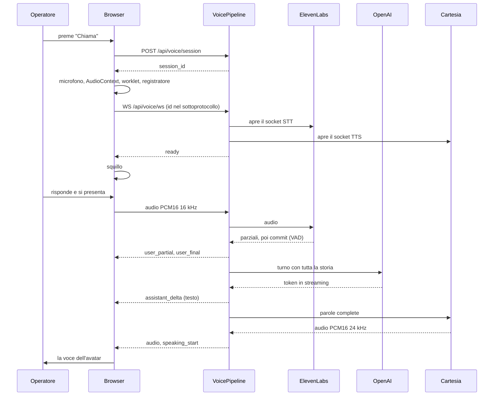
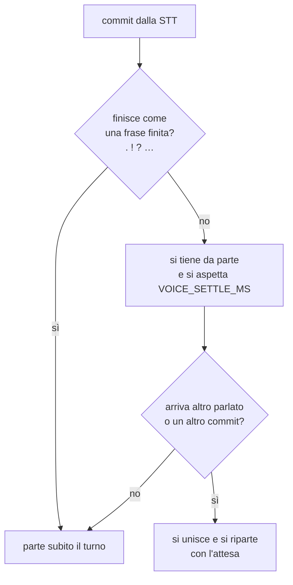

# La chiamata vocale

La funzionalità più complessa dell'applicazione: una telefonata simulata in cui
l'avatar chiama il numero verde della banca e l'operatore in formazione
risponde. Tre fornitori esterni in fila, un WebSocket, e un vincolo che governa
ogni scelta, cioè che **la latenza è la qualità del prodotto**.

## Il giro completo

## L'apertura in due tempi

`POST /api/voice/session` autentica, controlla e prepara; il WebSocket poi si
apre col solo `session_id`, che porta nell'handshake e non nell'indirizzo.

Perché due richieste e non una: un WebSocket non porta con sé le dipendenze di
FastAPI in modo comodo, e soprattutto la preparazione (permessi, avatar,
conversazione, storia) è lavoro da fare **prima** che il socket esista. Quello
che il POST fa, in [routers/voice.py](../backend/routers/voice.py):

1. verifica che le chiavi dei fornitori ci siano, altrimenti 503;
2. controlla che l'avatar sia visibile a chi chiama;
3. riusa la conversazione indicata o ne apre una nuova, con un titolo
   progressivo per categoria;
4. rifiuta di continuare una conversazione **di canale sbagliato** (una chat
   scritta non si prosegue al telefono) o **già chiusa** (una chiamata
   riagganciata è definitiva);
5. fotografa la scheda persona e la storia già scritta;
6. scrive la sessione e restituisce un id imprevedibile.

La sessione sta **in tabella**, non in memoria
([voice_sessions.py](../backend/voice_sessions.py)). È la conseguenza diretta
delle repliche: il POST e il WebSocket sono due richieste, e appena i processi
sono più di uno non finiscono sullo stesso. Tenendo lo stato su Postgres
qualunque replica serve qualunque chiamata, e davanti basta un bilanciamento
normale senza affinità di sessione da configurare per sempre.

La riga porta una copia della storia della conversazione, quindi ha vita
volutamente breve: si cancella a chiamata finita, e le sessioni chieste e mai
aperte scadono in un'ora e le raccoglie la pulizia periodica.

### L'id non viaggia nell'indirizzo

Il socket si apre su `/api/voice/ws` senza parametri, e l'id sta nei
**sottoprotocolli** dell'handshake: il client ne offre due, il nome
`skilllab-voice` e l'id, e il server conferma il primo. Sceglierlo nella
risposta non è formalità, se il client offre sottoprotocolli e il server non
ne conferma nessuno il browser chiude l'handshake da solo.

Il motivo è che l'id è la sola credenziale che apre la chiamata, e un indirizzo
finisce nel log degli accessi del proxy, e da lì ovunque quei log vengano
raccolti. Nell'handshake viaggia in un header, che nessuno registra.

### Lo stato dell'account si rilegge qui

Il socket è l'unica rotta che non passa da `get_current_user`, quindi è anche
l'unica che non vedrebbe una sospensione. Per questo `load_voice_session`
rilegge l'utente e chiama `access_denied_reason`
([account_status.py](../backend/account_status.py)), la stessa regola che ogni
altra richiesta applica: un account sospeso, o un'organizzazione sospesa, non
apre la chiamata nemmeno con un id ancora valido in mano. La risposta è la
stessa 4401 di un id sconosciuto.

Resta fuori la chiamata **già in corso**: chi viene sospeso mentre è al
telefono finisce la telefonata. Interromperla a metà vorrebbe dire rileggere lo
stato a ogni turno, cioè una query nel percorso caldo, e una chiamata dura
minuti, non ore.

## Il tetto alle chiamate

Prima di accettare il socket, il backend prende un posto
([voice_capacity.py](../backend/voice_capacity.py)). Se non ce ne sono, la
chiamata viene rifiutata con un messaggio leggibile ("Tutte le linee sono
occupate") e la chiusura 1013, che vuol dire "riprova più tardi". La riga della
sessione resta valida: non è stato consumato niente, quindi lo stesso id
funziona al tentativo dopo.

Il ragionamento: un event loop saturo non rifiuta, **rallenta**, e rallenta per
tutti insieme perché la coda degli eventi è una sola. La chiamata di troppo non
degrada se stessa, degrada anche le quaranta che stavano andando bene. Meglio
perderne una e dirlo.

Il conteggio è in memoria di proposito, ed è l'unica cosa in tutto il backend
che deve esserlo: a saturarsi è il core su cui gira quell'event loop, non
l'installazione. Il valore giusto lo dice il banco di prova in
[loadtest/](../loadtest/), e sta nella configurazione senza nessun ripiego nel
codice: un tetto scritto nel codice è un tetto che nessuno ha misurato.

## Il browser

[voiceCall.ts](../frontend/src/services/voiceCall.ts) è una classe che tiene
insieme microfono, grafo audio, socket e registratore.

**In salita.** Il microfono passa da un `AudioWorklet` scritto inline che
ricampiona a 16 kHz mono e produce PCM16 in blocchi da circa 40 ms. Gira fuori
dal thread principale, così l'interfaccia non fa perdere pacchetti audio.

**In discesa.** Ogni blocco che arriva diventa un `AudioBufferSourceNode`
programmato su una testina che avanza: i blocchi si concatenano senza buchi. Il
primo blocco di ogni turno ha un piccolo cuscinetto (40 ms) che assorbe il
jitter di rete, tenuto basso apposta perché si paga per intero sul ritardo che
l'operatore percepisce.

**Half duplex.** L'operatore non parla mai sopra l'avatar. Mentre l'avatar sta
elaborando o parlando, il browser manda al posto del microfono **silenzio della
stessa lunghezza**, invece di smettere di mandare: così lo stream STT resta
vivo e la sua VAD chiude pulitamente qualunque frase in sospeso.

**La registrazione.** Un `MediaStreamAudioDestinationNode` somma le due voci,
e un `MediaRecorder` scrive in Opus (webm/ogg) o in mp4 su Safari. Due
dettagli:

- l'audio dell'avatar entra nel registratore **dallo stesso nodo che lo
  suona**, quindi finisce nel file nell'istante in cui è stato sentito davvero,
  non quando il blocco è arrivato dalla rete;
- il microfono entra sempre, anche mentre il gate half duplex manda silenzio
  alla STT: il file conserva quello che l'operatore ha detto davvero, compresa
  la parte in cui ha parlato sopra.

La registrazione parte a squillo finito, non all'apertura del socket: la
suoneria non fa parte della conversazione.

## La pipeline lato server

[voice_pipeline.py](../backend/voice_pipeline.py), un'istanza per chiamata. Tre
cicli concorrenti su un `asyncio.wait` che chiude tutto appena uno finisce:

| Ciclo | Cosa fa |
| --- | --- |
| `_browser_loop` | Legge dal browser: i frame binari li inoltra alla STT, il JSON `end` chiude la chiamata |
| `_stt_loop` | Legge da ElevenLabs: parziali, commit, errori |
| `_tts_loop` | Legge da Cartesia: blocchi audio verso il browser |

Durante lo squillo parte anche un **prewarm**: una richiesta da un token sola a
OpenAI che paga in anticipo l'handshake e il prefill del prompt della persona,
cioè le due cose che altrimenti pagherebbe il primo turno. È best effort: nel
caso peggiore il primo turno paga quello che avrebbe pagato comunque.

Gli eventi JSON verso il browser sono: `ready`, `user_partial`, `user_final`,
`assistant_delta`, `assistant_end`, `speaking_start`, `speaking_end`,
`interrupt`, `error`.

## Il turno, e il problema dei commit spezzati

La fine del turno dell'operatore la decide la VAD di ElevenLabs, con soglia di
silenzio e sensibilità configurate. Ma ElevenLabs **spezza le frasi lunghe**:
commette un pezzo a metà discorso anche se l'operatore sta ancora parlando.
Rispondere a quel pezzo significherebbe rispondere a mezza frase e poi doversi
correggere.

Da qui l'aggregazione dei commit:

Un turno normale, che finisce con un punto, non paga niente. Il cronometro del
turno resta ancorato al **primo** commit del gruppo, così la latenza misurata
comprende anche l'attesa di grazia e non racconta una storia più bella di
quella vera.

Un commit che arriva mentre un turno è già in volo è invece un **barge in**: il
turno in corso viene annullato, il contesto Cartesia cancellato, e al browser
arriva prima la battuta troncata (che resta nella storia, perché è quello che
l'operatore ha effettivamente sentito) e poi `interrupt`.

## Dentro un turno

1. si apre un **contesto Cartesia** nuovo, identificato da un id;
2. i token di OpenAI arrivano in streaming: ognuno va al browser come testo
   (`assistant_delta`) e finisce in un buffer;
3. il buffer viene mandato alla TTS **sui confini di parola**, così la sintesi
   non deve indovinare la pronuncia di mezzo token;
4. l'audio torna taggato col contesto: quello di un contesto diverso, cioè di
   un turno annullato, viene buttato;
5. alla fine un blocco vuoto chiude il contesto e fa uscire l'audio residuo.

Se il modello fallisce e non è ancora uscito niente, l'avatar dice una battuta
di ripiego ("ho avuto un problema tecnico, puoi ripetere?"), che è meglio di un
silenzio che l'operatore non sa come interpretare.

Le scritture a database sono **fire and forget** su un thread: la trascrizione
non deve mai fermare l'audio. I task vengono tenuti in un insieme finché non
finiscono, perché l'event loop li tiene solo con riferimenti deboli e un task
non referenziato può essere raccolto a metà, perdendo la scrittura in silenzio.

## Le misure

[turn_metrics.py](../backend/turn_metrics.py) cronometra ogni turno per stadio,
così una risposta lenta si attribuisce invece di indovinarla:

| Segmento | Da dove a dove |
| --- | --- |
| `vad` | Ultimo parziale, cioè quando l'operatore ha smesso di parlare, fino al commit |
| `prep` | Commit fino alla richiesta al modello |
| `llm_ttft` | Richiesta fino al primo token. È il pezzo dominante |
| `tok2tts` | Primo token fino al primo invio alla sintesi |
| `cartesia` | Invio fino al primo audio ricevuto |
| `send` | Primo audio fino all'uscita verso il browser |

Il numero che riassume tutto è `percepita`, cioè `vad` più il tratto dal commit
al primo audio. Non comprende il cuscinetto di riproduzione del browser, che
aggiunge un altro pezzo fisso.

Si accende con `VOICE_LATENCY_LOG=1` e si aggrega con
[loadtest/report.py](../loadtest/report.py), che dà mediana, p95 e massimo per
stadio. Vale anche sul traffico vero, non solo sotto prova.

C'è anche `VOICE_STT_DEBUG`, che stampa il tracciato grezzo della STT: serve a
tarare la VAD, ma scrive nei log quello che le persone dicono, quindi in
produzione va spento.

## La registrazione, dopo

Alla chiusura il browser carica l'audio con `POST /api/voice/recording/{id}`.
Il corpo è il file grezzo e il `Content-Type` è quello che il `MediaRecorder`
ha scelto. Solo il proprietario carica, e un secondo caricamento **sostituisce**
il primo: un ritentativo dopo una POST andata male non deve lasciare due mezze
registrazioni.

I controlli: contenitore ammesso (webm, ogg, mp4), lunghezza dichiarata
rifiutata prima di leggere il corpo, e lunghezza vera controllata di nuovo
perché `Content-Length` è un'affermazione, non una garanzia.

Per rileggerla ci sono due endpoint separati, e non è pignoleria: `/info` dà i
metadati senza toccare il blob (la colonna è `deferred`), così l'interfaccia
decide se disegnare il player senza scaricare un file che potrebbe non
riprodurre mai.

Chi può ascoltare è la regola solita: il proprietario, il super admin, e
l'organization admin per le conversazioni dei propri utenti.

Una finezza che sta nel frontend: le citazioni della valutazione possono
**portare all'ascolto** del momento citato. La registrazione non ha marcatori
per messaggio, quindi il punto si stima dai tempi (la registrazione finisce
quando la riga viene scritta, e il `created_at` di un messaggio cade verso la
fine del turno parlato), con otto secondi di riavvolgimento fisso per
riportare l'inizio della frase a portata d'orecchio.

## L'avviso di registrazione

Una telefonata simulata registra la voce dell'operatore, la trascrive e la fa
valutare da un modello, col punteggio che finisce sotto gli occhi
dell'azienda. L'informativa deve arrivare **prima** che si apra il microfono.

L'avviso completo è bloccante solo la prima volta per utente
([recordingNotice.ts](../frontend/src/services/recordingNotice.ts)); poi la
trasparenza la portano l'indicatore fisso sotto il pulsante di chiamata e il
"REC" durante la conversazione, che non hanno il difetto della modale ripetuta,
cioè di venire chiusa senza leggerla.

Se il browser viene ripulito l'avviso ricompare, ed è il lato giusto in cui
sbagliare.

## Quando qualcosa non va

| Sintomo | Causa | Cosa risponde |
| --- | --- | --- |
| La chiamata non parte | Chiavi dei fornitori mancanti | 503 sul POST della sessione |
| `session_id` mancante, sconosciuto, scaduto, o account sospeso | Sessione mai creata, già consumata, o utente e organizzazione non più attivi | Chiusura 4401, uguale in tutti i casi così chi prova a indovinare non impara niente dalla differenza |
| La chiamata non parte e l'id sembra giusto | L'id è finito nella query string invece che nel sottoprotocollo | Chiusura 4401: il vecchio indirizzo non è più una strada |
| "Tutte le linee sono occupate" | Tetto del processo raggiunto | Chiusura 1013 |
| "Riconoscimento vocale non disponibile" | Errore fatale della STT (quota, autenticazione, limite di sessione) | Evento `error` e chiusura |
| Il modello non risponde | Guasto su OpenAI | Battuta di ripiego, la chiamata continua |
