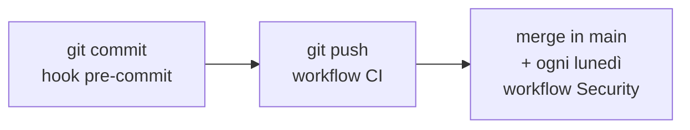

# Controlli automatici e pipeline

Cosa gira prima che una modifica arrivi in `main`, dove gira, e cosa blocca
davvero. I comandi da lanciare a mano stanno in
[contributing.md](contributing.md), qui c'è come è fatta la pipeline e
perché i controlli sono divisi in questo modo.

## Tre momenti, gli stessi controlli

I gate del hook e quelli della CI sono **gli stessi**: un fallimento in locale
è un fallimento della pipeline, e la pipeline non riserva sorprese a chi ha già
commesso. Il hook si abilita una volta dopo il clone
(`git config core.hooksPath .githooks`) e si salta, quando serve, con
`git commit --no-verify`.

Il flusso dei branch è `stage` (integrazione, commit diretti) verso `main`
(stabile), promosso a mano con un merge fast forward solo a CI verde. Il
dettaglio è in [contributing.md](contributing.md).

## Il workflow CI

[.github/workflows/ci.yml](../.github/workflows/ci.yml), su ogni push a `stage`
e `main` e su ogni PR verso di essi. Un push più recente sullo stesso
riferimento annulla la corsa in volo.

| Job | Cosa fa |
| --- | --- |
| `backend-quality` | `ruff check`, `ruff format --check`, `mypy`, e il controllo che i lock `requirements*.txt` siano coerenti con i `.in` |
| `backend-tests` | `pytest --cov` contro un **Postgres vero** avviato come service container |
| `frontend` | `prettier --check`, `oxlint`, build (che fa anche il type check), `vitest` con soglia di copertura |
| `secrets` | gitleaks su **tutta la storia**, non solo sulla punta |
| `docker-smoke` | Costruisce e avvia lo stack di produzione, e lo interroga |
| `infra-lint` | hadolint sui due Dockerfile, actionlint sui workflow, shellcheck sugli script |
| `ci-success` | Verde solo se tutti i precedenti lo sono. È il check unico da richiedere nelle impostazioni del branch |

**I test del backend girano su Postgres vero** e non su SQLite, perché
l'applicazione esegue SQL specifico di Postgres già all'avvio: le migrazioni
idempotenti, gli advisory lock, il `DISTINCT ON`. Un database finto
darebbe una suite verde su un'applicazione che non parte.

### Lo smoke test, che è la parte interessante

Non si limita a costruire le immagini: avvia **il compose di produzione**,
senza l'override di sviluppo, con due repliche di backend. Due e non quattro
perché bastano a provare le due cose che le repliche mettono alla prova, cioè
che Caddy le scopre dal DNS e che le migrazioni all'avvio reggono più processi
in fila sullo stesso lock, senza chiedere a un runner da quattro core di far
partire quattro uvicorn insieme.

Poi fa quattro verifiche, e ognuna copre un buco che le altre lascerebbero:

| Verifica | Cosa dimostra |
| --- | --- |
| Il backend risponde **da dentro la rete** | In produzione non pubblica nessuna porta, quindi interrogarlo dall'host proverebbe solo che qualcuno ha disfatto quella scelta |
| `http://localhost/` risponde | La React arriva passando dal proxy, come dal browser |
| `/api/avatars` risponde **401** | Che a rispondere sia stato il backend. Un 200 qui vorrebbe dire che `/api/*` sta finendo su nginx, che servirebbe comunque la pagina React e la verifica precedente non se ne accorgerebbe |
| Le porte 5432, 8000, 8080 e 3000 sono **irraggiungibili** dall'host | La superficie di rete è parte del deploy, quindi è parte dei test |

Il 401 come esito atteso è il dettaglio che rende il test onesto: sta
verificando l'instradamento, e l'unica risposta che prova che dietro c'è
davvero l'API è il rifiuto di chi non ha i cookie.

I file `.env` che lo stack pretende li scrive
[.github/scripts/write-ci-env.sh](../.github/scripts/write-ci-env.sh).

## Il workflow Security

[.github/workflows/security.yml](../.github/workflows/security.yml), sulle PR,
sui push a `main`, **ogni lunedì alle 6 UTC** e a mano dalla tab Actions.

| Job | Cosa scansiona |
| --- | --- |
| `dependencies` | `pip-audit` sui due lock del backend con `--require-hashes`, e `npm audit --audit-level=high` sul frontend |
| `filesystem` | Trivy sull'albero dei sorgenti: vulnerabilità, segreti e configurazioni sbagliate |
| `images` | Trivy sulle immagini **costruite**, così vengono prese anche le CVE dei sistemi di base |
| `codeql` | Analisi statica su Python e TypeScript |

I risultati vanno nella tab Security in formato SARIF, con la severità limitata
a HIGH e CRITICAL anche nel file e non solo nel codice di uscita: altrimenti
nella tab finirebbe pure tutto il rumore che il filtro voleva togliere.

**Nessuno di questi job compare fra i `needs` di `ci-success`, ed è voluto.** Un
rosso qui si vede ma non blocca un merge: sono controlli che dipendono da cosa
il mondo ha scoperto stanotte, non da cosa hai scritto tu. L'eccezione è
gitleaks, che infatti sta nella CI: un segreto commesso è tuo, ed è un blocco.

`pip-audit` gira col vincolo degli hash perché si controlli esattamente quello
che verrà installato, non la versione che il resolver sceglierebbe oggi. C'è
un'esclusione dichiarata con il suo perché nel file: una vulnerabilità senza
correzione disponibile, tenuta fuori così il job resta un segnale utile sulle
cose **nuove** invece di essere rosso fisso.

Qui dentro **non c'è nessuna scansione dinamica dell'applicazione in
esecuzione**: tutti questi job guardano il codice, le dipendenze e le immagini,
mai un'istanza che risponde. C'è stato un job `dast` con ZAP, tolto perché
senza credenziali arrivava solo al login e alle rotte che rispondono 401, cioè
sorvegliava le intestazioni e i flag dei cookie e nient'altro. Rifarlo con
copertura vera vuol dire un user pool Cognito dedicato ai test e una scansione
autenticata.

## I test

| Dove | Con cosa | Cosa coprono |
| --- | --- | --- |
| [backend/tests/](../backend/tests/) | pytest, con soglia di copertura | Permessi e confini del tenant, conservazione e cancellazione, il simulatore, l'accesso in tutte le sue vie storte, il legame fra un token e il browser che se lo è fatto emettere, e il giro dei modelli di riserva quando OpenAI non risponde |
| Accanto ai file del frontend, con suffisso `.test.ts(x)` | Vitest, con soglia di copertura | Funzioni pure di formattazione, il gate dei ruoli, la macchina della chiamata vocale, gli indirizzi che i servizi chiamano, le chiavi di cache e le invalidazioni degli hook, e quello che ogni ruolo vede in una schermata |

Il `conftest.py` del backend riempie con dei segnaposto tutte le variabili
obbligatorie, così l'unica cosa che va davvero configurata per far girare la
suite è l'indirizzo del database. Spegne anche il ciclo di pulizia periodica:
uno spazzamento che partisse a metà test girerebbe le sue DELETE su una
connessione propria, fuori dalla transazione che il test annulla alla fine.

Sul lato frontend i test non coprono tutto per principio: coprono quello che si
rompe **in silenzio**. La macchina della chiamata è l'esempio: uno stato
sbagliato lì non dà un errore, dà una telefonata che non funziona.

## Le dipendenze

Il backend dichiara le dipendenze di runtime in `requirements.in` senza
versioni, e il lock pinnato con gli hash si rigenera **dentro l'immagine di
produzione**, così le versioni scelte sono quelle che gireranno davvero. Un job
della CI controlla che lock e `.in` non abbiano divergenza.

Dependabot apre PR settimanali per pip, npm, Docker e GitHub Actions.

## Cosa non c'è

**Non c'è deploy automatico.** Le immagini si costruiscono solo per verifica, e
la messa in produzione è il comando descritto in
[deploy-e-scalabilita.md](deploy-e-scalabilita.md), dato a mano sul server.

**Non c'è branch protection** che imponga una PR verso `main`: la garanzia è
procedurale, si mergia solo a `stage` verde. Passando a un flusso con feature
branch avrebbe senso proteggere `stage` con `ci-success` come check richiesto.
