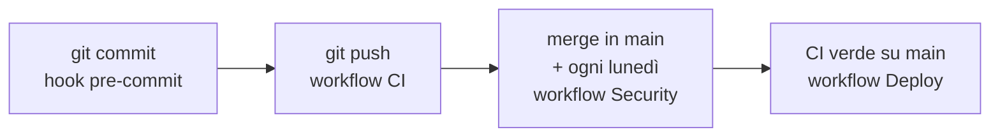
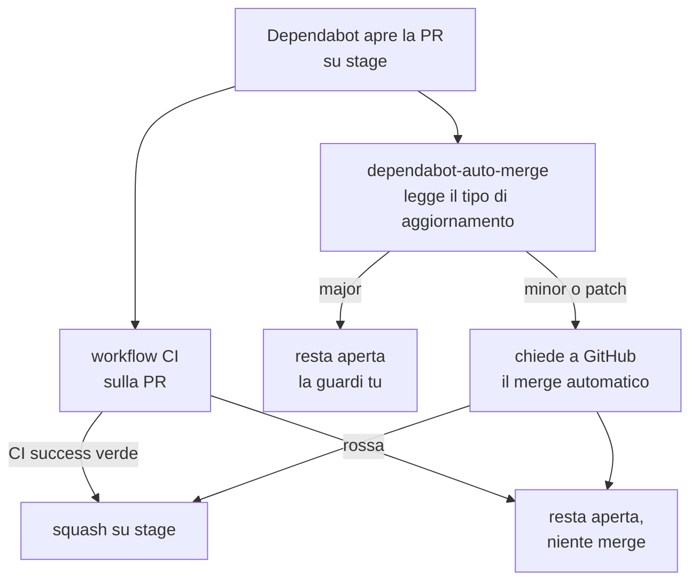

# Controlli automatici e pipeline

Cosa gira prima che una modifica arrivi in `main`, dove gira, e cosa blocca
davvero. I comandi da lanciare a mano stanno in
[contributing.md](contributing.md), qui c'è come è fatta la pipeline e
perché i controlli sono divisi in questo modo.

## Tre momenti, gli stessi controlli

L'ultimo riquadro non è un controllo, è la conseguenza: la CI verde su `main` è
la condizione che fa partire il rilascio in produzione, e lo racconta
[Il rilascio in produzione](#il-rilascio-in-produzione).

I gate del hook e quelli della CI sono **gli stessi**: un fallimento in locale
è un fallimento della pipeline, e la pipeline non riserva sorprese a chi ha già
commesso. Il hook si abilita una volta dopo il clone
(`git config core.hooksPath .githooks`) e si salta, quando serve, con
`git commit --no-verify`.

Il flusso dei branch è `stage` (integrazione, commit diretti) verso `main`
(stabile), promosso a mano con un merge fast forward solo a CI verde. Il
dettaglio è in [contributing.md](contributing.md).

## Cosa succede a ogni passo

**Quando fai `git commit`** parte il hook, che gira in locale gli stessi
controlli della CI: ruff, mypy, la coerenza dei lock, pytest, prettier, oxlint,
la build, vitest e gitleaks sui file in stage. Se qualcosa è rosso il commit non
viene creato. Sono circa dieci minuti, ed è il motivo per cui la CI quasi non
trova mai niente: quello che trova, lo trova prima.

**Quando pushi su `stage`** il push passa subito. Sul branch c'è un ruleset che
richiede il check `CI success`, ma il ruolo di amministratore lo scavalca: la
regola è lì per il bot, non per te (il perché sta più sotto, in
[Le impostazioni che non stanno nel repository](#le-impostazioni-che-non-stanno-nel-repository)).
Poi parte il workflow CI, sette job in parallelo, ed è l'unica cosa che parte:
Security non gira sui push a `stage`. Se un push più recente arriva mentre la
corsa è in volo, quella vecchia viene annullata.

Un rosso su `stage` non blocca niente, perché il commit è già dentro. Serve a
dirti che `stage` non è promuovibile finché non lo sistemi, ed è esattamente la
garanzia procedurale su cui si regge il flusso.

**Quando mergi `stage` in `main`** partono due workflow, CI e Security. Il
secondo può essere rosso per una CVE pubblicata nella notte, e non blocca il
merge perché il merge è già avvenuto: è una segnalazione da leggere, non un
semaforo da aspettare.

**Quando la CI su `main` diventa verde** parte il rilascio, che aggiorna il
server da solo. Il merge in `main` è quindi il momento in cui si decide di
mettere in produzione, e va scelto di conseguenza: gli aggiornamenti
interrompono le chiamate in corso
([deploy-e-scalabilita.md](deploy-e-scalabilita.md)).

**Quando Dependabot apre una PR** il giro è diverso, ed è l'unico automatico:
lo racconta [Il giro di una PR di Dependabot](#il-giro-di-una-pr-di-dependabot).

## Il workflow CI

[.github/workflows/ci.yml](../.github/workflows/ci.yml), su ogni push a `stage`
e `main` e su ogni PR verso di essi. Un push più recente sullo stesso
riferimento annulla la corsa in volo.

| Job | Cosa fa |
| --- | --- |
| `backend-quality` | `ruff check`, `ruff format --check`, `mypy`, e il controllo che i lock `requirements*.txt` siano coerenti con i `.in` |
| `backend-tests` | `pytest --cov` contro un **Postgres vero** avviato come service container |
| `frontend` | `prettier --check`, `oxlint`, build (che fa anche il type check), `vitest` con soglia di copertura |
| `secrets` | gitleaks su **tutta la storia**, non solo sulla punta |
| `docker-smoke` | Costruisce e avvia lo stack di produzione, e lo interroga |
| `infra-lint` | hadolint sui due Dockerfile, actionlint sui workflow, shellcheck sugli script |
| `ci-success` | Verde solo se tutti i precedenti lo sono. È il check unico da richiedere nelle impostazioni del branch |

**Gli strumenti di `infra-lint` sono binari presi dalle release su GitHub**, non
immagini. Giravano in un container ciascuno, e ogni `docker run` era un pull
anonimo da Docker Hub: i runner condividono gli indirizzi con tutti gli altri
progetti del mondo, quindi ogni tanto quel pull tornava indietro con
`unauthorized: authentication required` e il job diventava rosso senza che il
codice c'entrasse. Adesso il job dura sei secondi invece di quaranta, e la
versione di ogni strumento è scritta per esteso nel workflow.

**I test del backend girano su Postgres vero** e non su SQLite, perché
l'applicazione esegue SQL specifico di Postgres già all'avvio: le migrazioni
idempotenti, gli advisory lock, il `DISTINCT ON`. Un database finto
darebbe una suite verde su un'applicazione che non parte.

### Lo smoke test, che è la parte interessante

Non si limita a costruire le immagini: avvia **il compose di produzione**,
senza l'override di sviluppo, con due repliche di backend. Due e non quattro
perché bastano a provare le due cose che le repliche mettono alla prova, cioè
che Caddy le scopre dal DNS e che le migrazioni all'avvio reggono più processi
in fila sullo stesso lock, senza chiedere a un runner da quattro core di far
partire quattro uvicorn insieme.

Poi fa quattro verifiche, e ognuna copre un buco che le altre lascerebbero:

| Verifica | Cosa dimostra |
| --- | --- |
| Il backend risponde **da dentro la rete** | In produzione non pubblica nessuna porta, quindi interrogarlo dall'host proverebbe solo che qualcuno ha disfatto quella scelta |
| `http://localhost/` risponde | La React arriva passando dal proxy, come dal browser |
| `/api/avatars` risponde **401** | Che a rispondere sia stato il backend. Un 200 qui vorrebbe dire che `/api/*` sta finendo su nginx, che servirebbe comunque la pagina React e la verifica precedente non se ne accorgerebbe |
| Le porte 5432, 8000, 8080 e 3000 sono **irraggiungibili** dall'host | La superficie di rete è parte del deploy, quindi è parte dei test |

Il 401 come esito atteso è il dettaglio che rende il test onesto: sta
verificando l'instradamento, e l'unica risposta che prova che dietro c'è
davvero l'API è il rifiuto di chi non ha i cookie.

I file `.env` che lo stack pretende li scrive
[.github/scripts/write-ci-env.sh](../.github/scripts/write-ci-env.sh).

## Il workflow Security

[.github/workflows/security.yml](../.github/workflows/security.yml), sui push a
`main`, **ogni lunedì alle 6 UTC** e a mano dalla tab Actions.

| Job | Cosa scansiona |
| --- | --- |
| `dependencies` | `pip-audit` sui due lock del backend con `--require-hashes`, e `npm audit --audit-level=high` sul frontend |
| `filesystem` | Trivy sull'albero dei sorgenti: vulnerabilità, segreti e configurazioni sbagliate |
| `images` | Trivy sulle immagini **costruite**, così vengono prese anche le CVE dei sistemi di base |
| `codeql` | Analisi statica su Python e TypeScript |

I risultati vanno nella tab Security in formato SARIF, con la severità limitata
a HIGH e CRITICAL anche nel file e non solo nel codice di uscita: altrimenti
nella tab finirebbe pure tutto il rumore che il filtro voleva togliere.

**Nessuno di questi job compare fra i `needs` di `ci-success`, ed è voluto.** Un
rosso qui si vede ma non blocca un merge: sono controlli che dipendono da cosa
il mondo ha scoperto stanotte, non da cosa hai scritto tu. L'eccezione è
gitleaks, che infatti sta nella CI: un segreto commesso è tuo, ed è un blocco.

**Per la stessa ragione non gira più sulle pull request.** Ci girava, e il
risultato era un rosso quasi costante e scollegato dalla modifica: un `pip-audit`
che accusava il lock di sviluppo su una PR che toccava un Dockerfile, una CVE
pubblicata nella notte su tre PR aperte insieme. Un semaforo rosso che non
blocca niente e non riguarda ciò che hai cambiato insegna soltanto a non
guardare più i semafori, e il giorno in cui il rosso è vero passa inosservato.
La copertura non cambia, perché queste scansioni non guardano il diff: guardano
l'albero, ed è lo stesso albero il lunedì mattina.

`pip-audit` gira col vincolo degli hash perché si controlli esattamente quello
che verrà installato, non la versione che il resolver sceglierebbe oggi. Oggi
non ha esclusioni: ce n'era una, un timing attack su `ecdsa` che arrivava
dentro `python-jose` e non aveva una versione corretta, ed è sparita insieme
alla libreria che se la portava dietro quando la verifica dei token è passata a
PyJWT. Un'esclusione va scritta con il suo perché accanto, e va tolta appena il
motivo che la reggeva non c'è più: è la differenza fra un job che resta un
segnale utile sulle cose **nuove** e uno che nessuno guarda.

Qui dentro **non c'è nessuna scansione dinamica dell'applicazione in
esecuzione**: tutti questi job guardano il codice, le dipendenze e le immagini,
mai un'istanza che risponde. C'è stato un job `dast` con ZAP, tolto perché
senza credenziali arrivava solo al login e alle rotte che rispondono 401, cioè
sorvegliava le intestazioni e i flag dei cookie e nient'altro. Rifarlo con
copertura vera vuol dire un user pool Cognito dedicato ai test e una scansione
autenticata.

## Il rilascio in produzione

[.github/workflows/deploy.yml](../.github/workflows/deploy.yml). Entra nel
server in SSH e gli fa eseguire [deploy/deploy.sh](../deploy/deploy.sh), che è
lo stesso `git merge` più `docker compose up -d --build` del rilascio a mano
([deploy-e-scalabilita.md](deploy-e-scalabilita.md)). La prima installazione,
compresa la preparazione della chiave, sta in
[messa-in-produzione.md](messa-in-produzione.md).

**Il trigger è la CI verde su `main`, non il push su `main`.** Fra le due cose
passano i dieci minuti della corsa, e in quei dieci minuti sta la differenza fra
rilasciare quello che hai promosso e rilasciare qualcosa che non compila.

**Non c'è un bottone da premere**, e non è una svista. Il merge in `main` è già
un gesto deliberato, fatto a mano da `stage` e solo a CI verde: quella è la
decisione di rilasciare, e chiederne conferma dieci minuti dopo vorrebbe dire
confermare due volte la stessa cosa. Le conferme che si danno sempre smettono
di essere controlli. La regola che sostituisce il bottone è una sola, ed è
facile da rispettare: **nei giorni di esercitazione non si mergia in `main`**,
perché il rilascio interrompe le chiamate in corso. Il job dichiara comunque
l'ambiente `production`, quindi il giorno in cui quella regola si dimostrasse
fragile il revisore richiesto si attiva con una spunta nelle impostazioni, senza
toccare nessun file.

Tre dettagli valgono la riga che occupano:

| Scelta | Perché |
| --- | --- |
| L'impronta del server in `DEPLOY_KNOWN_HOSTS` | L'alternativa scritta ovunque è `StrictHostKeyChecking=no`, che fa accettare al runner qualunque macchina risponda a quell'indirizzo: è precisamente la cosa contro cui l'impronta esiste |
| Il comando forzato in `authorized_keys` | La chiave sta su un server di GitHub, e da lì può fare una cosa sola. È il server a decidere cosa gira, non chi bussa |
| Il controllo dopo il rilascio | Contro il dominio vero, e chiede `/` più un 401 su `/api/avatars`: senza, un rilascio che rompe l'avvio del backend risulterebbe verde qui e si scoprirebbe dal browser |

**Il rilascio si lancia anche a mano**, dalla tab Actions, quando serve
rimettere su lo stack senza un commit nuovo, per esempio dopo aver cambiato un
`.env` sul server.

**Quello che il rilascio non fa è tornare indietro.** Le immagini si
costruiscono sul server e non sono conservate da nessuna parte, quindi il
ritorno alla versione precedente si fa a mano e costa una ricostruzione
([deploy-e-scalabilita.md](deploy-e-scalabilita.md)). Il giorno in cui quei
minuti fossero troppi, la risposta è costruire le immagini in CI e pubblicarle
su un registry, con il server che si limita a scaricarle: è un cambio che si fa
quando serve, non prima.

Finché il server sta su un commit scelto a mano, i rilasci automatici
**falliscono invece di sovrascriverlo**, perché lo script avanza solo in fast
forward da `main`. È il comportamento voluto, non un intoppo: un rilascio che
riportasse su la versione da cui sei appena scappato sarebbe molto peggio di un
job rosso. Si torna in carreggiata con un `git checkout main` sul server, dopo
aver corretto in `main` quello che non andava.

## I test

| Dove | Con cosa | Cosa coprono |
| --- | --- | --- |
| [backend/tests/](../backend/tests/) | pytest, con soglia di copertura | Permessi e confini del tenant, conservazione e cancellazione, il simulatore, l'accesso in tutte le sue vie storte, il legame fra un token e il browser che se lo è fatto emettere, e il giro dei modelli di riserva quando OpenAI non risponde |
| [frontend/tests/](../frontend/tests/) | Vitest, con soglia di copertura | Funzioni pure di formattazione, il gate dei ruoli, la macchina della chiamata vocale, gli indirizzi che i servizi chiamano, le chiavi di cache e le invalidazioni degli hook, e quello che ogni ruolo vede in una schermata |

Il `conftest.py` del backend riempie con dei segnaposto tutte le variabili
obbligatorie, così l'unica cosa che va davvero configurata per far girare la
suite è l'indirizzo del database. Spegne anche il ciclo di pulizia periodica:
uno spazzamento che partisse a metà test girerebbe le sue DELETE su una
connessione propria, fuori dalla transazione che il test annulla alla fine.

Sul lato frontend i test non coprono tutto per principio: coprono quello che si
rompe **in silenzio**. La macchina della chiamata è l'esempio: uno stato
sbagliato lì non dà un errore, dà una telefonata che non funziona.

## Le dipendenze

Il backend dichiara le dipendenze di runtime in `requirements.in` senza
versioni, e il lock pinnato con gli hash si rigenera **dentro l'immagine di
produzione**, così le versioni scelte sono quelle che gireranno davvero. Un job
della CI controlla che lock e `.in` non abbiano divergenza.

Dependabot apre PR settimanali per pip, npm, Docker e GitHub Actions, **verso
`stage`** e non verso `main`: le PR devono nascere dal lato del flusso in cui il
lavoro entra, o ogni aggiornamento va riportato a mano dall'altra parte.

Minor e patch viaggiano raggruppate per ecosistema e **si mergiano da sole**
quando la CI passa. I major restano fuori dai gruppi, una PR per pacchetto, e si
guardano a mano: non sono manutenzione, sono migrazioni. Sulle immagini di base i
major sono ignorati del tutto, perché cambiare versione a Python o a Node
significa cambiare la piattaforma sotto tutto il resto, a partire dal lock che è
compilato dentro `python:3.12-slim`.

### Il giro di una PR di Dependabot

Il pezzo che conta è che **il merge automatico non scavalca nessun controllo**.
`gh pr merge --auto` non mergia niente sul momento: dice a GitHub di farlo
quando i check richiesti dal ruleset saranno verdi. Se la CI fallisce, la PR
resta aperta come prima, e nessuno l'ha mergiata al posto tuo. È per questo che
il ruleset con `CI success` richiesto non è un accessorio: senza un check da
aspettare, "automatico" vorrebbe dire "subito".

Il workflow gira su `pull_request_target` e non su `pull_request`, perché le PR
di Dependabot ricevono un token in sola lettura, che non basta a mergiare. Per
la stessa ragione **non fa nessun checkout**, ed è deliberato: con quell'evento
il codice della PR non va mai eseguito, o su un repository pubblico chiunque
apra una PR eseguirebbe ciò che vuole con un token in scrittura. Legge dei
metadati e chiama l'API, nient'altro.

I major non sono esclusi da una lista di nomi ma dal tipo di aggiornamento, che
`dependabot/fetch-metadata` ricava dalla PR stessa: un pacchetto nuovo non
sfugge alla regola per il fatto di non essere stato previsto.

## Le impostazioni che non stanno nel repository

Alcuni pezzi della pipeline vivono nelle impostazioni di GitHub, non in un file
versionato: clonando il repository non si vedono, e su un repository nuovo
vanno rifatti a mano.

| Impostazione | Dove | A cosa serve |
| --- | --- | --- |
| **Allow auto-merge** | Settings, General, Pull Requests | Senza, `gh pr merge --auto` si rifiuta di partire e le PR di manutenzione restano ferme |
| **Ruleset su `stage`** | Settings, Rules | Richiede il check `CI success`, vieta force push e cancellazione del branch, e lascia il bypass al ruolo di amministratore |
| **Dependabot legge la configurazione da `main`** | Nessuna impostazione, è il comportamento del servizio | Un cambio a `dependabot.yml` non ha effetto finché resta su `stage`: va portato sul branch di default |
| **Ambiente `production`** | Settings, Environments | Ci vivono i quattro segreti del rilascio, ed è il posto dove si aggiunge un revisore richiesto senza toccare il workflow |
| **`DEPLOY_USER`, `DEPLOY_HOST`, `DEPLOY_SSH_KEY`, `DEPLOY_KNOWN_HOSTS`** | Settings, Environments, `production` | L'utente, l'indirizzo, la chiave privata del runner e l'impronta del server. Come si ottengono sta in [messa-in-produzione.md](messa-in-produzione.md) |
| **Variabile `SITE_ADDRESS`** | Settings, Secrets and variables, Actions, Variables | Il dominio su cui il rilascio verifica di aver funzionato. È una variabile e non un segreto perché è pubblico, e mascherato renderebbe illeggibili proprio i log da guardare |
| **Il workflow Deploy si legge dal ramo di default** | Nessuna impostazione, è il comportamento del servizio | Come per `dependabot.yml`: finché una modifica a `deploy.yml` sta solo su `stage`, il rilascio continua a comportarsi come prima |

Il ruleset ha **il bypass sul ruolo di amministratore**, ed è una scelta, non
una dimenticanza: la regola esiste perché il merge automatico abbia un check da
aspettare, quindi deve vincolare il bot, non chi lavora. Senza il bypass i push
diretti su `stage` verrebbero rifiutati, e il flusso a commit diretti che questo
repository usa diventerebbe un flusso a feature branch. È una decisione da
prendere quando si vuole, non un effetto collaterale.

La casella **Require branches to be up to date before merging** è
deliberatamente spenta: con quella attiva, ogni avanzamento di `stage` rende non
aggiornate tutte le PR aperte, che vanno rilanciate una per una, e il merge
automatico resta appeso ad aspettare.

L'ultima riga della tabella è quella che si dimentica: la configurazione di
Dependabot si legge dal branch di default. Finché un cambio a
[dependabot.yml](../.github/dependabot.yml) sta solo su `stage`, il bot continua
a comportarsi come prima, e sembra che la modifica non abbia funzionato.

## Cosa non c'è

**Non c'è un registry.** Le immagini si costruiscono sul server a ogni
rilascio, e in CI solo per verifica: nessuna delle due viene pubblicata da
qualche parte. È il motivo per cui il ritorno alla versione precedente costa
una ricostruzione, ed è il punto in cui questa scelta andrà rivista.

**Non c'è branch protection** che imponga una PR verso `main`: la garanzia è
procedurale, si mergia solo a `stage` verde.
