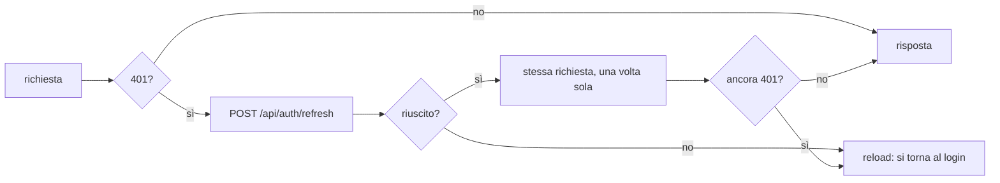
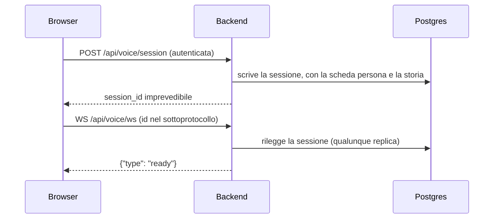

# Come il browser parla con il server

Tre forme, e ognuna esiste per un motivo diverso. Quasi tutto passa da
richieste HTTP normali; due cose sole non ci stanno dentro, e sono quelle in
cui il tempo conta.

| Forma | Dove si usa | Perché non basta una richiesta normale |
| --- | --- | --- |
| **HTTP + JSON** | Tutto il resto | Niente da aggiungere |
| **SSE** (Server-Sent Events) | La risposta dell'avatar nella chat scritta | Le prime parole devono arrivare al primo token del modello, non alla fine |
| **WebSocket** | La chiamata vocale | L'audio va nei due sensi contemporaneamente, per minuti |

Non c'è nessun `fetch` scritto a mano dentro un componente: le chiamate stanno
in [frontend/src/services/](../frontend/src/services/) e i componenti le
raggiungono da un hook. La regola e il perché stanno in
[frontend.md](frontend.md).

---

## HTTP: un solo punto di ingresso

Ogni chiamata passa da `apiFetch` in
[frontend/src/services/api.ts](../frontend/src/services/api.ts), che è l'unico
posto dove si decidono cinque cose:

**1. L'indirizzo.** La base è la stringa vuota: le richieste sono nella stessa
origine della pagina. In sviluppo è Vite a inoltrare `/api` e `/static` al
backend, in produzione è il reverse proxy. L'applicazione non sa nulla di
domini, e quindi funziona anche dietro un tunnel senza toccare il CORS.

**2. Il corpo.** Un oggetto viene serializzato in JSON con il suo header. Un
`Blob` (la registrazione di una chiamata) o un `FormData` (il ritratto di un
avatar, il documento di una simulazione) viaggiano invece **così come sono**,
senza toccare il `Content-Type`: quell'header lo deriva `fetch` dal corpo
stesso, ed è l'unico che sappia scriverci il boundary del multipart.

**3. Le credenziali.** `credentials: 'include'` sempre. Il token non lo tocca
nessuno: sta in un cookie `HttpOnly` che JavaScript non può nemmeno leggere, e
il browser lo attacca da solo.

**4. Il rinnovo della sessione.** Un 401 non è subito un errore:

Il ritentativo è **uno solo**: se anche dopo il rinnovo la risposta è 401 la
sessione è morta davvero, e la pagina si ricarica finendo sulla schermata di
accesso. Un ciclo di ritentativi terrebbe l'utente su una pagina che non
funziona senza dirglielo.

Anche **il rinnovo è uno solo**, per tutta l'applicazione: l'access token
scade mentre una pagina ha già diverse richieste in volo, quindi i 401
arrivano insieme, e uno per ciascuno vorrebbe dire altrettante chiamate a
Cognito nello stesso istante per ottenere la stessa identica cosa. Cognito le
limita, e basta che una venga rifiutata perché chi la stava aspettando finisca
sul ramo del reload con una sessione ancora buona. Chi arriva mentre il
rinnovo è in volo aspetta quello (`refreshSession` in
[auth.ts](../frontend/src/services/auth.ts)), e alla scadenza successiva ne
riparte uno nuovo.

**5. Gli errori.** Il corpo dell'errore viene aperto per estrarne il campo
`detail`, che è quello che FastAPI riempie con i messaggi in italiano scritti
negli endpoint. Il componente riceve quindi un `Error` con dentro la frase da
mostrare, non uno stato numerico da tradurre.

Per i file c'è `apiFetchBlob`, che è lo stesso giro con la risposta letta come
`Blob`: lo usano le registrazioni delle chiamate e i PDF delle valutazioni.
Consegnarlo al browser è `saveBlob`, e le due righe che sembrano di troppo
sono le due che lo fanno funzionare ovunque: il link va attaccato al documento
prima del click, e il suo URL va revocato più tardi, non nello stesso istante.
Firefox e Safari risolvono il download un attimo dopo l'evento, quindi con la
revoca immediata il file non arriva e nessuno se ne accorge finché non prova
su un browser diverso dal proprio.

---

## SSE: la risposta che arriva mentre nasce

Nella chat scritta la risposta dell'avatar può durare qualche secondo, e
consegnarla tutta insieme alla fine farebbe sembrare l'applicazione ferma.
L'endpoint `POST /api/chat/message` risponde quindi in Server-Sent Events.

Tre tipi di evento, dal server:

| Evento | Contenuto | Significato |
| --- | --- | --- |
| `delta` | `{"text": "..."}` | Un frammento, appena OpenAI lo produce |
| `done` | Lo scambio salvato | Finito, ed è a database |
| `error` | `{"detail": "..."}` | Non è stato salvato niente, si può rimandare |

Lo stream **non** si legge con un `EventSource`, perché quello sa fare solo GET
e qui serve mandare il messaggio nel corpo di una POST. Lo legge a mano
`sendChatMessage` in [api.ts](../frontend/src/services/api.ts): un `reader`
sul corpo della risposta, un buffer, e i blocchi separati da riga vuota
riconosciuti man mano che arrivano.

Due dettagli che sembrano piccoli e non lo sono:

- **Niente viene salvato finché la risposta non è completa.** Se la
  connessione cade a metà, il client se ne accorge (non è mai arrivato il
  `done`) e dice di rimandare il messaggio, con la certezza che nella
  trascrizione non è rimasto mezzo scambio.
- **`X-Accel-Buffering: no`** sulla risposta. nginx accumula per conto suo le
  risposte che inoltra, e senza quell'header lo stream tornerebbe a essere un
  blocco unico consegnato alla fine.

Lato server c'è una terza cosa da sapere: la connessione al database viene
**restituita al pool prima** di cominciare lo streaming. L'attesa del modello
sono decine di secondi in cui il database non serve, e quaranta persone che
scrivono insieme esaurirebbero il pool aspettando OpenAI. Il commento esteso è
in [routers/chat.py](../backend/routers/chat.py).

---

## WebSocket: la chiamata

Un socket solo, per tutta la durata della telefonata, su cui viaggiano due
tipi di frame:

- **binari**: l'audio. In salita il microfono in PCM16 a 16 kHz, in discesa la
  voce dell'avatar in PCM16 a 24 kHz.
- **testuali**: JSON con lo stato della chiamata (trascrizioni parziali e
  definitive, l'avatar che comincia e finisce di parlare, le interruzioni, gli
  errori).

L'apertura è in due tempi, e questa è la parte che conta:

Il WebSocket non è autenticato dai cookie ma dal `session_id`, che è un token
casuale a vita breve e viaggia nei sottoprotocolli dell'handshake, non nella
query string, perché un indirizzo finisce nei log del proxy. La sessione sta su
Postgres proprio perché le due richieste possono finire su repliche diverse, e
all'apertura viene riletto anche lo stato dell'account, che è l'unico posto in
cui una sospensione può raggiungere questa rotta: il dettaglio completo è in
[chiamata-vocale.md](chiamata-vocale.md).

---

## La cache lato client

Ogni lettura passa da TanStack Query, e ogni chiave di cache sta in un posto
solo: [frontend/src/hooks/queryKeys.ts](../frontend/src/hooks/queryKeys.ts).

Il motivo è un bug che era già successo: una chiave scritta a mano in tre
componenti, con una delle tre leggermente diversa. Due stringhe che dovevano
essere uguali e non lo erano sdoppiano la cache senza rompere niente, e chi
invalida la prima si lascia dietro la seconda, vecchia, sullo schermo.

Le convenzioni del file:

- ogni area ha un **prefisso** (`['simulations']`, `['conversations']`, ...) e
  una voce `all` che è il prefisso stesso: è quella da invalidare quando una
  mutation tocca qualcosa e non si sa esattamente dove sia in cache;
- **i filtri entrano nella chiave**. Cambiare filtro è una domanda diversa,
  quindi una voce di cache diversa, non la stessa da sovrascrivere;
- una scrittura invalida **il prefisso**, non la singola voce, quando l'effetto
  attraversa più liste. Pubblicare una simulazione, per dire, cambia sia
  l'elenco di gestione sia quello di chi la deve svolgere, e quale delle due
  sia in cache in quel momento non lo sa nessuno.

## Chi tiene lo stato dell'utente

`AuthProvider` ([frontend/src/contexts/AuthProvider.tsx](../frontend/src/contexts/AuthProvider.tsx))
tiene in memoria il profilo, e nient'altro. Non il token, che non può vedere.
Chi lo legge non passa dal context: usa
[useAuth](../frontend/src/hooks/useAuth.ts), come per ogni altro dato.

All'avvio della pagina non c'è modo di sapere se la sessione è viva guardando i
cookie, perché sono `HttpOnly`: si chiede al backend con `GET /api/auth/me`, e
la risposta decide se si vede l'applicazione o la landing page.
