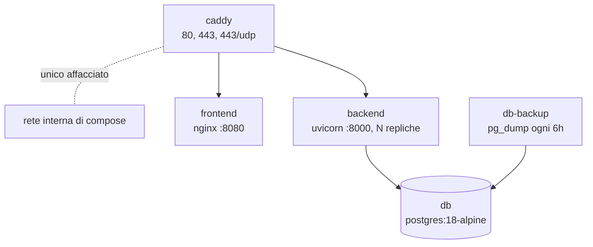

# Docker e i due ambienti

Come l'applicazione viene impacchettata e messa in piedi, e in che cosa
l'ambiente di sviluppo è diverso da quello di produzione. I comandi del deploy
stanno in [deploy-e-scalabilita.md](deploy-e-scalabilita.md).

## Un file solo, due ambienti

Accanto a [docker-compose.yml](../docker-compose.yml) c'è
[docker-compose.override.yml](../docker-compose.override.yml), e Compose lo
legge **da solo**, senza che nessuno glielo chieda. La conseguenza è la
regola più importante di tutto questo capitolo:

```bash
docker compose up --build                    # sviluppo (l'override viene letto)
docker compose -f docker-compose.yml up -d   # produzione (l'override viene escluso)
```

Il `-f` esplicito non è un vezzo: senza, si sta avviando lo sviluppo credendo
di avviare la produzione.

| | Sviluppo | Produzione |
| --- | --- | --- |
| Backend | `uvicorn --reload`, sorgenti montate dall'host | uvicorn normale, codice dentro l'immagine |
| Repliche del backend | 1 | `BACKEND_REPLICAS` |
| Frontend | Vite dev server | File compilati serviti da nginx |
| Caddy e backup | Spenti (profilo mai attivato) | Attivi |
| Porte affacciate | 5432, 8000, 3000 sull'host | Solo 80 e 443 di Caddy |
| Healthcheck del backend | Disattivato | Attivo |

Il frontend in sviluppo si ferma allo **stadio di build** del Dockerfile e
lancia Vite; in produzione arriva fino allo stadio nginx. Le due modalità
condividono il nome dell'immagine ma non lo stadio, ed è il motivo di un
inciampo noto: dopo aver costruito la produzione, il `docker compose up` di
sviluppo riparte in ciclo con exit 127, che è `npm` cercato dentro
un'immagine dove non c'è. Non è rotto niente, va solo ricostruito:

```bash
docker compose up -d --build frontend
```

## I cinque servizi di produzione



| Servizio | Immagine | Affacciato | Note |
| --- | --- | --- | --- |
| `caddy` | `caddy:2-alpine` | **Sì**, 80 e 443 | Termina TLS, smista, bilancia |
| `backend` | Costruita da `./backend` | No | N repliche identiche |
| `frontend` | Costruita da `./frontend` | No | Solo file statici |
| `db` | `postgres:18-alpine` | No | |
| `db-backup` | costruita da [db/Dockerfile](../db/Dockerfile) | No | L'immagine del database, così `pg_dump` è della stessa versione del server che copia, più `age`, che è quello che cifra i dump |

**Nessun segreto sta nel compose.** Le credenziali del database arrivano dal
file `.env` accanto al compose, e sono dichiarate con la sintassi che fa
fallire l'avvio dicendo cosa manca. Un errore in faccia al primo avvio è molto
meglio di un database di produzione con dentro `postgres/postgres` che nessuno
noterà mai.

Utente e nome del database contano solo alla prima inizializzazione del volume:
cambiarli dopo non li cambia dentro Postgres, li spezza e basta. La password
deve essere URL-safe, perché finisce dentro `DATABASE_URL`.

## Le immagini

**[backend/Dockerfile](../backend/Dockerfile)**, da `python:3.12-slim`. Le
dipendenze si installano prima del codice, così quel livello resta in cache
finché `requirements.txt` non cambia. Alla fine il container passa a un utente
non privilegiato, dichiarato **col numero** (`USER 10001`) e non col nome:
quel nome esiste solo dentro l'immagine, mentre chi guarda da fuori (l'host sui
file del volume, uno scanner che verifica che non giri da root) vede solo il
numero. Prima di installare le CA c'è un `apt-get upgrade`, lo stesso motivo
dell'`apk upgrade` del frontend: i pacchetti di sistema restano fermi allo
snapshot dell'immagine di base, e senza quella riga una correzione pubblicata
da Debian su `openssl` o `util-linux` arriverebbe solo quando l'immagine viene
ricostruita a monte, con il job `Image scan` rosso nel frattempo.

**[frontend/Dockerfile](../frontend/Dockerfile)**, a due stadi: Node compila,
e l'immagine finale è `nginx-unprivileged`, che gira come utente non root e
ascolta sulla 8080 perché sotto la 1024 non potrebbe. Nel secondo stadio c'è un
`apk upgrade` per prendere le correzioni uscite dopo lo scatto dell'immagine di
base.

Tutti i servizi hanno `no-new-privileges:true`, cioè non possono guadagnare
privilegi durante l'esecuzione.

## Chi decide dove va una richiesta

Il proxy verso il backend **stava in nginx**, e adesso sta solo in Caddy. Il
motivo non è estetico: nginx risolve il nome di un upstream **una volta sola
all'avvio**, quindi con quattro repliche avrebbe mandato tutto sempre alla
stessa, senza che niente sembrasse rotto.

Adesso [nginx.conf](../frontend/nginx.conf) serve solo i file compilati, con il
`try_files` che manda tutto a `index.html` perché il routing è lato React. Chi
smista è [caddy/Caddyfile](../caddy/Caddyfile), e lo fa così:

| Percorso | Destinazione |
| --- | --- |
| `/api/*`, `/static/*` | Le repliche del backend, sulla 8000 |
| Tutto il resto | `frontend:8080` |

Quattro dettagli del Caddyfile che valgono da soli:

- **le repliche non si elencano**: si chiedono al DNS di Docker, con un
  aggiornamento ogni cinque secondi. Così `--scale backend=6` cambia la
  capacità senza toccare nessun file;
- **`lb_policy least_conn`**, non round robin. Una chiamata vocale tiene la
  connessione aperta per dieci minuti, quindi quello che conta non è di chi sia
  il turno, è chi ne ha meno in corso adesso;
- **health check attivo su `/health`**: una replica che non è in grado di
  servire esce dal giro da sola e ci rientra appena torna a esserlo. Senza, il
  bilanciatore continuerebbe a mandarle una chiamata su N. Perché `/health` e
  non la radice sta più sotto, in questa stessa pagina;
- **gli header di sicurezza**, in un blocco solo e prima delle due strade, così
  valgono sia per la React sia per l'API sia per i ritratti sotto `/static`.
  Cosa difendono e quali deroghe ha la CSP di questa applicazione stanno in
  [sicurezza-e-privacy.md](sicurezza-e-privacy.md);
- **`X-Forwarded-For` sovrascritto, non accodato**. Il backend legge il primo
  valore per sapere chi sta chiamando, e accodandolo basterebbe che un client
  se lo mandasse da solo per farsi credere un altro indirizzo, aggirando il
  limite sui tentativi di accesso. È una riga, ed è la differenza fra un limite
  e la sua apparenza.

Il WebSocket della chiamata passa di qui senza configurazione aggiuntiva: Caddy
lo inoltra da sé.

`SITE_ADDRESS` decide anche i certificati: un dominio vero fa emettere e
rinnovare da Let's Encrypt, `localhost` usa la CA interna di Caddy, `:80` serve
in chiaro e va bene solo per le prove (coi cookie `Secure` l'applicazione non
riesce nemmeno a tenere il login). Ha un default, al contrario delle credenziali
del database, perché Compose interpola le variabili di tutti i servizi anche
quando non li avvia, e una variabile obbligatoria qui costringerebbe a
inventarsi un dominio pure per lavorare in locale.

## I volumi

| Volume | Contiene | Se lo perdi |
| --- | --- | --- |
| `db_data` | Il database | Tutto, e per questo esistono i backup |
| `backend_static` | I ritratti caricati degli avatar | Le immagini caricate. È condiviso fra le repliche: quella caricata da una deve essere servita da tutte |
| `caddy_data`, `caddy_config` | I certificati | Vanno richiesti daccapo, e Let's Encrypt smette di emetterli dopo qualche tentativo nella stessa settimana |
| `./backups` | I dump | Una cartella dell'host, non un volume, apposta perché un `rsync` possa portarli fuori dalla macchina. Il servizio che ci scrive non gira da root, quindi la cartella va di `70:70` ([messa-in-produzione.md](messa-in-produzione.md), passo 8) |

## Limiti, log e spegnimento

**I limiti di CPU e memoria** ci sono su tutti i servizi. Il pezzo che conta è
la **riserva** di memoria sul database: il tetto impedisce a Postgres di
prendersi tutto, la riserva impedisce agli altri di lasciarlo senza niente.
Senza, quattro repliche sotto picco possono spingerlo in swap, e un database
che scrive su disco al posto che in RAM non rallenta un po', si ferma, e con
lui tutto il resto.

Backend e database prendono i loro numeri dal `.env`, perché cambiano con la
macchina. Frontend e Caddy li hanno scritti nel compose, perché non cambiano:
nginx serve file già compilati e il suo lavoro non cresce col numero di
chiamate.

**Quello che il backend scrive** passa tutto dal `logging` di Python, nessuna
riga esclusa: ogni riga porta l'ora, il livello e il modulo che l'ha scritta, e
un errore porta con sé la traccia della sua eccezione invece del solo messaggio.
Il formato lo imposta [main.py](../backend/main.py) all'avvio e `LOG_LEVEL` ne
governa la soglia, quindi una `print` sparsa nel codice sarebbe una riga fuori
da entrambi: senza il livello a cui appartiene, e visibile anche quando si è
chiesto di alzare la soglia. Su un'installazione che si fa una volta e non si
tocca più, i log sono l'unico testimone che resta.

**I log** hanno un tetto uguale per tutti: driver `local`, 100 MB per file e 20
file, cioè al massimo 2 GB per container. Il driver di serie non cancella mai
niente, e il disco pieno non ferma solo chi scriveva: ferma anche Postgres, che
su quel disco deve scrivere per accettare qualunque cosa. Il `local` in più
comprime i file già ruotati, e il testo si comprime attorno a dieci volte, cioè
mesi di storia invece di giorni. Il conto va fatto **per container**, non per
servizio: con quattro repliche il caso peggiore è 8 GB di backend più 2 GB per
ciascuno degli altri.

**Lo spegnimento** ha due attese diverse e non arbitrarie:

- il backend ha 30 secondi. Non servono a salvare le chiamate in corso, che
  durano dieci minuti e cadono comunque: servono alle scritture, che nel
  percorso vocale partono fire and forget verso il database e con i dieci
  secondi di serie verrebbero troncate, perdendo gli ultimi pezzi di
  trascrizione senza che nessuno se ne accorga;
- il database ne ha 60, che gli servono per chiudere le connessioni e scrivere
  il checkpoint. Ucciso prima, i dati restano integri ma il riavvio successivo
  si porta via minuti di recovery, proprio mentre stai aspettando che torni su.

**Gli healthcheck** ci sono su database e backend. Quello del backend usa
Python e non `curl`, che nell'immagine slim non c'è, e ha un periodo di grazia
di 60 secondi all'avvio: le repliche si mettono in coda su un lock per
preparare lo schema, e l'ultima della fila può metterci un po' prima di
rispondere senza per questo essere malata.

### Due domande di salute, e due rotte

Il backend ne espone due, e la differenza è chi le usa e cosa ne fa
([main.py](../backend/main.py)):

| Rotta | Cosa risponde | Chi la interroga |
| --- | --- | --- |
| `GET /` | Il processo è vivo e sta rispondendo | L'healthcheck del compose e lo smoke test della CI |
| `GET /health` | Questa replica può servire una richiesta che tocca il database | Caddy, ogni dieci secondi, per decidere dove mandare le chiamate |

La radice **non guarda il database di proposito**. È la domanda che si fa a un
container per sapere se va riavviato, e un database irraggiungibile non è una
cosa che si risolve riavviando le repliche: un healthcheck che lo guardasse
farebbe risultare malato tutto lo stack per un guasto che sta da un'altra
parte.

`/health` invece guarda proprio quello, perché la domanda del bilanciatore è
un'altra: non "sei vivo" ma "posso mandarti una chiamata". Una replica che
risponde alla radice e non ha una connessione al database dice di sì e poi
fallisce ogni richiesta che le arriva.

Le due risposte negative, in [database.py](../backend/database.py),
`replica_health`:

- **il pool è esaurito.** Si legge senza aspettare, e viene guardato per
  primo: col pool pieno chiedere una connessione vorrebbe dire restare in coda
  fino a `pool_timeout`, cioè dieci secondi, e un controllo che ci mette dieci
  secondi a dire di stare male è già il guasto che doveva segnalare. Non è "un
  po' di carico": è lo stato in cui le scritture della trascrizione cominciano
  a mettersi in coda e a fallire in silenzio;
- **il database non risponde.** Un `SELECT 1`, e nella risposta finisce il
  tipo dell'errore e non il messaggio, che di un problema di connessione
  contiene l'indirizzo del database.

Il caso a cui pensare prima di toccare questa rotta è **tutte le repliche
insieme**: se il database è giù, o se sono tutte sature, Caddy non ha più
nessuno a cui mandare e risponde 502. È voluto, ed è la stessa scelta del tetto
alle chiamate vocali: un'installazione sopra la propria capacità che continua
ad accettare lavoro lo fa male per tutti, e dirlo è meglio che fingere. La
saturazione di una sola replica, che è il caso normale, non le fa nemmeno
troppo male: `least_conn` le stava già mandando meno chiamate delle altre.

`/health` **non è raggiungibile da fuori**: Caddy inoltra al backend solo
`/api` e `/static`, e questa rotta la chiama sulla porta interna.

## I backup

Un servizio a parte che gira un ciclo suo
([db/backup.sh](../db/backup.sh)), non un cron dell'host: l'installazione si fa
una volta e nessuno deve tornare sulla macchina perché i backup ripartano.

Quattro proprietà, le prime tre per lo stesso motivo:

- **il primo dump parte subito**, non fra sei ore;
- **un dump interrotto non prende il posto di uno buono**: si scrive su file
  temporaneo e si rinomina solo a `pg_dump` riuscito, così nella cartella non
  finisce mai un archivio troncato che sembra valido. Da quando il dump passa
  per una pipe di tre serve anche `pipefail`, perché altrimenti il codice di
  uscita sarebbe quello dell'ultimo comando e un `pg_dump` caduto a metà
  produrrebbe un file cifrato benissimo e mezzo vuoto;
- **il ciclo non muore**. Un backup fallito viene scritto nei log e si riprova
  al giro dopo, perché un ciclo che si spegne al primo errore smette di fare
  backup per sempre e nessuno se ne accorge finché non servono;
- **il dump esce cifrato**, a chiave pubblica (age). Sulla macchina che li
  produce c'è solo la chiave per cifrare, quindi chi ci entrasse non potrebbe
  leggerne nessuno, e la protezione resta attaccata al file anche quando viene
  copiato altrove, che è quello che a un backup succede per definizione.
  `BACKUP_AGE_RECIPIENT` è obbligatoria e senza di essa il servizio non parte,
  invece di scrivere dump in chiaro senza dirlo.

La ritenzione tiene i più recenti (di serie 28 file, uno ogni sei ore, cioè una
settimana abbondante). Il dump è fatto con `--clean --if-exists`, così si può
riversare su un database che ha già le tabelle, che è la situazione di ogni
ripristino vero.

Restano copie sulla stessa macchina: proteggono da una cancellazione sbagliata
e da un volume perso, **non dal disco che muore**. Portarle fuori è l'unica
cosa che le rende backup davvero.

## In sviluppo

Le porte tornano affacciate sull'host perché servono: la 5432 per attaccarsi al
database con un client, la 8000 per chiamare l'API direttamente, la 3000 per
l'applicazione.

Il proxy verso il backend in sviluppo lo fa **Vite**
([vite.config.ts](../frontend/vite.config.ts)), che inoltra `/api` e `/static`:
per questo l'applicazione non conosce nessun dominio e funziona uguale in
entrambi gli ambienti, e per questo Caddy in sviluppo non serve.

Due accortezze del file di override che sembrano dettagli e non lo sono: il
volume anonimo su `node_modules`, che impedisce al bind mount di coprire quelli
Linux installati dentro l'immagine con quelli Windows dell'host, e i limiti più
larghi sul frontend, perché lì gira Vite che tiene in memoria il grafo dei
moduli, e col tetto della produzione verrebbe ucciso a metà lavoro sembrando un
container che si riavvia da solo senza motivo.
