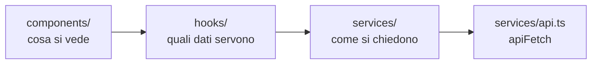

# Il frontend

Com'è organizzata l'app React e quali convenzioni rispettare quando ci si
aggiunge qualcosa. Come parla col server sta invece in
[comunicazione-frontend-backend.md](comunicazione-frontend-backend.md).

## I quattro strati

La direzione è sempre questa e non si salta un passo:

| Cartella | Contiene | Regola |
| --- | --- | --- |
| [components/](../frontend/src/components/) | Pagine e pezzi di interfaccia | Nessun `fetch`, nessuna chiave di cache |
| [hooks/](../frontend/src/hooks/) | Un hook per ogni lettura e per ogni scrittura | Qui vivono `useQuery` e `useMutation`, e le invalidazioni |
| [services/](../frontend/src/services/) | I tipi e le funzioni che chiamano gli endpoint | Niente React |
| [contexts/](../frontend/src/contexts/) | Solo `AuthContext` | Lo stato dell'utente, che serve ovunque |

**Un componente non chiama mai un endpoint da solo.** Il motivo non è
l'eleganza: una chiamata scritta dentro un componente non ha cache, non si
invalida quando qualcos'altro la cambia, e va ripetuta in ogni altro
componente che ha bisogno dello stesso dato. Con l'hook, due schermate che
guardano la stessa cosa la guardano davvero.

## Le rotte e i ruoli

Tutte in [App.tsx](../frontend/src/App.tsx). Ogni rotta dichiara
esplicitamente il ruolo minimo, e la proprietà è obbligatoria: non si può
aggiungere una pagina senza aver deciso chi ci entra.

| Rotta | Accesso | Pagina |
| --- | --- | --- |
| `/` | autenticato | Galleria degli avatar, con sopra i propri obiettivi |
| `/chat/:avatarId` | autenticato | Chiamata e chat con un avatar |
| `/confronto` | autenticato | Confronto fra i propri tentativi (per un admin, quelli di una persona del proprio tenant) |
| `/simulatore`, `/simulatore/:id` | autenticato | Elenco dei test tecnici e svolgimento |
| `/profile` | autenticato | Profilo, password, export dei propri dati |
| `/admin/dashboard`, `/admin/training`, `/admin/report` | admin | Cruscotti, percorsi assegnati, report per utente |
| `/admin`, `/admin/organizations`, `/admin/avatars`, `/admin/simulations`, `/admin/logs` | super admin | Utenti, organizzazioni, avatar, simulazioni, registro |

Il gate è [RequireRole](../frontend/src/components/RequireRole.tsx), che su un
ruolo insufficiente rimanda alla home con `replace`, così l'indirizzo bloccato
non lascia nemmeno una voce nella cronologia.

**Questo è solo comodità di navigazione.** Il controllo vero è nelle dipendenze
del backend (`get_current_admin`, `get_current_super_admin`) e nel filtro per
organizzazione: un utente che digita l'indirizzo a mano si prende un 403 dal
server, non una pagina vuota dal browser. Vedi
[organizzazioni-e-ruoli.md](organizzazioni-e-ruoli.md).

## I componenti condivisi

Prima di scrivere una schermata nuova si guarda cosa c'è già. Quasi tutta
l'impaginazione dell'app è fatta di questi pezzi:

| Componente | A cosa serve |
| --- | --- |
| [PageLayout](../frontend/src/components/PageLayout.tsx) | Il contenitore centrato e l'intestazione con titolo, descrizione e azione a destra. Le larghezze hanno nomi (`default`, `wide`, `split`, `form`) e non numeri, così una pagina nuova sceglie in base al proprio contenuto |
| [ModalShell](../frontend/src/components/ModalShell.tsx) | La scatola di ogni modale: sfondo, pannello, chiusura. Durante un'azione in corso (`locked`) non si chiude, perché una scrittura non va interrotta a metà. Esce in fondo alla pagina da un portal, come il tooltip: serve a chi si apre da dentro un'altra modale, che sfoca lo sfondo e altrimenti la confinerebbe al proprio riquadro |
| [DetailModal](../frontend/src/components/DetailModal.tsx) e `DetailField` | Il dettaglio in sola lettura di una riga di tabella |
| [ConfirmModal](../frontend/src/components/ConfirmModal.tsx) | Le conferme, comprese quelle distruttive. Con `elevated` sta sopra la modale da cui l'azione è partita |
| [DataTable](../frontend/src/components/DataTable.tsx) | Tabella, intestazione, righe, ricerca e paginazione. Le righe per pagina sono le stesse ovunque e la pagina non le sceglie |
| [Tooltip](../frontend/src/components/Tooltip.tsx) | Ogni spiegazione al passaggio del mouse. Vive in un portal, quindi non lo taglia il bordo di una tabella o di una modale, e di suo non aggiunge nodi al DOM: clona il figlio e gli aggancia gli eventi |
| [Badge](../frontend/src/components/Badge.tsx), [Spinner](../frontend/src/components/Spinner.tsx), [Toast](../frontend/src/components/Toast.tsx), [FormError](../frontend/src/components/FormError.tsx), [LoadingState](../frontend/src/components/LoadingState.tsx) | I pezzi piccoli ricorrenti |
| [Field](../frontend/src/components/Field.tsx), [Select](../frontend/src/components/Select.tsx), [SearchSelect](../frontend/src/components/SearchSelect.tsx) | I campi dei form, con le classi già decise |

Questi file esistono quasi tutti perché la stessa cosa era stata ricopiata in
otto o undici posti, e nelle copie i valori avevano cominciato a divergere
senza che la differenza volesse dire niente. Quando una scelta estetica è la
stessa in tutta l'app, deve stare scritta una volta.

## Le convenzioni di scrittura

- **File piccoli.** Una schermata complessa si spezza: la pagina, la modale di
  creazione, quella di dettaglio, l'editor di un pezzo. Il simulatore è un
  esempio: sei file, ognuno con un compito.
- **Il testo è in italiano** e senza trattini: si usano le virgole.
- **Gli stati vuoti non finiscono col punto.** Il punto resta negli errori e
  nelle descrizioni.
- **I tooltip sono sempre `Tooltip`, mai l'attributo `title` del browser.**
  Quello nativo compare dopo un secondo, si veste come il sistema operativo e
  non si sa dove finisce; il componente compare subito, è uguale in tutta
  l'app e non lo taglia nessun contenitore. Un `title` su un elemento HTML è
  quindi sempre un errore, mentre `title` come prop di `PageHeader`,
  `ModalHeader`, `ConfirmModal` o `Toast` è un'altra cosa e resta. Se il
  bersaglio può essere `disabled` serve `wrap`, perché un elemento disabilitato
  non emette eventi del mouse. Annidati (una targhetta dentro una riga che ha
  già il suo tooltip) vince il più interno, che spegne quello che lo contiene.
- **Le formattazioni condivise stanno in un modulo a parte** accanto ai
  componenti che le usano: [simulationFormat.ts](../frontend/src/components/simulationFormat.ts),
  [chatFormat.ts](../frontend/src/components/chatFormat.ts),
  [categoryStyles.ts](../frontend/src/components/categoryStyles.ts), che tiene
  anche le tinte selezionabili per le categorie degli avatar: sono un elenco
  chiuso di classi scritte per intero, perché una classe Tailwind composta a
  runtime non finirebbe mai nel CSS compilato.

## I test

Convivono con il codice, con lo stesso nome e il suffisso `.test.ts(x)`, e
girano con Vitest. Non coprono tutto per principio: coprono quello che si
rompe in silenzio, cioè le funzioni pure di formattazione, il gate dei ruoli, e
la macchina della chiamata vocale ([voiceCall.test.ts](../frontend/src/services/voiceCall.test.ts)),
dove uno stato sbagliato non dà errore, dà una telefonata che non funziona.

Comandi e gate di qualità stanno in [contributing.md](contributing.md).

## Lo stato dell'utente

`AuthContext` tiene il profilo in memoria e nient'altro: il token è in un
cookie `HttpOnly` che JavaScript non vede.

Ci sta appeso anche l'auto logout per inattività
([useIdleLogout](../frontend/src/hooks/useIdleLogout.ts)): trenta minuti senza
attività chiudono la sessione, e le schede aperte si tengono al corrente
attraverso `localStorage`, così usarne una tiene viva la sessione in tutte. Il
dettaglio è in [autenticazione.md](autenticazione.md).
