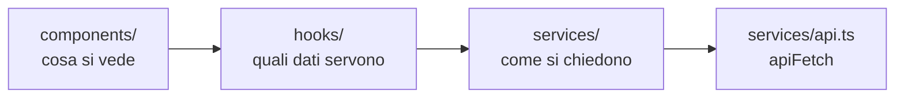

# Il frontend

Com'è organizzata l'app React e quali convenzioni rispettare quando ci si
aggiunge qualcosa. Come parla col server sta invece in
[comunicazione-frontend-backend.md](comunicazione-frontend-backend.md).

## I quattro strati

La direzione è sempre questa e non si salta un passo:

| Cartella | Contiene | Regola |
| --- | --- | --- |
| [components/](../frontend/src/components/) | Pagine e pezzi di interfaccia | Nessun `fetch`, nessuna chiave di cache |
| [hooks/](../frontend/src/hooks/) | Un hook per ogni lettura e per ogni scrittura | Qui vivono `useQuery` e `useMutation`, e le invalidazioni |
| [services/](../frontend/src/services/) | I tipi e le funzioni che chiamano gli endpoint | Niente React |
| [contexts/](../frontend/src/contexts/) | Solo `AuthProvider` e il suo context | Lo stato dell'utente, che serve ovunque, letto con `useAuth` |

**Un componente non chiama mai un endpoint da solo.** Il motivo non è
l'eleganza: una chiamata scritta dentro un componente non ha cache, non si
invalida quando qualcos'altro la cambia, e va ripetuta in ogni altro
componente che ha bisogno dello stesso dato. Con l'hook, due schermate che
guardano la stessa cosa la guardano davvero.

## Le rotte e i ruoli

Tutte in [App.tsx](../frontend/src/App.tsx). Ogni rotta dichiara
esplicitamente il ruolo minimo, e la proprietà è obbligatoria: non si può
aggiungere una pagina senza aver deciso chi ci entra.

**L'applicazione collegata sta sotto `/app`.** Il prefisso non è decorativo:
è quello che permette a un indirizzo di significare una cosa sola. Prima
l'area pubblica e quella privata si dividevano `/` e `/simulatore`, e dove
portasse un link dipendeva da chi lo apriva.

| Rotta | Accesso | Pagina |
| --- | --- | --- |
| `/app` | autenticato | Galleria degli avatar, con sopra i propri obiettivi |
| `/app/chat/:avatarId` | autenticato | Chiamata e chat con un avatar |
| `/app/confronto` | autenticato | Confronto fra i propri tentativi (per un admin, quelli di una persona del proprio tenant) |
| `/app/simulatore`, `/app/simulatore/:id` | autenticato | Elenco dei test tecnici e svolgimento |
| `/app/profile` | autenticato | Profilo, password, export dei propri dati |
| `/app/admin/dashboard`, `/app/admin/training`, `/app/admin/report` | admin | Cruscotti, percorsi a tappe, report per utente |
| `/app/admin`, `/app/admin/organizations`, `/app/admin/avatars`, `/app/admin/simulations`, `/app/admin/logs` | super admin | Utenti, organizzazioni, avatar, simulazioni, registro |

Il gate è [RequireRole](../frontend/src/components/RequireRole.tsx), che su un
ruolo insufficiente rimanda a `/app` con `replace`, così l'indirizzo bloccato
non lascia nemmeno una voce nella cronologia.

I link che il backend mette nelle notifiche
([notifications.py](../backend/notifications.py)) sono percorsi di quest'area,
prefisso compreso: chi legge una notifica ha per forza la sessione aperta.

Quelle rotte esistono **solo a sessione aperta**. Senza, lo stesso albero monta
il sito pubblico, che ha le sue:

| Rotta | Pagina |
| --- | --- |
| `/` | Cosa fa la piattaforma, in un colpo d'occhio |
| `/piattaforma` | La presentazione generale: le tre parti, il ciclo, i ruoli, come si adotta, cosa succede ai dati |
| `/roleplay` | La telefonata e la chat, la scheda persona, cosa resta dopo |
| `/simulatore` | Il test tecnico: le due origini delle domande, i quattro tipi, la correzione |
| `/valutazione` | I sei criteri, la revisione del docente, percorsi, confronto, cruscotti |

La home e `/piattaforma` non dicono la stessa cosa due volte: la prima parla a
chi è appena arrivato e deve capire in dieci secondi se la cosa lo riguarda, la
seconda a chi ha già capito di sì e vuole sapere com'è fatta, chi ci lavora
dentro e cosa deve preparare.

Un indirizzo sconosciuto torna alla home in tutti e due i casi, che sono due
home diverse: `/app` per chi è collegato, `/` per chi no. Da questo passano
anche i due cambi di stato, senza codice apposta: chi accede mentre legge il
sito pubblico si ritrova in `/app`, chi esce da una schermata interna torna
alla home pubblica, perché nel ramo appena montato quell'indirizzo non esiste
più. Ci passa anche chi ha un segnalibro di prima del prefisso.

**Questo è solo comodità di navigazione.** Il controllo vero è nelle dipendenze
del backend (`get_current_admin`, `get_current_super_admin`) e nel filtro per
organizzazione: un utente che digita l'indirizzo a mano si prende un 403 dal
server, non una pagina vuota dal browser. Vedi
[organizzazioni-e-ruoli.md](organizzazioni-e-ruoli.md).

**Le pagine di amministrazione si scaricano solo entrandoci.** Le due righe
`admin` e `super admin` della tabella sono import dinamici (`lazy`), il resto
no: sono otto schermate dense di tabelle e modali, e con un import normale
finivano nel primo file che il browser scarica, addosso anche a chi apre
l'applicazione solo per fare una telefonata di prova. L'attesa mentre il file
arriva è quella di `LoadingState`, la stessa che le pagine mostrano già
aspettando i propri dati. Il confine è quello dei permessi, non una misura di
comodo: se una schermata admin viene usata anche altrove, quel pezzo va
estratto in un file suo (è il caso di
[AssignmentStatusBadge](../frontend/src/components/AssignmentStatusBadge.tsx),
che la home mostra sugli obiettivi), altrimenti l'import statico se la
riporta dietro tutta.

## Il sito pubblico

Sta tutto in [components/public/](../frontend/src/components/public/), l'unica
sottocartella dei componenti, e non è un dettaglio di ordine: è il confine
oltre il quale non si chiama nessun endpoint e non si legge nessun utente. Una
pagina che si apre senza essere nessuno non ha dati da chiedere, quindi lì
dentro non esistono hook di TanStack Query.

| File | Cosa fa |
| --- | --- |
| `PublicHome`, `PlatformPage`, `RoleplayPage`, `SimulatorPage`, `EvaluationPage` | Le cinque pagine, una per rotta |
| [publicUi.tsx](../frontend/src/components/public/publicUi.tsx) | I pezzi con cui sono costruite: hero, sezione, griglia asimmetrica e card, striscia dei numeri, passi, pillole, tabella di confronto, chiamata all'azione |
| [publicSections.ts](../frontend/src/components/public/publicSections.ts) | Le cinque voci del sito, home compresa, scritte una volta sola: le leggono navbar, menu compatto e footer |
| [PublicNav.tsx](../frontend/src/components/public/PublicNav.tsx) | Le voci dentro la navbar, in fila sopra i 1024px e in un pannello sotto |
| [PublicFooter.tsx](../frontend/src/components/public/PublicFooter.tsx) | Il fondo pagina: mappa delle sezioni, fornitori, conservazione dei dati |
| [PublicLayout.tsx](../frontend/src/components/public/PublicLayout.tsx) | La rotta di impaginazione che le contiene, più il ritorno in cima a ogni cambio di pagina |
| [openLogin.ts](../frontend/src/components/public/openLogin.ts) | L'evento con cui una pagina chiede alla navbar di aprire la modale di accesso |
| [publicIcons.tsx](../frontend/src/components/public/publicIcons.tsx) | Le icone che servono solo qui, sulla stessa base di [icons.tsx](../frontend/src/components/icons.tsx) |

**Le pagine sono corte per scelta.** Ognuna sta in tre o quattro sezioni, con
le card che portano una frase o due: chi valuta uno strumento non legge un
manuale, e la profondità sta nell'applicazione e in `docs/`. Il testo descrive
cosa la piattaforma fa, mai come lo fa.

Due comportamenti che l'impaginazione porta con sé: il contenuto di ogni
sezione compare quando entra nello schermo (`Reveal`, che senza
`IntersectionObserver` mostra tutto subito, perché una pagina invisibile è un
guasto peggiore di una pagina immobile), e lo sfondo ha due macchie di luce
lentissime, la cui animazione `aurora` sta fra i token di
[index.css](../frontend/src/index.css) insieme a tutte le altre.

**Gli import dinamici vanno in tutte e due le direzioni.** Le pagine di
amministrazione non si scaricano finché non ci si entra, e per lo stesso motivo
il sito pubblico non si scarica a chi ha la sessione aperta: sono cinque pagine
di sola presentazione che quella persona non vedrà mai più. Il confine è
sempre quello dei permessi, qui nella sua forma più semplice, cioè l'essere o
non essere collegati.

Da qui discendono due vincoli che è facile violare per distrazione, perché la
navbar è montata sempre:

- l'evento che apre la modale sta in un file suo e non dentro una pagina,
  altrimenti l'import della navbar si riporterebbe dietro tutto il sito;
- le icone del sito pubblico non si importano dalla navbar. `MenuIcon`, che è
  l'unica che le serve, vive in `icons.tsx` proprio per questo.

**Il sito pubblico è documentazione che invecchia.** Racconta le funzionalità
dell'applicazione a chi non le ha ancora viste, quindi una funzionalità nuova
che non passa di lì lo lascia indietro senza che nessuno se ne accorga: chi
lavora all'applicazione non esce dalla propria sessione per guardare la
vetrina. Vale la stessa regola dei documenti in `docs/`, e il promemoria è la
prova in [smoke.test.tsx](../frontend/src/components/public/smoke.test.tsx),
che verifica soltanto che le cinque pagine si aprano.

## I componenti condivisi

Prima di scrivere una schermata nuova si guarda cosa c'è già. Quasi tutta
l'impaginazione dell'app è fatta di questi pezzi:

| Componente | A cosa serve |
| --- | --- |
| [PageLayout](../frontend/src/components/PageLayout.tsx) | Il contenitore centrato e l'intestazione con titolo, descrizione e azione a destra. Le larghezze hanno nomi (`default`, `wide`, `split`, `form`) e non numeri, così una pagina nuova sceglie in base al proprio contenuto |
| [ModalShell](../frontend/src/components/ModalShell.tsx) | La scatola di ogni modale: sfondo, pannello, chiusura. Durante un'azione in corso (`locked`) non si chiude, perché una scrittura non va interrotta a metà. Esce in fondo alla pagina da un portal, come il tooltip: serve a chi si apre da dentro un'altra modale, che sfoca lo sfondo e altrimenti la confinerebbe al proprio riquadro |
| [DetailModal](../frontend/src/components/DetailModal.tsx) e `DetailField` | Il dettaglio in sola lettura di una riga di tabella |
| [ConfirmModal](../frontend/src/components/ConfirmModal.tsx) | Le conferme, comprese quelle distruttive. Con `elevated` sta sopra la modale da cui l'azione è partita |
| [DataTable](../frontend/src/components/DataTable.tsx) | Tabella, intestazione, righe, ricerca e paginazione. Le righe per pagina sono le stesse ovunque e la pagina non le sceglie |
| [Tooltip](../frontend/src/components/Tooltip.tsx) | Ogni spiegazione al passaggio del mouse. Vive in un portal, quindi non lo taglia il bordo di una tabella o di una modale, e di suo non aggiunge nodi al DOM: clona il figlio e gli aggancia gli eventi |
| [Badge](../frontend/src/components/Badge.tsx), [Spinner](../frontend/src/components/Spinner.tsx), [Toast](../frontend/src/components/Toast.tsx), [FormError](../frontend/src/components/FormError.tsx), [LoadingState](../frontend/src/components/LoadingState.tsx) | I pezzi piccoli ricorrenti |
| [Field](../frontend/src/components/Field.tsx), [Select](../frontend/src/components/Select.tsx), [SearchSelect](../frontend/src/components/SearchSelect.tsx) | I campi dei form, con le classi già decise |

Questi file esistono quasi tutti perché la stessa cosa era stata ricopiata in
otto o undici posti, e nelle copie i valori avevano cominciato a divergere
senza che la differenza volesse dire niente. Quando una scelta estetica è la
stessa in tutta l'app, deve stare scritta una volta.

## Le convenzioni di scrittura

- **File piccoli.** Una schermata complessa si spezza: la pagina, la modale di
  creazione, quella di dettaglio, l'editor di un pezzo. Il simulatore è un
  esempio: sei file, ognuno con un compito.
- **Il testo è in italiano** e senza trattini: si usano le virgole.
- **Gli stati vuoti non finiscono col punto.** Il punto resta negli errori e
  nelle descrizioni.
- **I tooltip sono sempre `Tooltip`, mai l'attributo `title` del browser.**
  Quello nativo compare dopo un secondo, si veste come il sistema operativo e
  non si sa dove finisce; il componente compare subito, è uguale in tutta
  l'app e non lo taglia nessun contenitore. Un `title` su un elemento HTML è
  quindi sempre un errore, mentre `title` come prop di `PageHeader`,
  `ModalHeader`, `ConfirmModal` o `Toast` è un'altra cosa e resta. Se il
  bersaglio può essere `disabled` serve `wrap`, perché un elemento disabilitato
  non emette eventi del mouse. Annidati (una targhetta dentro una riga che ha
  già il suo tooltip) vince il più interno, che spegne quello che lo contiene.
- **Le formattazioni condivise stanno in un modulo a parte** accanto ai
  componenti che le usano: [simulationFormat.ts](../frontend/src/components/simulationFormat.ts),
  [chatFormat.ts](../frontend/src/components/chatFormat.ts),
  [categoryStyles.ts](../frontend/src/components/categoryStyles.ts), che tiene
  anche le tinte selezionabili per le categorie degli avatar: sono un elenco
  chiuso di classi scritte per intero, perché una classe Tailwind composta a
  runtime non finirebbe mai nel CSS compilato.

## I test

Convivono con il codice, con lo stesso nome e il suffisso `.test.ts(x)`, e
girano con Vitest. Non coprono tutto per principio: coprono quello che si
rompe in silenzio, cioè le funzioni pure di formattazione, il gate dei ruoli, e
la macchina della chiamata vocale ([voiceCall.test.ts](../frontend/src/services/voiceCall.test.ts)),
dove uno stato sbagliato non dà errore, dà una telefonata che non funziona.

Comandi e gate di qualità stanno in [contributing.md](contributing.md).

## Lo stato dell'utente

`AuthProvider` tiene il profilo in memoria e nient'altro: il token è in un
cookie `HttpOnly` che JavaScript non vede. Le schermate lo leggono con
[useAuth](../frontend/src/hooks/useAuth.ts).

Ci sta appeso anche l'auto logout per inattività
([useIdleLogout](../frontend/src/hooks/useIdleLogout.ts)): trenta minuti senza
attività chiudono la sessione, e le schede aperte si tengono al corrente
attraverso `localStorage`, così usarne una tiene viva la sessione in tutte. Il
dettaglio è in [autenticazione.md](autenticazione.md).
