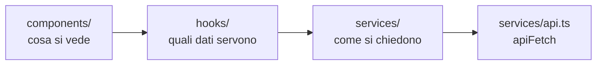

# Il frontend

Com'è organizzata l'app React e quali convenzioni rispettare quando ci si
aggiunge qualcosa. Come parla col server sta invece in
[comunicazione-frontend-backend.md](comunicazione-frontend-backend.md).

## I quattro strati

La direzione è sempre questa e non si salta un passo:

| Cartella                                   | Contiene                                       | Regola                                                       |
| ------------------------------------------ | ---------------------------------------------- | ------------------------------------------------------------ |
| [components/](../frontend/src/components/) | Pagine e pezzi di interfaccia                  | Nessun `fetch`, nessuna chiave di cache                      |
| [hooks/](../frontend/src/hooks/)           | Un hook per ogni lettura e per ogni scrittura  | Qui vivono `useQuery` e `useMutation`, e le invalidazioni    |
| [services/](../frontend/src/services/)     | I tipi e le funzioni che chiamano gli endpoint | Niente React                                                 |
| [contexts/](../frontend/src/contexts/)     | Solo `AuthProvider` e il suo context           | Lo stato dell'utente, che serve ovunque, letto con `useAuth` |

**Un componente non chiama mai un endpoint da solo.** Il motivo non è
l'eleganza: una chiamata scritta dentro un componente non ha cache, non si
invalida quando qualcos'altro la cambia, e va ripetuta in ogni altro
componente che ha bisogno dello stesso dato. Con l'hook, due schermate che
guardano la stessa cosa la guardano davvero.

## Le rotte e i ruoli

Tutte in [App.tsx](../frontend/src/App.tsx). Ogni rotta dichiara
esplicitamente il ruolo minimo, e la proprietà è obbligatoria: non si può
aggiungere una pagina senza aver deciso chi ci entra.

**L'applicazione collegata sta sotto `/app`.** Il prefisso non è decorativo:
è quello che permette a un indirizzo di significare una cosa sola. Prima
l'area pubblica e quella privata si dividevano `/` e `/simulatore`, e dove
portasse un link dipendeva da chi lo apriva.

| Rotta                                                                                        | Accesso     | Pagina                                                                                    |
| -------------------------------------------------------------------------------------------- | ----------- | ----------------------------------------------------------------------------------------- |
| `/app`                                                                                       | autenticato | Galleria degli avatar, con sopra i propri obiettivi                                       |
| `/app/chat/:avatarId`                                                                        | autenticato | Chiamata e chat con un avatar                                                             |
| `/app/percorsi`, `/app/percorsi/:assignmentId`                                               | user        | I propri percorsi di training, e il singolo come mappa                                    |
| `/app/confronto`                                                                             | autenticato | Confronto fra i propri tentativi (per un admin, quelli di una persona del proprio tenant) |
| `/app/simulatore`, `/app/simulatore/:id`                                                     | autenticato | Elenco dei test tecnici e svolgimento                                                     |
| `/app/profile`                                                                               | autenticato | Profilo, password, export dei propri dati                                                 |
| `/app/admin/dashboard`, `/app/admin/training`, `/app/admin/report`, `/app/admin/simulations` | admin       | Cruscotti, percorsi a tappe, report per utente, test tecnici                              |
| `/app/admin`, `/app/admin/organizations`, `/app/admin/avatars`, `/app/admin/logs`            | super admin | Utenti, organizzazioni, avatar, registro                                                  |

Il gate è [RequireRole](../frontend/src/components/RequireRole.tsx), che su un
ruolo che non corrisponde rimanda a `/app` con `replace`, così l'indirizzo
bloccato non lascia nemmeno una voce nella cronologia.

L'accesso non è una scala: `user` non è il gradino più basso di `admin`, è
l'altro lato. I percorsi affidati sono chiusi a chi amministra esattamente
come le pagine di amministrazione lo sono a chi si allena, e la voce in barra
sparisce insieme alla rotta.

I link che il backend mette nelle notifiche
([notifications.py](../backend/notifications.py)) sono percorsi di quest'area,
prefisso compreso: chi legge una notifica ha per forza la sessione aperta.

Quelle rotte esistono **solo a sessione aperta**. Senza, lo stesso albero monta
il sito pubblico, che è una rotta sola:

| Rotta | Pagina                                                      |
| ----- | ----------------------------------------------------------- |
| `/`   | Cosa è SkillLab e quali servizi offre, in un colpo d'occhio |

Le quattro pagine di sezione che stavano accanto alla home (`/piattaforma`,
`/roleplay`, `/simulatore`, `/valutazione`) non ci sono più. Raccontavano le
funzionalità nel dettaglio a chi non le aveva ancora viste, e quel dettaglio
serve a chi la piattaforma la sta già usando: prima dell'accesso resta la
presentazione generale, il resto si vede entrando.

Un indirizzo sconosciuto torna alla home in tutti e due i casi, che sono due
home diverse: `/app` per chi è collegato, `/` per chi no. Da questo passano
anche i due cambi di stato, senza codice apposta: chi accede mentre legge il
sito pubblico si ritrova in `/app`, chi esce da una schermata interna torna
alla home pubblica, perché nel ramo appena montato quell'indirizzo non esiste
più. Ci passa anche chi ha un segnalibro di prima del prefisso.

**Questo è solo comodità di navigazione.** Il controllo vero è nelle dipendenze
del backend (`get_current_admin`, `get_current_super_admin`) e nel filtro per
organizzazione: un utente che digita l'indirizzo a mano si prende un 403 dal
server, non una pagina vuota dal browser. Vedi
[organizzazioni-e-ruoli.md](organizzazioni-e-ruoli.md).

**Ogni pagina si scarica solo entrandoci.** Nessuna riga della tabella sta nel
primo file: tutte sono import dinamici, elencati in
[lazyPages.ts](../frontend/src/components/lazyPages.ts), che le tiene in un
elenco solo perché li chiede anche la barra (vedi sotto). L'elenco è diviso in
due, ed è la sola cosa da sapere per aggiungerne una: gli indirizzi fissi
(`/app/confronto`) stanno in una mappa per indirizzo esatto, quelli che
portano un id (`/app/chat/<avatar>`) in una mappa per tratto iniziale, perché
è l'id a cambiare i dati della pagina, non il file da scaricare.

Il confine era quello dei permessi, cioè le sole schermate di
amministrazione, ed era troppo stretto. Chi apriva il sito pubblico si
portava a casa comunque la chat, la telefonata con il suo ricampionamento del
microfono, il simulatore, il confronto e i percorsi: metà del primo file
spesa in schermate che senza una sessione non esistono. Il primo file adesso
è l'impalcatura e basta (la barra, la modale di accesso, le rotte), e pesa
69 kB invece di 482. Il sito pubblico ne scarica 343 in tutto invece di 497,
e chi entra nella galleria 346.

Resta vera la regola che ne discende: se un pezzo di una schermata viene usato
anche altrove va estratto in un file suo (è il caso di
[AssignmentStatusBadge](../frontend/src/components/AssignmentStatusBadge.tsx),
che i percorsi mostrano sulle tappe), altrimenti l'import statico se la
riporta dietro tutta. Quello che serve a due pagine diverse Rollup lo mette da
sé in un file condiviso, che tutte e due chiedono e nessuna duplica.

**Le librerie stanno in un file loro.** React, il router e la cache delle
query sono 267 kB che cambiano solo quando si aggiorna una dipendenza, e
mescolati al codice dell'applicazione cambiavano nome a ogni rilascio, perché
nel nome c'è l'impronta del contenuto: chi tornava sull'applicazione
riscaricava React per una virgola spostata in una tabella. A dividerli è la
regola `manualChunks` in [vite.config.ts](../frontend/vite.config.ts), che è
scritta per provenienza (tutto quello che viene da `node_modules`) e non come
elenco di pacchetti: un elenco andrebbe aggiornato a ogni dipendenza nuova, e
dimenticarsene non darebbe nessun errore, solo un file che ricomincia a
cambiare a ogni rilascio.

**Il file parte prima del click, non dopo.** Una voce di navigazione avvia
l'import quando il puntatore ci entra o quando prende il fuoco da tastiera
(`prefetchOnHover`), così fra quel momento e il click il file fa in tempo ad
arrivare. Vale per ogni collegamento che porta a una pagina, non solo per la
barra: la tessera di un avatar (che apre la chat, la pagina più pesante di
tutte), quella di un test, la scheda di un percorso e il bottone che lo
riprende, la scheda di un'organizzazione che apre i suoi utenti. È anche il
motivo per cui il confine allargato non si paga: il viaggio in più è già
finito quando il click arriva. Serve perché l'attesa, senza, non si vedrebbe nemmeno: React Router
avvolge la navigazione in `startTransition`, e in una transizione React non
copre con un fallback un contenuto già visibile, quindi il `Suspense` di
[App.tsx](../frontend/src/App.tsx), che è già montato con la pagina corrente,
non mostra il suo `LoadingState`. Si resta sulla pagina di prima e il click
sembra ignorato. Si vede soprattutto con il server di sviluppo, dove non
esiste un file per pagina e il browser chiede un modulo per volta: sono dalle
quattordici alle ventisette richieste, ognuna con una lettura dal bind mount e
la trasformazione TypeScript.

## La barra di navigazione

È montata sempre, ed è da lì che si passa da una sezione all'altra. Sta in nove
file, ognuno con un compito solo:

| File                                                                      | Cosa fa                                                                                          |
| ------------------------------------------------------------------------- | ------------------------------------------------------------------------------------------------ |
| [navEntries.tsx](../frontend/src/components/navEntries.tsx)               | Quali voci esistono e a chi si mostrano, come dati: la fila delle sezioni e i gruppi del profilo |
| [NavbarLink.tsx](../frontend/src/components/NavbarLink.tsx)               | Una voce in fila                                                                                 |
| [lazyPages.ts](../frontend/src/components/lazyPages.ts)                   | Le pagine che si scaricano entrandoci, e il precarico che una voce avvia al passaggio del mouse  |
| [navLinkStyles.ts](../frontend/src/components/navLinkStyles.ts)           | La forma di una voce, accesa o spenta, condivisa con la barra del sito pubblico                  |
| [NavbarMobileMenu.tsx](../frontend/src/components/NavbarMobileMenu.tsx)   | Le stesse sezioni dove non stanno in fila                                                        |
| [NavbarUserMenu.tsx](../frontend/src/components/NavbarUserMenu.tsx)       | Il proprio account: la scheda, le anagrafiche, i controlli, l'uscita                             |
| [NotificationsBell.tsx](../frontend/src/components/NotificationsBell.tsx) | Quante notifiche non lette ci sono e, aprendola, quali                                           |
| [Navbar.tsx](../frontend/src/components/Navbar.tsx)                       | Solo l'impaginazione: il logo, la fila al centro, le azioni a destra                             |
| [mainContent.ts](../frontend/src/components/mainContent.ts)               | L'ancora del contenuto, condivisa fra il salto della barra e i `main` delle impaginazioni        |

**Le voci sono dati, non markup.** La stessa sezione si presenta in tre posti
(la fila, il pannello compatto, e per l'amministrazione il menu del profilo), e
scritta tre volte sarebbe tre elenchi che prima o poi divergono: la voce nuova
comparirebbe in barra e non nel pannello, e chi apre l'applicazione dal
telefono non saprebbe che esiste. Aggiungere una sezione vuol dire aggiungere
una riga a `mainNavEntries` o a `profileMenuGroups`, con il predicato di ruolo
che decide a chi si mostra, come la rotta dichiara chi ci entra.

**Sotto i 1024px la fila si ritira in un pannello a comparsa.** Prima spariva e
basta: dal telefono restavano il logo e il menu del profilo, e il simulatore, i
percorsi e il confronto non si raggiungevano più, benché le pagine esistessero
e il ruolo le aprisse. Il pannello si chiude aprendo una voce, con Esc, con un
click fuori e a ogni cambio di indirizzo, perché si va altrove anche dal logo o
tornando indietro con il browser. La voce del sito pubblico resta invece sempre
in fila: è una sola, e ci sta a qualunque larghezza.

La soglia è a 1024px e non ai 768 di prima perché quattro voci con etichette
come "Simulatore Tecnico" occupano da sole più di metà barra: fra le due misure
non sparivano né stavano, si schiacciavano contro il menu del proprio account.
Le due soglie, quella della fila e quella del pulsante che apre il pannello,
sono la stessa cosa detta in due file, e cambiarne una vuol dire cambiare
l'altra.

**Il primo Tab di ogni pagina salta la barra.** In cima alla barra c'è un
collegamento invisibile finché non lo si raggiunge da tastiera, e porta il
fuoco sul contenuto della schermata. Senza, chi naviga da tastiera
riattraversa il logo, le sezioni, le notifiche e il menu del proprio account a
ogni cambio di pagina, prima di arrivare a quello per cui è entrato. Il fuoco
si sposta a mano e non con l'ancora del browser: un indirizzo con dentro il
salto è quello che poi finisce in un segnalibro. L'ancora è
`MAIN_CONTENT_ID`, e la portano i quattro `main` dell'applicazione, cioè
`PageContainer` per le pagine che ne passano, la galleria, la chat e il sito
pubblico.

**Una voce resta accesa anche nelle pagine figlie.** La mappa di un percorso è
dentro i propri percorsi, il singolo test è dentro il simulatore, e la chat di
un avatar è dentro la galleria: sono le pagine in cui si passa più tempo, e
spegnere la voce lì farebbe sembrare di essere usciti dalla sezione. Lo dice
`isActive` di ogni voce, che confronta l'indirizzo per prefisso dove il caso lo
richiede.

**Il menu del profilo è raggruppato per cosa si va a fare**, non in un elenco
di otto righe uguali: la propria scheda, le anagrafiche (persone,
organizzazioni, interlocutori), quello che si compone (i test e i percorsi),
quello che si controlla a cose fatte (il rendiconto e il registro). Un gruppo
che resta vuoto per il ruolo di chi guarda sparisce con il proprio separatore,
quindi uno studente vede due voci e nessuna riga grigia a segnare dei vuoti.

**Ne resta aperto uno solo.** Il pannello delle sezioni, il menu del profilo e
la campanella delle notifiche escono tutti dallo stesso angolo e sovrapposti
sarebbero illeggibili, quindi lo stato è uno («quale pannello è aperto») e sta
nella barra, non tre interruttori nei tre componenti: aprirne uno chiude quello
di prima. La campanella se lo teneva per sé, e finché è stato così si apriva
sopra il menu del profilo senza chiuderlo, con due riquadri nello stesso punto.
Per la stessa ragione i tre veli che intercettano il click fuori partono sotto
la barra e non da bordo a bordo: il pulsante che ha aperto un pannello deve
restare quello che lo richiude.

I tre pannelli si chiudono con Esc, dichiarano `aria-expanded` e `aria-controls`
e segnano con `aria-current` la pagina in cui si è. Esc passa da
[useCloseOnEscape](../frontend/src/hooks/useCloseOnEscape.ts), che è la stessa
cosa per tutto quello che si apre sopra la pagina senza essere una modale (le
modali ce l'hanno già dentro `ModalShell`, e fuori dalla barra ci passa anche
il riquadro della tappa sulla mappa di un percorso, che però non gli affida
nessun pulsante: il nodo da cui è stato aperto resta sulla mappa, quindi
chiudendolo il fuoco è già sulla tappa a cui si riferiva), e **riporta il fuoco
sul pulsante che aveva aperto il pannello**: senza, il fuoco finisce sul body e il Tab
successivo ricomincia dal salto al contenuto invece di riprendere da dove si
era. Solo su Esc, però: aprendo una voce si va altrove, e riportare il fuoco
sulla barra della pagina appena lasciata sarebbe un salto all'indietro.

Nessuno dei tre dichiara `aria-haspopup`: dentro ci sono collegamenti in un
riquadro, non un menu con la sua navigazione a frecce, e annunciarlo come tale
prometterebbe tasti che non ci sono.

## La guida introduttiva

Al primo ingresso un riquadro attraversa le sezioni una per volta, illuminando
l'elemento di cui parla: cosa si trova nella galleria, a cosa serve il
simulatore, dove stanno i propri percorsi. Si sfoglia avanti e indietro, e si
chiude quando si vuole.

| File                                                                        | Cosa fa                                                                     |
| --------------------------------------------------------------------------- | ---------------------------------------------------------------------------- |
| [tutorialSteps.ts](../frontend/src/components/tutorialSteps.ts)             | Cosa racconta, e a chi: i passi come dati, un elenco per ruolo              |
| [TutorialTour.tsx](../frontend/src/components/TutorialTour.tsx)             | Quale passo si legge, avanti e indietro, la chiusura                       |
| [TutorialSpotlight.tsx](../frontend/src/components/TutorialSpotlight.tsx)   | Il velo, il ritaglio sull'elemento, il riquadro                            |
| [tutorialPlacement.ts](../frontend/src/components/tutorialPlacement.ts)     | Dove finisce il riquadro: sotto, sopra, o al centro                        |
| [useAnchorRect.ts](../frontend/src/hooks/useAnchorRect.ts)                  | Dov'è, sullo schermo, l'elemento illuminato                                |
| [tutorialEvents.ts](../frontend/src/components/tutorialEvents.ts)           | Riaprirla dal proprio profilo, e chiedere alla barra il menu dell'account  |
| [useTutorial.ts](../frontend/src/hooks/useTutorial.ts)                      | L'unica scrittura: è stata vista                                           |

**Due guide, una per ruolo.** Chi si allena e chi amministra non fanno le
stesse cose, e non ricevono lo stesso giro: la prima parla di allenarsi e di
rivedere i propri risultati, la seconda di comporre i test, affidare i percorsi
e leggere il rendiconto. Il super admin riceve un elenco vuoto, che è il modo
in cui la guida non compare: sta sopra i tenant, e non è la persona da prendere
per mano al primo ingresso. `hasTutorial` è la stessa domanda fatta dal proprio
profilo, che offre di rivederla solo a chi l'ha ricevuta.

**Vista o no sta sull'account, non nel browser.** La colonna è
`users.tutorial_seen_at`, arriva con il profilo e si scrive con
`POST /api/auth/me/tutorial`. In `localStorage` sarebbe stata una proprietà del
computer invece che della persona: chi cambia postazione se la ritroverebbe
davanti, e chi ripulisce i dati del sito pure. Chiuderla la segna come vista
comunque, che si arrivi in fondo o che si chiuda al primo passo, perché chi la
interrompe l'ha vista comparire. Da lì in poi si riapre solo a mano, dalla
propria scheda, e quella riapertura non scrive niente: la data dice quando
l'account ha incontrato la guida, non quante volte l'ha letta.

**Illumina gli elementi veri, non delle copie.** Ogni passo porta il selettore
di quello di cui parla: le voci di navigazione si dichiarano da sé con
`data-tour` (in `NavbarLink`, nel pannello compatto e nel menu del profilo,
quindi una sezione nuova è indicabile senza che nessuno se ne ricordi), le tre
cose che escono dall'angolo destro hanno già un id. Lo stesso selettore trova
due copie della stessa voce, una in fila e una nel pannello compatto, e vale
quella che occupa dello spazio, cioè quella visibile a questa larghezza. Il
buio è l'ombra del ritaglio, larga quanto basta a coprire lo schermo, e sotto
al ritaglio non c'è niente: quello che si vede illuminato è il pulsante che poi
si andrà davvero a premere.

Un'ancora che non si trova non è un errore: sotto i 1024px le sezioni si
ritirano nel pannello e la voce in fila non esiste. Il passo resta e si legge
al centro, perché quello che spiega vale comunque, come già succede per il
benvenuto e per il commiato, che di un punto dello schermo non parlano.

**I passi che parlano di una voce del menu del proprio account lo aprono.** Le
sezioni di amministrazione stanno lì dentro, e una guida che ne disegnasse una
copia insegnerebbe un gesto che poi non si ritrova. Quale pannello è aperto lo
sa solo la barra, quindi la guida glielo chiede con un evento
(`TUTORIAL_USER_MENU_EVENT`), come le pagine pubbliche chiedono la modale di
accesso: il menu resta aperto finché si parla di quella voce e si richiude
appena si passa oltre.

La misura dell'elemento si rifà a ogni frame finché la guida è aperta, e non a
ogni evento che potrebbe spostarlo: gli eventi da ascoltare sarebbero lo
scroll, il ridimensionamento, il menu che si apre con la sua animazione e un
elenco che arriva dal server e allunga la pagina sotto. Un
`getBoundingClientRect` per frame su un elemento solo non si sente, e lo stato
cambia unicamente quando la misura cambia davvero.

Un velo trasparente raccoglie i click: la guida si sfoglia con i propri
pulsanti, con le frecce o con Esc, e non toccando quello che illumina. Un click
a vuoto porterebbe altrove a metà spiegazione, e uno che la chiudesse per
sbaglio la farebbe sparire per sempre, perché dopo la chiusura non torna da
sola.

## La galleria degli avatar

È la prima schermata di chi entra, e la sola che tutti aprono ogni volta.
[Header](../frontend/src/components/Header.tsx) presenta il catalogo e lo
conta, [AvatarGallery](../frontend/src/components/AvatarGallery.tsx) lo
mostra, [AvatarCard](../frontend/src/components/AvatarCard.tsx) è il singolo
avatar, e da lì si va in chat.

**L'impianto è lo stesso del simulatore tecnico**, cioè testata con i due
numeri, ricerca e pastiglie centrate, griglia che si riempie da sé, segnaposto
mentre si aspetta, vuoto con il gesto che lo rimedia e avviso di un rinfresco
caduto. Sono le due schermate da cui si sceglie cosa fare adesso, si aprono
dalla stessa barra e si scorrono con la stessa domanda in testa, quindi le
parti che si comportano allo stesso modo stanno scritte una volta sola
(`GalleryHero`, `galleryLayout`, `GallerySkeleton`, `GalleryEmpty`,
`StaleDataToast`). L'impaginazione è la stessa fin nella struttura: la fascia
sta **fuori** dal `main` e porta la propria imbottitura, il `main` è
`GalleryContainer`, che per questo sopra non ne ha e prende l'altezza che
avanza. Era scritto a mano dentro la pagina della galleria, e così lo spazio
fra i due numeri e la barra è lo stesso nelle due schermate invece di essere
un valore da tenere allineato a mano. Le ragioni qui sotto sono le ragioni di
quell'impianto, e valgono per tutte e due.

**Il catalogo si legge una volta e si filtra in casa.** La categoria era un
parametro nella query string, quindi una voce di cache per categoria e una
richiesta al server a ogni pastiglia premuta, per una lista che sta tutta in
memoria e che la testata sta già leggendo intera. Ora la lettura è una
(`useAvatars`, senza parametri), e cosa resta a schermo lo decide
[avatarFilters](../frontend/src/components/avatarFilters.ts): un modulo puro,
provato senza montare niente, che applica insieme la categoria scelta e le
parole della ricerca. Da qui vengono tre cose che prima non c'erano: il filtro
risponde nell'istante in cui si preme, si può cercare per nome, scenario o
categoria, e il numero accanto a ogni categoria si sa senza chiederlo.

**Si cerca anche nella descrizione.** Chi scrive «reclamo» sta cercando una
situazione, non un nome, e la situazione è scritta lì. Il confronto è quello
di `matchesSearch`, lo stesso delle tabelle: accenti e maiuscole non contano.

**Una griglia vuota ha tre motivi diversi e tre frasi diverse**
([AvatarGalleryEmpty](../frontend/src/components/AvatarGalleryEmpty.tsx)): la
ricerca non ha trovato niente, la categoria scelta è vuota, o il catalogo è
vuoto davvero. Le prime due chi guarda le risolve sul momento, e il riquadro
gli porge il gesto che le annulla; la terza no, e allora l'unica cosa utile è
portare chi il catalogo lo può riempire dove si riempie, cioè il super admin
alla gestione avatar. Prima era una frase sola, «Nessun avatar presente in
questa categoria», che a catalogo vuoto mandava a cercare in categorie che non
esistevano.

**Un guasto di rete si racconta in due modi**, perché sono due situazioni
diverse. Se non c'è niente a schermo è la pagina a dirlo, con il banner
d'errore e il pulsante che riprova, che resta spento mentre il tentativo è in
corso. Se invece il catalogo è già lì da una lettura precedente non si toglie
niente: basta l'avviso a scomparsa che dice che potrebbe non essere
aggiornato, e il suo tempo lo tiene `useFlashMessage`, che spegne il timer sia
alla scadenza sia quando si chiude l'avviso a mano.

**La tessera è un link**, non un riquadro reso cliccabile. Era un `div` con
`role="button"` e la gestione a mano di Invio e barra spaziatrice, cioè un link
rifatto per intero e peggio: il tasto centrale non apriva niente, «apri in una
scheda nuova» non compariva nel menu e l'indirizzo non si poteva copiare né
trascinare. Con un `Link` tutto questo torna gratis, e con lui se ne va anche
il ripple, che creava un nodo nel DOM a ogni click e lo toglieva con un timer:
la pressione ora è una classe `active:`, e il `.ripple` di `index.css` non
esiste più.

**Ogni tessera dice quello che chi guarda ci ha già fatto**: quante sessioni e
quando è stata l'ultima, e l'invito diventa «Riprova» invece di «Parla». È
l'informazione che si cerca scorrendo il catalogo, cioè da dove ricominciare e
cosa non si è ancora provato, e arriva dai due campi che il server calcola
sull'utente della richiesta (vedi
[avatar-e-persona.md](avatar-e-persona.md)). Un avatar mai affrontato non
mostra nessuno zero: una tessera nuova non ha niente da raccontare.

Due dettagli che si notano solo quando mancano: l'ingresso a cascata si ferma
dopo le prime file (era `index * 0.08s`, quindi con venti avatar l'ultimo
compariva dopo un secondo e mezzo, proprio mentre lo si cercava), e un ritratto
che non arriva lascia il posto a una sagoma invece che al testo alternativo su
fondo scuro, che sembrava una tessera rotta.

## Il sito pubblico

Sta tutto in [components/public/](../frontend/src/components/public/), l'unica
sottocartella dei componenti, e non è un dettaglio di ordine: è il confine
oltre il quale non si chiama nessun endpoint e non si legge nessun utente. Una
pagina che si apre senza essere nessuno non ha dati da chiedere, quindi lì
dentro non esistono hook di TanStack Query.

| File                                                                   | Cosa fa                                                                                               |
| ---------------------------------------------------------------------- | ----------------------------------------------------------------------------------------------------- |
| [PublicHome.tsx](../frontend/src/components/public/PublicHome.tsx)     | L'unica pagina: hero, i servizi in una griglia di card, i tre passaggi d'uso, la chiamata all'accesso |
| [publicUi.tsx](../frontend/src/components/public/publicUi.tsx)         | I pezzi con cui è costruita: hero, sezione, griglia asimmetrica e card, passi, chiamata all'azione    |
| [PublicNav.tsx](../frontend/src/components/public/PublicNav.tsx)       | La voce dentro la navbar, che è una sola e quindi non ha nessuna forma compatta                       |
| [PublicFooter.tsx](../frontend/src/components/public/PublicFooter.tsx) | Il fondo pagina: accesso, fornitori, conservazione dei dati                                           |
| [PublicLayout.tsx](../frontend/src/components/public/PublicLayout.tsx) | La rotta di impaginazione che la contiene, più il ritorno in cima a ogni cambio di pagina             |
| [openLogin.ts](../frontend/src/components/public/openLogin.ts)         | L'evento con cui una pagina chiede alla navbar di aprire la modale di accesso                         |
| [publicIcons.tsx](../frontend/src/components/public/publicIcons.tsx)   | Le icone che servono solo qui, sulla stessa base di [icons.tsx](../frontend/src/components/icons.tsx) |

**La pagina è corta per scelta.** Sta in tre sezioni, con le card che portano
una frase o due: chi valuta uno strumento non legge un manuale, e la
profondità sta nell'applicazione e in `docs/`. Il testo dice cosa la
piattaforma fa, mai come lo fa, e si ferma prima di numeri, condizioni e
configurazioni.

Due comportamenti che l'impaginazione porta con sé: il contenuto di ogni
sezione compare quando entra nello schermo (`Reveal`, che senza
`IntersectionObserver` mostra tutto subito, perché una pagina invisibile è un
guasto peggiore di una pagina immobile), e lo sfondo ha due macchie di luce
lentissime, la cui animazione `aurora` sta fra i token di
[index.css](../frontend/src/index.css) insieme a tutte le altre.

**Gli import dinamici vanno in tutte e due le direzioni.** Le pagine di
amministrazione non si scaricano finché non ci si entra, e per lo stesso motivo
il sito pubblico non si scarica a chi ha la sessione aperta: è una pagina di
sola presentazione che quella persona non vedrà mai più. Il confine è
sempre quello dei permessi, qui nella sua forma più semplice, cioè l'essere o
non essere collegati.

Da qui discendono due vincoli che è facile violare per distrazione, perché la
navbar è montata sempre:

- l'evento che apre la modale sta in un file suo e non dentro una pagina,
  altrimenti l'import della navbar si riporterebbe dietro tutto il sito;
- le icone del sito pubblico non si importano dalla navbar: quelle che servono
  a entrambi vivono in `icons.tsx` proprio per questo.

**Il sito pubblico è documentazione che invecchia.** Racconta i servizi
dell'applicazione a chi non li ha ancora visti, quindi un servizio nuovo che
non passa di lì lo lascia indietro senza che nessuno se ne accorga: chi lavora
all'applicazione non esce dalla propria sessione per guardare la vetrina.
Restando generale invecchia più lentamente, ma non è immune. Vale la stessa
regola dei documenti in `docs/`, e il promemoria è la prova in
[smoke.test.tsx](../frontend/tests/components/public/smoke.test.tsx), che
verifica soltanto che la pagina si apra.

## I componenti condivisi

Prima di scrivere una schermata nuova si guarda cosa c'è già. Quasi tutta
l'impaginazione dell'app è fatta di questi pezzi:

| Componente                                                                                                                                                                                                   | A cosa serve                                                                                                                                                                                                                                                                                                                                                                                                                                                                                                                                                                                                                                                                                                                                                                                                                                                                                                                                                                                                                                                                                                                                                                                                                                                                                                                                                          |
| ------------------------------------------------------------------------------------------------------------------------------------------------------------------------------------------------------------ | --------------------------------------------------------------------------------------------------------------------------------------------------------------------------------------------------------------------------------------------------------------------------------------------------------------------------------------------------------------------------------------------------------------------------------------------------------------------------------------------------------------------------------------------------------------------------------------------------------------------------------------------------------------------------------------------------------------------------------------------------------------------------------------------------------------------------------------------------------------------------------------------------------------------------------------------------------------------------------------------------------------------------------------------------------------------------------------------------------------------------------------------------------------------------------------------------------------------------------------------------------------------------------------------------------------------------------------------------------------------- |
| [PageLayout](../frontend/src/components/PageLayout.tsx)                                                                                                                                                      | Il `main` centrato e l'intestazione con titolo, descrizione e azione a destra. A destra sta l'azione principale e nient'altro: i filtri hanno la propria fascia sotto l'intestazione ([FiltersBar](../frontend/src/components/FiltersBar.tsx)), e dove stavano quassù dividevano la riga con il bottone che apre. Il blocco del titolo entra nella riga con una base fissa di venti rem e non con la larghezza del proprio testo: il flex decide il ritorno a capo prima di restringere, misurando gli elementi alla loro larghezza naturale, quindi era la lunghezza della descrizione a mandare l'azione sotto il titolo. Non si vedeva finché le descrizioni erano scritte nel codice, perché la stessa frase dà sempre lo stesso esito; nel simulatore la descrizione è quella scritta da chi ha preparato il test, e il comando per tornare all'elenco cambiava posto da una simulazione all'altra. Adesso l'azione va a capo quando lo spazio è poco davvero, cioè su uno schermo stretto, e mai per via di un testo lungo. Le larghezze hanno nomi (`default`, `wide`, `split`, `form`) e non numeri, così una pagina nuova sceglie in base al proprio contenuto. È un landmark e non un contenitore qualunque: quattordici pagine ci passano, ed è dove atterra il salto al contenuto                                                                                                                                                                                                                                                                                                                                                                                                                                                                                                                                                                                                                                                                                                                                                                                                                                                                                                                                                                                                                            |
| [ModalShell](../frontend/src/components/ModalShell.tsx)                                                                                                                                                      | La scatola di ogni modale: sfondo, pannello, chiusura. Durante un'azione in corso (`locked`) non si chiude, perché una scrittura non va interrotta a metà. Esce in fondo alla pagina da un portal, come il tooltip: serve a chi si apre da dentro un'altra modale, che sfoca lo sfondo e altrimenti la confinerebbe al proprio riquadro. **Da tastiera è una finestra vera**: si dichiara `role="dialog"` con `aria-modal`, prende il nome dal titolo che il pannello disegna già (`useModalTitleId`, in [modalTitle.ts](../frontend/src/components/modalTitle.ts), che `ModalHeader` e `DetailModal` chiamano da sé; le modali che si intestano a modo loro lo passano come `label`), porta il fuoco dentro all'apertura e lo riporta alla chiusura sul comando che l'aveva aperta, tiene il Tab dentro il pannello ed esce con Esc. Prima niente di tutto questo esisteva: si apriva «Elimina Utente» e il fuoco restava sulla riga dietro al velo, che non si vedeva nemmeno, e per chiudere bisognava trovare la crocetta a Tab. Esc si ferma sul pannello e non risale, così una conferma aperta sopra un'altra modale chiude se stessa e lascia aperta quella sotto; per la stessa ragione le tendine (`Select`, `SearchSelect`), il menu kebab e il campo in cui si rinomina una conversazione si prendono il proprio Esc e lo fermano lì. **Quanto scorre lo dice `layout`**: con `scroll` il pannello cresce col contenuto e va giù tutto insieme, con `column` restano ferme l'intestazione e la fascia in fondo e scorre solo quello che sta in mezzo, con `tall` l'altezza è costante, perché un elenco che si filtra non deve rimpicciolire la finestra a ogni tasto premuto. **I form lunghi stanno su `column`**, con il bottone che salva nella fascia in fondo: la scheda di un avatar e l'editor di un percorso ci sono passati perché quel bottone finiva sotto la piega, e chi compilava settanta campi o aggiungeva la sesta tappa doveva riscorrere tutta la finestra per ritrovarlo. Affiancare i campi non sarebbe servito: due colonne stanno bene solo dove i campi sono brevi e vanno in coppia (nome e cognome, categoria e voce), e sotto i 600px ricollassano in una, cioè proprio dove lo scroll pesa di più                                                                                                                                                                                                                                                                                                                                                                                                                                                                                                                                                                                                                                                                                                                                                                                                                                                                                                                                                                                                                               |
| [DetailModal](../frontend/src/components/DetailModal.tsx) e `DetailField`                                                                                                                                    | Il dettaglio in sola lettura di una riga di tabella, con in fondo l'azione che porta a cambiarla dove ce n'è una: dalla scheda di un utente si passa alla modifica senza chiudere, ritrovare la riga nella tabella e cercarle la matita                                                                                                                                                                                                                                                                                                                                                                                                                                                                                                                                                                                                                                                                                                                                                                                                                                                                                                                                                                                                                                                                                                                                                                                                                                                                                                                   |
| [ConfirmModal](../frontend/src/components/ConfirmModal.tsx)                                                                                                                                                  | Le conferme, comprese quelle distruttive. Con `elevated` sta sopra la modale da cui l'azione è partita. `cancelLabel` cambia le parole del bottone che non fa niente, dove «Annulla» sarebbe ambiguo                                                                                                                                                                                                                                                                                                                                                                                                                                                                                                                                                                                                                                                                                                                                                                                                                                                                                                                                                                                                                                                                                                                                                                |
| [UnsavedChangesModal](../frontend/src/components/UnsavedChangesModal.tsx) e [useCloseGuard](../frontend/src/hooks/useCloseGuard.ts)                                                                           | Il presidio fra un gesto di chiusura e una finestra piena di lavoro non salvato. L'hook decide (chiude subito quando non c'è niente da perdere, chiede quando c'è), la modale dice sempre le stesse parole, e chi la apre aggiunge solo *cosa* andrebbe perso. Copre le quattro vie con cui una modale si chiude, la X, Esc, lo sfondo e i bottoni; per il ricaricare la pagina c'è [useLeaveConfirmation](../frontend/src/hooks/useLeaveConfirmation.ts), che ferma il browser                                                                                                                                                                                                                                                                                                                                                                                                                                                                                                                                                                                                                                                                                                                                                                                                                                                                                                                                                                                                                                                                                                                                                                                                                                                                                                                                                                                                                                                                                                                                                                                                                                                                                                                                                                                                                                                                                                                                                                                                                                                                                                                                                        |
| [DataTable](../frontend/src/components/DataTable.tsx)                                                                                                                                                        | Tabella, intestazione, righe e ricerca. Sfogliare le righe non è affare suo, sta in `Pagination`. Le colonne stanno a misure fisse: ogni colonna dichiara la propria `width` in percentuale (obbligatoria, e le percentuali di una tabella sommano a 100), il layout è `table-fixed` e sotto `minWidth` scorre il riquadro invece di stringersi le colonne. Riceve i dati (`items`) e come si disegna una riga (`renderRow`), non le righe già costruite: finché arrivavano come `children`, la pagina costruiva un albero JSX per ogni elemento dell'elenco e la tabella ne mostrava venti, quindi su un report di tremila valutazioni se ne buttavano via duemilanovecentottanta a ogni battuta scritta nella ricerca. `renderRow` restituisce un elemento con la propria `key`, un `<Tr>` o un Fragment quando sotto la riga se ne apre una seconda. Lo stato vuoto non si dichiara più: deriva da `items`. Intestazioni e celle sono centrate nella propria colonna, e una cella che dentro si costruisce con un flex lo centra con `justify-center`. Una riga che apre qualcosa lo dichiara con `onActivate` invece di un `onClick` scritto a mano: da lì arrivano insieme il puntatore a manina, il fuoco da tastiera e Invio o Spazio per aprirla, che erano tre cose da ricordarsi ogni volta e che infatti mancavano, lasciando il dettaglio di una conversazione e di un test raggiungibili col solo mouse. La riga resta una riga e non diventa un bottone: `role="button"` le toglierebbe il posto nella griglia proprio nelle tabelle che si aprono. Le eccezioni le dichiara la cella con `align="left"`, e l'intestazione resta comunque al centro: la prima colonna della gestione utenti, degli avatar, del report attività, dei percorsi assegnati e delle due tabelle della dashboard, cioè quella che dà il nome alla riga, dove un'immagine o una targhetta seguita da un nome si scorre con l'occhio, e i pannelli che si aprono sotto una riga, che sono elenchi di voci e valori. `footerNote` è una fascia in fondo alla scheda, sotto la barra per sfogliare, per gli elenchi che dal server arrivano a finestre: dice quante righe sono state scaricate sul totale e offre di chiederne altre. Sta lì dentro e non sotto la tabella perché due conteggi sulle stesse righe a un centimetro di distanza si leggono come una contraddizione, e nella stessa striscia si vede che uno conta quello che si sta guardando e l'altro quello che è arrivato. `pageResetKey` è cosa rende queste righe un elenco diverso, i filtri attivi di solito: quando cambia si torna alla prima pagina, e l'ordinamento ci finisce da sé. Ordinare è della tabella e ha due modi. Dove i dati sono tutti in memoria la colonna dichiara `sortValue`, cioè come si legge da una riga il valore su cui ordina, e la tabella fa il resto: confronto con un `Intl.Collator` costruito una volta sola (`localeCompare` riga per riga rimette insieme le regole della lingua a ogni coppia, e su un elenco lungo è il grosso del tempo), celle vuote in fondo in tutti e due i versi perché una cella senza valore non è né la più piccola né la più grande, e ritorno alla prima pagina quando l'ordine cambia. Dove l'elenco arriva a finestre dal server, cioè la gestione utenti e il registro attività, la tabella non ordina niente: riceve `sort` e `onSortChange`, disegna l'intestazione attiva e riporta la scelta, perché ordinare qui vorrebbe dire ordinare le duecento righe già scaricate e chiamarle le prime duecento di tutte. Lì la colonna si dichiara ordinabile con `sortable`, e le colonne che il server sa ordinare stanno in `USER_SORT_COLUMNS` e `AUDIT_SORT_COLUMNS`, con le stesse chiavi da una parte e dall'altra. L'intestazione ordinabile è un `<button>` a tutta cella, perché è un comando e deve arrivare col tabulatore e con Invio, e `aria-sort` sta sulla cella, dove lo standard lo cerca |
| [Pagination](../frontend/src/components/Pagination.tsx) e [usePagination](../frontend/src/hooks/usePagination.ts)                                                                                            | Sfogliare un elenco lungo: la barra in fondo e il conto di quale fetta mostrare. Le righe per pagina sono le stesse ovunque e chi mostra l'elenco non le sceglie e si parte da venti, non dalla prima dell'elenco: dieci lasciavano mezza scheda vuota su uno schermo da scrivania, che è dove queste tabelle si guardano, e obbligavano a sfogliare elenchi che ci stavano quasi tutti. Dieci resta fra le scelte, perché dentro una riga che si apre (le prove di una persona) una pagina corta è quello che serve, `label` cambia soltanto come si chiama quello che si conta ("Percorsi per pagina" nella griglia dei percorsi). Il secondo argomento di `usePagination` è la chiave che riporta a pagina uno: restare alla terza pagina di una domanda a cui si è appena smesso di rispondere non vuol dire niente, e le righe che si vedrebbero non sono quelle che si cercava. Stava dentro `DataTable` ed è uscita quando è servita anche a un elenco che tabella non è                                                                                                                                                                                                                                                                                                                                                                                                                                                                                                                                                                                                                                                                                                                                                                                                                                                                                                                                                                                            |
| [Tooltip](../frontend/src/components/Tooltip.tsx)                                                                                                                                                            | Ogni spiegazione al passaggio del mouse. Vive in un portal, quindi non lo taglia il bordo di una tabella o di una modale, e di suo non aggiunge nodi al DOM: clona il figlio e gli aggancia gli eventi. Con `truncateOnly` compare solo se quel testo è davvero tagliato, su una riga (`.truncate`) o su più righe (`line-clamp-*`): su un testo intero ripeterebbe parola per parola quello che si sta già leggendo. Il taglio lo cerca anche nei testi dentro l'elemento, così il tooltip si può agganciare al riquadro che li contiene invece che a ogni riga, e a rispondere al mouse è tutta l'area che si passa sopra                                                                                                                                                                                                                                                                                                                                                                                                                                                                                                                                                                                                                                                                                                                                                                                                                                                                                                                                                                                                                                                                                                                                                                |
| [IconButton](../frontend/src/components/IconButton.tsx)                                                                                                                                                      | Il bottoncino quadrato delle azioni di una riga. Il tooltip fa parte del bottone e non gli sta attorno, così un'icona senza parole non può restare senza nome; su un bottone bloccato il tooltip viene avvolto da solo, altrimenti il motivo del blocco non comparirebbe proprio a chi ne ha bisogno                                                                                                                                                                                                                                                                                                                                                                                                                                                                                                                                                                                                                                                                                                                                                                                                                                                                                                                                                                                                                                                                  |
| [SecondaryButton](../frontend/src/components/SecondaryButton.tsx) | Il bottone di contorno, gemello di `PrimaryButton`: annullare una conferma, azzerare i filtri, aprire un'anagrafica di servizio. La sua riga di classi era ricopiata in sette punti, e nelle sette copie era già diversa: l'imbottitura era px-4 dappertutto tranne che sul «Categorie» della gestione avatar, quindi due bottoni di contorno erano larghi diversamente a seconda della schermata, e la trasparenza da spento era 50 in un file e 60 negli altri. Tre varianti, che sono i tre posti in cui compare: la misura normale, quella accanto all'azione principale di una schermata, e la metà della coppia in fondo a una conferma. `secondaryButtonCls` è la stessa cosa per chi non può montare il componente |
| [StaleContent](../frontend/src/components/StaleContent.tsx) | Le righe di prima mentre arriva la risposta a una domanda nuova: attenuate, non cliccabili e con `aria-busy`. Serve alle tabelle che cambiano filtro senza svuotarsi (`keepPreviousData`), perché sostituirle con il riquadro di caricamento faceva sparire tabella, ricerca e filtri, e la pagina saltava a ogni tasto premuto. Era ricopiato in tre pagine e nelle tre copie era già diverso: due attenuavano al 60% lasciando le righe cliccabili, la terza al 50% e le spegneva. Non cliccabili è la versione giusta, che un clic su una riga vecchia apre il dettaglio di qualcosa che sta per essere sostituito |
| [EmptyState](../frontend/src/components/EmptyState.tsx)                                                                                                                                                      | Il riquadro al posto di un elenco che non ha niente dentro, in due righe: cosa manca, e perché manca o cosa lo riempirebbe. La seconda è facoltativa, perché dove non c'è niente da fare una frase in più sarebbe una consolazione e non un'informazione. Era ricopiato in cinque schermate, e in una si era già fatto una costante locale                                                                                                                                                                                                                                                                                                                                                                                                                                                                                                                                                                                                                                                                                                                                                                                                                                                                                                                                                                                                                            |
| [FormError](../frontend/src/components/FormError.tsx) e [FormSuccess](../frontend/src/components/FormSuccess.tsx)                                                                                            | I due esiti, in due misure: `form` dentro una modale, `page` la fascia in cima a una schermata. Cosa scrivere quando una scrittura fallisce lo dice [errorMessage](../frontend/src/services/errors.ts): l'errore di una query arriva come `unknown`, e senza quel controllo il banner mostrerebbe "[object Object]" proprio dove serve una spiegazione. Era la stessa funzione di due righe ricopiata in nove file                                                                                                                                                                                                                                                                                                                                                                                                                                                                                                                                                                                                                                                                                                                                                                                                                                                                                                                                                                                                                                                                                                                                                                                                                                                                        |
| [Notice](../frontend/src/components/Notice.tsx)                                                                                                                                                              | Il terzo banner della famiglia, grigio: non un errore e non una conferma, ma la constatazione che non c'è niente da disegnare. Compare al posto di un grafico, così i conteggi a zero non si leggono come un caricamento andato storto. Era nato dentro la metà scritta della dashboard e ricopiato a mano due volte nell'altra                                                                                                                                                                                                                                                                                                                                                                                                                                                                                                                                                                                                                                                                                                                                                                                                                                                                                                                                                                                                                                       |
| [LoadError](../frontend/src/components/LoadError.tsx)                                                                                                                                                        | Il banner di un caricamento caduto con accanto il comando per richiederlo, che è l’unico errore a cui si può rimediare restando dove si è: senza, dentro una modale l’unica via è ricaricare la pagina e riaprire quello che si stava leggendo. Non dice però "sto riprovando": premuto il bottone, TanStack Query riporta la lettura in attesa e si porta via l'errore, quindi la schermata smonta il riquadro e mette al suo posto il proprio caricamento. Un `isRetrying` che bloccava il bottone c'è stato, passato da quattro schermate, e in nessuna delle quattro poteva accendersi. Era ricopiato a mano, riquadro rosso e gradiente compresi, nel dettaglio di una conversazione e nella valutazione di una chiamata                                                                                                                                                                                                                                                                                                                                                                                                                                                                                                                                                                                                                                         |
| [StatTile](../frontend/src/components/StatTile.tsx)                                                                                                                                                          | Un dato solo dentro il suo riquadro, l'etichetta piccola sopra e il valore sotto: i tentativi e la scadenza nel pannello di una tappa, quante domande e quanto durano in cima alle regole di un test. Nato dentro il pannello, e uscito quando le regole hanno avuto bisogno degli stessi riquadri: ricopiarne le misure avrebbe voluto dire due riquadri che si somigliano invece di uno solo                                                                                                                                                                                                                                                                                                                                                                                                                                                                                                                                                                                                                                                                                                                                                                                                                                                                                        |
| [Badge](../frontend/src/components/Badge.tsx), [Spinner](../frontend/src/components/Spinner.tsx), [Toast](../frontend/src/components/Toast.tsx), [LoadingState](../frontend/src/components/LoadingState.tsx) | I pezzi piccoli ricorrenti                                                                                                                                                                                                                                                                                                                                                                                                                                                                                                                                                                                                                                                                                                                                                                                                                                                                                                                                                                                                                                                                                                                                                                                                                                                                                                                                                            |
| [TableSkeleton](../frontend/src/components/TableSkeleton.tsx)                                                                                                                                                | La forma della tabella mentre le righe stanno arrivando, al posto della rotella centrata nelle sei pagine che aprono un elenco. Prende le stesse colonne della tabella vera, quindi le intestazioni sono già al loro posto e le celle grigie stanno alle misure che avranno: la pagina non resta vuota e poi si riempie di colpo spostando in basso tutto quello che sta sotto. Cinque righe finte, meno di quante ne arriveranno, perché uno scheletro più lungo dell'elenco vero farebbe rimpicciolire la scheda proprio quando i dati compaiono. Per chi non lo vede resta quello di prima: il contenitore fa da `role="status"` e porta la frase, le celle finte sono `aria-hidden`. La dashboard tiene la rotella, perché lì quello che arriva sono grafici e uno scheletro di tabella al loro posto direbbe la cosa sbagliata                                                                                                                                                                                                                                                                                                                                                                                                                                                                                                                                                                                                                                                                                                                                                                                                                                                                                                                                                                                                                                                                                                                                                                                                                                                                                                                                            |
| [GalleryHero](../frontend/src/components/GalleryHero.tsx) e i pezzi delle gallerie                                                                                                                           | L'impianto delle due gallerie, quella degli avatar e quella dei test tecnici: la testata con i numeri (`GalleryHero`), le misure della griglia e il ritardo a cascata delle tessere (`galleryLayout`), i segnaposto che ne prendono il posto mentre si aspetta (`GallerySkeleton`), il riquadro del vuoto con il gesto che lo rimedia (`GalleryEmpty`) e l'avviso di un rinfresco caduto su un elenco che resta a schermo (`StaleDataToast`). Sono le due schermate da cui si sceglie cosa fare adesso, si aprono dalla stessa barra e si scorrono con la stessa domanda in testa: tenerne due copie voleva dire due gallerie che a un certo punto non si somigliano più, con le colonne che cambiano larghezza e l'avviso che si sposta passando dall'una all'altra. Quello che resta scritto in ciascuna è la materia, cioè le parole della testata, cosa c'è sulle tessere e le tre ragioni per cui una griglia può essere vuota                                                                                                                                                                                                                                                                                                                                                                                                                                                                                                                                                                                                                                                                                                                                                                                                                                                                                                                                                                                                                                                                                                                                                                                                                                            |
| [Field](../frontend/src/components/Field.tsx), [Select](../frontend/src/components/Select.tsx), [SearchSelect](../frontend/src/components/SearchSelect.tsx)                                                  | I campi dei form, con le classi già decise. `SearchSelect` ha due varianti: come filtro la scelta sta in una chip accanto al campo di ricerca, come campo di un form (`variant="field"`) la chip prende il posto del campo, che torna quando si toglie la scelta. I nomi non si tagliano mai: l'elenco dei suggerimenti si allarga quanto il nome più lungo invece di stare nella larghezza del campo, e come campo di un form il nome scelto va a capo. Chi cerca sta scegliendo fra cose che si somigliano, e spesso si distinguono per l'ultima parola                                                                                                                                                                                                                                                                                                                                                                                                                                                                                                                                                                                                                                                                                                                                                                                                             |
| [PasswordField](../frontend/src/components/PasswordField.tsx) e [PasswordRules](../frontend/src/components/PasswordRules.tsx)                                                                                | I campi in cui si sceglie una password, e l'elenco dei requisiti che si accendono man mano. Sono i sei campi della modale di accesso e della pagina del profilo: il bottone occhio è del campo e non del modulo che lo ospita, e si richiude da solo quando il campo si svuota, altrimenti dopo un cambio password riuscito la password successiva comparirebbe in chiaro a chi non ha chiesto di vederla. Il motivo per cui due password non vanno bene sta sotto il campo, legato al campo, invece che nel banner in cima al modulo                                                                                                                                                                                                                                                                                                                                                                                                                                                                                                                                                                                                                                                                                                                                                                                                                                 |
| [SearchInput](../frontend/src/components/SearchInput.tsx) e [FilterTabs](../frontend/src/components/FilterTabs.tsx)                                                                                          | La casella con cui si cerca dentro un elenco, e il gruppo di pulsanti con cui si sceglie fra poche alternative. `FilterTabs` è sempre un `radiogroup` e mai una fila di bottoni sciolti, e ha due forme: `compact`, il gruppo stretto dentro una barra di filtri, e `pills`, la fila larga e centrata della galleria, che va a capo e porta accanto a ogni voce quanti elementi contiene                                                                                                                                                                                                                                                                                                                                                                                                                                                                                                                                                                                                                                                                                                                                                                                                                                                                                                                                                                              |
| [TabBar](../frontend/src/components/TabBar.tsx)                                                                                                                                                              | Le linguette con cui si cambia l’oggetto del discorso. Il filetto sotto e la distanza dal contenuto sono della barra e non di chi la usa: erano scritti a ogni chiamata, e nelle tre copie erano finiti a `mb-6` con filetto, `mb-5` con filetto e `mb-6` senza. Due varianti, che sono i due posti: in una schermata la barra si stacca da quello che comanda, in cima a una finestra è il bordo basso della testata. Sono diverse dal segmented control di `FilterTabs`, che invece restringe quello che si sta già guardando. Da tastiera si scorrono con le frecce, con Home e Fine per le estremità, e dentro il gruppo Tab si ferma una volta sola: è quello che le rende un gruppo di alternative invece di una fila di pulsanti. Dove il contenuto porta il proprio `TabPanel`, ogni linguetta cita il pannello che comanda; senza pannello non cita niente, perché un `aria-controls` verso un id inesistente dice una cosa falsa                                                                                                                                                                                                                                                                                                                                                                                                                                                                                                                                                                                                                                                                                                                                                                                                 |
| [NumberInput](../frontend/src/components/NumberInput.tsx)                                                                                                                                                    | Ogni campo numerico dell'app. Le frecce del browser sono spente da una regola sola in `index.css`, valida per tutti i campi numerici, e queste sono disegnate da noi: quelle di sistema sono due triangolini grigi che cambiano forma fra un browser e l'altro e in Chrome compaiono solo passandoci sopra. A muovere il valore sono `stepUp` e `stepDown` del campo stesso, le stesse funzioni che stanno dietro le frecce della tastiera, quindi `min`, `max` e `step` valgono senza rifare quel conto. La larghezza va sul riquadro (`wrapperClassName`) e non sul campo, altrimenti dentro una colonna di flex le frecce finiscono fuori dal bordo                                                                                                                                                                                                                                                                                                                                                                                                                                                                                                                                                                                                                                                                                                                |
| [ResetFiltersButton](../frontend/src/components/ResetFiltersButton.tsx) e [LoadMoreButton](../frontend/src/components/LoadMoreButton.tsx) | I due comandi di un elenco filtrato che dal server arriva a finestre: quello che riporta l'elenco intero, in fondo alla barra dei filtri, e quello che chiede la finestra successiva, dentro il `footerNote` di `DataTable`. Erano ricopiati fra la gestione utenti e il registro attività, e nelle due copie la regola era già diversa: uno azzerava anche la casella di ricerca, l'altro la lasciava scritta, quindi si premeva «Azzera Filtri» e l'elenco restava filtrato. Azzerare comprende sempre la ricerca, che è un filtro anche lei benché la casella stia dentro la tabella; il pulsante della finestra si spegne mentre quella arriva, perché due clic di seguito chiederebbero due volte le stesse righe |
| [FiltersBar](../frontend/src/components/FiltersBar.tsx) e [PeriodOrgFilters](../frontend/src/components/PeriodOrgFilters.tsx) | La fascia dei filtri di una schermata, e la coppia periodo più organizzazione che dashboard e report attività hanno in comune. `FiltersBar` è il riquadro, `FilterField` un campo con la sua etichetta sopra: una `label` vera dove il comando è un campo, una scritta dove è un gruppo di pastiglie, che si nomina col proprio `ariaLabel`. Due varianti: `page` è la fascia sotto l'intestazione di una schermata, `section` la barra in cima a un pezzo di pagina, che porta il filetto sotto perché in mezzo a una colonna di contenuto i comandi si leggerebbero come la prima riga di quel contenuto. Esistono perché lo stesso filtro stava in tre posti diversi a seconda di quando la pagina era stata scritta, e perché il riquadro era ricopiato in cinque barre con la stessa riga di classi. `PeriodOrgFilters` è un componente solo per le due pagine che hanno la stessa identica coppia di filtri e si aprono dallo stesso menu: scritta due volte era finita accanto al titolo di là e dentro la barra della tabella di qua. Ogni elenco filtrato ha la propria barra in un file suo, e sono otto: `UsersFilters`, `AuditLogsFilters`, `SimulationsFilters`, `AvatarsFilters`, `OrganizationsFilters`, `TrainingFilters`, `PeriodOrgFilters` per le due pagine di report e `ComparisonFilterBar` per le due metà del confronto |

Questi file esistono quasi tutti perché la stessa cosa era stata ricopiata in
otto o undici posti, e nelle copie i valori avevano cominciato a divergere
senza che la differenza volesse dire niente. Quando una scelta estetica è la
stessa in tutta l'app, deve stare scritta una volta.

## Le convenzioni di scrittura

- **File piccoli.** Una schermata complessa si spezza: la pagina, la modale di
  creazione, quella di dettaglio, l'editor di un pezzo. Il simulatore è un
  esempio: sei file, ognuno con un compito. Il criterio non è la lunghezza, è
  di quante cose parla il file: la barra in cima all'app si teneva addosso
  tutto il form di accesso, cioè undici stati che con le voci di menu non
  c'entravano niente, e ora quello vive in
  [AuthModal](../frontend/src/components/AuthModal.tsx).
- **Una modale nasce quando si apre.** Renderla solo mentre serve, invece di
  tenerla montata e nascosta, fa sì che i suoi campi ripartano vuoti da soli:
  il `reset` che nessuno si ricorda di aggiornare quando si aggiunge un campo
  diventa il montaggio del componente.
- **Una pagina orchestra, non disegna.** Le tre pagine più grosse sono ridotte
  a questo: [AdminPage](../frontend/src/components/AdminPage.tsx) tiene
  l'elenco e le conferme e affida a un file per pezzo i filtri, la riga e le
  modali; [AvatarAdminPage](../frontend/src/components/AvatarAdminPage.tsx) fa
  lo stesso con la scheda persona; ogni elenco filtrato tiene la propria barra
  in un file suo (`*Filters`), perché scritta dentro la pagina finiva per
  ricopiare a mano quello che i componenti condivisi facevano già, «Azzera
  Filtri» compreso;
  [ChatPage](../frontend/src/components/ChatPage.tsx) tiene solo ciò che
  riguarda entrambi i canali e lascia il resto alla colonna, alla barra in
  fondo e alle bolle. Il segno che un pezzo è al posto giusto è che il suo
  stato lo segue: gli undici campi di una scheda stanno dove la scheda si
  disegna, non nella pagina che la apre.
- **Un comportamento con uno stato suo diventa un hook**, non un altro gruppo
  di `useState` nella pagina: la chat scritta
  ([useTextChat](../frontend/src/hooks/useTextChat.ts)), la rinomina di una
  conversazione ([useConversationRename](../frontend/src/hooks/useConversationRename.ts)),
  le citazioni della pagella ([useCitationNavigation](../frontend/src/hooks/useCitationNavigation.ts)),
  il messaggio di conferma a tempo ([useFlashMessage](../frontend/src/hooks/useFlashMessage.ts)),
  la ricerca che aspetta la fine della digitazione prima di interrogare il
  server ([useDebouncedValue](../frontend/src/hooks/useDebouncedValue.ts), lo
  stesso ritardo in ogni casella che cerca).
  Il guadagno non è la lunghezza: è che quello stato si può provare da solo,
  come fa il test di `useTextChat` con il rientro di un messaggio che il
  server non ha mai ricevuto.
- **Chi mostra un dato lo legge da sé.** Due pezzi che mostrano la stessa cosa
  la chiedono ognuno al proprio hook: la query resta una sola nella cache di
  TanStack Query, quindi non c'è nessuna chiamata in più. La testata della
  galleria ([Header](../frontend/src/components/Header.tsx)) contava gli avatar
  ricevendoli dalla griglia sotto, che glieli rimandava in su con una callback
  dentro un `useEffect`: due render in più a ogni cambio di filtro, e la cosa
  sbagliata sotto gli occhi, perché il numero calava scegliendo una categoria
  mentre l'etichetta continuava a dire «Avatar». Una callback verso l'alto
  serve per un evento, cioè per dire che si è fatto qualcosa, non per un dato.
  Vale anche fra sezioni diverse: la striscia che dice se una prova è la tappa
  di un percorso ([PathStepNotice](../frontend/src/components/PathStepNotice.tsx))
  sta dentro la chat e dentro il simulatore, e i propri percorsi se li chiede
  da sola invece di farseli passare dalla pagina, che di percorsi non sa
  niente. Per lo stesso motivo non arriva come stato del collegamento su cui
  si è premuto: un dato passato di mano vale finché si arriva da lì, mentre
  quella tappa è la propria tappa comunque ci si sia entrati.
- **Un elenco che si filtra non sparisce mentre pensa.** Dove i filtri girano
  sul server sono parte della chiave di cache, quindi cambiarne uno è una query
  che non ha ancora dati: con `placeholderData: keepPreviousData` restano a
  video le righe di prima, attenuate e con `aria-busy`, invece del riquadro di
  caricamento al posto della tabella. Il salto della pagina a ogni tasto
  premuto nella ricerca era proprio quello. Chi azzera i filtri azzera anche la
  ricerca, benché la casella stia dentro la tabella: è un filtro come gli
  altri, e lasciarla scritta voleva dire premere «Azzera Filtri» e ritrovarsi
  davanti un elenco ancora ristretto.
- **Un elenco che non è arrivato non è un elenco vuoto.** Quando la lettura
  cade e non c'è niente a schermo, al posto della tabella va
  [LoadError](../frontend/src/components/LoadError.tsx), cioè il motivo più il
  comando per richiedere: senza, sotto la fascia rossa restava una tabella che
  diceva «Nessun utente trovato», e per riprovare bisognava ricaricare la
  pagina. Se invece le righe sono già a schermo il rinfresco caduto si dice e
  basta, con la fascia sopra: quelle righe restano buone, e portarle via
  vorrebbe dire perdere quello che si stava guardando. La differenza è
  `elenco.length === 0`, e vale per le nove schermate che hanno un elenco.
- **Gli stati vuoti non portano il punto finale.** Il punto resta negli errori
  e nelle descrizioni, che sono frasi; «Nessun utente trovato» è un'etichetta.
  Ce l'avevano tre schermate su sette, che è il modo in cui la stessa riga si
  legge come due cose diverse.
- **In una riga con del testo variabile accanto a un elemento fisso, la
  posizione dell'elemento non deve dipendere dal testo.** Il flex sceglie se
  andare a capo prima di restringere gli elementi, e li misura alla loro
  larghezza naturale: un blocco con `basis: auto` entra nella riga con la
  larghezza del proprio testo scritto su una riga sola, quindi basta un titolo
  lungo perché il bottone accanto scivoli sotto. `min-w-0` non lo evita, che
  serve a un'altra cosa, cioè a lasciare che il blocco si comprima quando i due
  sono già sulla stessa riga. Il blocco del testo entra quindi con una base che
  non dipende dal testo: zero (`min-w-0 flex-1`) dove il testo ha già
  `truncate`, cioè dove è già scritto che a mancare lo spazio deve accorciarsi
  con i puntini; una base fissa dove va a capo su più righe, come le venti rem
  di [PageLayout](../frontend/src/components/PageLayout.tsx). Non si vede
  finché i testi sono scritti nel codice, perché la stessa frase dà sempre lo
  stesso esito, e si vede dove il testo è quello scritto da chi usa
  l'applicazione: il titolo di un test, il nome di un percorso, l'email di una
  persona in un elenco di righe affiancate.
- **I filtri di un elenco stanno sotto l'intestazione, sempre.** È la fascia
  di [FiltersBar](../frontend/src/components/FiltersBar.tsx): l'intestazione
  porta il titolo e l'azione principale, i filtri stanno subito sotto e la
  ricerca resta nella barra della tabella, perché cerca dentro l'elenco che i
  filtri hanno già scelto. Le quattordici schermate lo facevano in tre modi
  diversi a seconda di quando erano state scritte: in questa fascia negli
  elenchi di gestione, accanto al titolo nella dashboard e nei percorsi,
  dentro la barra della tabella nel report attività. Dashboard e report
  attività, che hanno la stessa coppia di filtri e si aprono dallo stesso
  menu, li mostravano in due punti diversi dello schermo, e nei percorsi la
  tendina divideva la riga con «Nuovo Percorso», cioè con una cosa che filtro
  non è. Ogni fascia porta «Azzera Filtri» quando c'è qualcosa da azzerare.
- **Le tendine di una barra di filtri stanno nell'ordine delle colonne che
  restringono.** Nella gestione utenti organizzazione, ruolo, stato e accesso
  sono le colonne due, tre, quattro e cinque della tabella; nel registro
  attività l'organizzazione viene prima dell'azione perché prima è la sua
  colonna; nella gestione simulazioni il tipo e l'origine, che sono le due
  targhette di una colonna sola, vengono prima dello stato. Chi cerca il
  comando che restringe una colonna lo trova sopra la colonna che sta
  guardando, e una barra ordinata a caso lo fa leggere tutto ogni volta. Un
  filtro senza colonna (lo stato degli avatar, che in tabella non c'è) va in
  fondo, e le due date del registro restano in fondo anche loro: sono un
  intervallo che si sceglie una volta, non una tendina che si cambia di
  continuo.
- **Un form non salva quello che non è cambiato.** La modifica di un account
  con la scheda intatta ha il salvataggio spento, e sotto il bottone c'è
  scritto perché: la richiesta partirebbe lo stesso, scriverebbe chi ha toccato
  l'account e quando, e lascerebbe nel registro attività la traccia di una
  modifica che non c'è stata. Gli spazi ai bordi non contano, perché il server
  li toglie comunque.
- **Le regole di un form che il server non conosce stanno in un modulo
  puro**, non dentro il gestore del submit: le tre della scheda avatar vivono
  in [avatarForm.ts](../frontend/src/components/avatarForm.ts), dove si
  leggono in fila e si verificano senza montare niente.
- **Niente domini esterni.** Nessuno script, foglio di stile, carattere o
  immagine presi da un CDN: tutto quello che la pagina carica arriva
  dall'origine dell'applicazione, i caratteri Inter e Outfit compresi (vedi il
  commento in testa a [index.css](../frontend/src/index.css)). Non è una
  preferenza, ed è imposto dalla Content-Security-Policy: un `@import` verso
  un dominio di fuori non verrebbe caricato affatto. Il perché sta in
  [sicurezza-e-privacy.md](sicurezza-e-privacy.md) e in [gdpr.md](gdpr.md).
- **Il testo è in italiano** e senza trattini: si usano le virgole. In italiano
  anche i nomi delle schermate, dove esiste la parola: la voce in barra è
  «Galleria Avatar», non «Avatar Gallery», e i ruoli si leggono «Super admin» e
  «Amministratore organizzazione».
- **Gli stati vuoti non finiscono col punto.** Il punto resta negli errori e
  nelle descrizioni.
- **Il registro è professionale e impersonale.** Un'attesa si annuncia con
  quello che sta succedendo («Scrittura della scheda in corso...»), non con il
  sistema che parla di sé in prima persona; una durata si dice in modo asciutto
  («L'operazione richiede circa venti secondi»), non con un'approssimazione
  parlata. Niente emoji in nessuna scritta, neanche negli stati vuoti, dove il
  posto dell'illustrazione lo prende un'icona di
  [icons.tsx](../frontend/src/components/icons.tsx).
- **Il gergo interno non arriva a schermo.** «Tenant» è «organizzazione», il
  serbatoio delle domande di un test è «l'archivio» o semplicemente «le
  domande», e un errore del server non nomina mai una variabile d'ambiente: il
  dettaglio tecnico va nei log, all'utente arriva cosa non funziona e cosa può
  fare. I nomi interni restano validi nei commenti e in questi documenti, dove
  chi legge sono io.
- **Le etichette portano la maiuscola su ogni parola piena**: «Salva
  Modifiche», «Gestione Utenti», «Nuovo Avatar», «Crea Nuova Organizzazione».
  Restano minuscoli articoli, preposizioni e congiunzioni quando cadono in
  mezzo, perché «Torna All'Elenco» e «Valutazione E Analisi» non li scriverebbe
  nessuno: si legge «Torna all'Elenco», «Media per Criterio», «Segna Tutte come
  Lette». Vale anche fra un comando e ciò che apre, dove la stessa cosa va detta
  con le stesse maiuscole: il bottone «Nuova Simulazione» apre una modale
  intitolata «Nuova Simulazione», e se un bottone ha un'`aria-label` che ripete
  l'etichetta e la completa, quella comincia con l'etichetta identica («Apri il
  Tentativo su ...»).

  **Etichetta vuol dire comando, titolo, voce di menu, intestazione di colonna,
  linguetta, campo di un form, badge, pastiglia di un filtro.** Non lo sono le
  frasi, e restano quindi con la sola iniziale maiuscola: gli stati vuoti
  («Nessun dato disponibile»), i messaggi di errore e conferma, le descrizioni
  sotto i titoli, i testi di trasparenza («Questa chiamata viene registrata») e
  i titoli editoriali del sito pubblico, che sono headline e non etichette
  («Esercitazione, verifica e misurazione dei risultati»). Del sito pubblico segue la regola
  delle etichette la sola voce di navigazione, in
  [PublicNav.tsx](../frontend/src/components/public/PublicNav.tsx).

  **Le voci di una tendina di filtro fanno eccezione e portano la sola
  iniziale maiuscola**: «Tutti gli stati», «Tutte le organizzazioni», «Mai
  acceduto», «Amministratore organizzazione». Sono un elenco che si scorre
  tutto insieme, dove ogni voce è una risposta alla domanda scritta sopra la
  tendina e non un comando a sé, e in colonna le maiuscole in mezzo si
  leggevano come tanti titoli affiancati. L'etichetta sopra la tendina resta
  un'etichetta («Stato», «Organizzazione»), e la stessa regola vale per le
  tendine dei form, che sono le stesse liste offerte altrove: il ruolo si
  sceglie con le stesse parole nella barra dei filtri e nella scheda di un
  account. Le pastiglie di `FilterTabs` non sono tendine e restano etichette.

- **I tooltip sono sempre `Tooltip`, mai l'attributo `title` del browser.**
  Quello nativo compare dopo un secondo, si veste come il sistema operativo e
  non si sa dove finisce; il componente compare subito, è uguale in tutta
  l'app e non lo taglia nessun contenitore. Un `title` su un elemento HTML è
  quindi sempre un errore, mentre `title` come prop di `PageHeader`,
  `ModalHeader`, `ConfirmModal` o `Toast` è un'altra cosa e resta. Se il
  bersaglio può essere `disabled` serve `wrap`, perché un elemento disabilitato
  non emette eventi del mouse. Annidati (una targhetta dentro una riga che ha
  già il suo tooltip) vince il più interno, che spegne quello che lo contiene.
- **Le formattazioni condivise stanno in un modulo a parte** accanto ai
  componenti che le usano: [simulationFormat.ts](../frontend/src/components/simulationFormat.ts),
  [dateFormat.ts](../frontend/src/components/dateFormat.ts),
  [categoryStyles.ts](../frontend/src/components/categoryStyles.ts), che tiene
  anche le tinte selezionabili per le categorie degli avatar: sono un elenco
  chiuso di classi scritte per intero, perché una classe Tailwind composta a
  runtime non finirebbe mai nel CSS compilato.
- **Un momento che arriva dal server si legge sempre con `parseInstant`**
  ([instant.ts](../frontend/src/components/instant.ts)) e si scrive sempre con
  le quattro funzioni di [dateFormat.ts](../frontend/src/components/dateFormat.ts):
  la data, la data con l'ora, l'ora sola, e il momento al secondo
  (`formatTimestamp`, che serve al registro attività, dove due azioni possono
  cadere nello stesso minuto). Le colonne dello schema sono in UTC e senza fuso
  scritto, quindi la risposta porta `2026-08-12T17:00:00` e basta, e
  `new Date` la legge come ora locale: su una data lo scarto non si vede, su un
  orario sono due ore sbagliate. Erano quattro copie della stessa
  formattazione, due delle quali con la lettura sbagliata, e nel report
  attività si vedevano una accanto all'altra: la riga con l'ora giusta e la
  trascrizione che si apre da lì con quella spostata. Il registro attività è
  stata l'ultima a passare di qui, e fino ad allora mostrava ogni azione
  spostata del fuso di chi guardava, cioè due ore prima in estate, proprio
  nella schermata che esiste per dire quando le cose sono successe.
- **Un giorno di calendario scelto in un filtro non è una data, è un
  intervallo**, e parte come tale: `startOfDayInstant` e `endOfDayInstant`
  ([instant.ts](../frontend/src/components/instant.ts)) danno i due estremi di
  quel giorno nell'ora di chi lo ha scelto, come momenti veri con il fuso
  scritto. Mandare la data nuda (`2026-03-01T00:00:00`) chiede al server la
  giornata UTC invece della propria: in Italia sono un'ora o due di righe prese
  dal giorno sbagliato a ciascun estremo, cioè un filtro che risponde a una
  domanda diversa da quella scritta sullo schermo.

## I test

Stanno in [frontend/tests/](../frontend/tests/), fuori da `src/`, con le
stesse sottocartelle del codice (`components/`, `hooks/`, `services/`,
`contexts/`), il nome del file che provano e il suffisso `.test.ts(x)`. Girano
con Vitest. Non coprono tutto per principio: coprono quello che si rompe in
silenzio, cioè le funzioni pure di formattazione, il gate dei ruoli, e la
macchina della chiamata vocale ([voiceCall.test.ts](../frontend/tests/services/voiceCall.test.ts)),
dove uno stato sbagliato non dà errore, dà una telefonata che non funziona.

Lo stesso criterio vale per i pezzi estratti da una pagina: si prova quello
che ha una regola dentro, non quello che ha solo del markup. Le regole della
scheda avatar, il rientro di un messaggio che il server non ha ricevuto
([useTextChat.test.tsx](../frontend/tests/hooks/useTextChat.test.tsx)), i tre
stati della barra in fondo alla chat, le protezioni sull'account proprio e su
quello di sistema.

Sotto ci sono tre altri strati, che si rompono in silenzio per motivi loro.
I servizi in [services/](../frontend/src/services/) sono involucri sottili
attorno ad `apiFetch`, e quello che i loro test fissano è l'indirizzo, il
verbo e come i filtri diventano parametri: un nome di parametro che diverge
dal backend non fa rumore, restituisce semplicemente la lista sbagliata. Gli
hook in [hooks/](../frontend/src/hooks/) portano le chiavi di cache e le
invalidazioni, dove l'errore tipico è una scrittura che non fa rileggere
qualcosa e lascia a schermo dati vecchi che sembrano attuali
([queryKeys.test.ts](../frontend/tests/hooks/queryKeys.test.ts) controlla anche
che due domande diverse non finiscano nella stessa voce di cache). Le
schermate si provano da chi le usa: cosa vede un ruolo e cosa no, cosa dice
una pagina quando non c'è niente da mostrare, e cosa succede quando una
scrittura viene rifiutata.

Comandi e gate di qualità stanno in [contributing.md](contributing.md).

## Lo stato dell'utente

`AuthProvider` tiene il profilo in memoria e nient'altro: il token è in un
cookie `HttpOnly` che JavaScript non vede. Le schermate lo leggono con
[useAuth](../frontend/src/hooks/useAuth.ts).

Ci sta appeso anche l'auto logout per inattività
([useIdleLogout](../frontend/src/hooks/useIdleLogout.ts)): trenta minuti senza
attività chiudono la sessione, e le schede aperte si tengono al corrente
attraverso `localStorage`, così usarne una tiene viva la sessione in tutte. Il
dettaglio è in [autenticazione.md](autenticazione.md).
