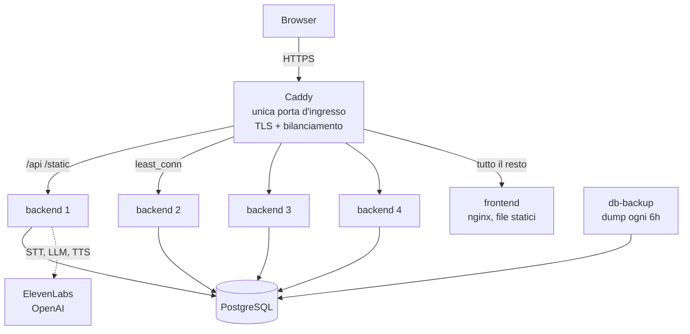

# Infrastruttura

Come SkillLab sta in piedi in produzione, perché è fatto così, e cosa manca
ancora.

Metà di questo documento riguarda solo questo progetto. L'altra metà, i
principi e la lista di controllo in fondo, vale per qualunque applicazione
che debba reggere più utenti di quanti ne regga un processo solo, ed è
scritta per essere riletta la prossima volta partendo da zero.

---

## 1. L'architettura



Cinque servizi, un solo affacciato su internet.

| Servizio | Cosa fa | Si affaccia? |
|---|---|---|
| **caddy** | Termina TLS, smista, bilancia | Sì, 80 e 443 |
| **backend** | FastAPI, N copie identiche | No |
| **frontend** | nginx, serve i file compilati | No |
| **db** | PostgreSQL | No |
| **db-backup** | Un dump ogni sei ore | No |

Il browser parla con un solo indirizzo. Non è un dettaglio estetico: i
cookie di sessione sono `Secure` e `HttpOnly`, e con due origini non
funzionerebbero. Una sola origine vuol dire anche zero CORS da gestire.

---

## 2. I principi

Questa è la parte da rileggere quando il progetto è un altro.

### 2.1 La capacità si aggiunge in processi, non in macchine

Un processo Python usa un core e uno solo, per via del GIL. Su una macchina
a 16 core, un processo solo ne usa uno e ne paga sedici.

Dentro quel processo `asyncio` dà molta concorrenza, perché mentre una
richiesta aspetta la rete il processore lavora per un'altra. Ma il tetto
arriva quando il core è pieno di lavoro vero, e per un'applicazione vocale
quel lavoro è concreto: codifiche, serializzazioni, cifratura di centinaia
di connessioni.

Quindi il conto è: **processi circa quanti sono i core**, e la capacità è
"quanto regge un processo" moltiplicato per il numero di processi. Le
macchine si aggiungono dopo, quando finiscono i core o la banda.

### 2.2 Un processo che ricorda qualcosa non si può replicare

È il principio da cui discende quasi tutto il lavoro fatto. Con quattro
repliche ci sono quattro memorie separate, e nessuna sa cosa hanno fatto le
altre.

La lista di controllo, che vale per qualunque applicazione:

1. **Stato di sessione tenuto in RAM.** Se una richiesta lo scrive e
   un'altra lo legge, con più repliche non si trovano. Va in tabella.
2. **Migrazioni allo startup.** N processi che partono insieme eseguono lo
   stesso DDL nello stesso istante. Serve un lock, e chi arriva dopo trova
   il lavoro fatto (quindi ogni passo deve essere idempotente).
3. **Lavoro periodico interno.** Il ciclo vive in ogni processo, quindi
   parte N volte. Serve un lock, ma non bloccante: chi lo perde salta il
   giro invece di mettersi in fila.
4. **Contatori di sicurezza** (tentativi di accesso, quote). Con N repliche
   il limite vale N volte tanto, e nessuno vede mai l'attacco per intero.
   Vanno condivisi.
5. **Cache locali con invalidazione.** Sopravvivono, ma con una finestra: la
   modifica fatta da una replica arriva alle altre dopo il TTL. Va saputo e
   scritto, non scoperto.
6. **Connessioni al database.** Il pool è per processo, il tetto del
   database è per installazione. Il conto è `repliche * (pool + overflow)`,
   e il default del database è 100.

### 2.3 Il lock distribuito ce l'ha già il database

Per i punti 2 e 3 non serve nessun componente aggiuntivo: PostgreSQL ha gli
advisory lock, che sono transazionali, si rilasciano da soli quando la
connessione cade, e non hanno nessuno dei problemi dei lock costruiti sopra
una cache (scadenza, rinnovo, processo morto con il lock in mano).

Due varianti, e la differenza conta:

- **`pg_advisory_lock`** (di sessione, bloccante) per il lavoro che gli
  altri devono aspettare, come preparare lo schema. Vive quanto la
  connessione, quindi va tenuta aperta apposta.
- **`pg_try_advisory_xact_lock`** (di transazione, non bloccante) per il
  lavoro che deve fare uno solo, come la pulizia periodica. Si rilascia da
  solo con il commit o il rollback.

### 2.4 Non aggiungere un componente per un problema che non hai

Redis sarebbe servito per tre cose: archivio condiviso veloce, lock
distribuito, comunicazione fra repliche.

Le prime due le fa il database meglio o uguale, alle frequenze in gioco (una
lettura per chiamata, una scrittura per login fallito). La terza è l'unica
in cui sarebbe insostituibile, ed è quella che non c'è: **nessuna replica
deve dire niente a un'altra**, ogni chiamata vive interamente dentro un
processo.

Il costo di un componente in più non è la sua installazione, è che va
aggiornato, protetto, salvato e diagnosticato per sempre. Su un progetto di
una persona sola, ogni pezzo aggiunto è un debito permanente.

### 2.5 Non tutto lo stato in memoria è un errore

Il tetto sulle chiamate contemporanee è l'unica cosa che **deve** restare
nella memoria del processo: a saturarsi è il core su cui gira quell'event
loop, non l'installazione. Quattro repliche con tetto 15 fanno sessanta
chiamate senza doversi coordinare.

La domanda giusta non è "questo stato è condiviso?", è "questo stato
descrive l'installazione o descrive il processo?".

### 2.6 Il lavoro periodico vive dentro l'applicazione

Purghe, backup, scadenze: tutto su un orologio interno, non su un cron
dell'host. Il motivo è che l'installazione si fa una volta e nessuno deve
tornare sulla macchina perché qualcosa riparta. Un cron che nessuno ha
rimesso dopo una migrazione è un lavoro che smette di girare in silenzio.

Il corollario è il punto 3 della lista: se il lavoro vive in ogni processo,
serve il lock.

### 2.7 Su una macchina sola, i limiti servono a proteggere il database

Quando tutto gira sullo stesso server, i servizi non sono vicini di casa
educati: si contendono gli stessi core e la stessa RAM, e chi ne ha di più
da fare tende a prendersi tutto.

Il servizio da proteggere è il database, e non perché sia il più fragile: è
quello da cui dipendono tutti gli altri. Un backend che rallenta rallenta le
sue chiamate, un Postgres spinto in swap ferma l'installazione intera. Per
questo ha due numeri e non uno: un tetto, che gli impedisce di prendersi
tutto, e soprattutto **una riserva, che impedisce agli altri di lasciarlo
senza niente**.

Il secondo posto dove i limiti servono è il disco, ed è quello che ci si
dimentica: i log di Docker crescono senza fine, e un disco pieno ferma
Postgres esattamente come la memoria finita. Il traffico normale non è il
pericolo, lo è una replica che non riesce a partire e viene riavviata in
continuazione stampando lo stesso errore: lì si passa da megabyte al giorno
a megabyte al minuto, e il secondo guasto arriva mentre stai indagando sul
primo.

Vale la pena scegliere anche il driver, non solo il tetto: quello di serie
tiene i file ruotati in chiaro, mentre il driver `local` li comprime, e a
parità di disco occupato tiene una storia dieci volte più lunga.

### 2.8 Chi decide dove va una richiesta deve essere uno solo

Il proxy verso il backend stava in nginx, che risolve il nome di un upstream
**una volta sola all'avvio**: con quattro repliche avrebbe mandato tutto
sempre alla stessa, senza che niente sembrasse rotto.

Adesso smista solo Caddy, che risolve il DNS di continuo, e nginx serve i
file statici e basta. Due bilanciatori in fila non raddoppiano niente,
raddoppiano solo i posti dove cercare quando qualcosa non torna.

Per connessioni lunghe (una chiamata vocale dura dieci minuti) la politica
va scelta: **`least_conn`, non round robin**. Conta chi ne ha meno in corso
adesso, non di chi sia il turno.

### 2.9 Quanto a lungo il browser si tiene quello che ha già

Chi serve il file decide anche se il browser dovrà richiederlo. La regola
segue una cosa sola: se il **nome** cambia insieme al contenuto, il file è
immutabile e non si richiede mai più; se il nome resta lo stesso mentre il
contenuto cambia, si richiede sempre, e la risposta è quasi sempre un 304.

In [nginx](../frontend/nginx.conf), che serve la build compilata:

- `/assets/` porta l'impronta del contenuto nel nome (Vite la scrive lì), e
  prende un anno con `immutable`. Senza, il browser richiedeva per conferma
  una ventina di file a ogni apertura, e nessuno di quei giri portava un byte
  utile: tornavano tutti "non è cambiato". La regola è `location ^~` perché
  altrimenti quella per estensione qui sotto vincerebbe, e i font e le
  immagini con l'impronta nel nome ricadrebbero nella scadenza breve;
- `index.html` è l'unico file senza impronta e l'unico che deve cambiare
  sotto il naso di chi ha la pagina aperta, perché è lui a nominare gli asset
  di questa build: prende `no-cache`, che non vuol dire non conservarlo ma
  chiedere conferma prima di riusarlo;
- le due icone in `public/` prendono un giorno: il nome non cambia col
  contenuto, quindi la scadenza è corta abbastanza da non lasciarne in giro
  una vecchia per giorni e lunga abbastanza da non richiederla a ogni pagina.

In [Caddy](../caddy/Caddyfile), per i ritratti degli avatar sotto `/static`,
la distinzione è fra i due tipi di file che ci finiscono. Un ritratto caricato
si chiama `upload_<uuid>.<ext>` e quel nome nasce e muore col file
(sostituire l'immagine di un avatar scrive un uuid nuovo), quindi è
`immutable` nel senso proprio del termine. Il segnaposto con le iniziali si
chiama invece `avatar_<id>.svg`, e il nome dipende dall'avatar e non dal
contenuto: rinominare l'avatar riscrive lo stesso file con lettere diverse, e
`immutable` bloccherebbe le vecchie iniziali nella cache di chi le ha già
viste. Lì la scadenza è un'ora. Il secondo matcher esclude il primo con un
`not` esplicito, perché due `header` che nominano lo stesso campo si
applicano entrambi e l'ultimo vince. `/api/*` non riceve nessun header di
cache.

### 2.10 Gli header di provenienza si sovrascrivono, non si accodano

L'applicazione legge il primo valore di `X-Forwarded-For` per sapere chi sta
chiamando. Se il proxy lo accoda, basta che un client se lo mandi da solo
per farsi credere un altro indirizzo, e passare sopra a qualunque limite
basato sull'IP.

Il proxy che sta davanti a tutto deve **sovrascriverlo** con l'indirizzo che
vede lui. È una riga, ed è la differenza fra un limite e la sua apparenza.

### 2.11 Un backup non esiste finché non l'hai ripristinato

Un volume non è un backup: protegge da un container ricreato, non da un
disco che muore né da una cancellazione sbagliata.

Quattro proprietà da pretendere: il primo dump parte subito e non fra sei
ore, un dump interrotto non prende il posto di uno buono (file temporaneo,
rinominato solo a fine riuscita, e `pipefail` perché in una pipe il codice
di uscita che conta non è quello dell'ultimo comando), il ciclo non muore
mai al primo errore, e **il dump esce già cifrato**.

L'ultima è quella che si dimentica, ed è quella che conta di più: un backup
è per definizione il file che viene copiato altrove, quindi la cifratura
del disco del server non lo protegge dopo il primo `rsync`. A chiave
pubblica, così sulla macchina che li produce c'è solo la chiave per
cifrare: chi ci entrasse non potrebbe leggerli. Con l'avvertenza che ne
consegue, cioè che la chiave privata va custodita davvero.

E poi la prova, che è l'unica cosa che conta: riversarlo su un database
vuoto e contare le righe.

### 2.12 Misurare prima di dimensionare

Quante richieste regge un processo non si deduce, si misura. Da quel numero
discende tutto: quanti processi, che macchina, quando serve la seconda.

Il metro non è "quando va in crash", è **quando la latenza peggiora**, e va
guardata la coda (il p95) e non la mediana, che resta bella molto oltre il
punto di rottura. La soglia sulla CPU è il **70% di un core**, non il 100%:
un event loop ha una coda sola, e quando il core è davvero pieno la latenza
cresce in modo non lineare.

Vedi [loadtest.md](loadtest.md), il banco di prova già pronto per farlo.

---

## 3. Cosa è stato fatto in questo progetto

### 3.1 Il codice, perché reggesse più di un processo

| Cosa | Dove | Perché |
|---|---|---|
| Sessioni vocali su database | [backend/voice_sessions.py](../backend/voice_sessions.py) | Il `POST` che apre la chiamata e il WebSocket che la usa sono due richieste: con più repliche non finiscono sullo stesso processo. Risolto così, cade anche il bisogno di affinità di sessione sul proxy |
| Lock sullo schema | [backend/startup_migrations.py](../backend/startup_migrations.py) | Quattro container che partono insieme facevano lo stesso DDL nello stesso istante |
| Lock sulla pulizia | [backend/housekeeping.py](../backend/housekeeping.py) | Lo stesso purge partiva quattro volte, con DELETE che si bloccavano a vicenda |
| Limite accessi su database | [backend/rate_limit.py](../backend/rate_limit.py) | Con quattro repliche il limite valeva quattro volte tanto |
| Tetto per processo | [backend/voice_capacity.py](../backend/voice_capacity.py) | Un event loop pieno non rifiuta, rallenta, e rallenta per tutti insieme |
| Pool di connessioni | [backend/database.py](../backend/database.py) | I default sono per un processo solo. In più `pool_pre_ping`, senza il quale la prima richiesta dopo un riavvio del database fallisce |
| Connessione restituita prima delle attese lunghe | [backend/routers/chat.py](../backend/routers/chat.py) | Valutazione e chat in streaming aspettano il modello per decine di secondi, e fino a lì tenevano ferma una connessione senza usarla. Con quaranta persone che chiudono insieme, il pool finiva per richieste che stavano solo aspettando OpenAI |

### 3.2 L'infrastruttura

| Cosa | Dove |
|---|---|
| TLS, smistamento, bilanciamento `least_conn`, header blindato, tetto sul corpo delle richieste | [caddy/Caddyfile](../caddy/Caddyfile) |
| Repliche, healthcheck, servizi, volumi | [docker-compose.yml](../docker-compose.yml) |
| Log compressi e con un tetto (2 GB per container, mesi di storia), e limiti di CPU e memoria, con la riserva che tiene Postgres fuori dallo swap | [docker-compose.yml](../docker-compose.yml) |
| I numeri che cambiano con la macchina (repliche, memoria del backend e del database) | il `.env` accanto al compose |
| Sviluppo: una replica, niente Caddy né backup | [docker-compose.override.yml](../docker-compose.override.yml) |
| Solo file statici, niente più proxy | [frontend/nginx.conf](../frontend/nginx.conf) |
| Dump ogni sei ore, cifrati a chiave pubblica, con ritenzione | [db/backup.sh](../db/backup.sh), [db/Dockerfile](../db/Dockerfile) |
| Banco di prova per la capacità | [loadtest/](../loadtest/) |

### 3.3 Come è stato verificato

Tutto provato sullo stack di produzione fatto girare in locale, con tre
repliche:

- richieste distribuite su tutte le repliche
- WebSocket vocale che attraversa il proxy fino al `ready` del backend
- `X-Forwarded-For` falsificato dal client e correttamente ignorato
- una replica spenta: nessuna richiesta persa, e rientro automatico quando
  torna
- dump ripristinato su un database vuoto, con tutte le righe al loro posto

Le uniche due cose non verificabili in locale sono l'emissione del
certificato pubblico e il DNS.

**Tornando indietro, il frontend va ricostruito.** I due modi condividono il
nome dell'immagine ma non lo stadio del Dockerfile: la produzione si ferma
su nginx coi file compilati, lo sviluppo si ferma prima e lancia Vite.
Costruire la produzione sovrascrive quell'immagine, e il `docker compose up`
successivo riparte in ciclo con exit 127, che è `npm` cercato dentro
un'immagine dove non c'è. Non è niente di rotto, serve solo dire di
ricostruire:

```bash
docker compose up -d --build frontend
```

---

## 4. Il deploy

### 4.1 La prima volta

1. Un server con Docker. Per il dimensionamento vedi il punto 2.1: processi
   quanti sono i core, e il numero di chiamate per processo lo dice il banco
   di prova.
2. Il dominio che punta all'indirizzo del server, con le porte 80 e 443
   raggiungibili. Servono entrambe: la 80 per la verifica di Let's Encrypt.
3. Il file di ambiente accanto al compose. **Non esiste un elenco delle
   variabili, ed è voluto:** quelle obbligatorie sono dichiarate nel compose
   con il messaggio che spiega cosa manca, quindi l'avvio fallisce dicendolo
   e nessun elenco può invecchiare. L'unica a cui fare attenzione è
   `SITE_ADDRESS`, perché ha un default: se la dimentichi il sito parte su
   `localhost` e dal dominio non risponde niente.

   In quello stesso file stanno anche i numeri che cambiano con la macchina,
   cioè quante repliche e quanta memoria a testa per backend e database. Il
   conto da rifare quando la macchina cambia è scritto lì sopra, accanto ai
   valori.
4. Poi:

```bash
docker compose -f docker-compose.yml up -d --build
```

Il `-f` esplicito è quello che esclude l'override di sviluppo, che altrimenti
Compose caricherebbe da solo.

### 4.2 Gli aggiornamenti

```bash
git pull
docker compose -f docker-compose.yml up -d --build
```

Lo schema si aggiorna da solo all'avvio, dietro il lock, quindi non c'è
nessun passo di migrazione da ricordare.

**Le chiamate in corso cadono.** Le repliche vengono sostituite tutte
insieme e chi è al telefono viene interrotto, quindi per ora gli
aggiornamenti vanno fatti in una finestra tranquilla. Il rimedio, quando
servirà, è nel punto 6.

Quello che invece non si perde più sono le scritture: il `stop_grace_period`
del backend dà trenta secondi alle scritture in volo (la trascrizione parte
fire and forget) per arrivare a destinazione, invece dei dieci di serie dopo
i quali il processo veniva ucciso a metà. Il database ne ha sessanta, che
gli servono per chiudere le connessioni e scrivere il checkpoint: se lo si
uccide prima, i dati restano integri ma il riavvio dopo si porta via minuti
di recovery.

---

## 5. Le operazioni

**Cambiare la capacità**, senza toccare nessun file:

```bash
docker compose -f docker-compose.yml up -d --scale backend=6
```

**Vedere cosa succede**, con le latenze di ogni turno di conversazione:

```bash
docker compose -f docker-compose.yml logs -f backend | grep LATENCY
docker compose -f docker-compose.yml logs -f caddy
docker stats
```

Le righe `[LATENCY]` si aggregano con [loadtest/report.py](../loadtest/report.py),
che dà mediana, p95 e massimo per stadio della pipeline. Vale anche sul
traffico vero, non solo sotto prova.

**Ripristinare un backup**, con lo stack fermo tranne il database:

```bash
age -d -i chiave-backup.txt backups/skilllab-AAAAMMGG-HHMMSS.sql.gz.age \
  | gunzip -c \
  | docker compose exec -T db psql -U <utente> -d <database>
```

I dump escono cifrati con age, quindi il ripristino si fa dalla macchina dove
sta la chiave privata, che non è questa. La coppia si crea una volta sola, e
altrove:

```bash
age-keygen -o chiave-backup.txt
```

La pubblica che stampa (`age1...`) va nel `.env` accanto al compose come
`BACKUP_AGE_RECIPIENT`; il file con la privata si custodisce dove si
custodiscono le password. Senza la variabile il servizio di backup non parte,
di proposito: un dump in chiaro prodotto perché mancava una riga di
configurazione è la cosa di cui nessuno si accorge. E vale anche il rovescio,
che è la ragione per cui quella chiave va custodita sul serio: **persa la
privata, i backup restano cifrati per sempre**.

**Portare i backup fuori dalla macchina.** Restano in `./backups`, che è una
cartella dell'host apposta perché un `rsync` verso uno spazio di
archiviazione remoto possa prenderli. Finché stanno solo lì, proteggono da
una cancellazione sbagliata ma non dal disco che muore.

**Quando qualcosa non va**, l'ordine da seguire:

1. `docker compose ps`: chi non è `healthy`.
2. I log di Caddy, che dicono se la richiesta è arrivata e con che esito.
3. I log del backend, dove compare anche quale replica ha risposto.
4. Se le chiamate falliscono tutte insieme ma l'applicazione risponde, il
   sospetto è sui fornitori esterni (quote esaurite), non sul codice.

---

## 6. Cosa manca

### Prima di avere utenti veri

- **Le quote dei fornitori.** Quaranta persone in chiamata sono quaranta
  stream simultanei per ciascun servizio. Se il piano ne concede dieci,
  l'applicazione funziona e il servizio no. È il rischio numero uno, e si
  chiude con una email, non con del codice.
- **Il costo al minuto**, misurato sui cruscotti dei tre fornitori con
  qualche chiamata vera, e moltiplicato per i minuti che pensi di vendere.
- **Il banco di prova almeno una volta**, per sapere quante chiamate regge
  davvero un processo invece di stimarlo.
- **`VOICE_STT_DEBUG=0` nel `.env` del server.** Accende il tracciato grezzo
  della STT, che scrive nei log le trascrizioni di quello che gli utenti
  dicono: in locale sta a 1 per tarare la VAD, sul server va a 0. È una delle
  due eccezioni fra le variabili, perché non ferma l'avvio se manca: vale
  attivo solo scritto esattamente `1`, e qualunque altra cosa, compresa
  l'assenza, lo lascia spento.
- **`DEV_ADMIN_LOGIN` spenta nel `.env` del server**, l'altra eccezione, con
  lo stesso patto. Accesa, la coppia `admin` / `admin` apre un super admin
  senza passare da Cognito, quindi senza traccia dove la si cercherebbe. Si
  spegne dopo aver creato e provato un super admin vero, mai prima:
  spegnendola su un'installazione nuova si resta chiusi fuori
  ([autenticazione.md](autenticazione.md)).

### Quando i numeri cresceranno

- **Aggiornamenti senza interrompere le chiamate.** Togliere una replica dal
  giro, aspettare che le sue chiamate finiscano da sole, sostituirla, e
  passare alla successiva.
- **La seconda macchina.** Serve quando finiscono i core o la banda. Con
  l'audio non compresso il primo limite è la scheda di rete, attorno alle
  cinquecento chiamate contemporanee.
- **Audio compresso** fra browser e server, che taglierebbe la banda di
  circa dieci volte e sposterebbe quel tetto molto più in là.
- **Backup fuori dalla macchina**, che è l'unico modo perché siano backup
  davvero.
- **Un controllo esterno che avvisi se il sito non risponde.** Oggi, se
  cade, lo scopre il primo utente.

---

## 7. Lista di controllo per il prossimo progetto

Nell'ordine in cui conviene affrontarli.

**Prima di scrivere l'infrastruttura**

- [ ] I limiti che non dipendono da te (quote di servizi esterni, costi per
      unità di uso) sono verificati? Sono l'unica cosa che può rendere
      inutile tutto il resto.
- [ ] Quanta banda muove un utente, e quanta ne muovono tutti insieme nel
      picco? Da lì si capisce se l'hosting con banda inclusa conta.

**Il codice, perché regga più di un processo**

- [ ] Nessuno stato di sessione nella memoria del processo.
- [ ] Migrazioni allo startup dietro un lock, e ogni passo idempotente.
- [ ] Lavoro periodico dietro un lock non bloccante.
- [ ] Contatori di sicurezza condivisi.
- [ ] Pool di connessioni dimensionato per il numero di repliche, con il
      tetto del database alzato di conseguenza, e il pre-ping attivo.
- [ ] Un tetto di capacità per processo, con un rifiuto onesto invece del
      degrado di tutti.
- [ ] Niente dati personali nei log.

**L'infrastruttura**

- [ ] Un solo servizio affacciato, che termina TLS.
- [ ] Un solo punto che decide il routing.
- [ ] Politica di bilanciamento scelta in base alla durata delle connessioni.
- [ ] Header di provenienza sovrascritti, non accodati.
- [ ] Healthcheck su ogni servizio, con un periodo di grazia iniziale
      abbastanza lungo da coprire l'avvio.
- [ ] Un tetto ai log, per dimensione e per numero di file, e un driver che
      comprima i file ruotati. Quello di serie non cancella niente, e il
      disco pieno ferma il database.
- [ ] Limiti di CPU e memoria su ogni servizio, e una **riserva** di memoria
      sul database, che è l'unico modo per impedire agli altri di spingerlo
      in swap sotto picco.
- [ ] Backup automatici, con scrittura atomica e ritenzione, e **una prova di
      ripristino fatta davvero**.
- [ ] La configurazione obbligatoria dichiarata in modo che l'avvio fallisca
      dicendo cosa manca.

**Prima di aprire le porte**

- [ ] Lo stack di produzione provato in locale, non solo quello di sviluppo.
- [ ] Distribuzione delle richieste verificata guardando i log, non
      supponendola.
- [ ] Una replica spenta a mano, per vedere se qualcuno se ne accorge.
- [ ] Un dump ripristinato su un database vuoto.
- [ ] Il numero di richieste per processo misurato, non stimato.
