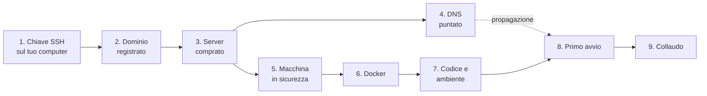

# La prima messa in produzione

Da un dominio che non esiste ancora a SkillLab raggiungibile da internet.
Questo documento copre solo la **prima volta**: comprare la macchina, metterla
in sicurezza, installarci Docker e portarci il progetto. Da lì in poi comandano
[deploy-e-scalabilita.md](deploy-e-scalabilita.md) per gli aggiornamenti e
[docker-e-ambienti.md](docker-e-ambienti.md) per come è fatto lo stack.

Serve mezza giornata la prima volta, e buona parte è attesa: il DNS che si
propaga e le immagini che si costruiscono.

## L'ordine, e perché è quello



Il dominio viene prima del server perché la propagazione del DNS è l'unica
attesa che non puoi accorciare, e mentre aspetti puoi fare tutto il resto. E il
DNS deve essere già arrivato quando avvii lo stack la prima volta: Caddy chiede
subito il certificato a Let's Encrypt, e se il dominio non risponde ancora la
richiesta fallisce. Non è grave di per sé, ma **Let's Encrypt conta i
fallimenti**, e dopo cinque tentativi nella stessa ora smette di rispondere per
un'ora. Con il DNS a posto in anticipo il problema non si presenta.

---

## 1. La chiave SSH, sul tuo computer

Va fatta per prima, perché il pannello di Hetzner te la chiede mentre crei il
server. Nel PowerShell di Windows:

```powershell
ssh-keygen -t ed25519 -C "skilllab"
```

Premi invio alle tre domande e accetta il percorso proposto. La passphrase
puoi lasciarla vuota: protegge la chiave se qualcuno ti ruba il computer, e se
la metti te la chiederà ogni volta che entri nel server.

Nascono due file in `C:\Users\david\.ssh\`. Quello che finisce in `.pub` è la
**chiave pubblica**, e si può mostrare a chiunque. L'altro, senza estensione,
è la chiave privata: è la tua identità, non esce mai da quel computer e non si
incolla da nessuna parte.

Copia negli appunti la pubblica, che ti serve fra due passi:

```powershell
Get-Content $env:USERPROFILE\.ssh\id_ed25519.pub | Set-Clipboard
```

Se perdi quel computer perdi l'accesso al server. Vale la pena tenerne una
copia in un gestore di password, insieme alle altre credenziali che nasceranno
in questa pagina.

---

## 2. Il dominio

Registralo dove preferisci. I registrar seri costano fra i dieci e i venti euro
l'anno per un `.it` o un `.com`, e le due cose che contano davvero sono che ti
diano il **controllo dei record DNS** e che il rinnovo automatico sia attivo:
un dominio scaduto non spegne il sito lentamente, lo spegne di colpo.

Se non hai preferenze, Cloudflare e Porkbun vendono al costo del registro e
non hanno la lista di supplementi che hanno gli operatori più pubblicizzati.
Anche Hetzner li vende, e avere tutto sullo stesso pannello ha il suo valore.

Due avvertenze che riguardano l'applicazione:

- **il dominio finisce nella privacy policy e nelle informative**, quindi
  sceglilo come sceglieresti un nome definitivo, non uno di prova;
- **niente proxy davanti al dominio** per adesso. Se registri su Cloudflare,
  il record va lasciato in modalità "DNS only" e non "Proxied": la nuvoletta
  arancione fa passare tutto il traffico dai loro server, che terminano il TLS
  al posto di Caddy e hanno un limite di durata sulle connessioni WebSocket.
  Le tue chiamate durano dieci minuti, e verrebbero tagliate.

---

## 3. Il server

Su [console.hetzner.cloud](https://console.hetzner.cloud), crea un progetto e
poi un server. Le scelte che contano:

| Voce | Cosa scegliere | Perché |
| --- | --- | --- |
| **Location** | Falkenstein, Norimberga o Helsinki | Dati in Europa, che è quello che la tua impostazione GDPR dà per assunto ([gdpr.md](gdpr.md)) |
| **Image** | Ubuntu 24.04 LTS | È la versione su cui Docker è supportato ufficialmente e per cui ogni messaggio di errore ha già una risposta scritta |
| **Type** | Cost-optimized, **CX53** (16 vCPU, 32 GB, 320 GB) | Sei repliche vogliono sei core, più margine per Postgres e Caddy. Vedi più sotto |
| **Networking** | IPv4 e IPv6 come propone | |
| **SSH keys** | Incolla la chiave pubblica del passo 1 | Senza, Hetzner ti manda una password per email, che è il modo peggiore di cominciare |
| **Backups** | **Attivalo** | Vedi più sotto: risolve da solo un punto aperto della documentazione |
| **Firewall** | Creane uno, regole nella tabella sotto | |

**Sulla taglia.** Il criterio sta in [infrastruttura.md](infrastruttura.md):
processi circa quanti sono i core, perché un processo Python ne usa uno solo.
Con quaranta studenti insieme e sei repliche servono almeno sei core, più il
margine per il database e per Caddy, e almeno sedici GB di memoria, perché ogni
replica tiene in RAM i buffer audio delle sue chiamate.

Il listino di Hetzner è cambiato il 15 giugno 2026, e le tre linee non si sono
mosse insieme: le cost-optimized sono salite del trenta per cento circa, le
altre sono più che raddoppiate. Il risultato è che a parità di vCPU e di
memoria la differenza di prezzo fra le linee è arrivata a quattro volte:

| Piano | vCPU | RAM | Disco | Al mese, IVA esclusa |
| --- | --- | --- | --- | --- |
| CX43 | 8 condivise | 16 GB | 160 GB | 15,99 € |
| **CX53** | **16 condivise** | **32 GB** | **320 GB** | **29,49 €** |
| CPX42 | 8 condivise, hardware premium | 16 GB | 320 GB | 69,49 € |
| CCX33 | 8 dedicate | 32 GB | 240 GB | 138,49 € |

Il CX53 è la scelta giusta per questa applicazione, e il motivo non è solo il
prezzo. Le cost-optimized girano su generazioni di hardware più vecchie e con i
core condivisi con altri clienti, quindi rendono meno per core sotto carico
sostenuto: la risposta è comprarne il doppio, che qui costa comunque meno della
metà del piano premium con la stessa scheda tecnica. Sedici core condivisi che
rendono il sessanta per cento battono otto core premium, e i trentadue GB
tolgono di mezzo la memoria come primo limite, che con sei repliche su una
macchina da sedici GB sarebbe stata stretta.

**Questa scelta va confermata con il banco di prova, non creduta.** La linea
cost-optimized è dichiarata meno adatta al carico multi processo prolungato, e
una chiamata vocale vive di latenza: la CPU condivisa non si vede nella media,
si vede nel p95. Il banco di prova ([loadtest.md](loadtest.md)) va lanciato su
questa macchina prima della prima esercitazione, ed è esattamente la domanda a
cui sa rispondere. Se i numeri non reggono, il passaggio al CPX42 si fa dal
pannello in pochi minuti: gli ingrandimenti sono sempre possibili, perché il
disco cresce e non diminuisce.

Comprare margine per paura, qui, costerebbe quaranta euro al mese per
un'incertezza che hai già gli strumenti per sciogliere.

**Sui backup.** Sono snapshot dell'intero disco, presi in automatico e tenuti
su uno storage separato dal server. Costano il venti per cento del prezzo della
macchina, cioè una manciata di euro al mese, e chiudono da soli la voce
*backup fuori dalla macchina* che [infrastruttura.md](infrastruttura.md)
elenca fra le cose mancanti: i dump di `./backups` proteggono da una
cancellazione sbagliata, gli snapshot di Hetzner dal disco che muore. E lo
fanno senza nessun lavoro periodico da mantenere sull'host, che è la regola che
hai scelto per tutto il resto.

**Le regole del firewall**, in ingresso, tutto il resto chiuso:

| Porta | Protocollo | A cosa serve |
| --- | --- | --- |
| 22 | TCP | Il tuo accesso |
| 80 | TCP | La verifica di Let's Encrypt, e il rimando a HTTPS |
| 443 | TCP | Il sito |
| 443 | UDP | HTTP/3, che Caddy pubblica |

Questo firewall sta **davanti** alla macchina, nella rete di Hetzner, e non
sulla macchina. È una differenza che conta più di quanto sembri, e il perché è
nel passo 5.

---

## 4. Il DNS

Appena il server è creato, il pannello ti mostra il suo indirizzo IPv4. Vai dal
registrar del dominio e crea **un record A**, dal nome che vuoi usare verso
quell'indirizzo. Se il sito deve stare sul dominio nudo, il nome è `@`.

**Non creare il record AAAA**, quello per IPv6, anche se Hetzner ti ha dato un
indirizzo IPv6. Un browser che trova un AAAA lo prova per primo, e se lo stack
non ascolta su IPv6 l'utente si prende un'attesa e poi un errore, mentre tutto
sembra a posto dal tuo computer. Aggiungerlo dopo, verificando che risponda, è
sempre possibile; nascere con un indirizzo che non risponde no.

Il TTL lascialo come propone il registrar.

Poi controlla, dal tuo PowerShell, che il nome sia arrivato:

```powershell
Resolve-DnsName skilllab.esempio.it
```

Deve rispondere con l'indirizzo del server. Se dice che il nome non esiste,
aspetta: di solito bastano dieci minuti, a volte serve qualche ora. **Non
proseguire fino al passo 8 finché questo comando non risponde giusto**, e nel
frattempo fai i passi da 5 a 7, che non dipendono dal dominio.

---

## 5. Mettere in sicurezza la macchina

Da qui in poi si lavora dentro il server. Entra come `root`, che è l'unico
utente che esiste adesso:

```powershell
ssh root@INDIRIZZO-DEL-SERVER
```

La prima volta ti chiede se ti fidi della sua impronta: è normale, rispondi
`yes`.

### 5.1 Un utente tuo

Lavorare da `root` significa che ogni errore di battitura è definitivo. Crea un
utente normale, che possa diventare amministratore quando serve chiederlo
esplicitamente:

```bash
adduser david
usermod -aG sudo david
```

`adduser` chiede una password: scegline una vera e conservala nel gestore di
password. Non servirà per entrare, che avviene a chiave, ma la chiede `sudo`
ogni volta che alzi i privilegi.

Poi passagli la tua chiave, così può entrare anche lui:

```bash
mkdir -p /home/david/.ssh
cp /root/.ssh/authorized_keys /home/david/.ssh/
chown -R david:david /home/david/.ssh
chmod 700 /home/david/.ssh
chmod 600 /home/david/.ssh/authorized_keys
```

**Adesso apri una seconda finestra di PowerShell**, senza chiudere questa, e
prova:

```powershell
ssh david@INDIRIZZO-DEL-SERVER
```

Deve entrare senza chiedere password. Questa regola vale per tutto il passo 5:
**non chiudere mai la sessione che funziona finché non hai verificato in
un'altra finestra che il nuovo modo funziona.** È l'unica cosa che sta fra te e
un server a cui non puoi più accedere, per il quale l'unico rimedio è la
console di emergenza del pannello.

### 5.2 Chiudere la porta a chi bussa

Ubuntu di serie accetta ancora l'accesso con password e l'accesso come `root`.
Un server appena acceso su un indirizzo pubblico riceve tentativi automatici di
indovinare le password nel giro di minuti: non è un'ipotesi, è il rumore di
fondo di internet.

Le impostazioni non si scrivono nel file principale, ma in un file a parte
dentro `sshd_config.d`, perché Ubuntu ne mette già uno suo, generato
all'installazione, che verrebbe letto dopo e rimetterebbe le cose come stavano.
Il numero alto nel nome garantisce l'ultima parola:

```bash
sudo tee /etc/ssh/sshd_config.d/99-skilllab.conf > /dev/null <<'EOF'
PermitRootLogin no
PasswordAuthentication no
KbdInteractiveAuthentication no
EOF
```

Controlla che la configurazione sia valida **prima** di applicarla, che è il
passo che evita il server inaccessibile:

```bash
sudo sshd -t && sudo systemctl restart ssh
```

Se `sshd -t` non stampa niente, è a posto. Poi, dalla solita seconda finestra,
verifica di riuscire ancora a entrare come `david`. Solo allora chiudi la
sessione di `root`, che d'ora in poi non entrerà più.

### 5.3 Il firewall sulla macchina, e un tranello

```bash
sudo ufw allow OpenSSH
sudo ufw allow 80/tcp
sudo ufw allow 443
sudo ufw enable
```

Alla domanda se procedere rispondi `y`: la regola su OpenSSH è già stata
aggiunta, quindi non ti stai chiudendo fuori.

Il tranello da conoscere: **Docker scavalca `ufw`.** Quando un container
pubblica una porta, Docker scrive le sue regole a un livello che `ufw` non
controlla, e quella porta resta raggiungibile anche se `ufw` dice di no. È il
motivo per cui il firewall che conta davvero è quello del passo 3, che sta
nella rete di Hetzner, fuori dalla macchina, dove Docker non arriva.

Nel tuo caso il rischio è comunque piccolo, perché in produzione l'unico
servizio che pubblica porte è Caddy, e pubblica proprio quelle che vuoi
aperte ([docker-compose.yml](../docker-compose.yml)). Ma se un giorno avviassi
lo stack di sviluppo su questo server, quello affaccia anche il database sulla
5432, e senza il firewall di Hetzner sarebbe aperto al mondo.

### 5.4 Le patch di sicurezza, da sole

```bash
sudo apt update && sudo apt upgrade -y
sudo apt install -y unattended-upgrades
sudo tee /etc/apt/apt.conf.d/20auto-upgrades > /dev/null <<'EOF'
APT::Periodic::Update-Package-Lists "1";
APT::Periodic::Unattended-Upgrade "1";
EOF
```

Da qui in poi gli aggiornamenti di sicurezza di Ubuntu si installano da soli. È
la stessa logica del lavoro periodico dentro l'applicazione: nessuno deve
tornare sulla macchina perché una cosa continui a funzionare.

Restano fuori gli aggiornamenti che richiedono un riavvio del kernel, che
vanno fatti a mano ogni tanto. Il server ti avvisa al login quando servono, e
il momento giusto per farli è lo stesso degli aggiornamenti dell'applicazione:
un giorno senza esercitazioni.

---

## 6. Docker

Quello che si installa con `apt install docker.io` è una versione vecchia e
senza il comando `compose`. Va preso dal repository ufficiale:

```bash
sudo apt install -y ca-certificates curl
sudo install -m 0755 -d /etc/apt/keyrings
sudo curl -fsSL https://download.docker.com/linux/ubuntu/gpg -o /etc/apt/keyrings/docker.asc
sudo chmod a+r /etc/apt/keyrings/docker.asc
echo "deb [arch=$(dpkg --print-architecture) signed-by=/etc/apt/keyrings/docker.asc] https://download.docker.com/linux/ubuntu $(. /etc/os-release && echo "$VERSION_CODENAME") stable" \
  | sudo tee /etc/apt/sources.list.d/docker.list > /dev/null
sudo apt update
sudo apt install -y docker-ce docker-ce-cli containerd.io docker-buildx-plugin docker-compose-plugin
```

Poi mettiti nel gruppo che può parlare con Docker, così non devi scrivere
`sudo` davanti a ogni comando:

```bash
sudo usermod -aG docker david
```

**Esci e rientra** perché il gruppo abbia effetto, e verifica:

```bash
docker compose version
```

Da sapere: stare nel gruppo `docker` equivale ad avere i privilegi di
amministratore, perché chi può avviare container può montarsi tutto il disco.
Su un server dove l'unico utente sei tu non cambia niente, ma è il motivo per
cui quel gruppo non si regala.

---

## 7. Il codice e l'ambiente

### 7.1 Portare il repository sul server

Il server deve poter leggere il repository, e non deve farlo con le tue
credenziali personali di GitHub: se un giorno la macchina venisse compromessa,
si porterebbe via l'accesso a tutto quello che tocchi. Si usa una **chiave di
deploy**, che vale per un repository solo e in sola lettura.

Sul server:

```bash
ssh-keygen -t ed25519 -C "server-skilllab"
cat ~/.ssh/id_ed25519.pub
```

Copia quello che stampa. Su GitHub, nel repository, vai in **Settings → Deploy
keys → Add deploy key**, incolla, dai un nome riconoscibile e **lascia
disattivata** la spunta della scrittura.

Poi, sempre sul server:

```bash
cd ~
git clone git@github.com:TUO-UTENTE/SkillLab.git
cd SkillLab
```

Il ramo da mettere in produzione è `main`, non `stage`.

### 7.2 I due file di ambiente

Ne servono due, e stanno in posti diversi perché rispondono a due domande
diverse:

| File | Cosa contiene |
| --- | --- |
| `backend/.env` | Le chiavi dei fornitori e la configurazione dell'applicazione |
| `.env`, accanto al compose | Le credenziali del database e i numeri che dipendono dalla macchina |

**Il primo** ce l'hai già sul tuo computer, per lo sviluppo. Copialo dal
PowerShell di Windows, dalla cartella del progetto:

```powershell
scp backend\.env david@INDIRIZZO-DEL-SERVER:~/SkillLab/backend/.env
```

Poi, sul server, restringi i permessi, perché contiene chiavi che valgono
soldi veri:

```bash
chmod 600 ~/SkillLab/backend/.env
```

E rivedilo, perché arriva dallo sviluppo e tre cose vanno cambiate:
`DEV_ADMIN_LOGIN` per adesso resta accesa (si spegne nel passo 9, non prima, o
resti chiuso fuori), `VOICE_STT_DEBUG` va a zero perché altrimenti scrive nei
log quello che gli utenti dicono, e l'indirizzo del database non va toccato:
lo sovrascrive il compose, che conosce il nome del servizio dentro la sua rete.

**Il secondo** va creato da zero, e qui la procedura è particolare, e voluta:

```bash
cd ~/SkillLab
touch .env
```

Poi si prova ad avviare, e **lo stack ti dice cosa manca, una variabile alla
volta**, con un messaggio che spiega di cosa si tratta. Non esiste un elenco da
seguire, ed è una scelta: un elenco scritto invecchia in silenzio, un messaggio
che blocca l'avvio no. Il ciclo è: lanci, leggi cosa manca, lo aggiungi al
file, rilanci.

Quello che i messaggi non possono dirti è **quale valore mettere**, perché
dipende dalla macchina. I criteri, per il CX53:

- **le repliche del backend**: parti da sei, che è il numero per cui è
  dimensionato tutto il resto della documentazione. I sedici core ne
  reggerebbero di più, ma il numero giusto lo dice il banco di prova, e
  cambiarlo dopo non richiede di toccare nessun file;
- **CPU e memoria per replica**: un core a testa, che è quanto un processo
  Python può usare comunque, e un paio di GB di memoria;
- **il database**: quattro core, con un tetto di memoria generoso e soprattutto
  una riserva, che non è un dettaglio: è quello che gli impedisce di finire in
  swap sotto picco ([docker-e-ambienti.md](docker-e-ambienti.md));
- **il tetto delle connessioni del database**: il conto è
  `repliche * (pool + overflow)`, e va tenuto sopra il risultato con un
  margine. Postgres di suo ne accetta cento, che con sei repliche sono già
  poche. Il conto per intero, con il perché, sta in
  [deploy-e-scalabilita.md](deploy-e-scalabilita.md), e conviene scriverlo come
  commento accanto al valore: è la cosa che nessuno ricorda il giorno che
  cambia il numero di repliche;
- **l'indirizzo del sito**: il dominio del passo 2, senza `https://` davanti;
- **le credenziali del database**: le scegli adesso, e la password **deve
  essere URL-safe**, perché finisce dentro un indirizzo di connessione dove una
  `@` o una `/` la spezzerebbero. Generala così, che dà solo cifre e lettere:

```bash
openssl rand -hex 24
```

Utente e nome del database contano solo alla primissima creazione del volume:
cambiarli dopo non li cambia dentro Postgres, li spezza e basta. Sceglili
adesso e mettili nel gestore di password insieme al resto.

---

## 8. Il primo avvio

Prima verifica che il DNS sia arrivato, se non l'hai già fatto. Poi:

```bash
cd ~/SkillLab
docker compose -f docker-compose.yml up -d --build
```

**Il `-f` esplicito non è un vezzo.** Accanto al compose c'è un file di
override che Compose legge da solo, senza chiederlo, e che trasforma tutto in
un ambiente di sviluppo: una replica sola, il database affacciato su internet,
niente Caddy. Senza quel `-f` staresti avviando lo sviluppo credendo di avviare
la produzione ([docker-e-ambienti.md](docker-e-ambienti.md)).

La prima costruzione impiega diversi minuti, perché compila il frontend e
installa le dipendenze Python. Le volte successive quasi tutto arriva dalla
cache.

Se manca qualcosa nel `.env`, si ferma subito e lo dice. Aggiungi e rilancia:
è il ciclo previsto dal passo 7.2, non un intoppo.

Quando risponde, guarda chi è vivo:

```bash
docker compose -f docker-compose.yml ps
```

Le repliche del backend devono arrivare a `healthy`, e possono metterci fino a
un minuto: all'avvio si mettono in fila su un lock per preparare lo schema del
database, e l'ultima della coda risponde tardi senza per questo essere malata
([dati-e-schema.md](dati-e-schema.md)).

Poi il certificato, che è la cosa che può andare storta e che va guardata
subito:

```bash
docker compose -f docker-compose.yml logs caddy
```

Cerca la riga che dice di aver ottenuto il certificato. Se invece vedi errori
di validazione, le cause sono tre e in quest'ordine: il DNS non è ancora
arrivato, la porta 80 non è aperta nel firewall di Hetzner, oppure l'indirizzo
del sito nel `.env` non è esattamente il nome che hai puntato.

Infine apri `https://` più il tuo dominio dal browser. Deve comparire il sito
pubblico, con il lucchetto.

---

## 9. Il collaudo

L'applicazione risponde, ma non è ancora in produzione. Restano cinque cose, e
la prima ha un ordine obbligato.

**Il super admin vero.** Adesso esiste solo l'accesso locale `admin` / `admin`,
che salta Cognito e non lascia traccia dove la si andrebbe a cercare. Entra con
quello, crea un super admin vero, che riceverà le credenziali per email da
Cognito, ed **esci e rientra con quello** per verificare che funzioni davvero,
password temporanea compresa. Solo dopo che è entrato almeno una volta, spegni
`DEV_ADMIN_LOGIN` nel `backend/.env` e riavvia lo stack. Spegnerla prima
significa restare chiusi fuori da un'installazione appena nata
([autenticazione.md](autenticazione.md)).

**Una chiamata vocale intera**, dal microfono fino all'audio di risposta, e poi
la valutazione. È l'unica prova che tocca tutti e tre i fornitori esterni, ed è
quella che scopre le chiavi sbagliate e le quote insufficienti. A proposito di
quote: quaranta studenti insieme sono quaranta stream simultanei per ciascun
servizio, e se il piano ne concede dieci l'applicazione funziona e il servizio
no. È il rischio numero uno, si chiude con una email al fornitore e va chiuso
prima della prima esercitazione, non durante.

**Il ripristino di un backup.** Il primo dump parte subito all'avvio, quindi ce
n'è già uno in `./backups`. Un backup non esiste finché non lo si è ripristinato
almeno una volta, e il modo è in [deploy-e-scalabilita.md](deploy-e-scalabilita.md).
Falla adesso, su un'installazione ancora vuota, dove sbagliare non costa
niente.

**Il banco di prova**, per sapere quante chiamate regge davvero un processo
invece di stimarlo, e quindi se sei repliche sono il numero giusto. Si lancia
con fornitori finti, quindi non costa niente e non rischia la sospensione degli
account ([loadtest.md](loadtest.md)).

**Il primo aggiornamento fatto per finta**, cioè un `git pull` seguito dal
comando di avvio, per vedere con i tuoi occhi che lo schema si aggiorna da solo
e che non c'è nessun passo di migrazione da ricordare.

---

## Da qui in poi

Gli aggiornamenti sono due comandi, e stanno in
[deploy-e-scalabilita.md](deploy-e-scalabilita.md) insieme alle operazioni di
tutti i giorni: leggere i log, cambiare il numero di repliche, capire chi non
sta bene. Con l'uso a picchi di questa piattaforma, un giorno di esercitazioni
a settimana, la finestra tranquilla per aggiornare c'è sempre, e l'unica
accortezza che il profilo richiede è un giro di prova prima di ogni sessione:
sei giorni senza traffico non sono un collaudo, e un guasto che nessuno ha
visto arrivare si presenta con quaranta studenti già collegati.
