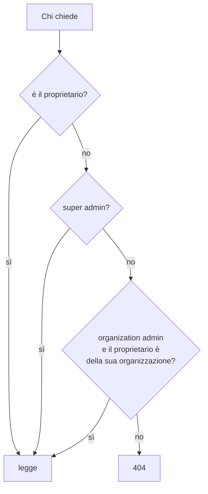

# Organizzazioni e ruoli

SkillLab è multi tenant: più aziende usano la stessa installazione e nessuna
vede i dati dell'altra. Questo documento spiega come quel confine è fatto, e
perché è fatto in un punto solo.

## I tre ruoli

| Ruolo | Organizzazione | Cosa può fare |
| --- | --- | --- |
| `super_admin` | Nessuna (`organization_id` NULL) | Sta sopra i tenant. Crea organizzazioni, avatar e utenti, e vede tutto |
| `organization_admin` | La sua | Amministra la propria: legge le conversazioni e i tentativi dei suoi utenti, compone percorsi, scrive i test tecnici, corregge valutazioni |
| `user` | La sua | Si allena, e vede solo la propria roba |

Il super admin è l'unico a non avere un'organizzazione, ed è esattamente questo
che lo mette al di sopra: ogni filtro per tenant lo lascia passare per come è
scritto, senza nessun caso speciale da ricordare.

## Il confine, in un punto solo

```python
def resolve_admin_scope(admin, organization_id=None):
    if admin.ruolo == ROLE_SUPER_ADMIN:
        return organization_id   # il filtro chiesto, o None = tutte
    return admin.organization_id # sempre la propria, qualunque cosa abbia chiesto
```

[auth_dependency.py](../backend/auth_dependency.py). Da qui nascono i filtri di
riga di tutta l'API di amministrazione, e la conseguenza è quella che conta:
un organization admin che aggiunge `?organization_id=` di un altro tenant si
vede **ignorare il parametro**, non rifiutare la richiesta. Non c'è una strada
per uscire dalla propria organizzazione, perché non c'è un punto in cui la
decisione venga presa una seconda volta.

Sul lato di chi non è admin la stessa idea prende la forma di una query
condivisa per area:

| Area | Funzione | Regola |
| --- | --- | --- |
| Avatar | `_visible_avatars` in [avatars.py](../backend/routers/avatars.py) | Solo quelli della propria organizzazione, tutti per il super admin |
| Categorie degli avatar | `get_categories` in [avatars.py](../backend/routers/avatars.py) | Come sopra. Il legame con l'avatar è una chiave esterna composta che porta con sé il tenant, così cambiare categoria non può spostare l'avatar di organizzazione (vedi [avatar-e-persona.md](avatar-e-persona.md)) |
| Simulazioni | `visible_query` in [simulations.py](../backend/routers/simulations.py) | Come sopra, più le bozze escluse fuori dall'amministrazione. È la stessa query a servire chi i test li scrive, chiesta con le bozze incluse (vedi [simulatore.md](simulatore.md)) |
| Conversazioni | `_owned_conversation_or_404` in [chat.py](../backend/routers/chat.py) | Solo le proprie, sempre |
| Tentativi | `_readable_attempt_or_404` in [simulations.py](../backend/routers/simulations.py) | I propri, e per un admin quelli di chi sta nella sua organizzazione |

## 404 e non 403

Quando qualcuno chiede qualcosa che non gli spetta, la risposta è **404**, non
403, in tutti i punti in cui la differenza direbbe qualcosa: un tentativo di
simulazione altrui, la conversazione di un altro utente, una simulazione di un
altro tenant.

Il motivo è che 403 conferma che quella riga esiste. Chi non ha diritto di
leggerla non ha nemmeno diritto di sapere che c'è.

Il 403 resta dove il fatto è già noto a chi chiede: un utente normale su una
rotta di amministrazione sa benissimo che quella pagina esiste, e sentirsi dire
"riservato agli amministratori" non gli rivela niente.

## Chi legge le conversazioni di chi

Questa è la regola che si ripete in tre punti diversi (il player della
registrazione, il dettaglio di un tentativo, il dettaglio di una
conversazione), sempre con la stessa forma:



È la stessa cosa che dire "un docente rilegge il lavoro dei propri studenti, e
di nessun altro".

Il proprietario è sempre **la persona**, mai la riga a cui la prova è
attaccata: un tentativo appartiene all'organizzazione di chi lo ha svolto e
non a quella della simulazione, come una conversazione appartiene a quella di
chi ha parlato e non a quella dell'avatar. La differenza si vede solo dopo che
il super admin ha spostato qualcuno di tenant, ed è esattamente il momento in
cui deve valere: le prove seguono la persona, e chi ha lasciato
un'organizzazione smette di essere leggibile da chi la amministra.

## Le organizzazioni

Le gestisce il super admin da
[routers/organizations.py](../backend/routers/organizations.py) e dalla pagina
[OrganizationsPage](../frontend/src/components/OrganizationsPage.tsx).

**Creazione.** Nome e slug, quest'ultimo derivato dal nome e reso unico
aggiungendo un numero finché è libero. Il tenant nasce già con una categoria
di avatar, "Clienti": la categoria è obbligatoria su ogni avatar, quindi senza
non si potrebbe creare nemmeno il primo.

**Sospensione.** Reversibile, e ha effetto immediato su tutti gli utenti del
tenant: nessuno entra più e chi era già dentro viene rifiutato alla richiesta
successiva, perché il controllo gira a ogni richiesta e non alla scadenza del
token. Il motivo della sospensione si scrive in chiaro e lo leggono anche gli
utenti bloccati: chi si trova fuori dalla propria formazione merita di sapere
perché, invece di un muro generico. Alla riattivazione il motivo si cancella,
perché descrive la sospensione in corso e non è uno storico (per quello c'è il
registro).

**Cancellazione.** Irreversibile, e porta via tutto: gli utenti, anche da
Cognito, le loro conversazioni, gli avatar privati del tenant con le loro
categorie, i ritratti dal disco, e quello che l'organizzazione aveva composto,
cioè i test tecnici e i percorsi formativi con le loro tappe. Passa dallo
stesso modulo di cancellazione di un singolo utente
([erasure.py](../backend/erasure.py)), così una tabella nuova viene coperta da
entrambe le strade insieme.

Test tecnici e percorsi il router se li cancella riga per riga, e non li lascia
alla `ON DELETE CASCADE` che pure sta sul modello: lo schema è costruito da
`create_all` senza uno strumento di migrazione, quindi un `ondelete` dichiarato
non è la prova che la tabella viva ce l'abbia. È la stessa ragione per cui
`erasure` non si fida di nessuna cascata. I percorsi vanno via prima delle
simulazioni, perché una tappa può puntare a una di esse.

La conferma che il super admin legge elenca le stesse cose, con i conteggi di
utenti e avatar della riga: chi cancella un tenant sta cancellando anche il
lavoro che quel tenant ha composto, e una conferma che parlasse solo di
persone e conversazioni lo direbbe a metà.

C'è anche un contatore di attività su una finestra di **trenta giorni**, e non
un totale storico: un totale non distingue un'organizzazione che ha lavorato
tanto un mese e poi ha smesso da una che sta lavorando ancora adesso.

## Gli utenti

Li gestisce il super admin da [routers/admin.py](../backend/routers/admin.py).
Creare un utente crea **due cose**: l'account su Cognito, che manda l'invito con
la password temporanea, e la riga locale che porta ruolo e organizzazione.

Due stati, e la differenza conta:

| Stato | Reversibile | Cosa significa |
| --- | --- | --- |
| `suspended` | Sì | Bloccato adesso, si riattiva |
| `disabled` | No | Chiuso: da lì si può solo cancellare |

Entrambi bloccano il login **e** uccidono le sessioni già aperte.

**L'anagrafica la tiene l'amministrazione.** Nome e cognome di un utente o di
un amministratore d'organizzazione non si riscrivono dal proprio profilo: il
nome che compare nei report, nelle revisioni e sui percorsi affidati è quello
registrato da chi ha creato l'account, e cambiarlo passa da
`PUT /api/admin/users/{id}` come già succede per l'email e per il ruolo. La
pagina Profilo mostra i due campi in sola lettura e non offre il salvataggio,
mentre `PUT /api/auth/me` risponde 403 a chi non è super admin: è quest'ultimo
il controllo che conta, il modulo spento è solo il modo di dirlo prima. Al
posto del salvataggio la pagina scrive a chi rivolgersi per far correggere il
proprio nome: due campi spenti senza quella riga mandano via chi era arrivato
lì apposta.

La cancellazione di una persona è il diritto all'oblio, ed è descritta in
[sicurezza-e-privacy.md](sicurezza-e-privacy.md): cosa sparisce, cosa resta di
proposito, e perché.

## Il lato frontend

Le rotte dichiarano il ruolo che richiedono con
[RequireRole](../frontend/src/components/RequireRole.tsx), e su un ruolo che
non corrisponde si viene rimandati alla home con `replace`. Non è una scala:
`/app/percorsi` chiede `user`, e i due ruoli di amministrazione ne restano
fuori quanto uno studente resta fuori dalla dashboard.

Va letto per quello che è: **comodità di navigazione, non sicurezza**. Il
controllo vero è nelle dipendenze del backend e nei filtri di riga descritti
sopra. Se un giorno il gate del browser sparisse per un errore, chi digita
l'indirizzo a mano vedrebbe una pagina che si riempie di 403 e di elenchi
vuoti, non i dati di qualcun altro.

Una conseguenza pratica di questa impostazione: alcune pagine sono **la stessa
pagina per tutti**. Il confronto fra tentativi e il simulatore stanno su rotte
aperte a chiunque sia autenticato; è il server a decidere se chi guarda vede
soltanto i propri dati o anche il selettore delle persone del proprio tenant.
