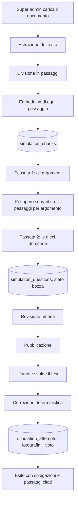

# Il simulatore tecnico, come funziona

Il gemello scritto del roleplay: là si misura come l'operatore gestisce una
persona, qui se conosce la procedura. Il super admin carica un documento
aziendale, un modello di ragionamento ne ricava dieci domande a risposta
multipla, un umano le rilegge, e gli utenti dell'organizzazione le svolgono
ottenendo un voto in decimi con la spiegazione di ogni risposta e il passaggio
del documento da cui la domanda nasce.

Questo file racconta il procedimento per intero, nell'ordine in cui accade.

## I file coinvolti

| File | Cosa fa |
| --- | --- |
| [backend/document_text.py](../backend/document_text.py) | Estrae il testo da PDF, DOCX, TXT, Markdown e lo normalizza |
| [backend/simulation_rag.py](../backend/simulation_rag.py) | Spezza il testo in passaggi, calcola le somiglianze, campiona |
| [backend/openai_service.py](../backend/openai_service.py) | Le chiamate a OpenAI: embedding e risposte JSON dal modello di ragionamento |
| [backend/simulation_questions.py](../backend/simulation_questions.py) | I due prompt e le due passate che producono le domande |
| [backend/routers/admin_simulations.py](../backend/routers/admin_simulations.py) | Il ciclo di vita lato super admin: caricamento, generazione, revisione, pubblicazione |
| [backend/routers/simulations.py](../backend/routers/simulations.py) | Lo svolgimento e la correzione |
| [backend/models.py:653-848](../backend/models.py#L653-L848) | Le quattro tabelle |
| [frontend/src/services/simulations.ts](../frontend/src/services/simulations.ts) | I tipi e le chiamate HTTP |
| [frontend/src/hooks/useSimulations.ts](../frontend/src/hooks/useSimulations.ts) | Gli hook TanStack Query |

## Il flusso in un colpo d'occhio

Le fasi 1, 2 e 3 sono tre chiamate HTTP distinte e non una sola. Il motivo è in
[admin_simulations.py:1-21](../backend/routers/admin_simulations.py#L1-L21): il
caricamento dura secondi, la generazione può durare minuti, e se fossero
un'unica richiesta un modello lento riporterebbe indietro un errore dopo tre
minuti lasciando il super admin senza niente, documento compreso.

---

## Fase 1, il caricamento del documento

`POST /api/admin/simulations` (multipart: `organization_id`, `title`,
`description`, `file`), riservato al super admin.

### 1.1 Controlli in ingresso

Nell'ordine, in
[create_simulation](../backend/routers/admin_simulations.py#L176-L235):

1. il titolo non può essere vuoto;
2. l'organizzazione deve esistere, ed è quella a cui la simulazione
   apparterrà per sempre (il tenant non si cambia più, vedi
   [update_simulation](../backend/routers/admin_simulations.py#L327-L344));
3. l'estensione deve essere `.pdf`, `.docx`, `.txt`, `.md` o `.markdown`. Si
   guarda l'estensione e non il content type dichiarato dal browser, che su
   Windows arriva vuoto o sbagliato più spesso di quanto si creda;
4. il file non può essere vuoto né superare 10 MB (`MAX_DOCUMENT_BYTES`). Si
   legge un byte in più del limite proprio per accorgersi del superamento
   senza caricare in memoria un file enorme.

Poi la riga `TechnicalSimulation` nasce in stato `draft`, e solo dopo si
indicizza il documento.

### 1.2 Estrazione del testo

[document_text.extract_text](../backend/document_text.py#L91-L108) sceglie il
lettore in base all'estensione:

- **PDF**: `pypdf`, con una riga vuota fra una pagina e l'altra, altrimenti
  l'ultima frase di una pagina e il titolo della successiva finiscono nello
  stesso paragrafo e quindi nello stesso passaggio;
- **DOCX**: `python-docx`, che legge i paragrafi e **anche le tabelle**, rese
  come righe `cella | cella | cella`. Le tabelle non stanno fra i paragrafi e
  sparirebbero in silenzio, che in una procedura è proprio dove stanno i
  passaggi operativi;
- **testo semplice**: UTF-8 con `latin-1` come rete di sicurezza, così da qui
  non esce mai un errore di decodifica.

Poi [_normalize](../backend/document_text.py#L39-L49) riduce tutto a una forma
sola: ritorni carrello di Windows, spazi e tabulazioni ripetuti (compreso lo
spazio unificatore che PDF e Word seminano ovunque e che a occhio è
indistinguibile da uno spazio normale), righe vuote multiple ridotte a una.

Il file originale non viene conservato da nessuna parte. Dopo questo passaggio
esiste solo la stringa, salvata in `TechnicalSimulation.document_text`.

Se il testo esce vuoto la richiesta fallisce con 400 e un messaggio esplicito:
è il caso del PDF fatto di pagine scansionate, che non contiene testo ma
immagini di testo, e nessun ritentativo lo cambia.

### 1.3 Divisione in passaggi

[split_into_chunks](../backend/simulation_rag.py#L43-L83) taglia il testo sui
confini dei paragrafi finché può, perché il paragrafo è l'unità che l'autore
del documento ha già deciso. Le misure:

| Costante | Valore | Perché |
| --- | --- | --- |
| `CHUNK_CHARS` | 1200 | Circa due paragrafi, su una procedura è un passo intero: abbastanza perché il passaggio si spieghi da solo, abbastanza poco perché il suo vettore parli di un argomento e non di cinque |
| `CHUNK_OVERLAP_CHARS` | 200 | La coda del passaggio chiuso apre il successivo, così una frase spezzata a metà si ritrova sempre con almeno uno dei due |
| `MIN_CHUNK_CHARS` | 80 | Sotto questa soglia il frammento è la coda di un titolo o una riga rimasta sola: non porta significato ma porta un vettore, e i vettori dei frammenti brevi somigliano un po' a tutto |

Un paragrafo che da solo supera i 1200 caratteri viene tagliato al suo interno
(succede con gli elenchi lunghi e con i PDF senza righe vuote). Se un documento
è così corto che tutti i suoi pezzi stanno sotto la soglia minima, si tiene il
testo intero come unico passaggio: meglio un passaggio breve che nessuno.

### 1.4 Indicizzazione

[embed_texts](../backend/openai_service.py#L211-L238) manda **tutti i passaggi in
una sola chiamata** al modello di embedding (`OPENAI_EMBEDDING_MODEL`), perché
l'API accetta più input insieme e spezzarli moltiplicherebbe per cento la
latenza senza cambiare il costo. I vettori tornano riordinati per indice,
perché l'API non promette di rispondere in ordine.

Qui **non c'è modello di riserva**, al contrario delle risposte JSON: i vettori
di due modelli diversi non si possono confrontare fra loro, e un documento con
metà passaggi indicizzati da uno e metà dall'altro darebbe ricerche
silenziosamente sbagliate. Se l'embedding fallisce, la richiesta risponde 502 e
si ritenta.

Ogni passaggio diventa una riga `SimulationChunk` con:

- `ordinal`, la posizione nel documento a partire da 1, che è il numero con cui
  le domande citeranno il passaggio;
- `content`, il testo;
- `embedding`, la lista di float salvata come JSON/JSONB.

L'embedding sta in una colonna JSON e non in un tipo vettoriale, e la
somiglianza si calcola in Python: pgvector andrebbe installato sul database, e
questa è un'applicazione che dopo il primo deploy non si tocca più. Il conto è
un prodotto scalare per passaggio, quindi qualche centinaio di passaggi si
confrontano in millisecondi, e la lettura dei vettori di UNA simulazione è una
query indicizzata su `simulation_id`. Il ragionamento per esteso è in
[simulation_rag.py:9-17](../backend/simulation_rag.py#L9-L17).

### 1.5 Ricaricare il documento

`POST /api/admin/simulations/{id}/document` rifà esattamente questi passi. I
passaggi di prima vengono cancellati, **le domande no**: le domande sono il
test, e un test non si azzera perché è stata caricata una versione aggiornata
della procedura. Restano lì con le loro citazioni che ora puntano ai passaggi
nuovi, ed è il super admin a decidere se rigenerarle.

---

## Fase 2, la generazione delle domande

`POST /api/admin/simulations/{id}/generate`. È l'unica chiamata dell'app che
può prendersi minuti. Il frontend la lancia senza ritentativi automatici
([useGenerateQuestions](../frontend/src/hooks/useSimulations.ts#L124-L139)),
perché ripartire da capo da solo raddoppierebbe l'attesa proprio quando è già
lunga.

Il router legge i passaggi già indicizzati (409 se non ce ne sono) e passa
testi e vettori a
[generate_questions](../backend/simulation_questions.py#L180-L233). Dentro
succedono tre cose.

### 2.1 Passata uno, gli argomenti

Il documento intero spesso non entra nel contesto, e anche quando entra il
modello scrive le domande su quello che ha letto per ultimo. Quindi:

[sample_evenly](../backend/simulation_rag.py#L116-L136) prende passaggi a
**distanza regolare** finché stanno in `TOPICS_BUDGET_CHARS` (30.000
caratteri). Prendere le prime pagine darebbe dieci domande sull'indice e sulla
premessa; prendendoli a distanza regolare gli argomenti restano distribuiti
come nel documento.

Su questo campione si chiede al modello esattamente dieci argomenti
verificabili, con criteri espliciti nel prompt
([_topics_prompt](../backend/simulation_questions.py#L47-L71)): un argomento va
bene se il documento dice qualcosa di preciso a riguardo, se sbagliarlo nel
lavoro reale avrebbe una conseguenza, se riguarda procedure, condizioni,
limiti, tempi, responsabilità o eccezioni. Non va bene se riguarda
l'impaginazione, la storia delle revisioni o chi ha scritto il documento, se la
risposta è un'opinione, o se ripete un argomento già indicato.

La risposta è JSON: `{"topics": ["", ""]}`.

### 2.2 Il recupero semantico

1. i dieci argomenti vengono trasformati in vettori con la stessa
   `embed_texts`, quindi vivono nello stesso spazio dei passaggi;
2. per ogni argomento, [most_similar](../backend/simulation_rag.py#L98-L113)
   calcola la similarità del coseno contro tutti i passaggi e tiene i
   `CHUNKS_PER_TOPIC` migliori, che sono **4**: tre o quattro coprono una
   procedura per intero, comprese le eccezioni, che sono spesso il paragrafo
   dopo quello che risponde alla domanda;
3. si costruisce una sezione per argomento, con i passaggi preceduti dal loro
   ordinale fra parentesi quadre (`[7] testo del passaggio...`), ordinati come
   nel documento.

Gli ordinali citati finiscono in un insieme `cited`, che servirà a validare le
citazioni della passata successiva.

### 2.3 Passata due, le domande

Una chiamata sola per tutte e dieci le domande, non dieci chiamate. Non è per
risparmiare: un modello che scrive le dieci domande insieme vede quello che ha
già chiesto, mentre dieci chiamate indipendenti producono tre domande sulla
stessa cosa e nessuna su tutto il resto.

Il prompt ([_questions_prompt](../backend/simulation_questions.py#L74-L123))
impone una domanda per argomento, quattro alternative (A, B, C, D) di cui una
sola corretta, e regole precise:

- **sulle domande**: la risposta corretta deve stare nei passaggi forniti, mai
  inventare soglie o regole; la domanda deve riguardare il lavoro
  dell'operatore (cosa fare, quando, a quali condizioni); deve reggersi da sola
  senza rimandare al documento;
- **sulle alternative**: le sbagliate devono essere errori realistici e
  plausibili, non assurdità che nessuno sceglierebbe; di lunghezza simile, così
  la giusta non si riconosce perché è la più lunga; niente "tutte le
  precedenti"; la posizione della corretta deve variare fra una domanda e
  l'altra;
- **sulla spiegazione**: due o tre frasi che spiegano perché la corretta è
  corretta e perché un errore tipico è un errore. La legge chi ha appena
  sbagliato, quindi deve insegnare la procedura, non ripetere qual era la
  risposta.

Il JSON richiesto è
`{"questions": [{"text", "options", "correct_option", "explanation", "source_chunks"}]}`,
con `correct_option` contato da 0 e `source_chunks` che elenca gli ordinali fra
parentesi quadre.

Il budget è di 8192 token di completamento, perché dieci domande con quattro
alternative e una spiegazione ciascuna, più i token che il ragionamento spende
prima di scriverne una, con un tetto stretto tornano indietro come JSON
troncato.

### 2.4 La pulizia della risposta

[_normalize_questions](../backend/simulation_questions.py#L133-L177) scarta una
domanda per volta invece di far cadere tutto:

- niente testo, o un numero di alternative diverso da quattro: si scarta;
- `correct_option` non intero o fuori intervallo: si scarta;
- ordinali in `source_chunks` che non sono fra quelli davvero forniti: si
  scartano **loro**, non la domanda, perché la citazione accompagna la
  spiegazione, non la sostiene.

Se non resta niente si solleva `ValueError`, che il router traduce in 422. Nove
domande buone su dieci si rimediano rigenerando, mentre buttare via tutto per
una riga storta significherebbe far ripartire da capo un caricamento che è già
costato due chiamate.

### 2.5 Come vengono fatte le chiamate al modello

Entrambe le passate girano dentro
[eval_json_completion](../backend/openai_service.py#L152-L208), lo stesso
meccanismo che valuta le conversazioni:

| Aspetto | Comportamento |
| --- | --- |
| Modello | `OPENAI_EVAL_MODEL`, con `OPENAI_EVAL_FALLBACK_MODELS` a seguire |
| Ragionamento | `reasoning_effort: high` sui modelli GPT-5, altrimenti `temperature: 0.3` |
| Formato | `response_format: json_object` |
| Timeout | 120 secondi per chiamata, non i 20 del roleplay: qui nessuno è in linea, c'è una rotella che gira in una pagina |
| Ritentativi | 1, quindi al massimo due tentativi per modello |
| Passaggio al modello di riserva | Solo su sovraccarichi (429, 500, 502, 503) **o su un JSON illeggibile**: un modello che risponde con campi mancanti ha fallito quanto uno che non ha risposto, e il rimedio è lo stesso. Un timeout invece non fa cambiare modello |

Alla fine il router cancella le domande precedenti, scrive le nuove numerate da
1, e **riporta la simulazione in bozza anche se era pubblicata**: le domande
nuove non le ha ancora lette nessuno. I tentativi già consegnati non ne
risentono, perché ognuno porta con sé la fotografia delle domande che ha
ricevuto.

---

## Fase 3, la revisione umana e la pubblicazione

Tutto succede in un pannello solo,
[SimulationEditorModal](../frontend/src/components/SimulationEditorModal.tsx),
aperto dalla **matita** di una riga della tabella in
[SimulationAdminPage](../frontend/src/components/SimulationAdminPage.tsx).

La tabella si comporta come quelle di utenti, organizzazioni e avatar: il clic
sulla riga apre la scheda di sola lettura
([SimulationDetailModal](../frontend/src/components/SimulationDetailModal.tsx),
lo stesso `DetailModal` delle altre, comprese le due righe finali su chi ha
creato la simulazione e chi l'ha toccata per ultimo), la matita apre la
modifica, il cestino elimina. Per una simulazione "modificare" vuol dire
scrivere le domande e pubblicarle, non correggere due campi in un form, quindi
dietro la matita c'è il pannello e non una modale di campi.

La paternità arriva solo da `/api/admin/simulations`
(`AdminSimulationResponse`), non da quella di chi svolge il test: le colonne le
scrive il listener di [authorship](../backend/authorship.py) come su ogni
entità amministrata, ma l'indirizzo di chi prepara i test non serve a chi li
fa.

Il super admin vede le domande **con le chiavi** (`SimulationQuestionAdminResponse`
aggiunge `correct_option`, `explanation` e `source_chunks`), più il testo del
documento e quante persone hanno già svolto il test.

`PUT /api/admin/simulations/{id}/questions` salva le domande **in blocco**: le
righe di prima si cancellano e si riscrivono. Riordinarne una, toglierne una e
riscriverne un'altra sono la stessa modifica, e a pezzi lascerebbero il test in
stati che non hanno senso. Due dettagli:

- le citazioni al documento si conservano solo dove il testo della domanda in
  quella posizione è rimasto identico. Sono ordinali di passaggi, non qualcosa
  che il super admin possa riscrivere nel form, e perderle a ogni correzione di
  un refuso toglierebbe a chi sbaglia il rimando alla procedura;
- il validatore Pydantic pretende almeno una domanda e al massimo dieci, e che
  `correct_option` sia l'indice di una delle alternative presenti.

Nell'editor la risposta corretta si sceglie **cliccando la lettera
dell'alternativa** e non da una tendina a parte: la tendina lascerebbe scrivere
"corretta: C" con la C vuota
([SimulationQuestionEditor](../frontend/src/components/SimulationQuestionEditor.tsx#L5-L10)).

`PUT /api/admin/simulations/{id}/status` pubblica o ritira. Pubblicare pretende
il test completo, dieci domande, che è quello che la pagina promette a chi lo
svolge (409 altrimenti). Ritirare non pretende niente, ed è la ragione per cui
esiste: quando c'è qualcosa che non va, il primo gesto deve poter essere
toglierla di mezzo. Il pulsante di pubblicazione nel pannello salva prima le
domande, così quello che finisce davanti agli utenti è quello che si sta
guardando.

Finché è in bozza, la simulazione esiste solo per il super admin: il filtro sta
in [visible_query](../backend/routers/simulations.py#L49-L64) e le bozze restano
fuori ovunque tranne che nelle pagine di amministrazione.

---

## Fase 4, lo svolgimento

### 4.1 Chi vede cosa

Una regola sola, in `visible_query`: il super admin sta sopra le organizzazioni
e le vede tutte, chiunque altro vede quelle della propria e nient'altro. Il
frontend non replica nessun filtro, il server serve a ciascuno quello che può
vedere.

`GET /api/simulations` restituisce l'elenco delle pubblicate, e per ognuna,
tramite [attempt_stats](../backend/routers/simulations.py#L89-L122), quanti
tentativi ha fatto chi guarda e come è andato l'ultimo. È una query sola per
tutto l'elenco che legge quattro colonne e conta in Python: i tentativi di UNA
persona sono decine, e farsi dare dal database l'ultimo di ogni gruppo
costerebbe o una query per riga o una window function.

### 4.2 Il test

`GET /api/simulations/{id}` restituisce le domande **senza la risposta esatta,
senza la spiegazione e senza i passaggi**. Non è un dettaglio: sono due schemi
diversi e non uno con campi opzionali
([schemas.py:918-941](../backend/schemas.py#L918-L941)), perché la chiave deve
restare sul server fino alla consegna, altrimenti il test lo risolverebbe la
scheda di rete.

In [SimulationRunner](../frontend/src/components/SimulationRunner.tsx) le risposte
vivono in uno stato locale `question_id -> indice dell'opzione`. Non c'è
cronometro e non c'è blocco: si può tornare indietro su una domanda fino alla
consegna, perché il test verifica se la procedura è nota, non se la si ricorda
sotto pressione, e per quello c'è il roleplay. Non c'è nemmeno un limite ai
tentativi.

Se si consegna con delle domande in bianco compare una conferma che dice quante
sono e che contano come sbagliate.

---

## Fase 5, la correzione

`POST /api/simulations/{id}/attempts`, con una voce per domanda
(`selected_option` a `null` significa lasciata in bianco).

**La correzione è deterministica e sta nel codice, non nel modello.** La
risposta esatta è stata decisa quando la domanda è nata e riletta da un umano
prima della pubblicazione, quindi lo stesso test consegnato due volte prende lo
stesso voto. Quello che l'LLM ha scritto e che arriva a chi ha sbagliato è la
spiegazione.

In [submit_attempt](../backend/routers/simulations.py#L245-L311), per ogni domanda
della simulazione:

1. un indice fuori dall'intervallo delle alternative è 400, non una risposta
   sbagliata: significa che il client ha mandato qualcosa di incoerente;
2. `is_correct` è `choice == question.correct_option`, quindi una domanda in
   bianco (`None`) è sbagliata ma resta distinguibile;
3. si accumula una voce con **domanda, alternative, risposta data, risposta
   esatta, esito e spiegazione**.

Quella lista è la `answers` del `SimulationAttempt`, ed è il punto centrale del
disegno: **una fotografia, non dei puntatori**. Il tentativo resta leggibile
per intero anche se la domanda viene poi riscritta o la simulazione rigenerata
da capo, e una domanda corretta dopo la consegna non può far apparire sbagliata
una risposta che era giusta.

Il punteggio è congelato nella riga (`correct_count` e `question_count`) e non
ricalcolato a ogni lettura. Il voto in decimi è la proprietà
[score](../backend/models.py#L836-L841), `corrette * 10 / totali` arrotondato a un
decimale, sulla stessa scala delle valutazioni del roleplay.

Infine [audit.describe](../backend/audit.py) registra titolo della simulazione e
punteggio.

### L'esito

La risposta alla consegna, e ogni rilettura successiva del tentativo, mescola
due sorgenti apposta
([_answer_results](../backend/routers/simulations.py#L198-L227)):

| Cosa si mostra | Da dove viene | Perché |
| --- | --- | --- |
| Testo, alternative, risposta data, risposta esatta, esito | La fotografia nel tentativo | Il voto non deve poter cambiare da solo mesi dopo l'esame |
| Spiegazione | La domanda **attuale**, se esiste ancora | Lì una correzione è un miglioramento |
| Passaggi del documento | I chunk **attuali** della simulazione | Sono il documento, e tenerne una copia per ogni tentativo di ogni utente moltiplicherebbe un manuale per il numero di chi lo studia |

Se il documento viene ricaricato le citazioni cambiano, e va bene così: quello
che deve restare fermo è il voto, non la citazione.

A schermo
([SimulationResult](../frontend/src/components/SimulationResult.tsx)) si vede il
voto in cima, poi domanda per domanda l'alternativa corretta in verde, quella
scelta in rosso se diversa, la nota sulle domande lasciate in bianco, la
spiegazione, e in fondo un "Cosa dice il documento" apribile con i passaggi
citati. Le spiegazioni compaiono anche sulle domande andate bene, perché chi ha
indovinato senza esserne sicuro è esattamente la persona che deve leggerle.

---

## Le letture successive

| Endpoint | Chi | Cosa |
| --- | --- | --- |
| `GET /api/simulations/{id}/attempts` | L'utente | I propri tentativi su quella simulazione, dal più recente |
| `GET /api/simulations/attempts/{id}` | Chi lo ha svolto, o un admin del tenant a cui la simulazione appartiene | Un tentativo con la sua correzione completa. È quello che si apre cliccando una riga nella dashboard |
| `GET /api/simulations/{id}/results` | Admin | Tutti i tentativi su una simulazione. Un organization admin li vede solo per le simulazioni della propria organizzazione, che è la stessa cosa che dire "solo dei propri utenti" |
| `GET /api/admin/simulations-report` | Admin | Tutti i tentativi in un colpo solo, chi li ha svolti e come è andata: è la sezione del simulatore nella dashboard (vedi [training-e-report.md](training-e-report.md)) |
| `GET /api/comparison/simulation-attempts` | L'utente, o un admin per una persona del proprio ambito | I test consegnati da una persona sola, dal più vecchio, con le risposte: è la linguetta del simulatore nella pagina di confronto |

Chi non ha diritto di leggere un tentativo riceve 404 e non 403: l'esistenza
stessa della riga non è un'informazione da dare.

Il report della dashboard è l'unica di queste letture che **non** parte da una
simulazione: raccoglie i tentativi per organizzazione di chi li ha svolti,
perché lì la domanda non è "com'è andato questo test" ma "come vanno le mie
persone".

---

## Il modello dati

| Tabella | Contiene | Note |
| --- | --- | --- |
| `technical_simulations` | Titolo, descrizione, stato, nome e testo del documento, organizzazione | Il file originale non c'è, solo il testo estratto |
| `simulation_chunks` | `ordinal`, `content`, `embedding` | Cancellati e riscritti a ogni caricamento del documento |
| `simulation_questions` | `position`, `text`, `options`, `correct_option`, `explanation`, `source_chunks` | `options` e `correct_option` stanno sulla stessa riga, quindi correggere il testo di un'opzione non può spostare la risposta esatta su un'altra |
| `simulation_attempts` | `correct_count`, `question_count`, `answers` (la fotografia), `created_at` | Il voto si ricava dai primi due, quindi resta leggibile anche se un giorno le domande non fossero più dieci |

Tutto ha `ondelete CASCADE` verso la simulazione. Eliminare una simulazione è
definitivo, al contrario dell'archiviazione di un avatar: un avatar archiviato
deve sopravvivere alle conversazioni giocate contro di lui, mentre un tentativo
si porta dietro la propria fotografia e non ha bisogno che la simulazione
esista ancora. Chi vuole solo toglierla di mezzo la ritira.

Le costanti sono in [models.py:56-62](../backend/models.py#L56-L62):
`SIMULATION_QUESTION_COUNT = 10`, `SIMULATION_OPTION_COUNT = 4`, gli stati
`draft` e `published`.

---

## Gli errori e cosa significano

| Situazione | Risposta |
| --- | --- |
| Estensione non supportata | 400, "carica un file PDF, DOCX, TXT o Markdown" |
| File vuoto o illeggibile, PDF scansionato | 400, con il motivo. Non è un problema di ritentativi, è il file |
| Documento oltre 10 MB | 413 |
| Embedding falliti | 502, il caricamento si ripete |
| Generazione su una simulazione senza passaggi indicizzati | 409 |
| Il modello non risponde o non risponde su nessun modello della lista | 502 |
| Il modello risponde qualcosa di inutilizzabile | 422 |
| Pubblicazione con meno di dieci domande | 409, con quante ce ne sono |
| Consegna di una simulazione senza domande | 409 |
| Indice di risposta fuori intervallo | 400 |
| Simulazione o tentativo non visibili a chi chiede | 404 |

---

## Conservazione e cancellazione

I tentativi sono l'unica parte personale del simulatore, e hanno il proprio
orologio: `SIMULATION_ATTEMPT_RETENTION_DAYS` (730 giorni in produzione, vedi
[gdpr.md](gdpr.md)). Il purge in [backend/retention.py](../backend/retention.py)
gira dentro l'applicazione, senza cron esterni, e cancella la riga intera,
fotografia delle risposte compresa. La simulazione con le sue domande non
riguarda nessuno in particolare e resta.

Alla cancellazione di un utente
([backend/erasure.py](../backend/erasure.py)) i suoi `SimulationAttempt` spariscono
con lui, mentre la firma di chi ha creato una `TechnicalSimulation` viene solo
anonimizzata: quella riga non è **su** di lui, porta solo il suo nome in calce.
