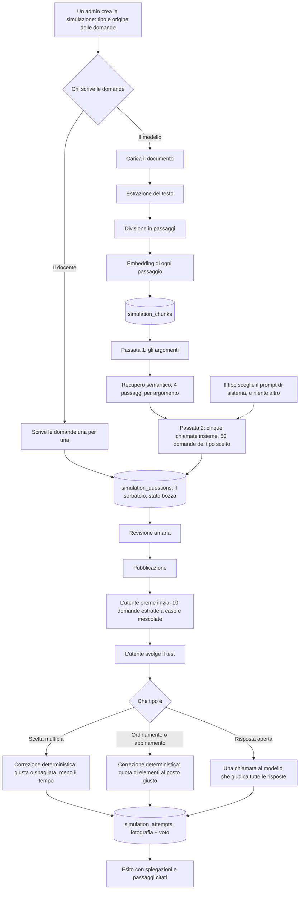

# Il simulatore tecnico, come funziona

Il gemello scritto del roleplay: là si misura come l'operatore gestisce una
persona, qui se conosce la procedura. Chi amministra carica un documento
aziendale, un modello di ragionamento ne ricava **cinquanta domande**, un umano
le rilegge, e gli utenti dell'organizzazione svolgono un test di **dieci
domande estratte a caso** da quelle cinquanta, una alla volta, ottenendo un
voto in decimi, con la spiegazione di ogni risposta e il passaggio del
documento da cui la domanda nasce. Oppure il documento non c'è e le domande le
scrive il docente: cambia chi riempie il serbatoio, non il test.

**Le due cifre dicono cose diverse.** Cinquanta è il serbatoio, cioè tutto
quello che si può chiedere su quel documento: si scrive una volta, si rilegge
una volta, e il server lo pretende pieno per pubblicare. Dieci è il test, ed è
il numero che chi risponde vede scritto ovunque. L'estrazione avviene quando si
preme "inizia", quindi due prove dello stesso test non sono la stessa fila di
domande, e rifarlo smette di essere un esercizio di memoria sull'ordine delle
lettere.

**Le domande arrivano da due strade**, scelte alla creazione e mai più
cambiate:

| | Generate da un documento | Scritte a mano |
| --- | --- | --- |
| Cosa si carica | Il documento aziendale | Niente |
| Chi scrive le domande | Il modello, in due passate | Il docente, una per una |
| Quante ne servono per pubblicare | 50 | 10 |
| Quanti elementi ha una domanda | Il numero fisso del tipo | Un intervallo, deciso domanda per domanda |
| Cosa vede chi sbaglia | La spiegazione e il passaggio del documento citato | La spiegazione scritta dal docente |

Il serbatoio pieno alla generazione non costa niente, cinquanta domande sono la
stessa attesa di dieci; a mano sono cinquanta domande scritte una per una, e il
minimo diventa quanto serve a comporre un tentativo. Chi ne scrive dieci fa un
test in cui tutti vedono le stesse dieci domande, chi ne scrive trenta fa un
test in cui due prove non si somigliano: il tetto resta cinquanta in entrambi i
casi.

**Da qui in poi le due strade si svolgono allo stesso modo.** Chi fa il test
riceve dieci domande estratte a caso, corrette allo stesso modo, con lo stesso
voto in decimi. Quello che cambia è che **si vede da dove vengono le domande**:
`source` viaggia fino all'ultima schermata, e ovunque compaia una simulazione o
un tentativo compare
[SimulationSourceBadge](../frontend/src/components/SimulationSourceBadge.tsx)
accanto alla targhetta del tipo. Un 4 preso su domande scritte da un modello e
un 4 preso su domande scritte dal proprio responsabile non si contestano allo
stesso modo, e chi legge il voto deve poterlo sapere senza aprire niente.

Le due targhette non si confondono, e nessuna delle due difese è il colore.
Quella del tipo è una pastiglia colorata con la sua parola scritta; quella
dell'origine è **solo un'icona**, neutra, con il tooltip che la nomina. Due
ragioni. La prima: violetto, ciano, verde e ambra dicono già tipo e stato, e
una terza coppia di tinte in fila renderebbe la riga illeggibile invece che
più informativa. La seconda: le due targhette stanno sempre appaiate, e due
pastiglie scritte una di fianco all'altra allungano ogni riga per dire una
cosa che l'icona dice da sola. Una scintilla dove ha scritto il modello, una
persona dove ha scritto qualcuno.

**Il tooltip delle due targhette è il nome e basta**, "Scelta multipla" e
"Manuale", le stesse parole che stanno nel markup per chi legge con uno screen
reader. Prima spiegava anche come si risponde, come si prende il voto e da
quale documento venivano le domande: sono le regole del test, e si leggono
prima di cominciare o nella scheda della simulazione, non passando il mouse su
una riga di tabella per sapere cosa dice quel disegnino.

Quella del tipo il tooltip ce l'ha **solo dove è ridotta all'icona**, cioè
nelle tabelle: dove la pastiglia porta la sua parola scritta, il tooltip
direbbe la stessa parola un centimetro più in alto. Quella dell'origine invece
ce l'ha sempre, perché la sua parola non si vede mai.

Il tooltip è quello dell'app ([Tooltip](../frontend/src/components/Tooltip.tsx)),
come ovunque nell'app e mai l'attributo `title` del browser: qui è l'unico modo
di leggere la targhetta, quindi non può comparire dopo un secondo né farsi
tagliare dal bordo di una tabella. E non scrive la parola
sola, scrive la frase intera ("domande generate da un modello che ha letto il
documento aziendale, e rilette da una persona prima della pubblicazione"), che
è quello che serve davvero sapere. La parola resta nel markup, nascosta, per
chi legge con uno screen reader, e resta anche nelle ricerche delle tabelle:
si può cercare "manuale" anche se sullo schermo quella parola non c'è.

**Un test è anche di uno di quattro tipi**, scelto insieme alla strada e
nemmeno lui più cambiato:

| | Scelta multipla | Risposta aperta | Ordinamento | Abbinamento |
| --- | --- | --- | --- | --- |
| Come si risponde | Una fra le alternative | Scrivendo qualche riga | Rimettendo dei passi in fila | Accoppiando due colonne |
| Tempo | 5 minuti e 30 secondi a domanda | Nessuno | Nessuno | Nessuno |
| Cosa decide i punti | Se è giusta e quanto in fretta è arrivata | Quanto la risposta è completa | Quanti passi sono al posto giusto | Quante coppie sono indovinate |
| Chi corregge | Il codice, confrontando due numeri | Un modello, alla consegna | Il codice, confrontando due liste | Il codice, coppia per coppia |
| Quando si sa il voto | Subito | Dopo qualche secondo di attesa | Subito | Subito |
| Quanti elementi ha una domanda | 4 alternative, o da 2 a 6 a mano | Una traccia | 5 passi, o da 3 a 6 a mano | 5 coppie, o da 3 a 6 a mano |

I due tipi in fondo sono arrivati dopo, e verificano quello che una crocetta
non raggiunge. **L'ordinamento chiede la sequenza**, che è dove le procedure si
sbagliano davvero: tutti sanno che il cliente va identificato, pochi sanno che
va fatto prima di aprire la pratica, e una domanda a crocette su questo o
regala la risposta o diventa un indovinello. **L'abbinamento chiede le
corrispondenze**, cioè le tabelle dei documenti aziendali, casistica e ufficio
competente, importo e autorizzazione: a crocette diventano quattro domande
dove ne basta una.

Le quattro scale finiscono nello stesso posto, da 0 a 1 per domanda e un voto
in decimi, quindi un test di una forma e uno di un'altra si leggono nello
stesso riepilogo e nella stessa dashboard. Proprio per questo **ogni posto in
cui compare un test dice di che tipo è**, con
[SimulationKindBadge](../frontend/src/components/SimulationKindBadge.tsx): un 7
preso a crocette col cronometro che scorre e un 7 preso scrivendo dieci
risposte non sono la stessa notizia. È il gemello del badge che distingue una chiamata da
una chat.

I colori sono due e non quattro, e dividono i tipi in due famiglie: violetto
dove si sceglie fra cose già scritte, ciano dove si compone una risposta,
come sul badge del canale di una conversazione. Un terzo e un quarto colore in
fila su una riga di tabella sarebbero un arcobaleno da decifrare; a distinguere
i tipi dentro la famiglia basta il disegno, che è la cosa che si guarda per
seconda: il pallino da selezionare, la matita, le righe da riordinare, le due
colonne unite da un ponte.

**Solo la scelta multipla ha il cronometro.** Scegliere fra quattro righe già
scritte è una cosa che si fa a tempo, scrivere una procedura o disporre sei
passi no, e un tempo tarato male renderebbe un tipo ingiocabile invece che
difficile. Negli
altri tre il punto si guadagna a pezzi, e toglierne anche col tempo vorrebbe
dire due scale che si moltiplicano su una domanda dove nessuno saprebbe più
dire da dove viene il voto.

Questo file racconta il procedimento per intero, nell'ordine in cui accade.

## I file coinvolti

| File | Cosa fa |
| --- | --- |
| [backend/document_text.py](../backend/document_text.py) | Estrae il testo da PDF, DOCX, TXT, Markdown e lo normalizza |
| [backend/simulation_rag.py](../backend/simulation_rag.py) | Spezza il testo in passaggi, calcola le somiglianze, campiona |
| [backend/openai_service.py](../backend/openai_service.py) | Le chiamate a OpenAI: embedding e risposte JSON dal modello di ragionamento |
| [backend/simulation_questions.py](../backend/simulation_questions.py) | I prompt e le due passate che producono il serbatoio, dell'uno o dell'altro tipo |
| [backend/simulation_review.py](../backend/simulation_review.py) | Il controllo del serbatoio che non costa: duplicati semantici, le due regole sulle alternative, l'impronta con cui l'esito invecchia |
| [backend/simulation_grounding.py](../backend/simulation_grounding.py) | La passata del modello: la risposta è sostenuta dai passaggi citati, e le alternative sono errori plausibili |
| [backend/simulation_open_answers.py](../backend/simulation_open_answers.py) | Il giudizio sulle risposte scritte: il prompt e la chiamata sola |
| [backend/simulation_scoring.py](../backend/simulation_scoring.py) | Quanto vale una risposta: la scala che scende col tempo e quella del giudizio |
| [backend/routers/admin_simulations.py](../backend/routers/admin_simulations.py) | Il ciclo di vita lato amministrazione: caricamento, generazione, revisione, pubblicazione |
| [backend/routers/simulations.py](../backend/routers/simulations.py) | Lo svolgimento e le due correzioni |
| [backend/exports.py](../backend/exports.py) | Il referto in PDF di un tentativo consegnato |
| [backend/pdf_kit.py](../backend/pdf_kit.py) | Come è vestito quel referto: colori, caratteri e riquadri, gli stessi della valutazione ([valutazione.md](valutazione.md#come-è-fatto-il-foglio)) |
| [backend/models.py:653-848](../backend/models.py#L653-L848) | Le quattro tabelle |
| [frontend/src/services/simulations.ts](../frontend/src/services/simulations.ts) | I tipi e le chiamate HTTP |
| [frontend/src/hooks/useSimulations.ts](../frontend/src/hooks/useSimulations.ts) | Gli hook TanStack Query |
| [frontend/src/components/SimulationsPage.tsx](../frontend/src/components/SimulationsPage.tsx) | L'elenco dei test da svolgere: la ricerca, i filtri e le schede |
| [frontend/src/components/simulationFilters.ts](../frontend/src/components/simulationFilters.ts) | Quali test restano dopo la ricerca e il filtro, su una lista già in memoria |
| [frontend/src/components/SimulationRunner.tsx](../frontend/src/components/SimulationRunner.tsx) | Le tre schermate dello svolgimento: regole, domande, esito |
| [frontend/src/components/SimulationProgress.tsx](../frontend/src/components/SimulationProgress.tsx) | A che punto è il test: un trattino per domanda, sopra il riquadro |
| [frontend/src/hooks/useLeaveConfirmation.ts](../frontend/src/hooks/useLeaveConfirmation.ts) | La conferma prima di chiudere o ricaricare, finché il test è a metà |
| [frontend/src/components/SimulationQuestionStep.tsx](../frontend/src/components/SimulationQuestionStep.tsx) | Una domanda a scelta multipla e il suo cronometro |
| [frontend/src/components/SimulationOpenQuestionStep.tsx](../frontend/src/components/SimulationOpenQuestionStep.tsx) | Una domanda aperta e la casella in cui si scrive |
| [frontend/src/components/SimulationOrderingStep.tsx](../frontend/src/components/SimulationOrderingStep.tsx) | Una domanda di ordinamento: i passi mescolati e le frecce per disporli |
| [frontend/src/components/SimulationMatchingStep.tsx](../frontend/src/components/SimulationMatchingStep.tsx) | Una domanda di abbinamento: le due colonne e una tendina per riga |
| [frontend/src/components/MoveControls.tsx](../frontend/src/components/MoveControls.tsx) | Le due frecce che spostano un elemento, condivise fra l'editor e lo svolgimento |
| [frontend/src/components/listOrder.ts](../frontend/src/components/listOrder.ts) | Il calcolo dietro le frecce: lo stesso elenco con un elemento in un'altra posizione |
| [frontend/src/components/SimulationWrittenAnswer.tsx](../frontend/src/components/SimulationWrittenAnswer.tsx) | Nell'esito: la risposta scritta, la traccia attesa, la correzione |
| [frontend/src/components/SimulationItemsAnswer.tsx](../frontend/src/components/SimulationItemsAnswer.tsx) | Nell'esito: la sequenza disposta e le coppie formate, con accanto la chiave |
| [frontend/src/components/SimulationKindBadge.tsx](../frontend/src/components/SimulationKindBadge.tsx) | La targhetta del tipo, l'unico modo in cui si disegna, ovunque compaia un test |
| [frontend/src/components/SimulationSourceBadge.tsx](../frontend/src/components/SimulationSourceBadge.tsx) | La targhetta dell'origine, che le sta sempre accanto: domande di un modello o di una persona |
| [frontend/src/components/SimulationQuestionEditor.tsx](../frontend/src/components/SimulationQuestionEditor.tsx) | Una domanda in scrittura: il testo, la chiave del suo tipo, la spiegazione, e le segnalazioni del controllo sopra il testo |
| [frontend/src/components/SimulationReviewPanel.tsx](../frontend/src/components/SimulationReviewPanel.tsx) | L'esito del controllo in testa alle domande, dalla segnalazione più grave, con il salto alla domanda di cui parla |
| [frontend/src/components/SimulationSettingsPanel.tsx](../frontend/src/components/SimulationSettingsPanel.tsx) | I dati del test accanto alle domande: titolo, descrizione e la sostituzione del documento |
| [frontend/src/components/SimulationAdminPage.tsx](../frontend/src/components/SimulationAdminPage.tsx) | La tabella di gestione: ricerca, filtri, e le tre finestre che apre |
| [frontend/src/components/SimulationsFilters.tsx](../frontend/src/components/SimulationsFilters.tsx) | Le due tendine sopra la tabella di gestione: stato e tipo di test |
| [frontend/src/components/SimulationEditorModal.tsx](../frontend/src/components/SimulationEditorModal.tsx) | Il pannello dove una simulazione diventa un test: domande, risultati, dati, pubblicazione |
| [frontend/src/hooks/useCloseGuard.ts](../frontend/src/hooks/useCloseGuard.ts) | La conferma fra un gesto di chiusura e una finestra piena di lavoro non salvato, condivisa con il resto dell'app |
| [frontend/src/components/SimulationStepsEditor.tsx](../frontend/src/components/SimulationStepsEditor.tsx) | La chiave di un ordinamento: i passi nella sequenza corretta |
| [frontend/src/components/SimulationPairsEditor.tsx](../frontend/src/components/SimulationPairsEditor.tsx) | La chiave di un abbinamento: le coppie già accoppiate |
| [frontend/src/components/simulationFormat.ts](../frontend/src/components/simulationFormat.ts) | Come si scrivono voti, punti e tempi, i nomi dei tipi, e la copia della scala che si legge durante la domanda |
| [frontend/src/components/PdfDownloadButton.tsx](../frontend/src/components/PdfDownloadButton.tsx) | Il pulsante che scarica un referto in PDF, condiviso con le valutazioni |

## Il flusso in un colpo d'occhio



Sulla strada a mano le fasi 1 e 2 non esistono: si crea la simulazione, si
scrivono le domande nel pannello della fase 3, si pubblica. Da lì in poi il
diagramma è lo stesso.

Le fasi 1, 2 e 3 sono tre chiamate HTTP distinte e non una sola. Il motivo è in
[admin_simulations.py:12-25](../backend/routers/admin_simulations.py#L12-L25): il
caricamento dura secondi, la generazione può durare minuti, e se fossero
un'unica richiesta un modello lento riporterebbe indietro un errore dopo tre
minuti lasciando chi la sta creando senza niente, documento compreso.

---

## Chi scrive i test

Entrambi i ruoli di amministrazione, come per i percorsi di training: un
organization admin è chi insegna davvero ai propri studenti, e far passare dal
super admin ogni procedura aziendale da trasformare in test metterebbe in mezzo
un estraneo al mestiere che si sta insegnando.

A confinarlo è il tenant, e la regola è quella di sempre, in un punto solo:

| Cosa | Super admin | Organization admin |
| --- | --- | --- |
| L'elenco della gestione | Tutte, di tutti i tenant, bozze comprese | Le proprie, bozze comprese |
| Una simulazione di un altro tenant | La apre | 404, come se non ci fosse |
| L'organizzazione di una nuova | La sceglie, ed è obbligatoria | Non la nomina: quella che chiede viene ignorata, e il server ci mette la sua |
| I risultati per test | Tutti i tentativi | Quelli delle persone della sua organizzazione |

Il filtro delle prime tre righe è la stessa
[visible_query](../backend/routers/simulations.py) che serve chi i test li
svolge, chiesta con le bozze incluse: non c'è un secondo posto in cui la
decisione venga presa, quindi non c'è un secondo posto in cui possa essere
presa diversamente. L'ultima riga invece guarda **l'organizzazione di chi ha
svolto il tentativo** e non quella della simulazione, come ovunque si legga
una prova (vedi [organizzazioni-e-ruoli.md](organizzazioni-e-ruoli.md)): le due
coincidono sempre, tranne dopo che il super admin ha spostato qualcuno di
tenant, ed è esattamente il momento in cui la differenza deve valere.

La pagina è la stessa per tutti e due, e la sola cosa che cambia è
l'organizzazione: chi ne amministra una sola non ne vede la colonna in tabella
e non se la sceglie creando un test, perché sarebbe la stessa parola su ogni
riga e una tendina con dentro una voce sola.

---

## Fase 1, il caricamento del documento

`POST /api/admin/simulations` (multipart: `organization_id`, `title`,
`description`, `kind`, `source`, `file`), riservato a chi amministra.

`organization_id` lo manda solo il super admin: per un organization admin il
campo non parte, e a metterci la propria organizzazione è il server (vedi
[chi scrive i test](#chi-scrive-i-test)).

### 1.1 Controlli in ingresso

Nell'ordine, in `create_simulation`:

1. il titolo non può essere vuoto;
2. l'organizzazione deve esistere, ed è quella a cui la simulazione
   apparterrà per sempre (il tenant non si cambia più, vedi
   `update_simulation`);
3. `kind` deve essere uno dei quattro (`multiple`, `open`, `ordering`,
   `matching`). Come il tenant, non si cambia più: le domande nascono già con
   delle alternative, con la traccia della risposta attesa, con dei passi in
   sequenza o con delle coppie, e cambiare il tipo dopo vorrebbe dire buttarle
   senza dirlo. Chi sceglie male ne crea una nuova;
4. `source` deve essere `ai` o `manual`, e nemmeno lui si cambia più. Da qui
   in poi i due percorsi si dividono: **con `manual` il file non ci deve
   essere** (400 se arriva, perché un test scritto a mano non ha un documento
   da cui ricavare niente), **con `ai` il file ci deve essere** (400 se
   manca);
5. sul file, quando c'è: l'estensione deve essere `.pdf`, `.docx`, `.txt`,
   `.md` o `.markdown`. Si guarda l'estensione e non il content type
   dichiarato dal browser, che su Windows arriva vuoto o sbagliato più spesso
   di quanto si creda;
6. il file non può essere vuoto né superare 10 MB (`MAX_DOCUMENT_BYTES`). Si
   legge un byte in più del limite proprio per accorgersi del superamento
   senza caricare in memoria un file enorme;
7. e un secondo tetto, sul file **aperto** e non sul file. Quello sopra misura
   la cosa sbagliata: un `.docx` è un archivio compresso, quindi dieci MB di
   file possono diventare centinaia di volte tanto una volta srotolati, e un
   PDF di poche centinaia di kB può dichiarare decine di migliaia di pagine. In
   tutti e due i casi il file passa il primo controllo e a cadere è il processo
   che prova a leggerlo. Il massimo è 200 MB una volta aperti
   (`MAX_UNCOMPRESSED_BYTES`, che lo zip dichiara nel proprio indice, quindi si
   legge di lì prima di aprire davvero) e 500 pagine (`MAX_PDF_PAGES`). Sono
   valori larghi di proposito: quello che fermano non è un documento lungo, è
   un documento costruito apposta.

I punti 5 e 6 li pone anche il browser, nel momento in cui il file si sceglie
(`documentRejection` in
[services/simulations.ts](../frontend/src/services/simulations.ts), che serve
sia alla creazione sia alla sostituzione del documento): senza, un file da
trenta megabyte occuperebbe la linea per tutto il tempo di un caricamento
destinato a tornare indietro come errore. Le parole del rifiuto sono le stesse
del server, alla lettera, perché lo stesso rifiuto detto in due modi sembrano
due problemi. A controllare per davvero resta comunque il server, l'unico che
vede il contenuto del file.

Poi la riga `TechnicalSimulation` nasce in stato `draft`, e solo dopo si
indicizza il documento. Su una simulazione a mano `document_name` e
`document_text` restano vuoti e non c'è nessun passaggio indicizzato: non è un
caricamento rimandato, è un test che si regge sulle domande e basta. Per la
stessa ragione **le due operazioni che presuppongono un documento rispondono
409** su una simulazione a mano: `POST .../generate` e `POST .../document`.

### 1.2 Estrazione del testo

[document_text.extract_text](../backend/document_text.py#L91-L108) sceglie il
lettore in base all'estensione:

- **PDF**: `pypdf`, con una riga vuota fra una pagina e l'altra, altrimenti
  l'ultima frase di una pagina e il titolo della successiva finiscono nello
  stesso paragrafo e quindi nello stesso passaggio;
- **DOCX**: `python-docx`, che legge i paragrafi e **anche le tabelle**, rese
  come righe `cella | cella | cella`. Le tabelle non stanno fra i paragrafi e
  sparirebbero in silenzio, che in una procedura è proprio dove stanno i
  passaggi operativi;
- **testo semplice**: UTF-8 con `latin-1` come rete di sicurezza, così da qui
  non esce mai un errore di decodifica.

Poi [_normalize](../backend/document_text.py#L39-L49) riduce tutto a una forma
sola: ritorni carrello di Windows, spazi e tabulazioni ripetuti (compreso lo
spazio unificatore che PDF e Word seminano ovunque e che a occhio è
indistinguibile da uno spazio normale), righe vuote multiple ridotte a una.

Il file originale non viene conservato da nessuna parte. Dopo questo passaggio
esiste solo la stringa, salvata in `TechnicalSimulation.document_text`.

Se il testo esce vuoto la richiesta fallisce con 400 e un messaggio esplicito:
è il caso del PDF fatto di pagine scansionate, che non contiene testo ma
immagini di testo, e nessun ritentativo lo cambia.

### 1.3 Divisione in passaggi

[split_into_chunks](../backend/simulation_rag.py#L43-L83) taglia il testo sui
confini dei paragrafi finché può, perché il paragrafo è l'unità che l'autore
del documento ha già deciso. Le misure:

| Costante | Valore | Perché |
| --- | --- | --- |
| `CHUNK_CHARS` | 1200 | Circa due paragrafi, su una procedura è un passo intero: abbastanza perché il passaggio si spieghi da solo, abbastanza poco perché il suo vettore parli di un argomento e non di cinque |
| `CHUNK_OVERLAP_CHARS` | 200 | La coda del passaggio chiuso apre il successivo, così una frase spezzata a metà si ritrova sempre con almeno uno dei due |
| `MIN_CHUNK_CHARS` | 80 | Sotto questa soglia il frammento è la coda di un titolo o una riga rimasta sola: non porta significato ma porta un vettore, e i vettori dei frammenti brevi somigliano un po' a tutto |

Un paragrafo che da solo supera i 1200 caratteri viene tagliato al suo interno
(succede con gli elenchi lunghi e con i PDF senza righe vuote). Se un documento
è così corto che tutti i suoi pezzi stanno sotto la soglia minima, si tiene il
testo intero come unico passaggio: meglio un passaggio breve che nessuno.

### 1.4 Indicizzazione

[embed_texts](../backend/openai_service.py#L211-L238) manda **tutti i passaggi in
una sola chiamata** al modello di embedding (`OPENAI_EMBEDDING_MODEL`), perché
l'API accetta più input insieme e spezzarli moltiplicherebbe per cento la
latenza senza cambiare il costo. I vettori tornano riordinati per indice,
perché l'API non promette di rispondere in ordine.

Qui **non c'è modello di riserva**, al contrario delle risposte JSON: i vettori
di due modelli diversi non si possono confrontare fra loro, e un documento con
metà passaggi indicizzati da uno e metà dall'altro darebbe ricerche
silenziosamente sbagliate. Se l'embedding fallisce, la richiesta risponde 502 e
si ritenta.

Anche questa chiamata ha il suo tetto per persona, venti all'ora
([llm_limits.py](../backend/llm_limits.py)), e viene consumato **dopo** la
lettura del file: un documento illeggibile è un errore di chi carica e non deve
consumare il tetto di una chiamata che non è mai partita. È la più economica
delle chiamate al modello, ma è l'unica il cui prezzo lo decide chi carica,
perché cresce con il documento.

Ogni passaggio diventa una riga `SimulationChunk` con:

- `ordinal`, la posizione nel documento a partire da 1, che è il numero con cui
  le domande citeranno il passaggio;
- `content`, il testo;
- `embedding`, la lista di float salvata come JSON/JSONB.

L'embedding sta in una colonna JSON e non in un tipo vettoriale, e la
somiglianza si calcola in Python: pgvector andrebbe installato sul database, e
questa è un'applicazione che dopo il primo deploy non si tocca più. Il conto è
un prodotto scalare per passaggio, quindi qualche centinaio di passaggi si
confrontano in millisecondi, e la lettura dei vettori di UNA simulazione è una
query indicizzata su `simulation_id`. Il ragionamento per esteso è in
[simulation_rag.py:9-17](../backend/simulation_rag.py#L9-L17).

### 1.5 Ricaricare il documento

`POST /api/admin/simulations/{id}/document` rifà esattamente questi passi. I
passaggi di prima vengono cancellati, **le domande no**: le domande sono il
test, e un test non si azzera perché è stata caricata una versione aggiornata
della procedura. Restano lì con le loro citazioni che ora puntano ai passaggi
nuovi, ed è chi amministra a decidere se rigenerarle.

Nell'interfaccia si arriva da **Dati del test**, la terza linguetta del
pannello di revisione (§ [I dati del test](#i-dati-del-test)), e c'è solo sui
test generati: su una simulazione scritta a mano un documento non è mai
esistito, e la chiamata risponde 409. Prima di partire chiede conferma, dicendo
quale documento prende il posto di quale e che le domande restano quelle di
adesso.

---

## Fase 2, la generazione del serbatoio

`POST /api/admin/simulations/{id}/generate`. È l'unica chiamata dell'app che
può prendersi minuti. Il frontend la lancia senza ritentativi automatici
([useGenerateQuestions](../frontend/src/hooks/useSimulations.ts)), perché
ripartire da capo da solo raddoppierebbe l'attesa proprio quando è già lunga.

Il router legge i passaggi già indicizzati (409 se non ce ne sono) e passa
testi e vettori a
[generate_questions](../backend/simulation_questions.py). Dentro succedono tre
cose: gli argomenti, il recupero, e le cinque chiamate che scrivono le
cinquanta domande.

### 2.1 Passata uno, gli argomenti

Il documento intero spesso non entra nel contesto, e anche quando entra il
modello scrive le domande su quello che ha letto per ultimo. Quindi:

[sample_evenly](../backend/simulation_rag.py#L116-L136) prende passaggi a
**distanza regolare** finché stanno in `TOPICS_BUDGET_CHARS` (30.000
caratteri). Prendere le prime pagine darebbe cinquanta domande sull'indice e
sulla premessa; prendendoli a distanza regolare gli argomenti restano
distribuiti come nel documento.

Su questo campione si chiedono al modello **fino a `MAX_TOPICS` argomenti
verificabili, che sono 25**, con criteri espliciti nel prompt
([_topics_prompt](../backend/simulation_questions.py)). Il numero è un tetto e
non una quota, e il prompt lo dice: un documento aziendale non contiene
cinquanta cose distinte su cui interrogare qualcuno, e chiederne cinquanta
vorrebbe dire farsi dare venti argomenti veri e trenta ripetizioni con
un'altra intestazione. Su una circolare di tre pagine il modello ne trova sei,
e va bene: le cinquanta domande si distribuiscono su quelli che ha trovato
davvero, quindi un documento povero dà più domande per argomento e uno ricco
meno.

**Questa passata non sa di che tipo sarà il test**, ed è voluto: un argomento su cui
vale la pena interrogare qualcuno è lo stesso sia che la risposta si scelga
fra quattro sia che si scriva, e nominare la forma sposterebbe gli argomenti
verso quelli che le si prestano invece che verso quelli che contano. Un argomento va
bene se il documento dice qualcosa di preciso a riguardo, se sbagliarlo nel
lavoro reale avrebbe una conseguenza, se riguarda procedure, condizioni,
limiti, tempi, responsabilità o eccezioni. Non va bene se riguarda
l'impaginazione, la storia delle revisioni o chi ha scritto il documento, se la
risposta è un'opinione, o se ripete un argomento già indicato.

La risposta è JSON: `{"topics": ["", ""]}`.

### 2.2 Il recupero semantico

1. gli argomenti vengono trasformati in vettori con la stessa
   `embed_texts`, quindi vivono nello stesso spazio dei passaggi;
2. per ogni argomento, [most_similar](../backend/simulation_rag.py#L98-L113)
   calcola la similarità del coseno contro tutti i passaggi e tiene i
   `CHUNKS_PER_TOPIC` migliori, che sono **4**: tre o quattro coprono una
   procedura per intero, comprese le eccezioni, che sono spesso il paragrafo
   dopo quello che risponde alla domanda;
3. si costruisce una sezione per argomento, con i passaggi preceduti dal loro
   ordinale fra parentesi quadre (`[7] testo del passaggio...`), ordinati come
   nel documento.

Gli ordinali citati finiscono in un insieme `cited`, che servirà a validare le
citazioni della passata successiva.

### 2.3 Passata due, le cinquanta domande

**Cinque chiamate da dieci domande, non una da cinquanta e non cinquanta da
una.** Il tetto di token di una risposta copre una decina di domande complete
di spiegazione, e oltre quello torna indietro un JSON troncato a metà della
trentesima. All'estremo opposto, una chiamata per domanda produrrebbe cinquanta
esaminatori indipendenti che chiedono tre volte la stessa cosa.

Le cinque partono **insieme** (`asyncio.gather`) e non una dopo l'altra: la
generazione è già la chiamata più lenta dell'app, e metterle in fila la
moltiplicherebbe per cinque. Il prezzo è che ognuna vede solo il proprio gruppo
di argomenti, quindi la varietà la garantiscono gli argomenti distinti e le
regole del prompt, non la vista sulle domande delle altre. **Una chiamata che
va storta si porta via il proprio gruppo e non le altre quaranta domande**: si
scrivono quelle che sono arrivate, la simulazione resta in bozza, e il super
admin decide se rigenerare o completare a mano. Solo se falliscono tutte
l'errore risale, e il router lo traduce come quando la chiamata era una sola.

#### Come le domande si spartiscono

[_plan_batches](../backend/simulation_questions.py) divide le cinquanta domande
in parti uguali fra gli argomenti trovati, con il resto sui primi: venticinque
argomenti ne prendono due ciascuno, sei ne prendono otto o nove ciascuno. Poi
raggruppa gli argomenti in chiamate da al massimo `QUESTIONS_PER_CALL` (10)
domande, e **un argomento resta tutto nella stessa chiamata finché ci sta**,
anche a costo di una chiamata in più con qualche domanda in meno: è proprio fra
le domande di uno stesso argomento che la ripetizione nasce, e scriverle
insieme è l'unico modo che il modello ha di vedere che sta per chiedere due
volte la stessa cosa. Si spezza solo l'argomento che da solo supera il tetto,
cioè quando il documento ne ha dati pochissimi.

Nel messaggio all'utente ogni argomento porta scritto quante domande scriverne:

```
## DOMANDE DA SCRIVERE IN TUTTO: 10

### ARGOMENTO: condizioni per sbloccare una carta bloccata
Domande da scrivere su questo argomento: 5
[7] testo del passaggio...
```

#### Le regole che rendono diverse le domande gemelle

Sono in [_variety_rules](../backend/simulation_questions.py), condivise dai due
prompt, e sono la ragione per cui il serbatoio non è la stessa domanda scritta
cinquanta volte. A un modello a cui si chiedono cinque domande su un argomento,
senza dirgli altro, esce la stessa domanda con cinque giri di parole. Quindi il
prompt dice da quale lato guardare l'argomento ogni volta (la condizione, il
limite o il tempo, l'eccezione, chi autorizza, il caso concreto, cosa succede
se una condizione non è rispettata), che **due domande a cui si risponde con la
stessa frase sono la stessa domanda** e riformulare non basta, e di cambiare
anche il modo di porla, fra la regola chiesta di petto e la situazione da cui
partire.

L'ultima regola è la più importante e vale come limite a tutte le altre: se i
passaggi non bastano per tutte le domande chieste, si scrivono partendo da
dettagli diversi degli stessi passaggi, **mai inventando** soglie o regole che
il documento non contiene. Due domande simili sono un difetto piccolo, una
domanda con una risposta inventata è un errore che qualcuno porterà al lavoro.

È qui che il tipo del test entra in scena, e cambia solo il prompt di sistema
(`_SYSTEM_PROMPTS`, una voce per tipo): le stesse chiamate, gli stessi
argomenti con i loro passaggi, un'altra cosa da scrivere.

#### A scelta multipla

Il prompt ([_questions_prompt](../backend/simulation_questions.py))
impone quattro alternative (A, B, C, D) di cui una sola corretta, e regole
precise:

- **sulle domande**: la risposta corretta deve stare nei passaggi forniti, mai
  inventare soglie o regole; la domanda deve riguardare il lavoro
  dell'operatore (cosa fare, quando, a quali condizioni); deve reggersi da sola
  senza rimandare al documento;
- **sulle alternative**: le sbagliate devono essere errori realistici e
  plausibili, non assurdità che nessuno sceglierebbe; di lunghezza simile, così
  la giusta non si riconosce perché è la più lunga; niente "tutte le
  precedenti"; la posizione della corretta deve variare fra una domanda e
  l'altra;
- **sulla spiegazione**: due o tre frasi che spiegano perché la corretta è
  corretta e perché un errore tipico è un errore. La legge chi ha appena
  sbagliato, quindi deve insegnare la procedura, non ripetere qual era la
  risposta.

Il JSON richiesto è
`{"questions": [{"text", "options", "correct_option", "explanation", "source_chunks"}]}`,
con `correct_option` contato da 0 e `source_chunks` che elenca gli ordinali fra
parentesi quadre.

#### A risposta aperta

Il prompt ([_open_questions_prompt](../backend/simulation_questions.py)) chiede
per ogni domanda la **traccia della risposta attesa**, che è la
parte che conta davvero: sarà l'unica cosa che il giudice avrà davanti quando
dovrà dire quanto vale quello che l'operatore ha scritto. Le regole in più
rispetto all'altro prompt:

- **sulle domande**: una cosa sola e delimitata, a cui si risponde in tre o
  quattro righe. "Descrivi la procedura di rimborso" è troppo larga, "quali
  condizioni devono valere perché un rimborso possa essere autorizzato allo
  sportello" va bene. E una risposta verificabile, non un parere: senza questo
  il modello scrive domande da tema, che nessuno può correggere;
- **sulla traccia**: i punti che devono esserci, elencati in modo che chi
  corregge possa dire quale manca. Non è la risposta perfetta da copiare, è il
  metro con cui si giudica, e una traccia vaga non è una chiave ma un'opinione,
  che produce voti indifendibili.

#### Di ordinamento

Il prompt ([_ordering_questions_prompt](../backend/simulation_questions.py))
chiede cinque passi **già nell'ordine corretto**: la chiave è l'ordine stesso,
e la mescolata avverrà molto più tardi, quando la domanda viene consegnata a
chi risponde. Le regole che tengono in piedi il tipo sono due, e sono
entrambe modi di dire "questa domanda deve avere una risposta sola":

- **l'ordine deve essere imposto dal documento**, non dal buon senso. Se per
  un argomento il documento non descrive nessuna sequenza, il prompt dice di
  cambiare aspetto invece di inventarne una: due passi che si possono
  invertire senza sbagliare sono una domanda con due risposte giuste;
- **nessun passo deve tradire la propria posizione**. Niente "per prima cosa",
  niente "poi", niente "dopo aver verificato il documento" dentro un passo: un
  passo che si rimette in fila da solo non verifica niente, e a scriverlo si
  fa senza accorgersene.

Il JSON richiesto è
`{"questions": [{"text", "ordered_steps", "explanation", "source_chunks"}]}`.

#### Di abbinamento

Il prompt ([_matching_questions_prompt](../backend/simulation_questions.py))
chiede cinque coppie, la voce a sinistra e il suo abbinato a destra. La regola
che regge il tipo è che **ogni voce di sinistra abbia una sola destinazione
giusta**, e che nessun elemento di destra valga per due voci: se due casi
hanno lo stesso trattamento, il prompt dice di tenerne uno solo e cercare
un'altra coppia. Senza questo si ottiene una domanda in cui chi conosce la
procedura sbaglia lo stesso, che è il modo più veloce di rendere un tipo
odiato.

Il prompt indica anche dove guardare: le **tabelle** del documento sono il
materiale migliore per questo tipo di domanda, ed è per questo che il lettore
DOCX le rende come righe `cella | cella | cella` invece di lasciarle cadere
(vedi 1.2). E vieta di ripetere nella voce di sinistra una parola che compare
solo nel suo abbinato, che è il modo in cui un abbinamento si risolve
riconoscendo una parola invece di conoscendo la procedura.

Il JSON richiesto è
`{"questions": [{"text", "pairs": [{"left", "right"}], "explanation", "source_chunks"}]}`.

Il budget è di 8192 token di completamento **per chiamata** in tutti i casi:
dieci domande con quattro alternative e una spiegazione, oppure dieci domande
con una traccia e una spiegazione, più i token che il ragionamento spende prima
di scriverne una. Con un tetto stretto tornano indietro come JSON troncato.

### 2.4 La pulizia della risposta

[_normalize_questions](../backend/simulation_questions.py) scarta una
domanda per volta invece di far cadere tutto, e cosa la renda scartabile
dipende dal tipo:

- niente testo: si scarta in tutti i casi;
- a scelta multipla, un numero di alternative diverso da quattro, o un
  `correct_option` non intero o fuori intervallo: si scarta;
- a risposta aperta, una `expected_answer` vuota: si scarta. Non è una domanda
  a cui manca un pezzo, è una domanda che nessuno potrebbe correggere;
- di ordinamento, un numero di passi diverso da cinque, oppure **due passi
  uguali**: si scarta. Due passi identici sono due risposte giuste, e chi
  risponde non avrebbe modo di sapere quale delle due il test si aspetta;
- di abbinamento, un numero di coppie diverso da cinque, una coppia con un
  lato vuoto, oppure due voci uguali **dentro una colonna**: si scarta, per la
  stessa ragione. Il controllo è per colonna e non sulla coppia intera: è
  l'elemento di destra che vale per due voci di sinistra a rendere la domanda
  irrisolvibile;
- ordinali in `source_chunks` che non sono fra quelli davvero forniti: si
  scartano **loro**, non la domanda, perché la citazione accompagna la
  spiegazione, non la sostiene.

Ogni domanda esce con tutti i mazzi di campi e vuoti quelli inutili, così il
router che le scrive nel database non deve sapere di che tipo erano.

Se da una chiamata non resta niente si solleva `ValueError`, che vale come una
chiamata fallita: le altre quattro restano. Quarantotto domande buone su
cinquanta si rimediano scrivendone due a mano, mentre buttare via una chiamata
intera per una riga storta significherebbe dieci domande in meno.

Alla fine [_without_duplicates](../backend/simulation_questions.py) toglie le
domande **scritte identiche** da due chiamate diverse (a meno di spazi e
maiuscole). Cade solo la copia letterale, perché è l'unica di cui si può essere
certi: due domande vicine ma non uguali restano, le legge chi rivede e le
toglie lui se vuole. Una domanda ripetuta nel serbatoio è peggio di una
domanda simile, perché l'estrazione potrebbe pescarle tutte e due nello stesso
tentativo, e chi risponde vedrebbe due volte la stessa cosa.

### 2.5 Come vengono fatte le chiamate al modello

Tutte le chiamate, quella degli argomenti e le cinque delle domande, girano
dentro [eval_json_completion](../backend/openai_service.py#L152-L208), lo stesso
meccanismo che valuta le conversazioni e che, sui test aperti, corregge le
risposte alla consegna:

| Aspetto | Comportamento |
| --- | --- |
| Modello | `OPENAI_EVAL_MODEL`, con `OPENAI_EVAL_FALLBACK_MODELS` a seguire |
| Ragionamento | `reasoning_effort: high` sui modelli GPT-5, altrimenti `temperature: 0.3` |
| Formato | `response_format: json_object` |
| Timeout | 120 secondi per chiamata, non i 20 del roleplay: qui nessuno è in linea, c'è una rotella che gira in una pagina |
| Ritentativi | 1, quindi al massimo due tentativi per modello |
| Passaggio al modello di riserva | Solo su sovraccarichi (429, 500, 502, 503) **o su un JSON illeggibile**: un modello che risponde con campi mancanti ha fallito quanto uno che non ha risposto, e il rimedio è lo stesso. Un timeout invece non fa cambiare modello |
| Tetto per persona | Dieci generazioni all'ora ([llm_limits.py](../backend/llm_limits.py)), e sono sei chiamate ciascuna. Qui il tetto non difende da chi genera, che è chi amministra, difende da una pagina lasciata a ripetere la stessa richiesta |

L'unica differenza per la correzione delle risposte aperte è che lì qualcuno
sta aspettando davvero: non è chi amministra davanti a una rotella, è chi ha
appena consegnato un test. Il budget è più basso (4096 token, dieci giudizi con
due frasi di commento ciascuno) e il resto è identico, giro sui modelli di
riserva compreso.

Alla fine il router cancella le domande precedenti, scrive le nuove numerate da
1 a 50, e **riporta la simulazione in bozza anche se era pubblicata**: le
domande nuove non le ha ancora lette nessuno. I tentativi già consegnati non ne
risentono, perché ognuno porta con sé la fotografia delle domande che ha
ricevuto. Se le chiamate riuscite hanno prodotto meno di cinquanta domande, si
scrivono quelle: la simulazione resta in bozza e non si pubblica finché il
serbatoio non è pieno.

---

## Fase 3, la revisione umana e la pubblicazione

Tutto succede in un pannello solo,
[SimulationEditorModal](../frontend/src/components/SimulationEditorModal.tsx),
aperto dalla **matita** di una riga della tabella in
[SimulationAdminPage](../frontend/src/components/SimulationAdminPage.tsx).

La tabella si comporta come quelle di utenti, organizzazioni e avatar: il clic
sulla riga apre la scheda di sola lettura
([SimulationDetailModal](../frontend/src/components/SimulationDetailModal.tsx),
lo stesso `DetailModal` delle altre, comprese le due righe finali su chi ha
creato la simulazione e chi l'ha toccata per ultimo), la matita apre la
modifica, il cestino elimina. Per una simulazione "modificare" vuol dire
scrivere le domande e pubblicarle, non correggere due campi in un form, quindi
dietro la matita c'è il pannello e non una modale di campi.

I valori della colonna "Simulazione" sono allineati a sinistra, come la prima
colonna delle altre tabelle dell'app: è la colonna che dà il nome alla riga e
sotto il titolo ci sta il documento, e al centro le due righe partirebbero da
due punti diversi. Le intestazioni restano al centro.

Nella colonna "Tipo" le due targhette, come si risponde e chi ha scritto le
domande, stanno una di fianco all'altra e non vanno mai a capo: è una colonna
larga con il padding stretto delle colonne compatte, perché "Scelta multipla"
accanto alla pastiglia dell'origine ci stia in fila. Su due righe si leggevano
come due informazioni separate, e alzavano ogni riga della tabella.

La paternità arriva solo da `/api/admin/simulations`
(`AdminSimulationResponse`), non da quella di chi svolge il test: le colonne le
scrive il listener di [authorship](../backend/authorship.py) come su ogni
entità amministrata, ma l'indirizzo di chi prepara i test non serve a chi li
fa.

Chi amministra vede le domande **con le chiavi** (`SimulationQuestionAdminResponse`
aggiunge `correct_option`, `expected_answer`, `ordered_steps`, `pairs`,
`explanation` e `source_chunks`), più in quanti passaggi il documento è stato
spezzato e quante persone hanno già svolto il test. Delle chiavi se ne legge
una sola, quella del tipo del test. I passi arrivano **in ordine**, al
contrario di come li riceve chi svolge il test: qui la chiave si rilegge, non
si indovina.

Il **testo del documento non viaggia**, per quanto sia scritto nella riga:
nessuna schermata lo mostra, e a rileggerlo sono la generazione e il
controllo, tutti e due dentro al server. Stava in ogni risposta di questo
router, salvataggio delle domande compreso, e un documento arriva fino a dieci
megabyte.

Il pannello ha tre linguette: **Domande**, dove si lavora quasi sempre,
**Risultati**, cioè i tentativi già consegnati con il loro voto, e **Dati del
test** ([SimulationSettingsPanel](../frontend/src/components/SimulationSettingsPanel.tsx)),
che è titolo, descrizione e documento. Le azioni in fondo (generare, salvare,
pubblicare, ritirare) restano le stesse qualunque linguetta si stia guardando:
riguardano il test, non la linguetta. Il numero accanto a «Domande» conta
quelle **scritte**, come il conteggio in fondo: una riga aggiunta e ancora
vuota non è una domanda, e due numeri diversi per la stessa cosa nella stessa
finestra si leggono come un errore.

Nei risultati ogni riga si apre, e dentro c'è il tentativo per intero, le
domande come sono state viste e cosa è stato risposto: è la stessa finestra
della dashboard e del report attività
([SimulationAttemptModal](../frontend/src/components/SimulationAttemptModal.tsx),
qui `elevated` perché sta sopra il pannello). Senza il cestino, però: buttare
via un tentativo è un gesto del report, non di chi sta preparando il test.

La tabella da cui il pannello si apre ha **sopra di sé** la sua barra di
filtri ([SimulationsFilters](../frontend/src/components/SimulationsFilters.tsx)),
com'è sopra la tabella quella della gestione utenti: tre tendine, il **tipo**
di test, l'**origine** delle domande (IA, manuale) e lo **stato** (bozze,
pubblicate, tutte), più «Azzera Filtri» quando c'è qualcosa da azzerare. Sono
le tre domande che si fa chi apre la pagina, che lavoro siano questi test, chi
ne ha scritto le domande e quali siano rimasti a metà, e la ricerca da sola non
sa rispondere: né «bozza» né «scelta multipla» sono scritti in una riga come
parole da cercare, e «IA» sulla riga è un'icona.

L'ordine è quello delle colonne che restringono, come in ogni barra di filtri
dell'app: il tipo e l'origine sono le due targhette della colonna «Tipo», lo
stato è la colonna dopo.

L'origine è la domanda che vale la rilettura: le domande che ha scritto il
modello sono quelle da controllare prima di pubblicare, quelle scritte da una
persona ci sono già passate. Le due voci portano le stesse parole del tooltip
della targhetta, «IA» e «Manuale», perché chi ha visto la scintilla su una riga
e ci ha letto sopra quella parola la ritrova qui.

Le voci delle tendine e la regola che le applica stanno in
[simulationFilters](../frontend/src/components/simulationFilters.ts)
(`ADMIN_STATUS_OPTIONS`, `ADMIN_KIND_OPTIONS`, `ADMIN_SOURCE_OPTIONS`,
`filterAdminSimulations`), che è lo stesso file delle pastiglie del catalogo:
sono modi di restringere lo stesso elenco letto da due parti diverse. In
tendina la voce che non restringe niente sta in cima, «Tutti gli stati»,
«Tutti i tipi» e «Tutte le origini», perché è il valore di partenza e non
un'ultima voce da cercare in fondo alla lista; i quattro tipi ci sono sempre,
anche dove il catalogo non li ha ancora, che qui accanto alla voce non c'è il
numero che c'è sulle pastiglie.

Prima stavano dentro la tabella, sulla stessa fascia della ricerca. Con un
filtro solo era una pastiglia accanto a una casella; con tre, quella fascia
diventava una barra di filtri incastrata fra l'intestazione della pagina e le
intestazioni delle colonne. La casella di ricerca invece resta dov'era, dentro
la tabella: è anche lei un filtro, e per questo «Azzera Filtri» la svuota e
compare anche quando è l'unica cosa scritta.

Quando la tabella resta vuota il messaggio dice **quale** filtro l'ha svuotata,
che «nessuna simulazione presente» sotto un filtro attivo farebbe credere che
siano sparite. Da due tendine scelte in su diventa un «nessuna simulazione
corrisponde ai filtri» solo: quali siano si legge sopra, e riscriverle nella
frase non direbbe comunque quale allargare.

### I dati del test

`PUT /api/admin/simulations/{id}` cambia **titolo e descrizione**, e nient'altro.
Non l'organizzazione, che si porterebbe dietro i tentativi di persone che
nell'organizzazione nuova non esistono; non il tipo di test e non l'origine
delle domande, perché le domande sono già nate dell'una o dell'altra forma e
cambiarle vorrebbe dire buttarle senza dirlo. Quei campi nel pannello non
compaiono proprio: un campo spento sarebbe una promessa che nessuno mantiene.

Sta insieme alle domande e non in una modale a parte perché è lo stesso test
visto da un altro lato: chi apre la matita per correggere un refuso nel titolo
e chi la apre per rileggere la trentesima domanda stanno lavorando sulla stessa
cosa, e uscire di qui vorrebbe dire riaprire da capo e ritrovarsi in cima
all'elenco.

Accanto ai campi, sui test generati, c'è la sostituzione del documento
(§ [1.5](#15-ricaricare-il-documento)), che chiede conferma prima di partire:
cancella i passaggi di prima, ne indicizza di nuovi, e lascia le domande dove
sono. Su un test scritto a mano la sezione non c'è, come non c'è l'endpoint che
la servirebbe.

#### Quello che si sta scrivendo non si perde

Le domande si modificano su una **copia locale** che si riallinea a quella del
server solo quando il serbatoio cambia davvero, cioè dopo una generazione o un
salvataggio. Il confronto è sul contenuto e non sull'oggetto, che a ogni
lettura è nuovo: senza, la copia locale verrebbe buttata a ogni ricontrollo
della query, e chi ha scritto venti domande, è passato al documento aperto in
un'altra finestra ed è tornato qui se le ritroverebbe com'erano sul server.
Titolo e descrizione in scrittura vivono nel pannello e non nella linguetta che
li disegna, per la stessa ragione: passare alle domande e tornare non li
riporta com'erano.

Le tre cose che tengono in piedi questa promessa:

- **il dettaglio non si ricontrolla al ritorno sulla finestra**
  (`useAdminSimulation`), al contrario di tutto il resto dell'app: è il dato su
  cui si sta scrivendo, e una lettura in sottofondo in quel momento non ha
  niente da aggiungere;
- **ogni scrittura lascia in cache il dettaglio che ha appena ricevuto**
  (`useApplyDetail`) invece di farlo rileggere. Le risposte di questo router
  sono già il dettaglio intero e aggiornato, quindi rileggerlo sarebbe un
  secondo giro sul server per avere quello che si ha in mano, e su cinquanta
  domande non è un giro leggero. Gli elenchi invece si rileggono, perché il
  conteggio delle domande e lo stato stanno lì e non nella risposta;
- **chiudere chiede conferma** quando c'è del lavoro non salvato
  ([useCloseGuard](../frontend/src/hooks/useCloseGuard.ts) e
  [UnsavedChangesModal](../frontend/src/components/UnsavedChangesModal.tsx)),
  su tutte e quattro le vie di uscita (la X, Esc, lo sfondo, i bottoni), e il
  ricaricare la pagina lo ferma il browser con `useLeaveConfirmation`, come
  durante un test in corso. Una riga aggiunta e lasciata vuota non conta come
  lavoro: chiedere conferma per quella insegna a rispondere senza leggere.

### Il controllo del serbatoio

Il problema della revisione umana non è che nessuno voglia farla: è che
cinquanta domande sono cinquanta righe tutte uguali, e chi le apre non ha
nessun modo di sapere da quale cominciare. `POST /api/admin/simulations/{id}/review`
dà quell'ordine.

**Non blocca niente**, ed è la scelta su cui tutto il resto sta in piedi. La
pubblicazione resta possibile con tutte le segnalazioni aperte, e quello che
la ferma resta quello che la fermava già, cioè il serbatoio pieno e nessuna
domanda a metà. Due domande simili sono un difetto piccolo, il conto di
quanto due testi si somiglino è una soglia e non una verità, e un controllo
che sbaglia e blocca è peggio di uno che sbaglia e avvisa.

Tre controlli in una richiesta sola, perché sono la stessa domanda posta a un
serbatoio, e stanno in due file secondo quello che costano:

| Cosa guarda | Dove | Come |
| --- | --- | --- |
| Due domande che chiedono la stessa cosa | [simulation_review.py](../backend/simulation_review.py) | Le cinquanta domande diventano vettori con `embed_texts` e si confrontano a coppie, con lo stesso prodotto scalare del recupero dei passaggi |
| La corretta molto più lunga delle altre, e la corretta quasi sempre nella stessa posizione | [simulation_review.py](../backend/simulation_review.py) | Si contano. Non sono giudizi, sono misure, e non servono un modello |
| La risposta che il documento non sostiene, e le alternative implausibili | [simulation_grounding.py](../backend/simulation_grounding.py) | Una passata del modello di ragionamento, sei domande per chiamata, con i passaggi citati davanti |

**I duplicati semantici sono il buco lasciato aperto da
`_without_duplicates`**, che toglie solo le copie scritte identiche: la stessa
domanda girata con altre parole passava, e l'estrazione può pescarle tutte e
due nello stesso tentativo. La soglia è alta di proposito (`0.93`): su un
documento aziendale le domande parlano tutte della stessa procedura e si
somigliano tutte un po', e a `0.80` verrebbe segnalato mezzo serbatoio, che è
lo stesso problema di cinquanta righe uguali con un passaggio in più. Quello
che si vuole prendere è la domanda riscritta, non la domanda vicina.

**La fondatezza è l'errore grave.** Le altre segnalazioni sono difetti di
forma; una domanda la cui risposta indicata il documento non sostiene è una
domanda sbagliata, e chi la sbaglia se la porta al lavoro convinto di avere
imparato una procedura che non c'è scritta da nessuna parte. Nasce dalla
regola che il prompt della generazione ripete a ogni chiamata, cioè di non
inventare mai soglie o regole: quella regola non è verificabile mentre si
scrive, lo è dopo, rileggendo la domanda accanto ai passaggi che cita.

Nel prompt ci sono quattro cose che il modello **non** deve fare, e la più
importante è l'ultima: non riscrivere le domande, non segnalare una domanda
perché è difficile, non segnalare quello che i passaggi non coprono ma
nemmeno contraddicono, e **nel dubbio non segnalare**. Un elenco lungo di
segnalazioni deboli è di nuovo cinquanta righe da leggere, e chi rivede
smette di guardarlo.

I passaggi si scrivono **una volta sola** in testa alla chiamata e le domande
li richiamano per ordinale, invece di ripeterli sotto ciascuna: le domande di
uno stesso argomento citano quasi sempre gli stessi tre o quattro passaggi, e
ripeterli vorrebbe dire pagare quattro volte la stessa pagina di documento. È
anche la forma in cui il modello li ha già visti mentre le domande le
scriveva.

**Vale solo dove c'è un documento.** Su una simulazione scritta a mano non c'è
niente da cui una domanda debba essere sostenuta, e le domande senza citazioni
restano fuori: `checked` dice quante ne sono state davvero verificate, perché
scrivere cinquanta dopo averne lette trenta sarebbe una rassicurazione
inventata. La regola sta in un posto solo (`verifiable_count`), così l'esito
non può dire un numero diverso da quello che la passata ha davvero letto.

**Una chiamata che va storta si porta via il proprio gruppo e non le altre**,
ed è voluto qui più che nella generazione: un controllo che fallisce per
intero perché sei domande su cinquanta non si sono lasciate leggere
lascerebbe chi rivede senza niente, che è peggio di un esito parziale.

#### L'esito è salvato, e ammette di essere vecchio

Sta sulla simulazione (`review_report`, `review_at`, `review_fingerprint`) e
ogni giro sostituisce il precedente. È salvato per la stessa ragione del
debriefing: il testo esiste solo perché qualcuno ha pagato una lettura, e
riderivarlo a ogni apertura del pannello vorrebbe dire ripagarla.

Le domande però non hanno una data di modifica, perché si riscrivono in
blocco: a dire che l'esito parla di un serbatoio che non c'è più è
**l'impronta**, un hash del testo, delle chiavi e delle citazioni, confrontato
in lettura con quella di adesso. La spiegazione non entra nell'impronta,
perché nessun controllo la legge: correggere un refuso lì non deve far
invecchiare un esito ancora valido.

L'impronta passa sempre da `snapshot`, da tutte e due le parti. Non è un
dettaglio: la fotografia normalizza le chiavi vuote a liste vuote mentre sulle
righe del database sono `NULL`, e senza quel passaggio le due impronte non
coinciderebbero mai e ogni esito nascerebbe già vecchio.

Non si rifà mai da solo. Un controllo che ripartisse a ogni salvataggio
sarebbe una chiamata a pagamento fatta da nessuno, e ne partirebbe una a ogni
virgola corretta.

#### Come si legge

L'esito viaggia dentro il dettaglio della simulazione e non da una rotta sua:
chi apre il pannello vuole le domande e l'esito insieme, e una seconda
chiamata sarebbe un secondo momento in cui i due possono non corrispondere.
`review` è **null** finché nessuno lo ha chiesto, che è diverso da un
controllo passato senza rilievi: quello è un esito con la lista vuota, ed è
una notizia che la schermata dice.

In cima alle domande sta
[SimulationReviewPanel](../frontend/src/components/SimulationReviewPanel.tsx),
che a schermo si intitola **«Controllo delle Domande»**: serbatoio è il nome
che la cosa ha qui e nel codice, non una parola da far leggere a chi
amministra. Le segnalazioni stanno **dalla più grave**, e ognuna porta al punto:
un clic sul numero della domanda ci salta sopra. **L'elenco delle domande non
si riordina**, ed è una scelta: il numero accanto a una domanda è anche la sua
posizione nel serbatoio e il modo in cui una segnalazione la nomina, quindi
riordinarlo vorrebbe dire che chi sta correggendo la 12 se la ritrova altrove
al controllo successivo.

Ogni domanda porta anche le proprie segnalazioni **sopra il testo**, dentro la
sua scheda: il pannello si legge una volta e poi si scende a correggere, e
senza il segno lì chi è arrivato alla trentunesima dovrebbe risalire per
ricordarsi cosa non andava.

Il tetto è quello della generazione, dieci all'ora
([llm_limits.py](../backend/llm_limits.py)): è lo stesso gesto ripetuto sulla
stessa simulazione, e ogni giro sostituisce l'esito precedente. Come per la
generazione, la connessione al database torna al pool prima dell'attesa, e il
serbatoio viene staccato dalla sessione prima del commit (`ReviewQuestion`,
`ReviewChunk`), perché dopo una riga a cui si chiedesse il testo tornerebbe a
interrogare il database proprio mentre nessuno gliela sta tenendo.

`PUT /api/admin/simulations/{id}/questions` salva le domande **in blocco**: le
righe di prima si cancellano e si riscrivono. Riordinarne una, toglierne una e
riscriverne un'altra sono la stessa modifica, e a pezzi lascerebbero il test in
stati che non hanno senso. Due dettagli:

- le citazioni al documento si conservano solo dove il testo della domanda in
  quella posizione è rimasto identico. Sono ordinali di passaggi, non qualcosa
  che chi amministra possa riscrivere nel form, e perderle a ogni correzione di
  un refuso toglierebbe a chi sbaglia il rimando alla procedura;
- il validatore Pydantic pretende almeno una domanda e al massimo cinquanta,
  che le alternative, dove ci sono, siano **da due a sei** e nessuna vuota, che
  `correct_option` sia l'indice di una di quelle presenti, e che i passi o le
  coppie, dove ci sono, siano **da tre a sei**. Quanti siano esattamente lo
  decide chi scrive la domanda, domanda per domanda: il modello ne scrive
  quattro o cinque perché è il numero su cui sono tarate le sue regole, il
  docente sceglie ogni volta, e una domanda con due alternative accanto a una
  con sei è un test legittimo. Il minimo degli elementi è tre e non due perché
  lì non si sceglie, si dispone: con due elementi il caso vale mezzo punto;
- **la chiave giusta per il tipo la controlla il router e non lo schema**
  (`_missing_key`): il payload porta le domande e non la simulazione a cui
  appartengono, quindi il tipo lì non si sa. Un test aperto con una domanda
  senza `expected_answer`, uno a scelta multipla con una domanda senza
  alternative, un ordinamento senza passi, un abbinamento senza coppie:
  risponde 422 dicendo quale posizione. Le chiavi degli altri tipi, se
  arrivano, vengono buttate (`_key_columns`) invece di restare scritte in
  colonne che nessuno leggerà.

Nell'editor la chiave che si vede è una sola, quella del tipo
([SimulationQuestionEditor](../frontend/src/components/SimulationQuestionEditor.tsx)).
Su un test a scelta multipla la risposta corretta si sceglie **cliccando la
lettera dell'alternativa** e non da una tendina a parte: la tendina lascerebbe
scrivere "corretta: C" con la C vuota. Su uno a risposta aperta c'è una casella
per la traccia, con scritto sotto che è il metro con cui ogni risposta verrà
corretta: lì chi scrive non sta correggendo un refuso, sta scrivendo la
regola del voto.

Le alternative si aggiungono e si tolgono dentro la domanda, fra due e sei. La
riga della corretta si sposta insieme a loro: togliere un'alternativa che stava
prima di quella giusta fa scalare l'indice, togliere proprio quella giusta
lascia la domanda **senza chiave**, ed è voluto. La risposta corretta si sceglie
di nuovo invece di scivolare da sola su un'alternativa che nessuno ha indicato,
e finché manca il pannello lo dice sotto le alternative e la pubblicazione
resta chiusa.

### 3.1 Le chiavi che sono un elenco

Gli altri due tipi hanno un editor per conto loro, e non somigliano a niente
di quello che c'è nel resto della scheda.

**L'ordinamento**
([SimulationStepsEditor](../frontend/src/components/SimulationStepsEditor.tsx))
è un elenco numerato in cui **l'ordine è la risposta**: non c'è nessuna
casella da spuntare che lo dica, quello che si legge dall'alto in basso è
quello che il test si aspetta, e i numeri accanto ai passi non sono
decorazione. Si riordina con due frecce
([MoveControls](../frontend/src/components/MoveControls.tsx)) e non
trascinando: si tocca con un dito senza prendere la mira, si usa con la
tastiera senza sapere nessuna scorciatoia, e non chiede una libreria a
un'applicazione che dopo il primo deploy non si tocca più. Un elenco lungo si
riordinerebbe meglio trascinando, ma qui gli elementi sono al massimo sei.
Sotto l'elenco sta scritto che chi svolge il test li riceve mescolati, e di
non cominciare un passo con "poi" o "infine": è l'errore che si fa senza
accorgersene, e regala la risposta.

**L'abbinamento**
([SimulationPairsEditor](../frontend/src/components/SimulationPairsEditor.tsx))
è un elenco di righe, la voce e il suo abbinato affiancati. Affiancati e non
in due colonne sovrapposte, perché è così che si rileggono per controllarle:
una colonna sopra e una sotto costringerebbe a contare le posizioni per capire
cosa sta con cosa, che è esattamente l'errore che quella schermata deve
rendere impossibile. Qui non ci sono frecce: la colonna di destra viene
mescolata alla consegna, quindi l'ordine delle righe non conta.

Su entrambi la pubblicazione pretende, oltre agli elementi pieni, che **non ce
ne siano due uguali** dentro una colonna: due passi identici o due voci con lo
stesso abbinato sono una domanda con due risposte giuste. Il pannello lo
controlla mentre si scrive, con la stessa regola del server (spazi e maiuscole
perdonati), così il bottone lo dice prima che il server risponda 409.

### 3.2 Le domande scritte a mano

Sulle simulazioni con `source = manual` il pannello è lo stesso, con due
differenze: **non c'è il bottone di generazione** (non c'è niente da leggere) e
**l'elenco cresce a mano**, con "Aggiungi domanda" in fondo e un cestino su
ognuna. Una domanda nuova nasce vuota con gli elementi che il modello
scriverebbe, quattro alternative o cinque passi o cinque coppie: sono punti di
partenza e non regole.

Il resto è identico riga per riga: stessa copia locale, stesso salvataggio in
blocco, stesso 422 sulla domanda incompleta, stessa bozza. Non esiste un
endpoint per scrivere una domanda alla volta, e non esiste una modalità mista:
una simulazione generata non si completa a mano oltre le correzioni, e una
scritta a mano non chiama mai il modello.

`PUT /api/admin/simulations/{id}/status` pubblica o ritira. Pubblicare pretende
il **serbatoio**: cinquanta domande su una simulazione generata, **dieci** su
una scritta a mano (409 altrimenti, dicendo quante ne servono e quante ce ne
sono). Non è il numero che chi svolge il test vede, è quello che rende diversa
una prova dalla successiva: pubblicarne una generata con venti domande vorrebbe
dire un test che al terzo tentativo è già tutto noto, mentre pretendere
cinquanta domande scritte a mano vorrebbe dire un test mai pubblicato. La
soglia sta in `TechnicalSimulation.required_pool`, con il suo gemello
`requiredPool` nel frontend.

Ritirare non pretende niente, ed è la ragione per cui esiste: quando c'è
qualcosa che non va, il primo gesto deve poter essere toglierla di mezzo. Il
pulsante di pubblicazione nel pannello salva prima le domande, così quello che
finisce davanti agli utenti è quello che si sta guardando.

Finché è in bozza, la simulazione esiste solo per chi amministra: il filtro sta
in [visible_query](../backend/routers/simulations.py#L102-L122) e le bozze restano
fuori ovunque tranne che nelle pagine di amministrazione.

---

## Fase 4, lo svolgimento

### 4.1 Chi vede cosa

Una regola sola, in `visible_query`: il super admin sta sopra le organizzazioni
e le vede tutte, chiunque altro vede quelle della propria e nient'altro. Il
frontend non replica nessun filtro, il server serve a ciascuno quello che può
vedere. È la stessa query che filtra la gestione, chiesta là con le bozze
incluse: chi scrive i test e chi li svolge non hanno due confini diversi da
tenere allineati.

`GET /api/simulations` restituisce l'elenco delle pubblicate, e per ognuna,
tramite [attempt_stats](../backend/routers/simulations.py), quanti
tentativi ha fatto chi guarda e come è andato l'ultimo. È una query sola per
tutto l'elenco che legge quattro colonne e conta in Python: i tentativi di UNA
persona sono decine, e farsi dare dal database l'ultimo di ogni gruppo
costerebbe o una query per riga o una window function.

**L'elenco non legge nessuna domanda.** Di tutto il serbatoio gli serve un
numero solo, quante domande avrà il tentativo, e quel numero arriva da una
query di conteggio raggruppata per simulazione
([question_counts](../backend/routers/simulations.py)). Caricare le domande
vere per poi fermarsi a contarle vorrebbe dire cinquanta righe per ogni test
in elenco, con dentro il testo, le alternative, la risposta attesa, la
spiegazione e i passaggi citati: mezzo megabyte di documento letto e buttato
per scrivere «10 domande». Vale nello stesso modo per la pagina delle regole,
che di domande non ne mostra nessuna, e per la tabella di gestione, dove il
numero che si legge è invece il serbatoio intero.

Il nome dell'organizzazione arriva insieme alla simulazione e non con una
lettura per riga: il `joinedload` sta dentro `visible_query`, cioè
nell'unico punto da cui ogni elenco di questa sezione passa, perché
`organization_name` sta in ogni risposta e senza sarebbe una query in più
per ogni tenant presente nell'elenco.

**La pagina è la galleria degli avatar con dentro dei test**
([SimulationsPage](../frontend/src/components/SimulationsPage.tsx)): stessa
testata con i due numeri, stessa ricerca e stesse pastiglie in mezzo alla
pagina, stessa griglia che si riempie da sé, stessi segnaposto mentre si
aspetta, stesso ingresso a cascata delle tessere. Sono le due schermate da cui si sceglie cosa fare adesso, si
aprono dalla stessa barra e si scorrono con la stessa domanda in testa, e
farle diverse voleva dire impararle due volte.

Uguali anche nella struttura, non solo nell'aspetto: la fascia
([SimulationsHeader](../frontend/src/components/SimulationsHeader.tsx)) sta
fuori dal `main` come quella della galleria, e il `main` è lo stesso delle due
schermate (`GalleryContainer`), quindi le distanze fra la fascia, la barra e
la griglia non sono due valori da tenere allineati a mano. Il numero la fascia
se lo conta da sé con lo stesso hook della griglia sotto: la query resta una
sola nella cache, e farselo passare dalla griglia vorrebbe dire due render in
più a ogni cambio di filtro per un dato che si sa già. Sono due come nella
galleria, dove sono gli avatar e le categorie in cui stanno: qui i test e le
tipologie in cui si risponde, e quelle sono le tipologie che il catalogo
contiene davvero, cioè quante pastiglie si troveranno sotto, non le quattro
che il simulatore sa fare. Le altre parti comuni sono elencate in
[frontend.md](frontend.md); qui restano le parole della testata, cosa c'è
sulle tessere
([SimulationCard](../frontend/src/components/SimulationCard.tsx)) e le tre
ragioni per cui la griglia può essere vuota
([SimulationsEmpty](../frontend/src/components/SimulationsEmpty.tsx)).

**Le pastiglie sono «Tutti» e i tipi di test**, come nella galleria sono
«Tutti» e le categorie: scelta multipla, risposta aperta, ordinamento,
abbinamento, ognuno con accanto quanti test contiene. Si restringe per tipo e
non per «già svolto o no» perché sono due domande di peso diverso: rispondere
a dieci domande a crocette e scriverne dieci sono due impegni che non si
scambiano, e chi apre la pagina sta decidendo quanto tempo ha adesso. Che un
test sia già stato svolto lo dice la sua tessera, riga per riga, insieme a
com'era andata.

I tipi che il catalogo non contiene non compaiono: una pastiglia con lo zero
accanto è un bottone che porta a una griglia vuota, e in un catalogo di soli
test a crocette sarebbero tre. L'ordine è quello con cui i tipi sono arrivati,
non quello del catalogo, che sposterebbe le pastiglie sotto le dita da
un'organizzazione all'altra. Il conto è del catalogo intero, non di quello che
la ricerca ha lasciato a schermo. I test arrivano tutti in una lettura sola,
quindi restringere è un giro su una lista già in memoria
([simulationFilters](../frontend/src/components/simulationFilters.ts)) e la
griglia risponde nell'istante in cui si preme. La ricerca guarda anche
il tipo, l'origine e l'organizzazione, che sulla scheda si leggono come una
targhetta o non si leggono affatto: cercare «aperta» trova i test in cui si
scrive, cercare «manuale» quelli scritti da una persona. La barra compare solo
se c'è qualcosa da restringere.

**Una griglia vuota ha tre motivi diversi e tre frasi diverse**, come nella
galleria: la ricerca non ha trovato niente, il tipo scelto è rimasto senza
test, o non è ancora stato pubblicato nessun test. La seconda è rara, perché
le pastiglie portano solo i tipi che il catalogo contiene, ma non è morta: un
rinfresco che porta via l'ultimo test di quel tipo lascerebbe altrimenti uno
spazio bianco senza spiegazione. Le prime due chi guarda le risolve sul
momento, e il riquadro gli porge il gesto che le annulla; la terza no, e allora
l'unica cosa utile è portare chi i test li può scrivere dove si scrivono, cioè
chi amministra alla gestione dei test. **Un guasto di rete si racconta in due
modi**, sempre come nella galleria: se non c'è niente a schermo lo dice la
pagina, con il motivo e il pulsante che riprova, se invece l'elenco è già lì da
una lettura precedente basta l'avviso a scomparsa, perché quello che si vede
resta buono.

Nella stessa riga arrivano `kind` e `source`, cioè le due targhette, e sulla
scheda stanno **in cima**, dove la tessera dell'avatar porta la categoria: come
si risponde e se le domande vengono da un documento o le ha scritte qualcuno si
leggono prima del titolo, perché è quello che dice se cominciare adesso o dopo.
Sono le targhette che il tipo e l'origine hanno in tutto il resto dell'app
([SimulationKindBadge](../frontend/src/components/SimulationKindBadge.tsx) e
[SimulationSourceBadge](../frontend/src/components/SimulationSourceBadge.tsx)),
colore compreso, e non più la parola in grigio che era scritta lì: la stessa
cosa si riconosceva in due modi a seconda della schermata.

**Sulla scheda non c'è nessun voto.** La tessera dice cos'è il test e cosa ci
si è già fatto, non com'era andata: un numero colorato in un angolo era la cosa
più forte della scheda e chiedeva di essere letto per primo, mentre chi scorre
la griglia sta scegliendo cosa provare adesso. Il voto si legge dentro, dove si
guarda una prova sola, e nei riepiloghi, dove si guardano insieme le prove di
una persona.

Di quale organizzazione sia il test lo legge il **solo super admin**, che è
l'unico ad avere davanti i test di più tenant: `organization_name` arriva a
tutti nella risposta, perché per chiunque altro è la propria, ma sulla scheda
sarebbe la stessa parola su ogni riquadro, in un posto che esiste per dire cosa
distingue un test dall'altro. Quando c'è sta **sotto le targhette**, su una
riga sua: quelle sono due pastiglie corte, e un nome di organizzazione in fila
con loro si portava via la riga intera.

Quante domande sono sta attaccato alla descrizione, perché è l'ultima cosa che
descrive il test: le targhette dicono come si risponde, quella riga dice quanto
dura. Lo storico è un'altra cosa, riguarda chi guarda e non il test, e per
quello sta in fondo, staccato.

In fondo alla scheda stanno quindi quanti svolgimenti ha il test e quando è
stato l'ultimo, con le stesse parole della tessera dell'avatar («3 svolgimenti,
ultimo il 13 ago 2026» accanto a «3 sessioni, ultima il 13 ago 2026»): dalla
griglia serve sapere se un test è da ripassare o è appena stato fatto, e quella
è una data, non un numero.
La data è per esteso ([formatDate](../frontend/src/components/dateFormat.ts)) e
non una distanza da adesso, perché le due schede portano lo stesso storico e si
leggono a un clic di distanza. Sopra non c'è nessun tooltip con il momento
esatto, come non ce n'è sulla tessera dell'avatar: dell'ora lì non se ne fa
niente, e una riga che reagisce al mouse invita a premerla mentre l'unica cosa
da premere è la tessera intera. Davanti alla riga sta
l'icona con cui il simulatore si presenta nella barra, come la tessera
dell'avatar porta quella della chat: dice di cosa è lo storico senza spendere
una parola su una riga che ne ha poche.

Anche le distanze dentro la scheda sono quelle della tessera dell'avatar, e
non un vuoto uniforme fra i blocchi: la targhetta stacca dal titolo, il titolo
dalla propria descrizione di un quarto di quello, e lo storico in fondo è
separato dal vuoto e basta. Le due tessere si scorrono nella stessa griglia a
un clic di distanza, e una riga grigia o un nome staccato il triplo bastano a
farle sembrare due schermate diverse.

`source` prosegue poi su ogni tentativo consegnato, come `simulation_source`,
in tutte e cinque le risposte che portano già `simulation_kind`: l'esito, i
riepiloghi, il report attività, la dashboard e il confronto. Un tentativo
letto sei mesi dopo dice ancora da dove venivano le domande che ha ricevuto.

Il `question_count` che arriva a chi svolge il test è **dieci**, cioè quante ne
avrà il tentativo ([drawn_count](../backend/routers/simulations.py)), non le
cinquanta del serbatoio: a chi sta per rispondere interessa quante domande deve
rispondere. Il serbatoio è una cosa di chi il test lo prepara, e il suo numero
si legge nelle pagine di amministrazione. Su una simulazione con meno di dieci
domande in tutto vale il minore dei due, perché un test di sei domande su sei è
preferibile a un errore.

### 4.2 L'estrazione, e poi il test

`GET /api/simulations/{id}` **non porta nessuna domanda**: porta il titolo, il
tipo, quante domande saranno e i tentativi passati, che è quello che serve alla
schermata delle regole. Aprire la pagina non decide più niente.

La risposta è lo stesso schema della riga dell'elenco, senza un campo in più
(`SimulationDetailResponse` eredita da `SimulationResponse` e non
aggiunge niente), e chi apre un test ci arriva quasi sempre dall'elenco, che
quella riga ce l'ha già in cache. Per questo
[useSimulation](../frontend/src/hooks/useSimulations.ts) parte da lì
(`initialData`) invece che da una schermata di caricamento: le regole
compaiono nell'istante in cui si preme la scheda. Non è una copia che resta
ferma, perché con il dato viaggia anche *quando* la lista era stata letta
(`initialDataUpdatedAt`): il dettaglio nasce vecchio quanto lei e si
ricontrolla da solo appena scade, invece di fidarsi per un minuto di dati che
sullo schermo erano già da dieci. Chi apre l'indirizzo di un test direttamente
non trova niente in cache, e la chiamata parte come prima.

`POST /api/simulations/{id}/start` è il momento in cui il test comincia:
[start_attempt](../backend/routers/simulations.py) estrae **dieci domande a
caso** dal serbatoio con `random.sample` e le manda, numerate da 1 a 10
nell'ordine in cui sono uscite. Le posizioni con cui erano state scritte non
dicono niente a chi risponde, e mostrarle in fila darebbe l'ordine del
documento a chi fa il test due volte.

Tre cose su questa chiamata:

| Scelta | Perché |
| --- | --- |
| È un POST e non un GET | La stessa richiesta risponde due cose diverse: qui si comincia un test, non si legge una pagina, e una GET del genere sarebbe la prima cosa che una cache metterebbe da parte |
| L'estrazione non ha memoria dei tentativi di prima | Chi ritenta può ritrovare una domanda già vista, ed è giusto: una procedura sbagliata due volte va chiesta due volte. Evitarlo vorrebbe dire tenere il conto di cosa ognuno ha già visto, cioè una tabella che cresce con i tentativi per un problema che il caso risolve da solo su cinquanta domande |
| Il server non si segna da nessuna parte quali domande ha dato | Una riga per ogni test iniziato e mai finito sarebbe una tabella di sessioni da far scadere. Le dieci domande vivono nel browser e tornano indietro con la consegna, che le controlla (vedi 5) |

Le domande arrivano **senza la risposta esatta, senza la traccia della risposta
attesa, senza la spiegazione e senza i passaggi**. Non è un dettaglio: sono due
schemi diversi e non uno con campi opzionali
([schemas.py](../backend/schemas.py)), perché la chiave deve restare sul server
fino alla consegna, altrimenti il test lo risolverebbe la scheda di rete. Su un
test a risposta aperta la traccia è la chiave, e vale esattamente la stessa
regola: chi la ricevesse con la domanda avrebbe la risposta scritta davanti.

Ogni tipo riempie la propria lista e lascia vuote le altre, e una lista vuota
non è un campo mancante: è la domanda che non ne ha. A dire come si risponde è
`kind`, che sta sulla simulazione, e non la lunghezza di queste liste.

**Su ordinamento e abbinamento la chiave non si può togliere, perché la chiave
è l'ordine.** I passi sono salvati nella sequenza giusta e le coppie sono
salvate già accoppiate: mandarli come sono scritti vorrebbe dire consegnare la
risposta insieme alla domanda. Quindi si mescolano qui
([_shuffled_items](../backend/routers/simulations.py)), nel momento in cui la
domanda esce dal server, come le domande stesse si estraggono qui e non quando
la pagina si apre.

Sull'abbinamento si mescola **solo la colonna di destra**: la sinistra è
l'elenco dei casi e il suo ordine non dice niente, mentre rimescolare tutte e
due farebbe leggere la stessa domanda in due modi a due persone senza
aggiungere niente.

Il server non si segna quale mescolata ha spedito, e non gli serve: è la stessa
scelta per cui non si segna quali domande ha estratto. La conseguenza sta nella
consegna, che rimanda il **testo** degli elementi e non la loro posizione (vedi
5.2).

In [SimulationRunner](../frontend/src/components/SimulationRunner.tsx) le
domande estratte e le risposte vivono in uno stato locale, e la pagina ha tre
schermate: le regole, le domande, l'esito. Sono una pagina sola e non tre
indirizzi, perché un id nuovo a metà test sarebbe un tasto "indietro" del
browser che rimette in gioco una domanda già consegnata. Ricaricando si riparte
dalle regole e quello che si era risposto è perso: le risposte vivono nel
browser finché non si consegna, perché un test a metà non è un tentativo. Non
c'è nessun limite ai tentativi.

Perché sia perso per scelta e non per sbaglio, finché il test è cominciato e
non consegnato il browser chiede conferma prima di chiudere o ricaricare
([useLeaveConfirmation](../frontend/src/hooks/useLeaveConfirmation.ts)). Copre
il ricaricare, il chiudere la scheda e l'uscire dall'applicazione, **non la
navigazione interna**: fermare una voce della barra o il tasto indietro
vorrebbe dire `useBlocker`, che funziona solo con un data router, e le
rotte stanno su `<BrowserRouter>`.

A che punto è il test lo dice una fila di trattini sopra la domanda
([SimulationProgress](../frontend/src/components/SimulationProgress.tsx)), uno
per domanda, accesi fino a quella a schermo. Sta fuori dal riquadro perché è
del test e non della domanda, e perché dentro, sulla scelta multipla, ci
sarebbe già la barra del tempo: due barre a un centimetro l'una dall'altra che
misurano cose diverse. A trattini invece che continua per lo stesso motivo, e
`aria-hidden` perché "Domanda 3 di 10" è scritto in lettere subito
sotto.

Le domande stanno nello stato del componente e **non nella cache di TanStack
Query**, che è l'unica deroga alla regola del progetto, e per una ragione:
[useStartSimulation](../frontend/src/hooks/useSimulations.ts) è una mutation
perché le domande sono l'esito di un'estrazione fatta una volta, non un dato da
riprendere. Una query le rifarebbe estrarre quando la finestra torna in primo
piano, cambiando le domande sotto le mani di chi sta rispondendo. Per la stessa
ragione "Riprova il Test" le butta e torna alle regole: il tentativo nuovo avrà
le sue.

Il passo che monta a ogni domanda è uno dei quattro, scelto in base a `kind`:
`SimulationQuestionStep` per le alternative, `SimulationOpenQuestionStep` per
la casella in cui si scrive, `SimulationOrderingStep` per i passi da disporre,
`SimulationMatchingStep` per le due colonne. Sono quattro componenti e non uno
con dei rami perché hanno in comune solo il fatto di stare in mezzo a un test:
uno vive attorno a un cronometro, gli altri no, e quello che raccolgono è ogni
volta una cosa diversa.

### 4.2.1 A scelta multipla

**Una domanda alla volta, cinque minuti e mezzo ciascuna.** Si risponde, si
passa alla successiva e non si torna più indietro. Il conto alla rovescia scende
a schermo in minuti e secondi e la barra sotto si svuota, di ambra nell'ultimo
minuto e mezzo, che è dove il punteggio comincia a scendere, e di rosso sotto i
venti secondi; sulla barra resta il segno di dove finisce la grazia, perché il
tratto che non costa niente e quello che costa a ogni respiro altrimenti si
assomigliano. Accanto al cronometro c'è quanto varrebbe rispondere adesso, fermo
a un punto per tutta la grazia e poi in discesa: una regola che decide un voto
va guardata mentre agisce, non scoperta nel riepilogo. Quel numero lo calcola il browser con la sua copia
della scala (in `simulationFormat`), ma i punti che contano sono quelli che il
server rimanda con l'esito.

Le regole stanno in [SimulationIntro](../frontend/src/components/SimulationIntro.tsx)
e si leggono **prima**: quante domande sono, quanto dura ognuna, che non si
torna indietro, che il tempo scaduto vale come sbagliata, e che **le domande
cambiano a ogni tentativo** perché sono estratte a caso quando si preme il
pulsante. Il test comincia quando lo si dice, e la schermata esiste per questo:
il cronometro della prima domanda non può partire su una pagina appena aperta,
mentre si sta ancora leggendo il titolo. Premuto il pulsante si aspetta il
server per un istante, e il pulsante lo dice ("Preparazione del test...")
invece di restare fermo: se l'estrazione fallisce l'errore compare sopra le
regole e il pulsante è ancora lì.

Sopra le regole, e poi sull'esito, c'è una striscia quando **questo test è la
tappa di un percorso**
([PathStepNotice](../frontend/src/components/PathStepNotice.tsx)): il voto che
serve per superarla si legge mentre si leggono le regole, invece di restare
sulla mappa da cui si è usciti, e dall'esito si torna al percorso. Fra le
domande no: a cronometro acceso sarebbe una cosa in più da guardare. Chi
decide se compaia sono i dati, cioè la tappa di adesso di un percorso aperto
che punta a questo test, e non la strada fatta per arrivare qui: il perché sta
in [training-e-report.md](training-e-report.md).

Ogni domanda è un
[SimulationQuestionStep](../frontend/src/components/SimulationQuestionStep.tsx)
montato con `key={question.id}`, quindi il passo alla domanda dopo rimonta il
componente e con lui il cronometro: è il rimontaggio a rimettere il tempo al
pieno, non un effetto che azzera un contatore. Dentro, tre scelte che vale la
pena conoscere:

| Scelta | Perché |
| --- | --- |
| Il tempo residuo si calcola da una scadenza assoluta, non scalando un contatore a ogni battito | Una scheda in secondo piano riceve meno battiti del previsto, e un contatore scalato regalerebbe secondi a chi cambia finestra |
| La consegna della domanda passa da un `answered` in ref | Il tempo può finire nello stesso istante in cui si preme il pulsante, e consegnare due volte farebbe saltare un avanzamento |
| Finché non si va avanti la scelta si può cambiare, dopo no | Il tempo della domanda è per decidere, non per battere sul pulsante |

Le alternative sono etichette attorno a un radio nascosto, quindi da tastiera
si entra nel gruppo con il tabulatore e si scorre con le frecce, che è il
comportamento normale di un gruppo di radio: la selezione segue il fuoco, e
l'alternativa si accende. Prima di aver scelto niente però il fuoco non si
vedeva, perché l'unica cosa accesa era la scelta: c'è quindi un anello
(`has-[:focus-visible]`) che dice dove si è anche quando ancora non si è
scelto.

Allo scadere si passa avanti con l'opzione selezionata, se ce n'è una, o in
bianco. Chi non sa la risposta non deve aspettare il tempo per forza: il
pulsante diventa "Salta la Domanda" e la consegna in bianco.

**Nessun riscontro durante il percorso.** Giusto e sbagliato arrivano insieme
alla fine, perché sapere di aver sbagliato la seconda mentre si legge la terza
cambia il modo di rispondere alle otto che restano.

Il cronometro vive nel browser e il server non ne sa niente: non c'è un istante
d'inizio registrato e la consegna viene accettata quando arriva. È un test di
formazione e non un esame sorvegliato, quindi il tempo serve a chi lo svolge,
per allenarsi a rispondere senza rileggere il manuale, e non a impedire a
qualcuno di barare.

### 4.2.2 A risposta aperta

Una domanda alla volta e nessun ritorno indietro come sopra, ma **senza
cronometro**. Il tempo di una domanda a crocette è il tempo di decidere fra
quattro righe già scritte e non di scriverne una, e un tempo che scorre mentre
si compone una risposta premierebbe chi scrive in fretta invece di chi conosce
il lavoro. Qui i punti dipendono solo
da quanto la risposta è completa, quindi rileggersi prima di consegnare non
costa niente ed è anzi la cosa giusta da fare, ed è scritto nelle regole prima
di cominciare.

La casella prende il fuoco da sola, perché è l'unica cosa da fare in quella
schermata. Il tetto è di 5000 caratteri, lo stesso che il server accetta, e lo
spazio rimasto compare solo negli ultimi 500: un contatore sempre a schermo
suggerirebbe che la lunghezza conta, mentre una risposta breve che dice tutto
vale quanto una lunga. Chi non sa la risposta ha il pulsante "Salta la
domanda", che la consegna in bianco.

Anche qui nessun riscontro durante il percorso.

### 4.2.3 Di ordinamento

I passi arrivano già mescolati e si dispongono con le frecce, lo stesso
[MoveControls](../frontend/src/components/MoveControls.tsx) che chi amministra
usa per scrivere la chiave. Senza cronometro, come sopra e per la stessa
ragione, e con la stessa conseguenza scritta nelle regole: ricontrollare prima
di andare avanti non costa niente.

**L'ordine di partenza non si tocca.** È quello in cui il server li ha
mandati, e rimescolarlo nel browser vorrebbe dire che ricaricare la pagina
cambia la domanda: la mescolata è già avvenuta una volta, dove viveva la
chiave.

Chi non tocca niente sta saltando la domanda, e il pulsante lo dice ("Salta la
domanda" invece di "Avanti"). Non basterebbe confrontare la sequenza con
quella di partenza, perché consegnarla identica è una risposta legittima:
quello che si guarda è se le frecce sono state usate.

### 4.2.4 Di abbinamento

Ogni voce di sinistra ha la sua tendina, quella di tutta l'app
([Select](../frontend/src/components/Select.tsx)), con dentro la colonna di
destra mescolata. Una tendina per riga e non il trascinamento: si usa con un
dito senza prendere la mira, si usa con la tastiera senza sapere nessuna
scorciatoia, e non chiede una libreria a un'applicazione che dopo il primo
deploy non si tocca più.

Ogni tendina porta il nome della voce che sta abbinando ("Abbinamento per
Carta"): sono cinque, tutte con lo stesso invito scritto sopra, e chi le sente
lette una dopo l'altra sentirebbe cinque volte la stessa frase senza sapere a
cosa si riferisce. A schermo la voce è lì di fianco e basta guardarla, quindi
il nome vive solo per chi legge con la voce.

**Lo stesso abbinato si può scegliere due volte.** Impedirlo vorrebbe dire
toglierlo dalle tendine che restano, e chi si accorge a metà di aver sbagliato
la prima si ritroverebbe la scelta giusta sparita dal menu. Restano scelte
sbagliate come le altre, con un avviso in fondo che le fa notare senza
bloccare niente: la chiave dice che un abbinato vale per una voce sola, quindi
due voci uguali sono già una risposta che perde punti.

Le voci lasciate scoperte semplicemente non viaggiano, e valgono sbagliate.
Chi non ne abbina nessuna consegna la domanda in bianco.

Finita l'ultima domanda il test **si consegna da solo**. È l'unica pagina
dell'app in cui una chiamata fallita non lascerebbe niente da ritentare a mano,
quindi l'errore resta a schermo con le risposte ancora in memoria e il pulsante
per riprovare la consegna.

---

## Fase 5, la correzione

`POST /api/simulations/{id}/attempts`, con una voce per domanda. Un campo per
tipo di test e se ne manda uno solo: `selected_option` con `elapsed_ms`,
`answer_text`, `ordered_steps`, `pairs`. Vuoti tutti significa lasciata in
bianco, che si può fare in ogni tipo.

### 5.0 Quali domande erano

Il payload dice anche **quali** domande il tentativo aveva, perché il server
non se l'è segnato. [_submitted_questions](../backend/routers/simulations.py)
controlla tre cose, e sono la sola difesa che questo disegno permette:

1. ogni domanda consegnata è di questa simulazione (400 altrimenti);
2. nessuna arriva due volte, o si consegnerebbe tre volte quella che si sa;
3. sono **tante quante ne ha un tentativo**, cioè dieci. Senza questo bastava
   consegnare una risposta giusta sola per prendere dieci: il tempo si può
   dichiarare (vedi sotto), il numero delle domande no.

Una domanda lasciata in bianco resta possibile e vale sbagliata, ma la sua voce
va mandata lo stesso: è quello che il browser fa per le domande saltate e per
quelle mai arrivate a schermo.

Le posizioni nella fotografia sono quelle **dentro il tentativo**, da 1 a 10, e
non quelle nel serbatoio: chi rilegge il proprio esito deve trovare la terza
domanda al terzo posto, non al trentanovesimo.

[submit_attempt](../backend/routers/simulations.py) guarda poi il tipo e prende
una delle quattro strade, e il resto è identico: la conta delle esatte, la
somma dei punti, la fotografia, il voto congelato nella riga.

**Ordinamento e abbinamento rimandano il testo degli elementi, non la loro
posizione.** Il server ha mescolato la domanda quando l'ha spedita e non si è
segnato come, quindi un indice riferito a una mescolata che nessuno ha
conservato non vorrebbe dire niente. Il testo invece si confronta con la
chiave, ed è la stessa scelta di `_submitted_questions`, dove è il payload a
dire cosa era stato consegnato. Il confronto perdona spazi doppi e maiuscole e
niente altro: quello che torna indietro è il testo che il server stesso ha
mandato, quindi un elemento che non combacia è un elemento riscritto, non uno
storpiato da un browser.

### 5.1 A scelta multipla, il codice

**Deterministica, e sta nel codice, non nel modello.** La risposta esatta è
stata decisa quando la domanda è nata e riletta da un umano prima della
pubblicazione, quindi lo stesso test consegnato due volte prende lo stesso
voto. Quello che l'LLM ha scritto e che arriva a chi ha sbagliato è la
spiegazione.

In [_multiple_choice_answers](../backend/routers/simulations.py), per ogni
domanda del tentativo:

1. un indice fuori dall'intervallo delle alternative è 400, non una risposta
   sbagliata: significa che il client ha mandato qualcosa di incoerente;
2. `is_correct` è `choice == question.correct_option`, quindi una domanda in
   bianco (`None`) è sbagliata ma resta distinguibile;
3. i punti della domanda escono da `is_correct` e dal tempo (vedi sotto);
4. si accumula una voce con **domanda, alternative, risposta data, risposta
   esatta, esito, tempo, punti e spiegazione**.

Quella lista è la `answers` del `SimulationAttempt`, ed è il punto centrale del
disegno: **una fotografia, non dei puntatori**. Il tentativo resta leggibile
per intero anche se la domanda viene poi riscritta o la simulazione rigenerata
da capo, e una domanda corretta dopo la consegna non può far apparire sbagliata
una risposta che era giusta.

### 5.2 Di ordinamento e di abbinamento, ancora il codice

Deterministiche come la scelta multipla, con una differenza sola: qui una
risposta può essere **giusta a metà**, e i punti sono la quota di elementi al
posto giusto (`matched_points`). Quattro passi su sei valgono 0,7 come quattro
coppie su sei indovinate.

Cosa si conta:

| | Cosa vale un punto | Come si contano |
| --- | --- | --- |
| Ordinamento | Un passo nella posizione esatta | Le due liste a confronto, posizione per posizione ([_ordering_answers](../backend/routers/simulations.py)) |
| Abbinamento | Una voce di sinistra con accanto l'abbinato giusto | Si parte dalle coppie della chiave, e chi non ha abbinato quella voce non compare fra le proposte ([_matching_answers](../backend/routers/simulations.py)) |

**Un elemento vale quanto un altro**, ed è voluto: dire che il primo passo di
una procedura pesa più dell'ultimo vorrebbe dire scriverlo da qualche parte,
domanda per domanda, e nessuno lo farebbe.

Sull'ordinamento si contano le **posizioni esatte** e non le coppie in ordine
relativo. È una scelta con un difetto vero: un passo spostato all'inizio fa
scalare tutti gli altri e costa caro, mentre contando le coppie costerebbe
poco. In cambio il numero che finisce nell'esito è "quattro passi su sei al
posto giusto", che chi prende un voto basso capisce e sa come rimediare,
mentre "dieci coppie su quindici" è un numero che nessuno saprebbe leggere.
Fra una scala più giusta e una che si spiega, per un test di formazione vale
di più la seconda.

I due tipi trattano diversamente una risposta malformata, e non è
un'incoerenza:

- una **sequenza con un numero di passi diverso** da quello della domanda è
  400, come un indice fuori intervallo sulla scelta multipla: non è una
  risposta sbagliata, è una domanda diversa da quella che era stata data;
- un **abbinato inventato** invece si accetta e vale sbagliato. Chi lo ha
  scritto ha già perso quella coppia, e rifiutare la consegna intera per una
  riga storta butterebbe via un test che qualcuno ha appena svolto.

La soglia oltre cui una risposta conta fra le esatte è la stessa delle
risposte aperte, la sufficienza (`PASS_POINTS`, 0,6): quattro passi su sei
sono una crocetta verde, tre su sei no.

### 5.3 A risposta aperta, il modello

Qui la correzione non può stare nel codice: la risposta è testo scritto da una
persona, e dire se "prima si identifica il cliente" copre una procedura che il
documento descrive in cinque righe è un giudizio, non un uguale.

[_open_answers](../backend/routers/simulations.py) manda tutte le risposte
scritte a
[judge_open_answers](../backend/simulation_open_answers.py), che è **una
chiamata sola per l'intero tentativo**. Non dieci: in parallelo sarebbero dieci
volte il rischio che una vada storta, in serie un minuto di rotella, e in più un
modello che vede tutto il test giudica con lo stesso metro dalla prima
all'ultima, mentre dieci chiamate indipendenti sono dieci esaminatori diversi.

Cosa vede il modello, per ogni domanda: il testo, la **traccia della risposta
attesa** e quello che l'operatore ha scritto (troncato a 2000 caratteri: oltre
non c'è una risposta, c'è un incollaggio del manuale). Non vede il documento,
di proposito: la traccia è già la sintesi che chi amministra ha approvato, e
dargli anche i passaggi rimetterebbe in discussione la chiave nel momento in
cui la si applica.

**La risposta la scrive chi sta prendendo il voto**, quindi non entra nel
prompt così com'è: arriva dentro un recinto che cambia a ogni chiamata e senza
i marcatori con cui si imita la struttura del blocco, cioè il titolo della
domanda e le etichette a inizio riga
([untrusted_text.py](../backend/untrusted_text.py)). Il formato da falsificare
lo ha già visto chiunque abbia letto una volta il proprio feedback, e
`### DOMANDA 2` seguito da una traccia inventata era un modo per consegnare al
correttore una chiave di correzione scritta da chi viene corretto. Lo stesso
meccanismo difende la valutazione delle conversazioni, ed è raccontato per
esteso in [valutazione.md](valutazione.md). Domanda e traccia, invece, restano
com'è: le ha scritte chi ha preparato il test e sono già passate da una
rilettura umana.

Cosa torna indietro, per posizione: `quality` da 0 a 1 e due righe di
`feedback`. Il prompt dice esplicitamente cosa **non** deve spostare il voto,
che è la parte che serve di più: ortografia, forma, parole diverse da quelle
della traccia, lunghezza. E una regola severa: una risposta che afferma
qualcosa di sbagliato non supera 0,5 anche se nel resto dice cose giuste,
perché sul lavoro quell'affermazione porterebbe a un errore.

Tre scelte attorno alla chiamata:

| Caso | Cosa succede | Perché |
| --- | --- | --- |
| Risposta in bianco | Non arriva al modello, vale zero | Più veloce, costa meno, ed è l'unico modo di essere certi che chi non scrive niente non prenda niente |
| Consegne troppo ravvicinate | 429 dal tetto per persona ([llm_limits.py](../backend/llm_limits.py)), venti correzioni all'ora | Un test si consegna una volta, e la correzione è una chiamata a pagamento per consegna. Un tentativo tutto in bianco non consuma niente, perché non chiama nessuno |
| Il modello non risponde su nessun modello della lista | 502, il tentativo **non** si scrive | Le risposte sono ancora nel browser e il pulsante per riprovare c'è già; scrivere un tentativo mezzo corretto no |
| Il modello salta una domanda a cui era stato risposto | 502, il tentativo **non** si scrive | Un voto più basso del dovuto per un motivo che chi lo riceve non può né vedere né contestare è peggio di una consegna da ripetere |

La voce che finisce nella fotografia porta **domanda, risposta scritta, traccia
attesa, commento, esito, punti e spiegazione**. Il giudizio è congelato lì
insieme al resto, e per una ragione in più rispetto alle scelte multiple:
rivalutare la stessa risposta domani darebbe un numero simile ma non lo stesso,
e un voto che oscilla non è un voto.

### Quanto vale una risposta

Sapere una procedura e ricordarsela subito non sono la stessa cosa, e allo
sportello la differenza si vede: chi deve rileggere il manuale la risposta ce
l'ha, ma dopo. Il punteggio la misura, e le tre scale vivono tutte in
[simulation_scoring](../backend/simulation_scoring.py). Sono tre e non quattro
perché ordinamento e abbinamento condividono la stessa: contano elementi al
posto giusto, e cosa sia un elemento lo decide il tipo, non la scala.

**Su un test a scelta multipla**, il tempo, in due tempi: i primi quattro
minuti non costano niente, il minuto e mezzo che resta costa un decimo ogni
dieci secondi.

| Quando arriva la risposta | Se è giusta vale |
| --- | --- |
| entro 4 minuti | 1 |
| entro 4:10 | 0,9 |
| entro 4:20 | 0,8 |
| … un decimo ogni 10 secondi … | … |
| entro 5:30, cioè l'ultimo istante | 0,1 |
| sbagliata o in bianco, a qualsiasi velocità | 0 |

La grazia c'è perché la scala non misura la prontezza ma il rileggersi la
procedura: fra chi decide in cinque secondi e chi ci pensa un minuto non c'è
niente da distinguere, e distinguerlo vorrebbe dire dare un voto alla velocità
di lettura. Chi invece arriva in fondo alla scala la risposta la sta cercando.

Tre scelte dietro la tabella. L'ultimo scalino vale un decimo e non zero,
perché rispondere giusto all'ultimo istante è comunque saperlo e vale più che
sbagliare: è anche quello che prende chi allo scadere aveva una scelta
selezionata e giusta, perché la selezione vale come risposta consegnata. Un `elapsed_ms` fuori scala viene riportato dentro invece di far
fallire la consegna: un numero storto è comunque un test che qualcuno ha
svolto.

La terza è la meno ovvia: **un `elapsed_ms` assente vale come l'ultimo
scalino**, non come il primo. Il tempo è l'unica parte del punteggio che il
server non può verificare, quindi la scelta è fra due errori: chi non lo manda
prende il massimo, oppure prende il minimo. Il primo è silenzioso, un client
vecchio o modificato piglia dieci e nessuno se ne accorge. Il secondo si vede
subito nel voto, e un voto strano è una cosa che qualcuno viene a chiedere.

Non è teoria: questo difetto c'è stato. Il tempo è arrivato `null` per un
giorno perché il browser aveva ancora la versione senza cronometro, i voti
sono usciti pieni e la sola traccia era che i punti coincidevano sempre con le
risposte esatte. Col fallback al minimo quei tentativi sarebbero saltati
all'occhio subito.

**Su un test a risposta aperta**, la completezza:

| Quanto la risposta copre la traccia | Vale |
| --- | --- |
| tutto quello che serviva | 1 |
| manca una condizione o un passaggio secondario | 0,7 - 0,8 |
| metà, oppure giusto ma troppo vago | 0,5 |
| sfiora l'argomento senza rispondere | 0,2 - 0,3 |
| sbagliata, fuori tema, o in bianco | 0 |

**Su un test di ordinamento o di abbinamento**, la quota:

| Elementi al posto giusto | Vale |
| --- | --- |
| tutti e cinque | 1 |
| quattro su cinque | 0,8 |
| tre su cinque | 0,6, cioè la sufficienza, e conta fra le esatte |
| due su cinque | 0,4 |
| nessuno, o domanda in bianco | 0 |

Anche qui il tempo non c'entra e non viene misurato. Un numero di elementi
diverso da cinque cambia solo il denominatore: quattro passi su sei fanno 0,7,
arrotondato a un decimale come tutte le altre scale, così i punti di una
domanda si leggono uguali in ogni tipo di test.

Sulle risposte aperte, il tempo non c'entra ugualmente. Le altre tre scelte:

- **un giudizio fuori scala rientra** invece di far fallire la consegna, come
  il tempo storto: un modello che scrive 1,3 ha comunque detto che la risposta
  era completa;
- **una risposta non giudicata vale zero**, che non è la stessa prudenza del
  tempo assente: là il tempo c'era e non è arrivato, qui il giudizio non c'è, e
  una risposta non giudicata non può valere punti. Detto questo, il caso non
  arriva mai fino ai punti, perché un giudizio mancante fa fallire la consegna
  prima;
- **la sufficienza si guarda sui punti arrotondati** e non sul giudizio grezzo:
  con la soglia sul numero nascosto, una risposta da 0,57 mostrerebbe 0,6
  accanto a una crocetta rossa, e nessuno saprebbe spiegare perché.

Il punteggio è congelato nella riga (`earned_points` e `question_count`) e non
ricalcolato a ogni lettura, cosa che con i punti a tempo conta doppio: il
tempo di una risposta è successo una volta sola. Sulle risposte aperte conta
per un motivo gemello: quel giudizio è stato dato una volta sola. Il voto in
decimi è la proprietà [score](../backend/models.py#L839-L842), cioè
`punti * 10 / domande` arrotondato a un decimale, sulla stessa scala delle
valutazioni del roleplay.

`correct_count` resta accanto ai punti e non è più il voto: risponde a
un'altra domanda, quante ne sapeva, e senza di lui un sei con otto risposte
esatte sarebbe illeggibile. Nel riepilogo si vedono entrambi, e ogni domanda
porta i suoi punti con accanto quello che li ha decisi: il tempo sulla scelta
multipla, quanti elementi erano al posto giusto negli altri due tipi
deterministici. Fuori dalla scelta multipla "esatta" vuol dire **arrivata
almeno a 0,6** (`PASS_POINTS`), che è la sufficienza, la stessa soglia con cui
il voto finale si colora a schermo: i punti sono una scala continua, ma quella
colonna è una conta, e da qualche parte la riga va tirata.

**Il tempo lo misura il browser.** Il server lo riporta dentro scala se arriva
storto, ma non ha modo di verificarlo: non consegna le domande una alla volta
e non registra un istante d'inizio, quindi un client modificato può dichiarare
zero. È una scelta e non una svista, questo è un test di formazione e non un
esame sorvegliato. Renderlo davvero vincolante vorrebbe dire consegnare le
domande a tempo dal server, che è un altro disegno.

Infine [audit.describe](../backend/audit.py) registra titolo della simulazione e
punteggio.

### L'esito

La risposta alla consegna, e ogni rilettura successiva del tentativo, mescola
due sorgenti apposta
([_answer_results](../backend/routers/simulations.py#L383-L437)):

| Cosa si mostra | Da dove viene | Perché |
| --- | --- | --- |
| Testo, alternative, risposta data, risposta esatta, esito, tempo e punti | La fotografia nel tentativo | Il voto non deve poter cambiare da solo mesi dopo l'esame, e il tempo di una risposta è successo una volta sola |
| Risposta scritta, traccia attesa e commento del modello | La fotografia nel tentativo | La traccia di oggi potrebbe essere stata riscritta, e mostrarla accanto a un voto dato su quella di ieri farebbe leggere una correzione sbagliata |
| Spiegazione | La domanda **attuale**, se esiste ancora | Lì una correzione è un miglioramento |
| Passaggi del documento | I chunk **attuali** della simulazione | Sono il documento, e tenerne una copia per ogni tentativo di ogni utente moltiplicherebbe un manuale per il numero di chi lo studia |

Se il documento viene ricaricato le citazioni cambiano, e va bene così: quello
che deve restare fermo è il voto, non la citazione.

A schermo
([SimulationResult](../frontend/src/components/SimulationResult.tsx)) si vede il
voto in cima, con accanto quante risposte erano esatte e quanti punti hanno
fruttato, poi domanda per domanda i punti presi, la spiegazione, e in fondo un
"Estratti dal documento" apribile con i passaggi citati. Le spiegazioni
compaiono anche sulle domande andate bene, perché chi ha indovinato senza
esserne sicuro è esattamente la persona che deve leggerle.

Quello che cambia fra i tipi è solo il corpo di ogni domanda:

- **a scelta multipla**, in quanto tempo la risposta è arrivata, l'alternativa
  corretta in verde, quella scelta in rosso se diversa, e la nota sulle domande
  lasciate in bianco;
- **di ordinamento e di abbinamento**
  ([SimulationItemsAnswer](../frontend/src/components/SimulationItemsAnswer.tsx)),
  quello che è stato risposto riga per riga, verde dove era al posto giusto e
  rosso altrimenti, e accanto a ogni riga sbagliata **dove andava**: "va al 3"
  su un passo fuori posto, "era: Sportello" su un abbinamento scambiato. Senza
  quel numero un elenco tutto rosso non insegna niente, perché non si vede di
  quanto si era sbagliato. Sotto l'elenco, sull'ordinamento, la sequenza
  giusta per intero: le targhette dicono di quanto ogni passo era fuori posto,
  ma la sequenza va letta di seguito per ricordarsela. Sull'abbinamento si
  parte dalle coppie della chiave e non da quelle date, così le voci lasciate
  scoperte compaiono comunque: una voce senza abbinamento è una coppia
  sbagliata come le altre, e non vederla farebbe sembrare la domanda più corta
  di com'era;
- **a risposta aperta**
  ([SimulationWrittenAnswer](../frontend/src/components/SimulationWrittenAnswer.tsx)),
  tre riquadri in quest'ordine: quello che ha scritto, gli elementi attesi, la
  valutazione. La traccia sta lì per una ragione precisa: su una scelta multipla
  il voto si verifica da solo, l'alternativa giusta è lì e o era quella o non
  lo era, mentre qui il voto lo ha dato un modello che ha letto un testo. Senza
  il metro con cui è stato misurato, uno 0,6 sarebbe una parola dell'autorità e
  non una correzione.

**Lo stesso esito su carta.** `GET /api/simulations/attempts/{id}/pdf`
([simulation_attempt_pdf](../backend/exports.py)) stampa la stessa pagina:
il voto, e poi domanda per domanda quanto ha valso, cosa è stato risposto,
perché, e i passaggi del documento.

Sulla carta i tre tipi che non si scrivono diventano la stessa cosa, un elenco
con accanto detto cosa non andava (`_answer_rows`): le alternative con
"corretta" e "risposta data" scritte a parole invece che col colore, i passi
disposti con "va al 3", gli abbinamenti con "era: Sportello". Una scheda sola
li stampa tutti e tre, perché su un foglio si leggono allo stesso modo.

Tre differenze rispetto allo schermo, e sono la carta a imporle: i passaggi non stanno dietro un "Estratti dal documento" da aprire,
perché un foglio non si apre, e restano sotto quell'intestazione sola, un
riquadro per citazione, come le citazioni dentro il pannello a schermo; il
referto è scritto in terza persona anche
quando è lo studente a scaricarlo, perché un foglio che dà del tu non si può
consegnare a nessun altro, ed essere consegnato è il motivo per cui esiste;
e **ogni domanda sta su un foglio suo**, dalla seconda in poi. Un test si
rilegge una domanda alla volta, e avere sotto gli occhi la correzione della
prossima mentre si sta ancora leggendo questa non serve a niente. La prima
resta sotto il voto, dove il foglio è già aperto, e una domanda la cui
correzione sfora si prende anche la pagina dopo, ma quella successiva
ricomincia comunque da capo.

Come è vestito il foglio, e cosa succede quando una risposta è più lunga di
una pagina, sta in [valutazione.md](valutazione.md#come-è-fatto-il-foglio):
i due referti condividono [pdf_kit.py](../backend/pdf_kit.py).

L'endpoint è **uno solo per tutti e due i lettori**, a differenza del PDF
della valutazione (vedi [valutazione.md](valutazione.md)): lì lo studente e
l'admin passano da due strade perché la conversazione si legge da due strade,
qui la lettura del tentativo è già una sola, e chi non può guardarlo non
può nemmeno stamparlo.

### Rileggere un proprio tentativo

L'esito non vive solo nell'attimo della consegna. Sotto le regole del test,
[SimulationAttemptsList](../frontend/src/components/SimulationAttemptsList.tsx)
elenca i propri tentativi **uno per riga**: data, quante risposte erano
corrette, il voto. Ogni riga riapre quel tentativo per intero in
[SimulationAttemptModal](../frontend/src/components/SimulationAttemptModal.tsx),
con le stesse domande, le stesse risposte, le spiegazioni e i passaggi del
documento. Ne compaiono cinque, i più recenti, e chi ne ha di più li chiede
tutti con il pulsante sotto: un elenco lungo quanto la storia di un anno
spingerebbe il test fuori dallo schermo.

Erano una fila di pillole con dentro voto e data, e sono diventate righe perché
le tre cose stiano sempre nella stessa colonna: scendere con l'occhio lungo i
voti dice da solo se si sta migliorando, mentre in una striscia le date si
accavallavano e confrontare due prove voleva dire cercarle. Le corrette
compaiono qui e nella pillola non ci stavano, ma sono la differenza fra un 6
preso rispondendo piano e un 6 preso sbagliando.

È la stessa modale che gli amministratori aprono dalla dashboard, e con `own`
cambiano tre cose: l'esito è scritto in seconda persona ("la tua risposta"),
l'intestazione non ripete nome e indirizzo di chi legge, e in testa non c'è il
cestino, perché un tentativo lo elimina chi corregge e non chi lo ha svolto
(vedi [training-e-report.md](training-e-report.md)). Il componente è uno
perché la pagina deve essere una: chi corregge legge esattamente quello che
legge chi ha sbagliato.

**Ognuno vede solo i propri.** L'elenco dei tentativi arriva già filtrato
sull'utente che chiede, e il tentativo singolo lo serve solo a chi lo ha svolto o
a un admin del tenant, quindi il frontend non ha nessun controllo da rifare: il
pulsante può aprire soltanto quello che il server gli manderebbe comunque.

---

## Le letture successive

| Endpoint | Chi | Cosa |
| --- | --- | --- |
| `GET /api/simulations/{id}/attempts` | L'utente | I propri tentativi su quella simulazione, dal più recente: è l'elenco "Tentativi passati" sotto le regole del test |
| `GET /api/simulations/attempts/{id}` | Chi lo ha svolto, o un admin del tenant a cui **chi lo ha svolto** appartiene | Un tentativo con la sua correzione completa. È quello che si apre cliccando una riga nella dashboard o un proprio tentativo passato |
| `GET /api/simulations/{id}/results` | Admin, e per un organization admin solo i tentativi delle persone della sua organizzazione | Tutti i tentativi su una simulazione: è la linguetta "Risultati" accanto alle domande, e guarda la prova dal lato del test invece che da quello della persona. Serve a chi le domande le ha scritte, quindi sta dietro lo stesso ruolo della pagina che la apre |
| `GET /api/admin/simulations-report` | Admin | Tutti i tentativi in un colpo solo, chi li ha svolti e come è andata: è la sezione del simulatore nella dashboard (vedi [training-e-report.md](training-e-report.md)) |
| `GET /api/comparison/simulation-attempts` | L'utente, o un admin per una persona del proprio ambito | I test consegnati da una persona sola, dal più vecchio, con l'esito di ogni domanda (id, testo, giusta o sbagliata): è la linguetta del simulatore nella pagina di confronto |

Chi non ha diritto di leggere un tentativo riceve 404 e non 403: l'esistenza
stessa della riga non è un'informazione da dare.

**L'organizzazione che decide è sempre quella di chi ha svolto il test**, mai
quella della simulazione, e vale per tutte e cinque le righe qui sopra oltre
che per la cancellazione. Le due coincidono quasi sempre, perché un test si
svolge solo dentro la propria organizzazione, ma si separano appena il super
admin sposta qualcuno di tenant: il tentativo resta attaccato alla simulazione
di prima, e la regola giusta è quella che segue la persona, come già facevano
il report e il confronto. Scegliere la simulazione avrebbe voluto dire far
leggere nome ed email di chi se n'è andato all'organizzazione che ha lasciato,
e negare il dettaglio a quella dove adesso sta, che intanto se lo trovava
elencato nel proprio report.

Nel confronto fra due tentativi si appaiano **solo le domande capitate in tutte
e due**: con l'estrazione a caso ogni prova ha la sua fila, e una domanda vista
una volta sola non è né recuperata né persa, non è stata chiesta (vedi
[training-e-report.md](training-e-report.md)).

Il report della dashboard è l'unica di queste letture che **non** parte da una
simulazione: raccoglie i tentativi per organizzazione di chi li ha svolti,
perché lì la domanda non è "com'è andato questo test" ma "come vanno le mie
persone".

---

## Il modello dati

| Tabella | Contiene | Note |
| --- | --- | --- |
| `technical_simulations` | Titolo, descrizione, stato, `kind`, `source`, nome e testo del documento, organizzazione | Il file originale non c'è, solo il testo estratto, e su una simulazione a mano non c'è nemmeno quello. `kind` e `source` si decidono alla creazione e non si cambiano |
| `simulation_chunks` | `ordinal`, `content`, `embedding` | Cancellati e riscritti a ogni caricamento del documento |
| `simulation_questions` | `position`, `text`, `options`, `correct_option`, `expected_answer`, `ordered_steps`, `pairs`, `explanation`, `source_chunks` | Il serbatoio: cinquanta righe per simulazione, e `position` è il posto lì dentro, non il numero che chi risponde vede accanto alla domanda. Le quattro chiavi sono alternative fra loro e se ne riempie una sola, secondo il `kind` della simulazione: per questo sono nullable, non perché una domanda possa non avere una risposta esatta. `options` e `correct_option` stanno comunque sulla stessa riga, quindi correggere il testo di un'opzione non può spostare la risposta esatta su un'altra. `ordered_steps` sono i passi **nell'ordine giusto**, che è la chiave stessa, e `pairs` le coppie già accoppiate: entrambe JSON e non due tabelle, perché sono da tre a sei righe che si leggono, si scrivono e si buttano sempre insieme alla domanda, e nessuna query le cerca per conto loro |
| `simulation_attempts` | `correct_count`, `question_count`, `earned_points`, `answers` (la fotografia), `created_at` | `question_count` sono le domande di **quel** tentativo, dieci, non quelle del serbatoio. Il voto si ricava da punti e domande, quindi resta leggibile anche se un giorno le domande non fossero più dieci, e i tentativi consegnati quando il test era di dieci domande fisse si leggono ancora come allora. `earned_points` è arrivata dopo: i tentativi di prima l'hanno riempita con le loro risposte esatte, che è quello che valevano quando il tempo non contava (vedi [startup_migrations](../backend/startup_migrations.py)) |

**Quali domande siano state date a un tentativo non è scritto da nessuna
parte** prima della consegna, e **nemmeno in che ordine erano state
mescolate**: l'estrazione e la mescolata vivono nel browser di chi risponde e
tornano indietro con le risposte. Dopo la consegna invece è scritto per sempre,
nella fotografia, come tutto il resto del tentativo. Una tabella di sessioni
aperte darebbe righe da far scadere per ogni test cominciato e mai finito, in
un'applicazione dove un tentativo esiste solo quando viene consegnato.

Il tipo sta sulla simulazione e non sulla singola domanda, quindi un test è
tutto di una forma sola. Le quattro si svolgono in modi troppo diversi per
stare nella stessa pagina: le multiple hanno un cronometro e si correggono da
sole, le altre no. Chi vuole verificare le stesse procedure in più modi carica
due volte lo stesso documento, che costa una generazione e non un disegno.

Le colonne nuove (`kind`, `source`, `expected_answer`, e più tardi
`ordered_steps` e `pairs`) arrivano con un default che è già il valore giusto
per le righe che c'erano: le simulazioni di prima sono tutte a scelta multipla
e tutte generate da un documento, e le loro domande non hanno né una traccia né
degli elementi da disporre. Nessun backfill da scrivere, solo la ALTER e il
passaggio di `options` e `correct_option` a nullable.

Tutto ha `ondelete CASCADE` verso la simulazione. Eliminare una simulazione è
definitivo, al contrario dell'archiviazione di un avatar: un avatar archiviato
deve sopravvivere alle conversazioni giocate contro di lui, mentre un tentativo
si porta dietro la propria fotografia e non ha bisogno che la simulazione
esista ancora. Chi vuole solo toglierla di mezzo la ritira.

Le costanti sono in [models.py](../backend/models.py):
`SIMULATION_POOL_COUNT = 50` (il serbatoio), `SIMULATION_QUESTION_COUNT = 10`
(le domande di un tentativo, e il minimo per pubblicare un test scritto a
mano), `SIMULATION_OPTION_COUNT = 4` (quante ne scrive il modello),
`SIMULATION_MIN_OPTIONS = 2` e `SIMULATION_MAX_OPTIONS = 6` (l'intervallo entro
cui può stare una domanda scritta a mano), `SIMULATION_GENERATED_ITEMS = 5`
(quanti passi o coppie scrive il modello), `SIMULATION_MIN_ITEMS = 3` e
`SIMULATION_MAX_ITEMS = 6` (l'intervallo dei due tipi a elenco: il minimo è
tre e non due perché lì non si sceglie, si dispone), gli stati `draft` e
`published`, i tipi `multiple`, `open`, `ordering` e `matching`, le origini
`ai` e `manual`. Hanno il gemello nel frontend, in
[services/simulations.ts](../frontend/src/services/simulations.ts): `POOL_COUNT`
si legge dove si prepara un test, `QUESTION_COUNT` dove lo si svolge,
`MIN_OPTIONS` e `MAX_OPTIONS` nell'editor di una domanda a crocette,
`MIN_ITEMS` e `MAX_ITEMS` in quello dei due tipi a elenco, e `requiredPool()` è
la copia di `required_pool` che decide cosa scrive il bottone di
pubblicazione.

---

## Gli errori e cosa significano

| Situazione | Risposta |
| --- | --- |
| Estensione non supportata | 400, "carica un file PDF, DOCX, TXT o Markdown" |
| Tipo di test fuori dai quattro previsti | 400 |
| Origine diversa da `ai` o `manual` | 400 |
| Simulazione a mano creata con un documento, o generata creata senza | 400, con il motivo |
| Generazione o caricamento del documento su una simulazione scritta a mano | 409, "creane una nuova" |
| Domanda con meno di due o più di sei alternative | 422 |
| Domanda con meno di tre o più di sei passi, o coppie | 422 |
| File vuoto o illeggibile, PDF scansionato | 400, con il motivo. Non è un problema di ritentativi, è il file |
| Documento oltre 10 MB | 413 |
| Documento che aperto supera i 200 MB, o PDF oltre 500 pagine | 400, con il motivo |
| Embedding falliti | 502, il caricamento si ripete |
| Generazione su una simulazione senza passaggi indicizzati | 409 |
| Il modello non risponde su nessun modello della lista, in **nessuna** delle cinque chiamate | 502. Se anche una sola è riuscita, le sue domande si scrivono |
| Il modello risponde qualcosa di inutilizzabile in tutte le chiamate | 422 |
| Domande salvate senza la chiave del loro tipo | 422, con la posizione della domanda |
| Pubblicazione con il serbatoio incompleto (cinquanta domande se generata, dieci se scritta a mano) | 409, con quante ne servono e quante ce ne sono |
| Inizio o consegna di una simulazione senza domande | 409 |
| Consegna con un numero di risposte diverso dalle domande del test | 400, con l'invito a ricominciare |
| Consegna con una domanda che non è di questa simulazione, o ripetuta | 400 |
| Indice di risposta fuori intervallo | 400 |
| Sequenza consegnata con un numero di passi diverso da quello della domanda | 400: non è una risposta sbagliata, è una domanda diversa da quella data |
| Pubblicazione con due passi uguali, o due voci o due abbinamenti uguali | 409: sarebbe una domanda con due risposte giuste |
| La correzione delle risposte aperte fallisce o torna incompleta | 502, con l'invito a riprovare: il tentativo non si scrive |
| Simulazione o tentativo non visibili a chi chiede | 404 |

---

## Conservazione e cancellazione

I tentativi sono l'unica parte personale del simulatore, e hanno il proprio
orologio: `SIMULATION_ATTEMPT_RETENTION_DAYS` (730 giorni in produzione, vedi
[gdpr.md](gdpr.md)). Il purge in [backend/retention.py](../backend/retention.py)
gira dentro l'applicazione, senza cron esterni, e cancella la riga intera,
fotografia delle risposte compresa. La simulazione con le sue domande non
riguarda nessuno in particolare e resta.

Alla cancellazione di un utente
([backend/erasure.py](../backend/erasure.py)) i suoi `SimulationAttempt` spariscono
con lui, mentre la firma di chi ha creato una `TechnicalSimulation` viene solo
anonimizzata: quella riga non è **su** di lui, porta solo il suo nome in calce.

Un singolo tentativo può anche essere tolto a mano da un admin, dal report
attività (`DELETE /api/admin/simulation-attempts/{id}`, vedi
[training-e-report.md](training-e-report.md)): è il caso di un test aperto per
sbaglio o svolto da chi non doveva. Sparisce solo la fotografia di quelle
risposte, e la simulazione resta lì da rifare.
