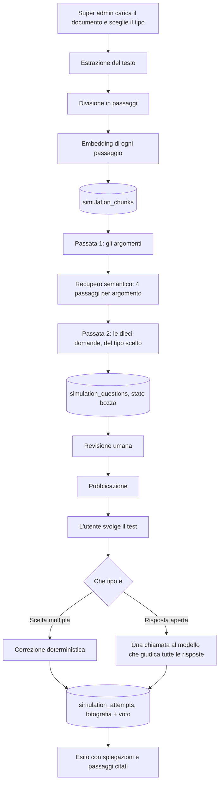

# Il simulatore tecnico, come funziona

Il gemello scritto del roleplay: là si misura come l'operatore gestisce una
persona, qui se conosce la procedura. Il super admin carica un documento
aziendale, un modello di ragionamento ne ricava dieci domande, un umano le
rilegge, e gli utenti dell'organizzazione le svolgono una domanda alla volta,
ottenendo un voto in decimi, con la spiegazione di ogni risposta e il passaggio
del documento da cui la domanda nasce.

**Un test è di uno di due tipi**, scelto quando si carica il documento e mai
più cambiato:

| | Scelta multipla | Risposta aperta |
| --- | --- | --- |
| Come si risponde | Una fra quattro alternative | Scrivendo qualche riga |
| Tempo | 30 secondi a domanda | Nessuno |
| Cosa decide i punti | Se è giusta e quanto in fretta è arrivata | Quanto la risposta è completa |
| Chi corregge | Il codice, confrontando due numeri | Un modello, alla consegna |
| Quando si sa il voto | Subito | Dopo qualche secondo di attesa |

Le due scale finiscono nello stesso posto, da 0 a 1 per domanda e un voto in
decimi, quindi un test dell'una forma e uno dell'altra si leggono nello stesso
riepilogo e nella stessa dashboard. Proprio per questo **ogni posto in cui
compare un test dice di che tipo è**, con
[SimulationKindBadge](../frontend/src/components/SimulationKindBadge.tsx): un 7
preso a crocette in trenta secondi e un 7 preso scrivendo dieci risposte non
sono la stessa notizia. È il gemello del badge che distingue una chiamata da
una chat, e i colori vogliono dire la stessa cosa: violetto dove si sceglie o
si parla, ciano dove si scrive.

Questo file racconta il procedimento per intero, nell'ordine in cui accade.

## I file coinvolti

| File | Cosa fa |
| --- | --- |
| [backend/document_text.py](../backend/document_text.py) | Estrae il testo da PDF, DOCX, TXT, Markdown e lo normalizza |
| [backend/simulation_rag.py](../backend/simulation_rag.py) | Spezza il testo in passaggi, calcola le somiglianze, campiona |
| [backend/openai_service.py](../backend/openai_service.py) | Le chiamate a OpenAI: embedding e risposte JSON dal modello di ragionamento |
| [backend/simulation_questions.py](../backend/simulation_questions.py) | I prompt e le due passate che producono le domande, dell'uno o dell'altro tipo |
| [backend/simulation_open_answers.py](../backend/simulation_open_answers.py) | Il giudizio sulle risposte scritte: il prompt e la chiamata sola |
| [backend/simulation_scoring.py](../backend/simulation_scoring.py) | Quanto vale una risposta: la scala che scende col tempo e quella del giudizio |
| [backend/routers/admin_simulations.py](../backend/routers/admin_simulations.py) | Il ciclo di vita lato super admin: caricamento, generazione, revisione, pubblicazione |
| [backend/routers/simulations.py](../backend/routers/simulations.py) | Lo svolgimento e le due correzioni |
| [backend/models.py:653-848](../backend/models.py#L653-L848) | Le quattro tabelle |
| [frontend/src/services/simulations.ts](../frontend/src/services/simulations.ts) | I tipi e le chiamate HTTP |
| [frontend/src/hooks/useSimulations.ts](../frontend/src/hooks/useSimulations.ts) | Gli hook TanStack Query |
| [frontend/src/components/SimulationRunner.tsx](../frontend/src/components/SimulationRunner.tsx) | Le tre schermate dello svolgimento: regole, domande, esito |
| [frontend/src/components/SimulationQuestionStep.tsx](../frontend/src/components/SimulationQuestionStep.tsx) | Una domanda a scelta multipla e il suo cronometro |
| [frontend/src/components/SimulationOpenQuestionStep.tsx](../frontend/src/components/SimulationOpenQuestionStep.tsx) | Una domanda aperta e la casella in cui si scrive |
| [frontend/src/components/SimulationWrittenAnswer.tsx](../frontend/src/components/SimulationWrittenAnswer.tsx) | Nell'esito: la risposta scritta, la traccia attesa, la correzione |
| [frontend/src/components/SimulationKindBadge.tsx](../frontend/src/components/SimulationKindBadge.tsx) | La targhetta del tipo, l'unico modo in cui si disegna, ovunque compaia un test |
| [frontend/src/components/simulationFormat.ts](../frontend/src/components/simulationFormat.ts) | Come si scrivono voti, punti e tempi, i nomi dei tipi, e la copia della scala che si legge durante la domanda |

## Il flusso in un colpo d'occhio

Le fasi 1, 2 e 3 sono tre chiamate HTTP distinte e non una sola. Il motivo è in
[admin_simulations.py:1-21](../backend/routers/admin_simulations.py#L1-L21): il
caricamento dura secondi, la generazione può durare minuti, e se fossero
un'unica richiesta un modello lento riporterebbe indietro un errore dopo tre
minuti lasciando il super admin senza niente, documento compreso.

---

## Fase 1, il caricamento del documento

`POST /api/admin/simulations` (multipart: `organization_id`, `title`,
`description`, `kind`, `file`), riservato al super admin.

### 1.1 Controlli in ingresso

Nell'ordine, in
[create_simulation](../backend/routers/admin_simulations.py#L176-L235):

1. il titolo non può essere vuoto;
2. l'organizzazione deve esistere, ed è quella a cui la simulazione
   apparterrà per sempre (il tenant non si cambia più, vedi
   [update_simulation](../backend/routers/admin_simulations.py#L327-L344));
3. `kind` deve essere `multiple` o `open`. Come il tenant, non si cambia più:
   le domande nascono già con quattro alternative o con la traccia della
   risposta attesa, e cambiare il tipo dopo vorrebbe dire buttarle senza
   dirlo. Chi sceglie male ricarica il documento in una simulazione nuova;
4. l'estensione deve essere `.pdf`, `.docx`, `.txt`, `.md` o `.markdown`. Si
   guarda l'estensione e non il content type dichiarato dal browser, che su
   Windows arriva vuoto o sbagliato più spesso di quanto si creda;
5. il file non può essere vuoto né superare 10 MB (`MAX_DOCUMENT_BYTES`). Si
   legge un byte in più del limite proprio per accorgersi del superamento
   senza caricare in memoria un file enorme.

Poi la riga `TechnicalSimulation` nasce in stato `draft`, e solo dopo si
indicizza il documento.

### 1.2 Estrazione del testo

[document_text.extract_text](../backend/document_text.py#L91-L108) sceglie il
lettore in base all'estensione:

- **PDF**: `pypdf`, con una riga vuota fra una pagina e l'altra, altrimenti
  l'ultima frase di una pagina e il titolo della successiva finiscono nello
  stesso paragrafo e quindi nello stesso passaggio;
- **DOCX**: `python-docx`, che legge i paragrafi e **anche le tabelle**, rese
  come righe `cella | cella | cella`. Le tabelle non stanno fra i paragrafi e
  sparirebbero in silenzio, che in una procedura è proprio dove stanno i
  passaggi operativi;
- **testo semplice**: UTF-8 con `latin-1` come rete di sicurezza, così da qui
  non esce mai un errore di decodifica.

Poi [_normalize](../backend/document_text.py#L39-L49) riduce tutto a una forma
sola: ritorni carrello di Windows, spazi e tabulazioni ripetuti (compreso lo
spazio unificatore che PDF e Word seminano ovunque e che a occhio è
indistinguibile da uno spazio normale), righe vuote multiple ridotte a una.

Il file originale non viene conservato da nessuna parte. Dopo questo passaggio
esiste solo la stringa, salvata in `TechnicalSimulation.document_text`.

Se il testo esce vuoto la richiesta fallisce con 400 e un messaggio esplicito:
è il caso del PDF fatto di pagine scansionate, che non contiene testo ma
immagini di testo, e nessun ritentativo lo cambia.

### 1.3 Divisione in passaggi

[split_into_chunks](../backend/simulation_rag.py#L43-L83) taglia il testo sui
confini dei paragrafi finché può, perché il paragrafo è l'unità che l'autore
del documento ha già deciso. Le misure:

| Costante | Valore | Perché |
| --- | --- | --- |
| `CHUNK_CHARS` | 1200 | Circa due paragrafi, su una procedura è un passo intero: abbastanza perché il passaggio si spieghi da solo, abbastanza poco perché il suo vettore parli di un argomento e non di cinque |
| `CHUNK_OVERLAP_CHARS` | 200 | La coda del passaggio chiuso apre il successivo, così una frase spezzata a metà si ritrova sempre con almeno uno dei due |
| `MIN_CHUNK_CHARS` | 80 | Sotto questa soglia il frammento è la coda di un titolo o una riga rimasta sola: non porta significato ma porta un vettore, e i vettori dei frammenti brevi somigliano un po' a tutto |

Un paragrafo che da solo supera i 1200 caratteri viene tagliato al suo interno
(succede con gli elenchi lunghi e con i PDF senza righe vuote). Se un documento
è così corto che tutti i suoi pezzi stanno sotto la soglia minima, si tiene il
testo intero come unico passaggio: meglio un passaggio breve che nessuno.

### 1.4 Indicizzazione

[embed_texts](../backend/openai_service.py#L211-L238) manda **tutti i passaggi in
una sola chiamata** al modello di embedding (`OPENAI_EMBEDDING_MODEL`), perché
l'API accetta più input insieme e spezzarli moltiplicherebbe per cento la
latenza senza cambiare il costo. I vettori tornano riordinati per indice,
perché l'API non promette di rispondere in ordine.

Qui **non c'è modello di riserva**, al contrario delle risposte JSON: i vettori
di due modelli diversi non si possono confrontare fra loro, e un documento con
metà passaggi indicizzati da uno e metà dall'altro darebbe ricerche
silenziosamente sbagliate. Se l'embedding fallisce, la richiesta risponde 502 e
si ritenta.

Ogni passaggio diventa una riga `SimulationChunk` con:

- `ordinal`, la posizione nel documento a partire da 1, che è il numero con cui
  le domande citeranno il passaggio;
- `content`, il testo;
- `embedding`, la lista di float salvata come JSON/JSONB.

L'embedding sta in una colonna JSON e non in un tipo vettoriale, e la
somiglianza si calcola in Python: pgvector andrebbe installato sul database, e
questa è un'applicazione che dopo il primo deploy non si tocca più. Il conto è
un prodotto scalare per passaggio, quindi qualche centinaio di passaggi si
confrontano in millisecondi, e la lettura dei vettori di UNA simulazione è una
query indicizzata su `simulation_id`. Il ragionamento per esteso è in
[simulation_rag.py:9-17](../backend/simulation_rag.py#L9-L17).

### 1.5 Ricaricare il documento

`POST /api/admin/simulations/{id}/document` rifà esattamente questi passi. I
passaggi di prima vengono cancellati, **le domande no**: le domande sono il
test, e un test non si azzera perché è stata caricata una versione aggiornata
della procedura. Restano lì con le loro citazioni che ora puntano ai passaggi
nuovi, ed è il super admin a decidere se rigenerarle.

---

## Fase 2, la generazione delle domande

`POST /api/admin/simulations/{id}/generate`. È l'unica chiamata dell'app che
può prendersi minuti. Il frontend la lancia senza ritentativi automatici
([useGenerateQuestions](../frontend/src/hooks/useSimulations.ts#L124-L139)),
perché ripartire da capo da solo raddoppierebbe l'attesa proprio quando è già
lunga.

Il router legge i passaggi già indicizzati (409 se non ce ne sono) e passa
testi e vettori a
[generate_questions](../backend/simulation_questions.py#L180-L233). Dentro
succedono tre cose.

### 2.1 Passata uno, gli argomenti

Il documento intero spesso non entra nel contesto, e anche quando entra il
modello scrive le domande su quello che ha letto per ultimo. Quindi:

[sample_evenly](../backend/simulation_rag.py#L116-L136) prende passaggi a
**distanza regolare** finché stanno in `TOPICS_BUDGET_CHARS` (30.000
caratteri). Prendere le prime pagine darebbe dieci domande sull'indice e sulla
premessa; prendendoli a distanza regolare gli argomenti restano distribuiti
come nel documento.

Su questo campione si chiede al modello esattamente dieci argomenti
verificabili, con criteri espliciti nel prompt
([_topics_prompt](../backend/simulation_questions.py#L47-L71)). **Questa
passata non sa di che tipo sarà il test**, ed è voluto: un argomento su cui
vale la pena interrogare qualcuno è lo stesso sia che la risposta si scelga
fra quattro sia che si scriva, e nominare la forma sposterebbe gli argomenti
verso quelli che le si prestano invece che verso quelli che contano. Un argomento va
bene se il documento dice qualcosa di preciso a riguardo, se sbagliarlo nel
lavoro reale avrebbe una conseguenza, se riguarda procedure, condizioni,
limiti, tempi, responsabilità o eccezioni. Non va bene se riguarda
l'impaginazione, la storia delle revisioni o chi ha scritto il documento, se la
risposta è un'opinione, o se ripete un argomento già indicato.

La risposta è JSON: `{"topics": ["", ""]}`.

### 2.2 Il recupero semantico

1. i dieci argomenti vengono trasformati in vettori con la stessa
   `embed_texts`, quindi vivono nello stesso spazio dei passaggi;
2. per ogni argomento, [most_similar](../backend/simulation_rag.py#L98-L113)
   calcola la similarità del coseno contro tutti i passaggi e tiene i
   `CHUNKS_PER_TOPIC` migliori, che sono **4**: tre o quattro coprono una
   procedura per intero, comprese le eccezioni, che sono spesso il paragrafo
   dopo quello che risponde alla domanda;
3. si costruisce una sezione per argomento, con i passaggi preceduti dal loro
   ordinale fra parentesi quadre (`[7] testo del passaggio...`), ordinati come
   nel documento.

Gli ordinali citati finiscono in un insieme `cited`, che servirà a validare le
citazioni della passata successiva.

### 2.3 Passata due, le domande

Una chiamata sola per tutte e dieci le domande, non dieci chiamate. Non è per
risparmiare: un modello che scrive le dieci domande insieme vede quello che ha
già chiesto, mentre dieci chiamate indipendenti producono tre domande sulla
stessa cosa e nessuna su tutto il resto.

È qui che il tipo del test entra in scena, e cambia solo il prompt di sistema:
la stessa chiamata, gli stessi argomenti con i loro passaggi, un'altra cosa da
scrivere.

#### A scelta multipla

Il prompt ([_questions_prompt](../backend/simulation_questions.py#L74-L123))
impone una domanda per argomento, quattro alternative (A, B, C, D) di cui una
sola corretta, e regole precise:

- **sulle domande**: la risposta corretta deve stare nei passaggi forniti, mai
  inventare soglie o regole; la domanda deve riguardare il lavoro
  dell'operatore (cosa fare, quando, a quali condizioni); deve reggersi da sola
  senza rimandare al documento;
- **sulle alternative**: le sbagliate devono essere errori realistici e
  plausibili, non assurdità che nessuno sceglierebbe; di lunghezza simile, così
  la giusta non si riconosce perché è la più lunga; niente "tutte le
  precedenti"; la posizione della corretta deve variare fra una domanda e
  l'altra;
- **sulla spiegazione**: due o tre frasi che spiegano perché la corretta è
  corretta e perché un errore tipico è un errore. La legge chi ha appena
  sbagliato, quindi deve insegnare la procedura, non ripetere qual era la
  risposta.

Il JSON richiesto è
`{"questions": [{"text", "options", "correct_option", "explanation", "source_chunks"}]}`,
con `correct_option` contato da 0 e `source_chunks` che elenca gli ordinali fra
parentesi quadre.

#### A risposta aperta

Il prompt ([_open_questions_prompt](../backend/simulation_questions.py)) chiede
per ogni argomento una domanda e la **traccia della risposta attesa**, che è la
parte che conta davvero: sarà l'unica cosa che il giudice avrà davanti quando
dovrà dire quanto vale quello che l'operatore ha scritto. Le regole in più
rispetto all'altro prompt:

- **sulle domande**: una cosa sola e delimitata, a cui si risponde in tre o
  quattro righe. "Descrivi la procedura di rimborso" è troppo larga, "quali
  condizioni devono valere perché un rimborso possa essere autorizzato allo
  sportello" va bene. E una risposta verificabile, non un parere: senza questo
  il modello scrive domande da tema, che nessuno può correggere;
- **sulla traccia**: i punti che devono esserci, elencati in modo che chi
  corregge possa dire quale manca. Non è la risposta perfetta da copiare, è il
  metro con cui si giudica, e una traccia vaga non è una chiave ma un'opinione,
  che produce voti indifendibili.

Il budget è di 8192 token di completamento in entrambi i casi: dieci domande
con quattro alternative e una spiegazione, oppure dieci domande con una traccia
e una spiegazione, più i token che il ragionamento spende prima di scriverne
una. Con un tetto stretto tornano indietro come JSON troncato.

### 2.4 La pulizia della risposta

[_normalize_questions](../backend/simulation_questions.py#L133-L177) scarta una
domanda per volta invece di far cadere tutto, e cosa la renda scartabile
dipende dal tipo:

- niente testo: si scarta in entrambi i casi;
- a scelta multipla, un numero di alternative diverso da quattro, o un
  `correct_option` non intero o fuori intervallo: si scarta;
- a risposta aperta, una `expected_answer` vuota: si scarta. Non è una domanda
  a cui manca un pezzo, è una domanda che nessuno potrebbe correggere;
- ordinali in `source_chunks` che non sono fra quelli davvero forniti: si
  scartano **loro**, non la domanda, perché la citazione accompagna la
  spiegazione, non la sostiene.

Ogni domanda esce con entrambi i mazzi di campi e quello inutile vuoto, così il
router che le scrive nel database non deve sapere di che tipo erano.

Se non resta niente si solleva `ValueError`, che il router traduce in 422. Nove
domande buone su dieci si rimediano rigenerando, mentre buttare via tutto per
una riga storta significherebbe far ripartire da capo un caricamento che è già
costato due chiamate.

### 2.5 Come vengono fatte le chiamate al modello

Entrambe le passate girano dentro
[eval_json_completion](../backend/openai_service.py#L152-L208), lo stesso
meccanismo che valuta le conversazioni e che, sui test aperti, corregge le
risposte alla consegna:

| Aspetto | Comportamento |
| --- | --- |
| Modello | `OPENAI_EVAL_MODEL`, con `OPENAI_EVAL_FALLBACK_MODELS` a seguire |
| Ragionamento | `reasoning_effort: high` sui modelli GPT-5, altrimenti `temperature: 0.3` |
| Formato | `response_format: json_object` |
| Timeout | 120 secondi per chiamata, non i 20 del roleplay: qui nessuno è in linea, c'è una rotella che gira in una pagina |
| Ritentativi | 1, quindi al massimo due tentativi per modello |
| Passaggio al modello di riserva | Solo su sovraccarichi (429, 500, 502, 503) **o su un JSON illeggibile**: un modello che risponde con campi mancanti ha fallito quanto uno che non ha risposto, e il rimedio è lo stesso. Un timeout invece non fa cambiare modello |

L'unica differenza per la correzione delle risposte aperte è che lì qualcuno
sta aspettando davvero: non è un super admin davanti a una rotella, è chi ha
appena consegnato un test. Il budget è più basso (4096 token, dieci giudizi con
due frasi di commento ciascuno) e il resto è identico, giro sui modelli di
riserva compreso.

Alla fine il router cancella le domande precedenti, scrive le nuove numerate da
1, e **riporta la simulazione in bozza anche se era pubblicata**: le domande
nuove non le ha ancora lette nessuno. I tentativi già consegnati non ne
risentono, perché ognuno porta con sé la fotografia delle domande che ha
ricevuto.

---

## Fase 3, la revisione umana e la pubblicazione

Tutto succede in un pannello solo,
[SimulationEditorModal](../frontend/src/components/SimulationEditorModal.tsx),
aperto dalla **matita** di una riga della tabella in
[SimulationAdminPage](../frontend/src/components/SimulationAdminPage.tsx).

La tabella si comporta come quelle di utenti, organizzazioni e avatar: il clic
sulla riga apre la scheda di sola lettura
([SimulationDetailModal](../frontend/src/components/SimulationDetailModal.tsx),
lo stesso `DetailModal` delle altre, comprese le due righe finali su chi ha
creato la simulazione e chi l'ha toccata per ultimo), la matita apre la
modifica, il cestino elimina. Per una simulazione "modificare" vuol dire
scrivere le domande e pubblicarle, non correggere due campi in un form, quindi
dietro la matita c'è il pannello e non una modale di campi.

La paternità arriva solo da `/api/admin/simulations`
(`AdminSimulationResponse`), non da quella di chi svolge il test: le colonne le
scrive il listener di [authorship](../backend/authorship.py) come su ogni
entità amministrata, ma l'indirizzo di chi prepara i test non serve a chi li
fa.

Il super admin vede le domande **con le chiavi** (`SimulationQuestionAdminResponse`
aggiunge `correct_option`, `expected_answer`, `explanation` e `source_chunks`),
più il testo del documento e quante persone hanno già svolto il test. Delle due
chiavi se ne legge una sola, quella del tipo del test.

`PUT /api/admin/simulations/{id}/questions` salva le domande **in blocco**: le
righe di prima si cancellano e si riscrivono. Riordinarne una, toglierne una e
riscriverne un'altra sono la stessa modifica, e a pezzi lascerebbero il test in
stati che non hanno senso. Due dettagli:

- le citazioni al documento si conservano solo dove il testo della domanda in
  quella posizione è rimasto identico. Sono ordinali di passaggi, non qualcosa
  che il super admin possa riscrivere nel form, e perderle a ogni correzione di
  un refuso toglierebbe a chi sbaglia il rimando alla procedura;
- il validatore Pydantic pretende almeno una domanda e al massimo dieci, e che
  `correct_option`, dove ci sono delle alternative, sia l'indice di una di
  quelle presenti;
- **la chiave giusta per il tipo la controlla il router e non lo schema**: il
  payload porta le domande e non la simulazione a cui appartengono, quindi il
  tipo lì non si sa. Un test aperto con una domanda senza `expected_answer`, o
  uno a scelta multipla con una domanda senza alternative, risponde 422 dicendo
  quale posizione. La chiave dell'altro tipo, se arriva, viene buttata invece
  di restare scritta in una colonna che nessuno leggerà.

Nell'editor la chiave che si vede è una sola, quella del tipo
([SimulationQuestionEditor](../frontend/src/components/SimulationQuestionEditor.tsx)).
Su un test a scelta multipla la risposta corretta si sceglie **cliccando la
lettera dell'alternativa** e non da una tendina a parte: la tendina lascerebbe
scrivere "corretta: C" con la C vuota. Su uno a risposta aperta c'è una casella
per la traccia, con scritto sotto che è il metro con cui ogni risposta verrà
corretta: lì il super admin non sta correggendo un refuso, sta scrivendo la
regola del voto.

`PUT /api/admin/simulations/{id}/status` pubblica o ritira. Pubblicare pretende
il test completo, dieci domande, che è quello che la pagina promette a chi lo
svolge (409 altrimenti). Ritirare non pretende niente, ed è la ragione per cui
esiste: quando c'è qualcosa che non va, il primo gesto deve poter essere
toglierla di mezzo. Il pulsante di pubblicazione nel pannello salva prima le
domande, così quello che finisce davanti agli utenti è quello che si sta
guardando.

Finché è in bozza, la simulazione esiste solo per il super admin: il filtro sta
in [visible_query](../backend/routers/simulations.py#L49-L64) e le bozze restano
fuori ovunque tranne che nelle pagine di amministrazione.

---

## Fase 4, lo svolgimento

### 4.1 Chi vede cosa

Una regola sola, in `visible_query`: il super admin sta sopra le organizzazioni
e le vede tutte, chiunque altro vede quelle della propria e nient'altro. Il
frontend non replica nessun filtro, il server serve a ciascuno quello che può
vedere.

`GET /api/simulations` restituisce l'elenco delle pubblicate, e per ognuna,
tramite [attempt_stats](../backend/routers/simulations.py#L89-L122), quanti
tentativi ha fatto chi guarda e come è andato l'ultimo. È una query sola per
tutto l'elenco che legge quattro colonne e conta in Python: i tentativi di UNA
persona sono decine, e farsi dare dal database l'ultimo di ogni gruppo
costerebbe o una query per riga o una window function.

### 4.2 Il test

`GET /api/simulations/{id}` restituisce le domande **senza la risposta esatta,
senza la traccia della risposta attesa, senza la spiegazione e senza i
passaggi**. Non è un dettaglio: sono due schemi diversi e non uno con campi
opzionali ([schemas.py:918-941](../backend/schemas.py#L918-L941)), perché la
chiave deve restare sul server fino alla consegna, altrimenti il test lo
risolverebbe la scheda di rete. Su un test a risposta aperta la traccia è la
chiave, e vale esattamente la stessa regola: chi la ricevesse con la domanda
avrebbe la risposta scritta davanti.

Nelle domande di un test aperto `options` arriva come lista vuota, e non è un
campo mancante: è la domanda che non ne ha. A dire come si risponde è `kind`,
che sta sulla simulazione.

In [SimulationRunner](../frontend/src/components/SimulationRunner.tsx) le risposte
vivono in uno stato locale `question_id -> indice dell'opzione`, e la pagina ha
tre schermate: le regole, le domande, l'esito. Sono una pagina sola e non tre
indirizzi, perché un id nuovo a metà test sarebbe un tasto "indietro" del
browser che rimette in gioco una domanda già consegnata. Ricaricando si riparte
dalle regole e quello che si era risposto è perso: le risposte vivono nel
browser finché non si consegna, perché un test a metà non è un tentativo. Non
c'è nessun limite ai tentativi.

Il passo che monta a ogni domanda è uno dei due, scelto in base a `kind`:
`SimulationQuestionStep` per le alternative, `SimulationOpenQuestionStep` per
la casella in cui si scrive. Sono due componenti e non uno con dei rami perché
hanno in comune solo il fatto di stare in mezzo a un test: uno vive attorno a
un cronometro, l'altro non ce l'ha.

### 4.2.1 A scelta multipla

**Una domanda alla volta, trenta secondi ciascuna.** Si risponde, si passa alla
successiva e non si torna più indietro. Il conto alla rovescia scende a schermo
e la barra sotto il numero si svuota, di ambra sotto i dieci secondi e di rosso
sotto i cinque. Accanto ai secondi c'è quanto varrebbe rispondere adesso, che
scende insieme a loro: una regola che decide un voto va guardata mentre agisce,
non scoperta nel riepilogo. Quel numero lo calcola il browser con la sua copia
della scala (in `simulationFormat`), ma i punti che contano sono quelli che il
server rimanda con l'esito.

Le regole stanno in [SimulationIntro](../frontend/src/components/SimulationIntro.tsx)
e si leggono **prima**: quante domande sono, quanto dura ognuna, che non si
torna indietro e che il tempo scaduto vale come sbagliata. Il test comincia
quando lo si dice, e la schermata esiste per questo: il cronometro della prima
domanda non può partire su una pagina appena aperta, mentre si sta ancora
leggendo il titolo.

Ogni domanda è un
[SimulationQuestionStep](../frontend/src/components/SimulationQuestionStep.tsx)
montato con `key={question.id}`, quindi il passo alla domanda dopo rimonta il
componente e con lui il cronometro: è il rimontaggio a rimettere a trenta i
secondi, non un effetto che azzera un contatore. Dentro, tre scelte che vale la
pena conoscere:

| Scelta | Perché |
| --- | --- |
| Il tempo residuo si calcola da una scadenza assoluta, non scalando un contatore a ogni battito | Una scheda in secondo piano riceve meno battiti del previsto, e un contatore scalato regalerebbe secondi a chi cambia finestra |
| La consegna della domanda passa da un `answered` in ref | Il tempo può finire nello stesso istante in cui si preme il pulsante, e consegnare due volte farebbe saltare un avanzamento |
| Finché non si va avanti la scelta si può cambiare, dopo no | I trenta secondi sono per decidere, non per battere sul pulsante |

Allo scadere si passa avanti con l'opzione selezionata, se ce n'è una, o in
bianco. Chi non sa la risposta non deve aspettare il tempo per forza: il
pulsante diventa "Salta la domanda" e la consegna in bianco.

**Nessun riscontro durante il percorso.** Giusto e sbagliato arrivano insieme
alla fine, perché sapere di aver sbagliato la seconda mentre si legge la terza
cambia il modo di rispondere alle otto che restano.

Il cronometro vive nel browser e il server non ne sa niente: non c'è un istante
d'inizio registrato e la consegna viene accettata quando arriva. È un test di
formazione e non un esame sorvegliato, quindi il tempo serve a chi lo svolge,
per allenarsi a rispondere senza rileggere il manuale, e non a impedire a
qualcuno di barare.

### 4.2.2 A risposta aperta

Una domanda alla volta e nessun ritorno indietro come sopra, ma **senza
cronometro**. Trenta secondi bastano a scegliere una lettera, non a scrivere
una procedura, e un tempo che scorre mentre si compone una risposta premierebbe
chi scrive in fretta invece di chi conosce il lavoro. Qui i punti dipendono solo
da quanto la risposta è completa, quindi rileggersi prima di consegnare non
costa niente ed è anzi la cosa giusta da fare, ed è scritto nelle regole prima
di cominciare.

La casella prende il fuoco da sola, perché è l'unica cosa da fare in quella
schermata. Il tetto è di 5000 caratteri, lo stesso che il server accetta, e lo
spazio rimasto compare solo negli ultimi 500: un contatore sempre a schermo
suggerirebbe che la lunghezza conta, mentre una risposta breve che dice tutto
vale quanto una lunga. Chi non sa la risposta ha il pulsante "Salta la
domanda", che la consegna in bianco.

Anche qui nessun riscontro durante il percorso.

Finita l'ultima domanda il test **si consegna da solo**. È l'unica pagina
dell'app in cui una chiamata fallita non lascerebbe niente da ritentare a mano,
quindi l'errore resta a schermo con le risposte ancora in memoria e il pulsante
per riprovare la consegna.

---

## Fase 5, la correzione

`POST /api/simulations/{id}/attempts`, con una voce per domanda. Un campo per
tipo di test e se ne manda uno solo: `selected_option` con `elapsed_ms`, oppure
`answer_text`. Vuoti entrambi significa lasciata in bianco, che si può fare in
tutti e due i casi.

[submit_attempt](../backend/routers/simulations.py) guarda il tipo e prende una
delle due strade, poi il resto è identico: la conta delle esatte, la somma dei
punti, la fotografia, il voto congelato nella riga.

### 5.1 A scelta multipla, il codice

**Deterministica, e sta nel codice, non nel modello.** La risposta esatta è
stata decisa quando la domanda è nata e riletta da un umano prima della
pubblicazione, quindi lo stesso test consegnato due volte prende lo stesso
voto. Quello che l'LLM ha scritto e che arriva a chi ha sbagliato è la
spiegazione.

In [_multiple_choice_answers](../backend/routers/simulations.py), per ogni
domanda della simulazione:

1. un indice fuori dall'intervallo delle alternative è 400, non una risposta
   sbagliata: significa che il client ha mandato qualcosa di incoerente;
2. `is_correct` è `choice == question.correct_option`, quindi una domanda in
   bianco (`None`) è sbagliata ma resta distinguibile;
3. i punti della domanda escono da `is_correct` e dal tempo (vedi sotto);
4. si accumula una voce con **domanda, alternative, risposta data, risposta
   esatta, esito, tempo, punti e spiegazione**.

Quella lista è la `answers` del `SimulationAttempt`, ed è il punto centrale del
disegno: **una fotografia, non dei puntatori**. Il tentativo resta leggibile
per intero anche se la domanda viene poi riscritta o la simulazione rigenerata
da capo, e una domanda corretta dopo la consegna non può far apparire sbagliata
una risposta che era giusta.

### 5.2 A risposta aperta, il modello

Qui la correzione non può stare nel codice: la risposta è testo scritto da una
persona, e dire se "prima si identifica il cliente" copre una procedura che il
documento descrive in cinque righe è un giudizio, non un uguale.

[_open_answers](../backend/routers/simulations.py) manda tutte le risposte
scritte a
[judge_open_answers](../backend/simulation_open_answers.py), che è **una
chiamata sola per l'intero tentativo**. Non dieci: in parallelo sarebbero dieci
volte il rischio che una vada storta, in serie un minuto di rotella, e in più un
modello che vede tutto il test giudica con lo stesso metro dalla prima
all'ultima, mentre dieci chiamate indipendenti sono dieci esaminatori diversi.

Cosa vede il modello, per ogni domanda: il testo, la **traccia della risposta
attesa** e quello che l'operatore ha scritto (troncato a 2000 caratteri: oltre
non c'è una risposta, c'è un incollaggio del manuale). Non vede il documento,
di proposito: la traccia è già la sintesi che il super admin ha approvato, e
dargli anche i passaggi rimetterebbe in discussione la chiave nel momento in
cui la si applica.

Cosa torna indietro, per posizione: `quality` da 0 a 1 e due righe di
`feedback`. Il prompt dice esplicitamente cosa **non** deve spostare il voto,
che è la parte che serve di più: ortografia, forma, parole diverse da quelle
della traccia, lunghezza. E una regola severa: una risposta che afferma
qualcosa di sbagliato non supera 0,5 anche se nel resto dice cose giuste,
perché sul lavoro quell'affermazione porterebbe a un errore.

Tre scelte attorno alla chiamata:

| Caso | Cosa succede | Perché |
| --- | --- | --- |
| Risposta in bianco | Non arriva al modello, vale zero | Più veloce, costa meno, ed è l'unico modo di essere certi che chi non scrive niente non prenda niente |
| Il modello non risponde su nessun modello della lista | 502, il tentativo **non** si scrive | Le risposte sono ancora nel browser e il pulsante per riprovare c'è già; scrivere un tentativo mezzo corretto no |
| Il modello salta una domanda a cui era stato risposto | 502, il tentativo **non** si scrive | Un voto più basso del dovuto per un motivo che chi lo riceve non può né vedere né contestare è peggio di una consegna da ripetere |

La voce che finisce nella fotografia porta **domanda, risposta scritta, traccia
attesa, commento, esito, punti e spiegazione**. Il giudizio è congelato lì
insieme al resto, e per una ragione in più rispetto alle scelte multiple:
rivalutare la stessa risposta domani darebbe un numero simile ma non lo stesso,
e un voto che oscilla non è un voto.

### Quanto vale una risposta

Sapere una procedura e ricordarsela subito non sono la stessa cosa, e allo
sportello la differenza si vede: chi deve rileggere il manuale la risposta ce
l'ha, ma dopo. Il punteggio la misura, e le due scale vivono tutte in
[simulation_scoring](../backend/simulation_scoring.py).

**Su un test a scelta multipla**, il tempo:

| Quando arriva la risposta | Se è giusta vale |
| --- | --- |
| entro 3 secondi | 1 |
| entro 6 | 0,9 |
| entro 9 | 0,8 |
| … un decimo ogni 3 secondi … | … |
| entro 30, cioè l'ultimo istante | 0,1 |
| sbagliata o in bianco, a qualsiasi velocità | 0 |

Tre scelte dietro la tabella. L'ultimo scalino vale un decimo e non zero,
perché rispondere giusto all'ultimo istante è comunque saperlo e vale più che
sbagliare. Un `elapsed_ms` fuori scala viene riportato dentro invece di far
fallire la consegna: un numero storto è comunque un test che qualcuno ha
svolto.

La terza è la meno ovvia: **un `elapsed_ms` assente vale come l'ultimo
scalino**, non come il primo. Il tempo è l'unica parte del punteggio che il
server non può verificare, quindi la scelta è fra due errori: chi non lo manda
prende il massimo, oppure prende il minimo. Il primo è silenzioso, un client
vecchio o modificato piglia dieci e nessuno se ne accorge. Il secondo si vede
subito nel voto, e un voto strano è una cosa che qualcuno viene a chiedere.

Non è teoria: questo difetto c'è stato. Il tempo è arrivato `null` per un
giorno perché il browser aveva ancora la versione senza cronometro, i voti
sono usciti pieni e la sola traccia era che i punti coincidevano sempre con le
risposte esatte. Col fallback al minimo quei tentativi sarebbero saltati
all'occhio subito.

**Su un test a risposta aperta**, la completezza:

| Quanto la risposta copre la traccia | Vale |
| --- | --- |
| tutto quello che serviva | 1 |
| manca una condizione o un passaggio secondario | 0,7 - 0,8 |
| metà, oppure giusto ma troppo vago | 0,5 |
| sfiora l'argomento senza rispondere | 0,2 - 0,3 |
| sbagliata, fuori tema, o in bianco | 0 |

Qui il tempo non c'entra e non viene misurato. Le altre tre scelte:

- **un giudizio fuori scala rientra** invece di far fallire la consegna, come
  il tempo storto: un modello che scrive 1,3 ha comunque detto che la risposta
  era completa;
- **una risposta non giudicata vale zero**, che non è la stessa prudenza del
  tempo assente: là il tempo c'era e non è arrivato, qui il giudizio non c'è, e
  una risposta non giudicata non può valere punti. Detto questo, il caso non
  arriva mai fino ai punti, perché un giudizio mancante fa fallire la consegna
  prima;
- **la sufficienza si guarda sui punti arrotondati** e non sul giudizio grezzo:
  con la soglia sul numero nascosto, una risposta da 0,57 mostrerebbe 0,6
  accanto a una crocetta rossa, e nessuno saprebbe spiegare perché.

Il punteggio è congelato nella riga (`earned_points` e `question_count`) e non
ricalcolato a ogni lettura, cosa che con i punti a tempo conta doppio: il
tempo di una risposta è successo una volta sola. Sulle risposte aperte conta
per un motivo gemello: quel giudizio è stato dato una volta sola. Il voto in
decimi è la proprietà [score](../backend/models.py#L839-L842), cioè
`punti * 10 / domande` arrotondato a un decimale, sulla stessa scala delle
valutazioni del roleplay.

`correct_count` resta accanto ai punti e non è più il voto: risponde a
un'altra domanda, quante ne sapeva, e senza di lui un sei con otto risposte
esatte sarebbe illeggibile. Nel riepilogo si vedono entrambi, e ogni domanda
porta i suoi punti con accanto il tempo che li ha decisi. Su un test a risposta
aperta "esatta" vuol dire **arrivata almeno a 0,6** (`OPEN_PASS_POINTS`), che è
la sufficienza, la stessa soglia con cui il voto finale si colora a schermo: il
giudizio è una scala continua, ma quella colonna è una conta, e da qualche
parte la riga va tirata.

**Il tempo lo misura il browser.** Il server lo riporta dentro scala se arriva
storto, ma non ha modo di verificarlo: non consegna le domande una alla volta
e non registra un istante d'inizio, quindi un client modificato può dichiarare
zero. È una scelta e non una svista, questo è un test di formazione e non un
esame sorvegliato. Renderlo davvero vincolante vorrebbe dire consegnare le
domande a tempo dal server, che è un altro disegno.

Infine [audit.describe](../backend/audit.py) registra titolo della simulazione e
punteggio.

### L'esito

La risposta alla consegna, e ogni rilettura successiva del tentativo, mescola
due sorgenti apposta
([_answer_results](../backend/routers/simulations.py#L198-L227)):

| Cosa si mostra | Da dove viene | Perché |
| --- | --- | --- |
| Testo, alternative, risposta data, risposta esatta, esito, tempo e punti | La fotografia nel tentativo | Il voto non deve poter cambiare da solo mesi dopo l'esame, e il tempo di una risposta è successo una volta sola |
| Risposta scritta, traccia attesa e commento del modello | La fotografia nel tentativo | La traccia di oggi potrebbe essere stata riscritta, e mostrarla accanto a un voto dato su quella di ieri farebbe leggere una correzione sbagliata |
| Spiegazione | La domanda **attuale**, se esiste ancora | Lì una correzione è un miglioramento |
| Passaggi del documento | I chunk **attuali** della simulazione | Sono il documento, e tenerne una copia per ogni tentativo di ogni utente moltiplicherebbe un manuale per il numero di chi lo studia |

Se il documento viene ricaricato le citazioni cambiano, e va bene così: quello
che deve restare fermo è il voto, non la citazione.

A schermo
([SimulationResult](../frontend/src/components/SimulationResult.tsx)) si vede il
voto in cima, con accanto quante risposte erano esatte e quanti punti hanno
fruttato, poi domanda per domanda i punti presi, la spiegazione, e in fondo un
"Cosa dice il documento" apribile con i passaggi citati. Le spiegazioni
compaiono anche sulle domande andate bene, perché chi ha indovinato senza
esserne sicuro è esattamente la persona che deve leggerle.

Quello che cambia fra i due tipi è solo il corpo di ogni domanda:

- **a scelta multipla**, in quanto tempo la risposta è arrivata, l'alternativa
  corretta in verde, quella scelta in rosso se diversa, e la nota sulle domande
  lasciate in bianco;
- **a risposta aperta**
  ([SimulationWrittenAnswer](../frontend/src/components/SimulationWrittenAnswer.tsx)),
  tre riquadri in quest'ordine: quello che ha scritto, cosa doveva dire, la
  correzione. La traccia sta lì per una ragione precisa: su una scelta multipla
  il voto si verifica da solo, l'alternativa giusta è lì e o era quella o non
  lo era, mentre qui il voto lo ha dato un modello che ha letto un testo. Senza
  il metro con cui è stato misurato, uno 0,6 sarebbe una parola dell'autorità e
  non una correzione.

### Rileggere un proprio tentativo

L'esito non vive solo nell'attimo della consegna. Nella barra "Tentativi
passati", sotto le regole del test, ogni voto è un pulsante che riapre quel
tentativo per intero in
[SimulationAttemptModal](../frontend/src/components/SimulationAttemptModal.tsx),
con le stesse domande, le stesse risposte, le spiegazioni e i passaggi del
documento. Ne compaiono cinque, i più recenti, e chi ne ha di più li chiede
tutti con il pulsante accanto: una barra lunga quanto la storia di un anno
spingerebbe il test fuori dallo schermo.

È la stessa modale che gli amministratori aprono dalla dashboard, con la sola
prop `own` a cambiare: con `own` l'esito è scritto in seconda persona ("la tua
risposta") e l'intestazione non ripete nome e indirizzo di chi legge. Il
componente è uno perché la pagina deve essere una: chi corregge legge esattamente
quello che legge chi ha sbagliato.

**Ognuno vede solo i propri.** L'elenco dei tentativi arriva già filtrato
sull'utente che chiede, e il tentativo singolo lo serve solo a chi lo ha svolto o
a un admin del tenant, quindi il frontend non ha nessun controllo da rifare: il
pulsante può aprire soltanto quello che il server gli manderebbe comunque.

---

## Le letture successive

| Endpoint | Chi | Cosa |
| --- | --- | --- |
| `GET /api/simulations/{id}/attempts` | L'utente | I propri tentativi su quella simulazione, dal più recente: è la barra "Tentativi passati" in cima al test |
| `GET /api/simulations/attempts/{id}` | Chi lo ha svolto, o un admin del tenant a cui la simulazione appartiene | Un tentativo con la sua correzione completa. È quello che si apre cliccando una riga nella dashboard o un proprio tentativo passato |
| `GET /api/simulations/{id}/results` | Admin | Tutti i tentativi su una simulazione. Un organization admin li vede solo per le simulazioni della propria organizzazione, che è la stessa cosa che dire "solo dei propri utenti" |
| `GET /api/admin/simulations-report` | Admin | Tutti i tentativi in un colpo solo, chi li ha svolti e come è andata: è la sezione del simulatore nella dashboard (vedi [training-e-report.md](training-e-report.md)) |
| `GET /api/comparison/simulation-attempts` | L'utente, o un admin per una persona del proprio ambito | I test consegnati da una persona sola, dal più vecchio, con le risposte: è la linguetta del simulatore nella pagina di confronto |

Chi non ha diritto di leggere un tentativo riceve 404 e non 403: l'esistenza
stessa della riga non è un'informazione da dare.

Il report della dashboard è l'unica di queste letture che **non** parte da una
simulazione: raccoglie i tentativi per organizzazione di chi li ha svolti,
perché lì la domanda non è "com'è andato questo test" ma "come vanno le mie
persone".

---

## Il modello dati

| Tabella | Contiene | Note |
| --- | --- | --- |
| `technical_simulations` | Titolo, descrizione, stato, `kind`, nome e testo del documento, organizzazione | Il file originale non c'è, solo il testo estratto. `kind` si decide al caricamento e non si cambia |
| `simulation_chunks` | `ordinal`, `content`, `embedding` | Cancellati e riscritti a ogni caricamento del documento |
| `simulation_questions` | `position`, `text`, `options`, `correct_option`, `expected_answer`, `explanation`, `source_chunks` | Le due chiavi sono alternative fra loro e se ne riempie una sola, secondo il `kind` della simulazione: per questo `options` e `correct_option` sono nullable, non perché una domanda possa non avere una risposta esatta. `options` e `correct_option` stanno comunque sulla stessa riga, quindi correggere il testo di un'opzione non può spostare la risposta esatta su un'altra |
| `simulation_attempts` | `correct_count`, `question_count`, `earned_points`, `answers` (la fotografia), `created_at` | Il voto si ricava da punti e domande, quindi resta leggibile anche se un giorno le domande non fossero più dieci. `earned_points` è arrivata dopo: i tentativi di prima l'hanno riempita con le loro risposte esatte, che è quello che valevano quando il tempo non contava (vedi [startup_migrations](../backend/startup_migrations.py)) |

Il tipo sta sulla simulazione e non sulla singola domanda, quindi un test è
tutto dell'una forma o tutto dell'altra. Le due si svolgono in modi troppo
diversi per stare nella stessa pagina: le multiple hanno un cronometro e si
correggono da sole, le aperte no. Chi vuole verificare le stesse procedure in
entrambi i modi carica due volte lo stesso documento, che costa una generazione
e non un disegno.

Le colonne nuove (`kind` e `expected_answer`) arrivano con un default che è già
il valore giusto per le righe che c'erano: le simulazioni di prima sono tutte a
scelta multipla, e le loro domande non hanno una traccia. Nessun backfill da
scrivere, solo la ALTER e il passaggio di `options` e `correct_option` a
nullable.

Tutto ha `ondelete CASCADE` verso la simulazione. Eliminare una simulazione è
definitivo, al contrario dell'archiviazione di un avatar: un avatar archiviato
deve sopravvivere alle conversazioni giocate contro di lui, mentre un tentativo
si porta dietro la propria fotografia e non ha bisogno che la simulazione
esista ancora. Chi vuole solo toglierla di mezzo la ritira.

Le costanti sono in [models.py:56-62](../backend/models.py#L56-L62):
`SIMULATION_QUESTION_COUNT = 10`, `SIMULATION_OPTION_COUNT = 4`, gli stati
`draft` e `published`, i tipi `multiple` e `open`.

---

## Gli errori e cosa significano

| Situazione | Risposta |
| --- | --- |
| Estensione non supportata | 400, "carica un file PDF, DOCX, TXT o Markdown" |
| Tipo di test diverso da `multiple` o `open` | 400 |
| File vuoto o illeggibile, PDF scansionato | 400, con il motivo. Non è un problema di ritentativi, è il file |
| Documento oltre 10 MB | 413 |
| Embedding falliti | 502, il caricamento si ripete |
| Generazione su una simulazione senza passaggi indicizzati | 409 |
| Il modello non risponde o non risponde su nessun modello della lista | 502 |
| Il modello risponde qualcosa di inutilizzabile | 422 |
| Domande salvate senza la chiave del loro tipo | 422, con la posizione della domanda |
| Pubblicazione con meno di dieci domande | 409, con quante ce ne sono |
| Consegna di una simulazione senza domande | 409 |
| Indice di risposta fuori intervallo | 400 |
| La correzione delle risposte aperte fallisce o torna incompleta | 502, con l'invito a riprovare: il tentativo non si scrive |
| Simulazione o tentativo non visibili a chi chiede | 404 |

---

## Conservazione e cancellazione

I tentativi sono l'unica parte personale del simulatore, e hanno il proprio
orologio: `SIMULATION_ATTEMPT_RETENTION_DAYS` (730 giorni in produzione, vedi
[gdpr.md](gdpr.md)). Il purge in [backend/retention.py](../backend/retention.py)
gira dentro l'applicazione, senza cron esterni, e cancella la riga intera,
fotografia delle risposte compresa. La simulazione con le sue domande non
riguarda nessuno in particolare e resta.

Alla cancellazione di un utente
([backend/erasure.py](../backend/erasure.py)) i suoi `SimulationAttempt` spariscono
con lui, mentre la firma di chi ha creato una `TechnicalSimulation` viene solo
anonimizzata: quella riga non è **su** di lui, porta solo il suo nome in calce.
