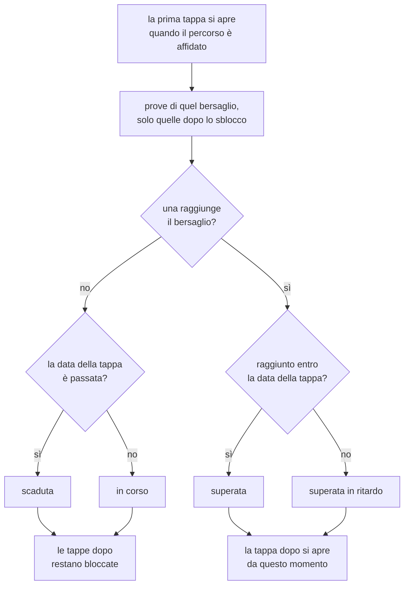

# Percorsi, notifiche e report

Quello che sta attorno all'esercizio: i percorsi che un docente compone e
assegna, gli avvisi che ne derivano, il confronto fra i propri tentativi e i
cruscotti di chi guarda una classe.

Tutte queste cose hanno in comune una scelta: **niente stato salvato**. Il
completamento di una tappa, le notifiche e i numeri dei cruscotti si
ricalcolano a ogni lettura dalle righe che li descrivono già.

## I percorsi

Un percorso è una **sequenza numerata di tappe**, e ogni tappa è un obiettivo
su un avatar oppure su una simulazione tecnica: "arriva a 7 con Mario Rossi,
poi passa il test sulle procedure di cassa con almeno 6". La successiva si
apre solo quando quella prima di lei è stata superata. Sta in
[routers/training.py](../backend/routers/training.py).

Prima era un obiettivo solo, un utente su un avatar. Andava bene finché
allenarsi voleva dire una conversazione; non sapeva dire "prima parla con
questo cliente, poi dimostra di conoscere la procedura", che è come si insegna
davvero un mestiere. Le vecchie righe non sono state convertite: una di quelle
non è un percorso di una tappa, perché non ha né il percorso a cui appartenere
né il tipo di bersaglio, e la migrazione porta via la tabella
([startup_migrations.py](../backend/startup_migrations.py)).

**Un percorso è un modello, non una copia per allievo.** Si compone una volta
e si affida a quante persone si vuole; correggere l'obiettivo di una tappa
vale subito per tutti quelli che lo stanno percorrendo, ed è esattamente il
motivo per cui esiste come riga a sé. Il progresso non ne soffre perché non è
salvato da nessuna parte: si rilegge dalle tappe che ci sono adesso.

Le tre tabelle ([models.py](../backend/models.py)):

| Tabella | Cosa tiene |
| --- | --- |
| `training_paths` | Il percorso: titolo, descrizione, tenant |
| `training_path_steps` | Una tappa: posto nella fila, bersaglio, obiettivo, scadenza |
| `training_path_assignments` | Il percorso affidato a una persona, e quando |

Sulla tappa il bersaglio è **una colonna o l'altra**, mai tutte e due e mai
nessuna, e a imporlo è un vincolo sulla tabella: è la stessa forma delle
chiavi di una domanda di simulazione, dove ogni tipo riempie la propria
colonna e lascia stare le altre (vedi [simulatore.md](simulatore.md)).

**La scadenza è una data con l'ora, scritta quando si compone il percorso.**
Sta sul calendario, quindi è la stessa per chiunque percorra quel percorso e
corre anche mentre la tappa è ancora chiusa: si legge da subito, e a dire che
la tappa non si è ancora aperta resta lo sblocco. È facoltativa, e una tappa
senza data non scade mai.

La conseguenza voluta di una data a calendario è che **un percorso vecchio va
ridatato prima di affidarlo di nuovo**: le sue tappe hanno i termini decisi
allora, e per chi lo riceve oggi sono già passati. Il percorso resta un
modello riusabile in tutto il resto, e riscrivere le date è una passata sola
nel form di composizione.

**Chi compone e chi assegna.** Entrambi i ruoli di amministrazione. Un
organization admin è chi insegna davvero ai propri studenti, e far passare
ogni percorso dal super admin metterebbe in mezzo un estraneo al corso. A
confinarlo è il tenant, come sempre: il percorso è di una sola organizzazione,
le sue tappe possono puntare solo agli avatar e ai test di quella, e si affida
solo a utenti di quella.

**Di cosa può essere fatta una tappa** lo dice `GET /assignable-content`: gli
avatar non archiviati e le simulazioni pubblicate del tenant. Sta accanto alla
validazione che rifiuta una tappa sbagliata, per la stessa ragione per cui ci
sta `assignable-users`: il selettore e il controllo devono condividere una
definizione sola, invece che il frontend ne tenga una copia libera di
divergere. Una bozza o un avatar archiviato prendono **409 e non 404**: quelli
esistono, e chi compone il percorso li sta guardando nel proprio pannello,
solo non sono qualcosa che si possa svolgere. E una tappa che nessuno può
superare non è un dettaglio, perché terrebbe chiuse tutte quelle dopo di lei.

**Chi può ricevere un percorso.** Gli utenti attivi di quel tenant, super
admin escluso perché non appartiene a nessuno. Lo stesso percorso non si
affida due volte alla stessa persona, e chi ce l'ha già viene **lasciato
stare** invece che far fallire la richiesta: selezionare tutta
l'organizzazione e assegnare ai tre nuovi arrivati è il gesto normale, e un
errore su tutto costringerebbe a spuntare a mano chi c'era già.

### Il progresso, ricavato in lettura

Una tappa è superata quando **una prova svolta dopo il suo sblocco** raggiunge
il punteggio richiesto. La prova è una conversazione valutata con l'avatar
della tappa, oppure un test tecnico consegnato se la tappa è una simulazione;
in entrambi i casi il voto è in decimi, che è quello che permette alle due
forme di stare sulla stessa scala e sotto la stessa barra.

**Scaduta e aperta sono due cose diverse.** Il diagramma racconta una tappa
aperta, ma la data corre anche sulle altre: una tappa ancora chiusa il cui
termine è passato risponde `overdue`, e il percorso con lei. Non è un modo di
dire che si può cominciare, perché a dirlo è `unlocked_at`, che resta vuoto:
lo stato dice se la tappa è in tempo, lo sblocco se è il suo turno. Nel
frontend a tenerle separate è
[`isStepLocked`](../frontend/src/components/trainingFormat.ts), che guarda lo
sblocco e non lo stato, così nessuna schermata offre una strada dentro una
tappa che il percorso non ha ancora aperto.

Tre conseguenze volute:

- **l'allenamento fatto prima non supera niente**, né quello precedente
  all'assegnazione né quello fatto mentre la tappa era ancora chiusa. Una
  tappa è qualcosa da fare quando è il suo turno, non un premio per quello che
  c'era già;
- **il blocco vive dentro il percorso, non sulla risorsa**. L'avatar e il test
  restano aperti a tutti dalla galleria e dalla pagina delle simulazioni: il
  percorso decide in che ordine le prove contano, non cosa si può aprire. Un
  lucchetto vero toglierebbe l'allenamento libero su quelle risorse a chi il
  percorso ce l'ha, e lo stesso avatar può stare in due percorsi a due
  posizioni diverse;
- **niente resta appeso**. Cancellare una conversazione o rifarne il giudizio
  non può lasciare in giro una spunta vecchia né una tappa sbloccata da un
  fatto che non è più vero, perché non c'è nessuna spunta salvata.

Il punteggio di una conversazione è quello **finale**, correzione del docente
compresa: uno studente a cui è stato detto 7.5 non deve trovarsi la tappa
ancora aperta perché la macchina aveva detto 6 (vedi
[valutazione.md](valutazione.md)). Quello di un test è il voto congelato sul
tentativo, che nessuno corregge a mano (vedi [simulatore.md](simulatore.md)).

Le letture sono fatte con **due query per tutta la pagina**, una per forma di
prova, e il taglio per tappa avviene in Python: lo sblocco dipende dalla tappa
prima, e due percorsi possono chiedere lo stesso avatar in posizioni diverse.
Restano due query separate come ovunque nell'applicazione, così un percorso di
soli avatar non paga la scansione dei tentativi di simulazione per scoprire
che non ne ha.

La derivazione sta in [training_progress.py](../backend/training_progress.py)
e non nel router che la mostra: è una regola, non una risposta HTTP, e da lì
si legge per intero senza attraversare le rotte, i permessi e gli audit che le
stanno attorno.

**Dove si vedono.** Chi un percorso ce l'ha lo apre da `/app/percorsi`
([MyPathsPage](../frontend/src/components/MyPathsPage.tsx)), che è l'elenco dei
propri, e da lì entra nel singolo
([PathMapPage](../frontend/src/components/PathMapPage.tsx)). La voce in barra è
di **chiunque sia collegato**, admin compresi: ricevere un percorso non dipende
dal ruolo, e comporne uno è un altro mestiere, che sta nel menu di
amministrazione.

**Ogni percorso porta la firma di chi l'ha affidato**, nome e cognome e data,
in coda alla scheda dell'elenco e sotto il titolo nella mappa
([assignedByLabel](../frontend/src/components/trainingFormat.ts)). Un percorso
che compare da solo non dice a chi chiedere, e la data è quella da cui la prima
tappa conta, quindi le due cose stanno sulla stessa riga. Il nome arriva già
composto dal server (`assigned_by_name`) e manca quando quell'account è stato
cancellato, perché `assigned_by_id` va a NULL: in quel caso resta la sola data,
dato che il percorso è comunque arrivato in un giorno preciso.

Il singolo percorso è disegnato come una **mappa**
([PathTrailMap](../frontend/src/components/PathTrailMap.tsx)): le tappe sono
nodi su un sentiero che scende serpeggiando, e il tratto già camminato è
acceso, mentre il resto della strada è appena accennato. La fila di righe
rispondeva
alla domanda di chi guarda venti assegnazioni in una tabella; qui la domanda è
una sola e diversa, «a che punto sono io», e la risposta è dove finisce la
luce. Sapere cosa viene dopo resta metà del motivo per cui un percorso è una
fila, quindi si vedono tutte le tappe, lucchetti compresi.

**Un tratto si accende quando la tappa a cui porta si sblocca**, cioè
nell'istante in cui si supera quella prima di lei: chiusa la tappa 1 si
illumina la strada dalla 1 alla 2, e non un centimetro oltre. A percorso appena
affidato il sentiero è tutto spento.

A tenere quella promessa è una **maschera che taglia il sentiero a un'altezza**
([litUntil](../frontend/src/components/pathMapLayout.ts)), non una frazione
della sua lunghezza. La differenza non è di stile: la larghezza del disegno è
stirata per riempire la finestra, quindi le distanze lungo la curva valgono una
cosa nel disegno e un'altra sullo schermo, e il primo taglio, fatto con un
tratteggio normalizzato da `pathLength`, ballava fra le due misure al punto che
il fondo del sentiero risultava acceso a percorso appena cominciato. Il
sentiero però scende sempre, e una riga orizzontale lo stiramento non la tocca.

**La mappa ha una finestra sua, e non è la pagina.** Il sentiero scorre dentro
il proprio riquadro, si trascina col mouse, e i comandi in alto lo
rimpiccioliscono fino a farlo stare tutto sotto gli occhi: guardare cosa viene
fra sei tappe è un gesto, non un viaggio in fondo alla pagina che si porta via
anche il pannello. Da qualunque punto si torna alla tappa di adesso con un
bottone solo, e all'apertura la finestra ci è già sopra.

La riduzione **rifà il conto delle posizioni** invece di rimpicciolire con un
`transform` il disegno già fatto: a stringersi sono le distanze fra le tappe,
mentre la larghezza è una percentuale e resta quella della finestra, che è
l'unica direzione in cui una mappa di questa forma può mostrare più cose. Sotto
una certa misura i nomi sotto ai nodi non ci stanno più e vengono tolti, non
lasciati illeggibili: restano nel tooltip e nell'etichetta che legge lo
screen reader.

Un nodo porta il numero e il nome, perché è quanto serve per capire dove si è;
l'obiettivo, la scadenza, i tentativi e il bottone che apre la chat o il test
stanno nel riquadro della tappa
([PathStepPanel](../frontend/src/components/PathStepPanel.tsx)). **Anche una
tappa bloccata si sceglie**, e il riquadro risponde con il motivo per cui non
si può ancora cominciare invece che con un bottone: quella tappa esiste ed è la
prossima.

**La pagina si apre sulla sola mappa, e il riquadro arriva scegliendo un
nodo** ([PathStepDrawer](../frontend/src/components/PathStepDrawer.tsx)). La
domanda con cui si entra in un percorso è dove si è arrivati, e a quella il
sentiero risponde da solo, con la luce che si ferma e l'alone attorno alla
tappa di adesso: il dettaglio è una seconda domanda, e prima che la si faccia
una colonna fissa lasciava al disegno un terzo di schermo senza dire niente in
più. Il riquadro si posa sul bordo destro della mappa invece che al centro
dello schermo, perché non è un discorso a parte, e sceglierne un'altra ne
cambia il contenuto senza chiudere niente. Si toglie di mezzo dal bottone, con
Esc, ricliccando il nodo da cui lo si è aperto, e su schermo stretto, dove
sale dal basso come un foglio, anche toccando fuori.

Aprendolo **la mappa gli fa posto invece di sparirci sotto**: il sentiero si
scosta dal centro fin quasi al bordo, quindi un pannello appoggiato lì
coprirebbe le tappe di destra, cioè metà di quelle che si guardano mentre lo
si legge. Le posizioni sono percentuali della larghezza, e restringere il
riquadro della mappa ricompone il sentiero invece di tagliarlo.

Dove il sentiero non ci sta (l'elenco) il percorso si riduce a un anello di
avanzamento
([PathProgressRing](../frontend/src/components/PathProgressRing.tsx)) e a una
fila di trattini colorati
([PathStepDots](../frontend/src/components/PathStepDots.tsx)): quante tappe
sono, in che ordine e a che punto, senza i nomi.

La home è solo la galleria degli avatar. Prima aveva in cima una striscia con i
percorsi aperti, perché era l'unico posto in cui i percorsi esistevano; adesso
che hanno una sezione loro, quel promemoria è un doppione di ciò che sta a un
clic nella barra, e chi arriva in home ci arriva per scegliere un avatar.

Gli amministratori stanno in `/app/admin/training`
([TrainingPage](../frontend/src/components/TrainingPage.tsx)), **due linguette
perché sono due domande**: di cosa sono fatti i percorsi, e a che punto è la
propria gente. Prima era una schermata sola, dove il form di assegnazione
stava sopra la tabella e ogni assegnazione ricominciava dalla scelta
dell'avatar; comporre e seguire sono due lavori, e si fanno in due momenti
diversi della settimana. Nella tabella la riga dice quante tappe sono chiuse e
qual è quella aperta, e la fila intera si apre solo sulla riga che interessa:
sei tappe per venti persone tutte insieme sono una tabella che non si legge.

La fila di tappe della tabella
([PathStepsTrail](../frontend/src/components/PathStepsTrail.tsx)) non apre
niente, e non è una limitazione tecnica: la chat e il test sono di chi il
percorso lo sta facendo, e lui li apre dalla propria mappa. Finché i due posti
condividevano questa fila, la differenza era una proprietà che ne spegneva
metà. A che punto è una tappa lo dice la stessa targhetta
([AssignmentStatusBadge](../frontend/src/components/AssignmentStatusBadge.tsx)),
che vive in un file suo: la pagina di amministrazione si scarica solo
entrandoci (vedi [frontend.md](frontend.md)), e una targhetta presa da lì se la
sarebbe riportata dietro tutta sulla home di chiunque.

**Assegnare fa una domanda sola**
([AssignPathModal](../frontend/src/components/AssignPathModal.tsx)): chi deve
percorrerlo. Le persone si cercano per nome o per email e si spuntano tutte
insieme, e il "seleziona tutti" segue la ricerca, perché è l'unico modo in cui
quel bottone risponde a quello che si sta guardando.

## Le notifiche

Cose che succedono a uno studente mentre non sta guardando: gli viene
assegnato un percorso, una tappa si apre, la sua scadenza si avvicina, la
scadenza passa, l'ultima tappa si chiude, un docente pubblica una revisione di
una sua conversazione. Prima venivano scoperte per caso, al login successivo.

Nessuna di queste è **salvata** come notifica
([notifications.py](../backend/notifications.py)): si ricavano dalle righe che
già le descrivono. Una notifica salvata è una copia che invecchia: sposta
in avanti la data di una tappa e un "scaduto" salvato continua ad annunciare
una cosa che non è più vera; ritira un percorso e la sua notifica gli
sopravvive. Derivate,
smettono semplicemente di essere prodotte.

| Tipo | Quando |
| --- | --- |
| `assignment.assigned` | Un percorso è stato assegnato |
| `assignment.unlocked` | Una tappa si è aperta |
| `assignment.due_soon` | La scadenza della tappa aperta è entro tre giorni |
| `assignment.overdue` | La scadenza è passata e la tappa non è superata |
| `assignment.completed` | L'ultima tappa è stata superata |
| `review.published` | Un docente ha pubblicato o rivisto una revisione |

**Le tappe già chiuse non annunciano niente**, e nemmeno quelle bloccate
finché sono in tempo: una scadenza che deve ancora arrivare, per qualcosa a
cui non si è arrivati, sarebbe una data da temere senza motivo. Quando invece
la data di una tappa bloccata è passata il ritardo c'è davvero e viene detto,
con la differenza che al posto di "puoi ancora riprovare" si legge quale tappa
va superata per aprirla. Anche la prima tappa non annuncia il proprio sblocco:
l'ha già detto l'assegnazione, nello stesso istante.

L'unica cosa scritta è **cosa è già stato letto** (`notification_reads`), perché
quello è il solo fatto che nessuna query può ricostruire.

**Ogni voce porta alla mappa del percorso di cui parla**, non alla home: una
notifica dice qualcosa di preciso ("la tappa 3 si è aperta"), e lasciare a chi
la legge il compito di ritrovare quale percorso fosse è metà del motivo per cui
esiste.

Ogni voce porta una chiave stabile che la identifica fra una richiesta e
l'altra, così il segno di lettura continua a corrispondere. La chiave di una
revisione contiene il momento dell'ultima modifica, ed è voluto: un docente che
rivede il proprio verdetto produce una chiave nuova, quindi una notifica non
letta, perché lo studente quella versione non l'ha davvero vista.

## Il confronto fra tentativi

`/app/confronto` ([ComparisonPage](../frontend/src/components/ComparisonPage.tsx)),
servito da [routers/comparison.py](../backend/routers/comparison.py).

Uno studente vede i propri tentativi e quelli di nessun altro. Un admin sceglie
una persona del proprio ambito e legge i suoi, **una persona alla volta**: non
c'è nessun modo di mettere due studenti fianco a fianco, e non è una mancanza.
Quella schermata esiste per rispondere a "sono migliorato?", e una classifica
fra studenti è una domanda diversa, con conseguenze diverse dentro un'aula.

Un utente normale che passasse l'id di qualcun altro se lo vede **ignorare**,
non rifiutare: la risposta a cui ha diritto è la stessa in entrambi i casi, e
un 403 confermerebbe che quell'id esiste.

Anche qui i punteggi passano da `final_score`, altrimenti il confronto
contraddirebbe la pagella che lo studente ha in mano.

**Anche il confronto ha due linguette**, come la dashboard: le conversazioni
valutate (`GET /api/comparison/attempts`) e i test tecnici
(`GET /api/comparison/simulation-attempts`), una prova per volta. La persona
invece si sceglie **una volta sola, accanto al titolo**: è sempre la stessa di
cui si guardano entrambe, ripetere il selettore in ciascuna metà sarebbe due
modi di dire la stessa cosa, e un riquadro suo sopra i filtri faceva tre
pannelli da attraversare prima di arrivare a un voto.

| Metà | Componente | Cosa c'è sotto il verdetto |
| --- | --- | --- |
| Conversazioni | [ComparisonConversations](../frontend/src/components/ComparisonConversations.tsx) | I sei criteri della valutazione, appaiati per chiave |
| Test tecnici | [ComparisonSimulations](../frontend/src/components/ComparisonSimulations.tsx) | Le domande capitate in tutte e due le prove, appaiate per id: quali sbagli sono stati recuperati e quali persi |

### Il verdetto prima del dettaglio

La pagina risponde a "sono migliorato", e quella risposta è un numero solo: in
cima ai risultati c'è
[ComparisonVerdict](../frontend/src/components/ComparisonVerdict.tsx), cioè da
quanto a quanto e di quanto, con sotto una riga che dice **cosa** è cambiato
(quanti criteri sono migliorati, peggiorati e rimasti fermi, o quante domande
sono state recuperate e perse). Prima la sottrazione la faceva chi guardava,
fra due voti che stavano in due card distanti e una targhetta piccola
nell'angolo della seconda.

Da lì in giù l'ordine è quello delle domande che ci si fa: **di quanto**, poi
**su cosa** (i criteri o le domande), e infine **quali erano le due prove**, che
è il contesto in fondo. Il voto di ciascuna prova resta scritto in piccolo
accanto al suo titolo: in grande, ripetuto, faceva cercare la differenza fra le
due card proprio dove è già calcolata.

Le quattro parti si chiamano allo stesso modo, **"prima" e "dopo"**: i comandi
della fila da cui si sceglie, il verdetto, le intestazioni dei criteri e le due
card in fondo. Sono anche i due posti fra cui si distribuiscono le prove, quindi
chi tocca "prima" su una prova sa già dove la vedrà comparire.

### Le prove si aprono, non si affiancano

In fondo a ciascuna metà le due card portano un comando
([ComparisonOpenButton](../frontend/src/components/ComparisonOpenButton.tsx),
uno solo per tutte e due, perché è lo stesso gesto) che apre la prova per intero
nella schermata che la sa già mostrare:

| Metà | Cosa apre | Cosa ci si trova |
| --- | --- | --- |
| Conversazioni | [ConversationDetailModal](../frontend/src/components/ConversationDetailModal.tsx) | La trascrizione, i momenti citati dalla valutazione, la registrazione della chiamata, le note del docente |
| Test tecnici | [SimulationAttemptModal](../frontend/src/components/SimulationAttemptModal.tsx) | Le domande come sono state viste, cosa è stato risposto e il passaggio del documento che dice qual era la risposta giusta |

Sul test tecnico serve più che sulle conversazioni: il dettaglio domanda per
domanda dice **se** una domanda è andata bene o male, e solo per quelle capitate
in tutte e due le prove, mentre cosa fosse stato risposto sta nel tentativo.

**Affiancarle nella pagina no**, ed è una scelta. I criteri e le domande stanno
uno accanto all'altro perché hanno una chiave su cui appaiarsi, e si legge la
stessa riga da due parti; due trascrizioni non ce l'hanno, i turni sono diversi
di numero, di ordine e di lunghezza, quindi sarebbero due colonne che scorrono
per conto loro sotto il verdetto, che è quello che si vuole leggere per primo. E
sarebbe una seconda trascrizione, più povera di quella che esiste, destinata a
divergerne alla prima modifica.

Da chi guarda dipende **da dove si legge**, e le due metà non si assomigliano su
questo. Una conversazione propria arriva da `GET /api/chat/conversation/{id}` e
quella di un'altra persona da `GET /api/admin/conversations/{id}`, quindi la
pagina passa alla metà parlata chi ha svolto le prove e se è chi sta guardando
(`scope`). Un tentativo invece si legge da `GET /api/simulations/attempts/{id}`
in tutti e due i casi, perché quell'endpoint serve già sia chi l'ha svolto sia
l'admin del suo tenant: lì `isOwn` cambia solo l'intestazione, che a chi rilegge
il proprio test porta il suo nome.

In nessuna delle due il cestino compare, perché il confronto non passa
`onDeleted`: non è una schermata di amministrazione delle prove. Una revisione
scritta dalla trascrizione ricarica invece i tentativi, o il docente
correggerebbe un voto continuando a leggere il precedente.

### Prima si restringe, poi si sceglie

Due prove si affiancano per capire se una persona è migliorata, e quella lettura
regge solo fra prove della stessa specie: una telefonata e una chat scritta non
si giudicano allo stesso modo, e nemmeno un test a crocette e uno a risposta
aperta, che sono corretti da due scale diverse. Senza filtri la fila delle prove
mostra tutto quello che quella persona ha fatto, e la prima cosa che capita di
scegliere è proprio il paio che non si legge.

Sopra la fila sta quindi una barra di filtri,
[ComparisonFilterBar](../frontend/src/components/ComparisonFilterBar.tsx), uguale
nelle due metà e sempre con le stesse due voci: **la specie della prova** a
linguette, perché ha poche voci fisse e la scelta corrente va letta senza aprire
niente, e **il bersaglio** in una tendina, perché è un elenco lungo quanto le
cose fatte da quella persona.

| Metà | Linguette | Tendina |
| --- | --- | --- |
| Conversazioni | Il canale, con `MODE_FILTERS` | Lo scenario, cioè l'avatar |
| Test tecnici | Il tipo di test, con `KIND_FILTERS` | Il test |

I due elenchi di linguette sono gli stessi che filtrano la dashboard e lo
storico di una persona, non due gemelli scritti a parte: le tre schermate
offrono così le stesse scelte con le stesse parole.

Le tre regole che il filtro applica stanno in
[comparisonFilters.ts](../frontend/src/components/comparisonFilters.ts), perché
le due metà le condividono e scritte due volte prima o poi divergono:

- **le voci del bersaglio si ricavano dalle prove che esistono davvero**, e solo
  da quelle già passate per il primo filtro (`filterOptions`): uno scenario
  affrontato unicamente al telefono, offerto mentre si guardano le chat, porta a
  una lista vuota e a nient'altro;
- **un filtro che le prove rimaste non sostengono più torna aperto**
  (`survivingFilter`), invece di restare selezionato su una combinazione che non
  ha niente dentro;
- **la coppia proposta è la prima contro l'ultima fra le rimaste**
  (`resolvePair`), e la scelta di chi guarda vale finché appartengono entrambe
  alla lista: quando una non ci appartiene più, perché si è cambiata persona o
  si è stretto un filtro, si torna alla coppia proposta invece di mostrare mezzo
  confronto senza dire perché.

### La coppia si sceglie dalla fila delle prove

Le due prove si sceglievano da due tendine, e per cambiarne una bisognava aprire
un elenco di righe tutte uguali fatte di data, titolo e voto, ricordandosi cosa
c'era nell'altra tendina: la coppia che si stava componendo non era mai visibile
per intero. Adesso c'è
[ComparisonTimeline](../frontend/src/components/ComparisonTimeline.tsx): tutte
le prove rimaste, in ordine di tempo, con la data, il titolo, il voto e la
targhetta della specie.

**Ogni prova porta i due posti del confronto**, "prima" e "dopo", e si tocca
quello che le si vuole dare (`assignRole`). I due comandi accesi nella fila sono
la coppia che si sta guardando, quindi lo stato del confronto si legge dove lo
si cambia.

Il posto lo dice chi sceglie, e non una regola: una carta sola da toccare
avrebbe avuto bisogno di decidere per conto suo quale delle due prove in corso
lasciava il posto, e una regola del genere non si vede, va indovinata al primo
tocco e ricordata a ogni tocco successivo. Una selezione a due passi, "scegli la
prima e poi la seconda", avrebbe invece lasciato una prova scelta, l'altra in
attesa e la pagina a metà.

L'unico caso in cui la coppia si muove da sola è spostare la prova che sta già
nell'altro posto: i due **si scambiano**, perché con due prove sole metterne una
fuori lascerebbe mezzo confronto e tenerla dov'è significherebbe confrontare una
prova con se stessa. I comandi restano visibili sempre e non al passaggio del
mouse, che su un telefono non avviene mai. Con molte prove la fila scorre invece
di allungare la pagina, perché quello che conta sta sotto.

I filtri **partono aperti**. Chi arriva qui vuole vedere cosa ha fatto, e
nascondergli metà delle proprie prove per prudenza sarebbe una risposta
incompleta. Affiancare due prove di specie diversa resta quindi possibile, e in
quel caso la pagina lo dice con un avviso invece di impedirlo, **uno per
ragione**: due scenari diversi e due canali diversi sono due cose da sapere, e
la seconda non deve sparire dietro la prima.

Quando i filtri lasciano meno di due prove la barra resta a schermo e il
riquadro dice che sono stati i filtri, non che non c'è niente
([ComparisonEmpty](../frontend/src/components/ComparisonEmpty.tsx) distingue le
tre ragioni per cui un confronto non si può fare): è l'unica delle tre a cui chi
guarda può rimediare sul momento, e il filtro da allargare deve restare a
portata di mano.

Il dettaglio domanda per domanda **compare solo fra due prove sullo stesso
test**, e le domande si appaiano per id e mai per posizione: una domanda
riscritta dopo il primo tentativo è una domanda diversa, e appaiarla sulla
posizione direbbe che è stata recuperata quando non è nemmeno la stessa. Da
quando ogni tentativo estrae dieci domande a caso dal serbatoio di cinquanta
(vedi [simulatore.md](simulatore.md)), la posizione è anche il posto in una
fila che l'altro tentativo non ha avuto, e **si confrontano solo le domande
capitate in tutte e due**: una vista una volta sola non è né recuperata né
persa, non è stata chiesta, e le due prove possono non averne nessuna in
comune, cosa che il verdetto dice invece di lasciare una tabella vuota. Le righe
il cui esito è **cambiato stanno in cima**: sono la ragione per cui un test si
rifà, e nell'ordine del primo tentativo, che è comunque l'ordine di una fila che
l'altro non ha avuto, finivano sparse fra quelle che ripetono un esito già
noto. Le
risposte viaggiano già con l'elenco dei tentativi invece di aspettare una
seconda chiamata sui due scelti: sono l'unica cosa che rende confrontabili due
prove sullo stesso test, che è il motivo per cui uno lo rifà.

Il selettore delle persone conta **entrambe le prove**: chi ha solo svolto dei
test deve poterci finire, o la metà scritta si aprirebbe su nessuno.

## I cruscotti e i report

Tre schermate per chi amministra, tutte confinate dallo stesso `resolve_admin_scope`:

| Schermata | Endpoint | Cosa mostra |
| --- | --- | --- |
| `/app/admin/dashboard` | `GET /api/admin/evaluations-report` | I punteggi delle valutazioni, per grafici e medie |
| `/app/admin/dashboard` | `GET /api/admin/simulations-report` | I test tecnici consegnati, con voto e risposte esatte |
| `/app/admin/report` | `GET /api/admin/users-report` | Una riga per persona: le due prove svolte, apribili e cancellabili una a una |
| `/app/admin` | `GET /api/admin/users` | La tabella degli utenti, filtrata e paginata |

**La dashboard e il report rispondono a due domande diverse**, ed è quello che
li tiene separati invece di farne due viste della stessa cosa. La dashboard
guarda un gruppo e cerca una media; il report guarda **una persona alla
volta** e cerca cosa ha fatto. Per questo le medie stanno tutte di là, e di
qua ci sono le prove una per una, ognuna col proprio voto.

**La dashboard ha due linguette**, una per prova: le conversazioni con gli
avatar e le simulazioni tecniche
([DashboardSimulations](../frontend/src/components/DashboardSimulations.tsx)).
Si guarda una prova per volta, e non una sotto l'altra: "come parlano" e "cosa
sanno" sono due domande, e in una colonna sola i grafici della seconda si
leggerebbero come il seguito della prima. Il conteggio sulla linguetta dice
subito da che parte ci sono dati.

Stessi filtri in cima (organizzazione e utente) e stessi disegni
([scoreCharts](../frontend/src/components/scoreCharts.tsx):
andamento nel tempo, righe a barra, card dei KPI), perché la domanda è la
stessa e cambia solo la prova su cui si risponde. Sull'asse orizzontale della
sezione scritta, al posto dei sei criteri di una valutazione, ci sono le
simulazioni svolte: quale test la gente non passa è la cosa che quella metà sa
dire e l'altra no.

Due query separate e non una: chi non usa il simulatore non deve pagare la
scansione dei tentativi dentro la lettura delle valutazioni. I tentativi sono
raccolti per **organizzazione di chi ha svolto il test**, non della simulazione:
la dashboard di un tenant parla della propria gente, e un test preparato
altrove sparirebbe dai suoi numeri.

**Ogni metà ha il proprio selettore di prova**, nello stesso posto della barra
dei filtri e con lo stesso gruppo di pulsanti
([FilterTabs](../frontend/src/components/FilterTabs.tsx), estratto dal
selettore di canale quando è servito il gemello): di là chiamate, chat o
entrambe, di qua uno dei quattro tipi di test o tutti. Non può essere
un selettore solo, perché è la stessa domanda ("quale delle due sto
guardando") fatta su due cose diverse.

**Nel simulatore i tipi hanno una voce ciascuno**, e non ce n'è una che ne
raccoglie più d'uno: si correggono con scale diverse, quindi tenerne due
insieme in un filtro vorrebbe dire mettere sulla stessa media un voto preso a
crocette in trenta secondi e uno preso disponendo sei passi senza fretta.
"Tutti" resta in fondo perché è il punto di partenza, non una quinta scelta, e
l'ordine delle voci è quello in cui i tipi sono nati, che è anche quello dal
più usato al meno.

Le opzioni dei due gruppi non vivono nella dashboard: stanno accanto alla
parola che il badge mostra (`MODE_FILTERS` in `conversationMode`,
`KIND_FILTERS` in `simulationFormat`), perché anche lo storico del report
attività e la barra del confronto fanno le stesse due domande, e tre elenchi
separati finirebbero per offrire scelte diverse nelle tre schermate. I default
invece restano qui, e sono una decisione di questa pagina: la dashboard parte
dalle chiamate perché una media che mescola i due canali è ambigua, il confronto
parte da tutto perché lì si guarda cosa una persona ha fatto.

La scelta **sta a monte di tutto**: KPI, andamento, medie per test e confronto
fra utenti partono dalle righe già ristrette, perché una media che mescola due
prove diverse non risponde alla domanda che il selettore ha appena posto. Il
filtro utente invece continua solo a evidenziare nel confronto fra utenti, e
non a restringerlo: quello è un modo di guardare, il tipo è la prova di cui si
parla. Quando il filtro non lascia niente la sezione lo dice con parole sue,
perché "nessun test ancora consegnato" davanti a un filtro attivo si legge
come un dato sbagliato.

Un default diverso nelle due metà, e non è una svista. Il canale parte da
"Chiamate", perché al telefono e in chat non si è valutati alla pari e
mescolarli di default darebbe una media ambigua. Il tipo parte da "Tutti",
perché i tipi sono quattro e tre di loro sono arrivati dopo il primo: un
default che ne mostrasse uno solo terrebbe nascosta la maggior parte della
dashboard a chi non sa che il selettore esiste.

**Ogni riga dice di che prova si tratta**, in tutte e due le metà. Là una
conversazione è al telefono o in chat
([ConversationModeBadge](../frontend/src/components/ConversationModeBadge.tsx)),
qui un test è di uno dei quattro tipi
([SimulationKindBadge](../frontend/src/components/SimulationKindBadge.tsx)): due
badge gemelli, stessa forma e stessi colori, violetto dove si sceglie fra cose
già scritte e ciano dove si compone una risposta. I colori restano due anche
con quattro tipi, e a distinguerli dentro la famiglia è il disegno: quattro
tinte in fila su una riga di tabella sarebbero un arcobaleno da decifrare. Il
motivo del badge è lo stesso nei due casi, cioè che il
voto da solo non dice quale prova era, e nel simulatore pesa anche di più: un
7 preso a crocette in trenta secondi e un 7 preso scrivendo dieci risposte non
sono la stessa notizia. Nella tabella il badge è in forma di sola icona per
non rubare spazio al titolo, e in entrambe le metà **la prova si cerca con la
stessa parola che il badge mostra**, perché quella parola (`kindLabel` di qua,
`conversationModeLabel` di là) finisce nella `matchesSearch` della riga. La riga "Media per simulazione" lo scrive accanto
al conteggio dei tentativi: lì si parla del test, e come ci si risponde è una
sua proprietà quanto quante volte è stato svolto.

Il tipo arriva dal server insieme al tentativo (`simulation_kind` su
`SimulationReportRow` e su `SimulationComparisonAttempt`, letto dalla
simulazione con la join che c'era già), non viene dedotto dalla forma delle
risposte: una fotografia si legge per quello che dice, non indovinando.

Accanto viaggia `simulation_source`, chi aveva scritto quelle domande, e ha una
targhetta sua (`SimulationSourceBadge`) che sta sempre a fianco di quella del
tipo. Quella però non scrive mai la sua parola, in nessuna schermata: è
un'icona con il tooltip, perché appaiata a una pastiglia scritta allungherebbe
ogni riga per dire una cosa che l'icona dice da sola, e perché il colore è già
preso dal tipo e dallo stato. La parola (`sourceLabel`) resta comunque nella
`matchesSearch` della riga: si cerca "manuale" anche se sullo schermo quella
parola non compare.

I voti dei test non passano da `final_score` e non hanno un `has_override`:
nessuno li corregge a mano, e il voto resta quello congelato sul tentativo,
sia che l'abbia deciso il confronto fra due numeri sia un modello che ha letto
delle risposte scritte (vedi [simulatore.md](simulatore.md)).

Il dettaglio di una conversazione vista da un admin
(`GET /api/admin/conversations/{id}`) porta trascrizione, valutazione e
revisione insieme, ed è da lì che parte la correzione descritta in
[valutazione.md](valutazione.md). In testa alla modale c'è il referto in PDF
(`GET /api/admin/conversations/{id}/evaluation/pdf`), lo stesso file che scarica
chi ha tenuto la conversazione, nella posizione che ha nel dettaglio di un test
consegnato: in fondo alla valutazione si vedrebbe solo arrivando in fondo a
leggerla. Il posto lo ha lasciato la registrazione, che è salita sopra la
trascrizione perché è la stessa conversazione detta a voce.

Il gesto è lo stesso nella metà scritta: il clic su una riga della tabella dei
test apre il tentativo per intero
([SimulationAttemptModal](../frontend/src/components/SimulationAttemptModal.tsx)),
che ricarica le risposte da `GET /api/simulations/attempts/{id}` perché nel
report ci sono il voto e i conteggi ma non le risposte, e sono quelle il motivo
per cui si apre. Anche da lì il referto si scarica in PDF, come dal dettaglio
di una conversazione. La pagina è la stessa che lo studente vede subito dopo aver
consegnato ([SimulationResult](../frontend/src/components/SimulationResult.tsx)),
in terza persona invece che in seconda: chi corregge deve leggere esattamente
quello che leggerà chi ha sbagliato.

**L'esportazione.** `GET /api/admin/evaluations-report/export` produce un foglio
di calcolo con le stesse righe che si vedono a schermo
([exports.py](../backend/exports.py), che genera anche i due PDF, quello di una
valutazione e quello di un test consegnato, vestiti da
[pdf_kit.py](../backend/pdf_kit.py)). Come ogni altra lettura, i voti sono
quelli finali.

## Il report attività

`/app/admin/report`
([UserReportPage](../frontend/src/components/UserReportPage.tsx)): una riga per
persona, e su quella riga tutto quello che quella persona ha fatto.

Prima la riga diceva **quante conversazioni** e **quanti minuti**, cioè solo
quanto l'app era stata usata. Sono i due numeri che dicono meno: mezz'ora di
chiamate non è una notizia, e chi si allenava solo sul simulatore compariva
come una riga vuota. Ora la riga porta:

| Colonna | Cosa risponde |
| --- | --- |
| Conversazioni | Quante ne ha avute nel periodo |
| Simulazioni | Quante ne ha consegnate nel periodo |
| Durata | Il tempo passato a parlare, che resta ma non comanda più |

**Nella riga non c'è nessuna media.** Il voto appartiene alla singola prova e
si legge lì, nello storico che si apre sotto; una media per persona accanto a
un conteggio farebbe leggere due cose diverse come se fossero una, e una media
sul gruppo la scrive già la dashboard. La riga risponde a quanto e a cosa, il
dettaglio a com'è andata.

I percorsi assegnati non compaiono qui: hanno già la loro schermata in
`/app/admin/training`, dove si vedono tappa per tappa con la scadenza e il
progresso, e un "2 su 3" in questa riga sarebbe la stessa cosa detta peggio. L'ultimo
accesso, allo stesso modo, resta nella tabella degli utenti in `/app/admin`, che è
dove si guarda lo stato di un account e non cosa ci si è fatto dentro.

**I voti dello storico sono quelli finali**, correzione del docente compresa,
come ovunque: un report che mostrasse il numero della macchina
contraddirebbe la pagella che lo studente ha in mano. Una conversazione non
ancora valutata **non è uno zero**: al posto del voto c'è "n.d.", perché uno
zero sarebbe una bocciatura mai data.

**Il periodo** (sempre, 7, 30 o 90 giorni) restringe le prove e i conteggi:
il numero di chi si allena da un anno non dice cosa ha fatto
adesso. Parte da "sempre" e non da un mese, per la stessa ragione per cui il
tipo di test nella dashboard parte da "entrambi": un filtro già acceso mostra
una tabella mezza vuota a chi non sa che esiste, e quella si legge come un
dato sbagliato invece che come una scelta. Il periodo e la durata stanno in
[reportFormat.ts](../frontend/src/components/reportFormat.ts), le date le
scrive [lastAccess.ts](../frontend/src/components/lastAccess.ts), lo stesso
file della tabella degli utenti, così due punti dell'area di amministrazione
non dicono la stessa data in due modi diversi.

**Gli utenti restano tutti in elenco** anche quando il periodo non lascia loro
nessuna prova: una riga a zero è la risposta a "chi non si sta allenando", e
sparendo dalla tabella si porterebbe via la domanda.

**Sotto la riga, due linguette**
([UserReportDetail](../frontend/src/components/UserReportDetail.tsx)): le
conversazioni di qua, le simulazioni di là, come nella dashboard e nel
confronto. "Come parla" e "cosa sa" sono due domande, e in una lista sola la
seconda si leggerebbe come il seguito della prima; il conteggio sulla
linguetta dice da che parte ci sono dati prima di aprirla. Si apre sulla prova
che la persona ha davvero svolto: chi ha solo fatto simulazioni troverebbe
altrimenti una linguetta vuota, e dovrebbe scoprire da sé che l'altra non lo
è.

**Accanto alle linguette, tutto a destra, il filtro e la ricerca della prova
attiva**, e cambiano con lei: di una conversazione si chiede il canale
(chiamate, chat, entrambe), di una simulazione il tipo (uno dei quattro, o
tutti), e sono due domande che all'altra metà non si
possono nemmeno fare. Le opzioni sono le stesse della dashboard e stanno
scritte una volta sola, accanto alla parola che il badge mostra: `MODE_FILTERS`
in [conversationMode](../frontend/src/components/conversationMode.ts)
e `KIND_FILTERS` in
[simulationFormat](../frontend/src/components/simulationFormat.ts). Anche qui
**la prova si cerca con la stessa parola del badge**: chi legge "Chat" su una
riga si aspetta che scrivere "chat" gliela trovi.

**I tre filtri si sommano**, in quest'ordine: il periodo restringe lato server
quello che arriva, il canale (o il tipo) restringe quelle righe, la ricerca
restringe ancora quello che resta. Il conteggio sulla linguetta lo dice:
finché non c'è nessun filtro locale è il totale del periodo ("Conversazioni
(12)"), appena ne accendi uno diventa quante ne restano su quante erano
("Conversazioni (3 di 12)"). Un dodici accanto a tre righe si leggerebbe come
un errore, e un tre da solo nasconderebbe che sotto quel filtro c'è dell'altro.
Il "di" compare anche sulla linguetta che non si sta guardando, perché è la
verità di quella metà e dice che di là un filtro è rimasto acceso. La colonna
della tabella invece resta sul totale del periodo: parla della persona, non
di come si sta guardando il suo storico.

**Filtro e ricerca sono due per metà, non due in comune.** Una ricerca scritta
sulle conversazioni, portata di peso sulle simulazioni, svuoterebbe la lista
senza che sia successo niente, e chi passa di là leggerebbe "nessun risultato"
come se non ci fosse mai stato nulla. Partono entrambe da "tutto", perché il
report serve a vedere cosa una persona ha fatto e un filtro già acceso ne
nasconderebbe una parte. E quando è un filtro a non lasciare niente la lista
lo dice con parole sue ("nessuna conversazione **con questi filtri**"), che è
una notizia diversa da "nessuna nel periodo scelto".

La casella di ricerca è la stessa della tabella, estratta da DataTable in
[SearchInput](../frontend/src/components/SearchInput.tsx) quando è servita
anche fuori da una tabella: due caselle scritte due volte a due centimetri
l'una dall'altra prima o poi non si somigliano più.

**Le due righe si comportano allo stesso modo**: si aprono per leggere com'è
andata e si possono togliere. Il clic su una conversazione apre trascrizione e
valutazione con la stessa
[ConversationDetailModal](../frontend/src/components/ConversationDetailModal.tsx)
della dashboard, pannello di revisione compreso, così da qui si può anche
correggere un voto; il clic su una simulazione apre il tentativo per intero
con la stessa
[SimulationAttemptModal](../frontend/src/components/SimulationAttemptModal.tsx).
In tutti e due i casi il motivo è lo stesso: nella riga c'è il voto ma non
quello che l'ha prodotto, e il voto da solo non dice a chi corregge dove si è
girato male.

Perché la modale della conversazione sia potuta arrivare qui ha smesso di
volere una riga del report valutazioni intera: adesso chiede solo chi ha
parlato con chi e quando (`ConversationDetailTarget`), che è la sua
intestazione, e il resto lo carica dall'id. Il report attività elenca anche le
conversazioni **mai valutate**, e una riga di valutazione per quelle non
esiste proprio.

Le modali stanno **fuori dalla tabella** e non dentro il dettaglio, perché il
riquadro della tabella sfoca lo sfondo, e una schermata intera aperta lì
dentro resterebbe confinata al riquadro. Dentro la riga, il cestino è un
bersaglio separato dal resto: aprire e cancellare sono due gesti sulla stessa
riga, ed è lì che si confondono.

**Le due prove si buttano anche da aperte.** Il cestino non è solo sulla riga:
sta anche in testa alla schermata che apre una prova per intero, accanto al
referto in PDF, e sono le due sole cose che si fanno a una prova già chiusa.
Chi ha appena letto una trascrizione fino in fondo è già dentro la
conversazione che vuole togliere, e chiuderla per andare a cercarne la riga è
il modo in cui si finisce per cancellare quella sbagliata. Il cestino compare
solo a chi è arrivato lì da una schermata di amministrazione: chi rilegge una
prova sua non lo vede, e non avrebbe l'endpoint per usarlo.

La conferma è **la stessa da tutti e due i posti**
([DeleteConversationDialog](../frontend/src/components/DeleteConversationDialog.tsx)
e [DeleteAttemptDialog](../frontend/src/components/DeleteAttemptDialog.tsx)):
dentro c'è la chiamata, quello che va detto prima di premere e l'errore se il
server rifiuta, quindi la frase che spiega cosa sparisce esiste una volta
sola. Da dentro una modale la conferma si apre `elevated`, cioè sopra: è
l'ultima cosa comparsa, e la prova da cancellare resta lì dietro da rileggere
finché non si preme.

Perché una modale possa aprirsi da dentro un'altra,
[ModalShell](../frontend/src/components/ModalShell.tsx) esce in fondo alla
pagina attraverso un portal: il pannello che la ospita sfoca lo sfondo, e un
antenato che sfoca diventa il riferimento di tutto quello che sta dentro,
quindi è lo stesso motivo per cui le modali della tabella stanno fuori dal
dettaglio. Chi le montava già a livello di pagina non se ne accorge, era già
lì che finivano.

**Anche una simulazione si cancella da qui**
(`DELETE /api/admin/simulation-attempts/{id}`), gemello della cancellazione di
una conversazione (`DELETE /api/admin/conversations/{id}`) e per la stessa
ragione: le due prove si tolgono dallo stesso posto, e una prova cancellabile
solo se è una conversazione lascerebbe lì per sempre il test aperto per
sbaglio o svolto da chi non doveva. Sparisce il **tentativo**, cioè la
fotografia di quelle dieci risposte, e la simulazione resta lì da rifare: la
conferma lo scrive, perché è tutta lì la differenza. Lo scope è
l'organizzazione di chi ha svolto il test, come nel report che lo elenca.

**Eliminare è degli amministratori**, tutti e due gli endpoint: il super admin
su tutte le organizzazioni, l'organization admin sulla propria, e fuori dal
proprio tenant la prova non esiste, cioè risponde 404 come per un id
inventato. Un utente normale prende 403 e non ha nessun endpoint per
cancellarsi lo storico: cancellare le proprie prove male non è un modo di
allenarsi, e quello che l'interessato può ottenere sui propri dati passa dalle
strade del GDPR (vedi [gdpr.md](gdpr.md)). Di una conversazione se ne va anche
tutto quello che le sta attaccato, cioè trascrizione, valutazione e revisione:
il commento di un docente su qualcosa che non si può più rileggere non
servirebbe a nessuno.

Lato server è una lettura sola ([admin.py](../backend/routers/admin.py)) con
due query separate, una per prova: chi non usa il simulatore non deve pagare
la scansione dei tentativi dentro quella delle conversazioni.

## Le due date di un account

Nella tabella degli utenti compaiono due colonne che sembrano la stessa cosa e
non lo sono:

| Colonna | Cosa dice |
| --- | --- |
| `last_login_at` | L'ultimo accesso vero. Non lo tocca il rinnovo del token, perché ruotare un token non è un accesso |
| `last_activity_at` | L'ultima volta che l'account è stato visto vivo, scritta da qualunque richiesta autenticata |

Servono entrambe perché una sessione si rinnova da sola finché il browser resta
aperto: la data di accesso può essere di settimane fa mentre la persona sta
lavorando adesso. NULL su `last_login_at` vuol dire un invito mandato e mai
accettato, che è un problema diverso da un account dormiente e va visto come
tale.

L'attività si scrive a intervalli, non a ogni richiesta
([activity.py](../backend/activity.py)): una UPDATE per ogni click di ogni
utente collegato sarebbe un prezzo assurdo per un dato che si legge in una
scheda di amministrazione. E le rotte che il browser interroga da solo (le
notifiche, per dire) sono escluse: senza quella lista, una scheda dimenticata
aperta sembrerebbe qualcuno che sta lavorando.
