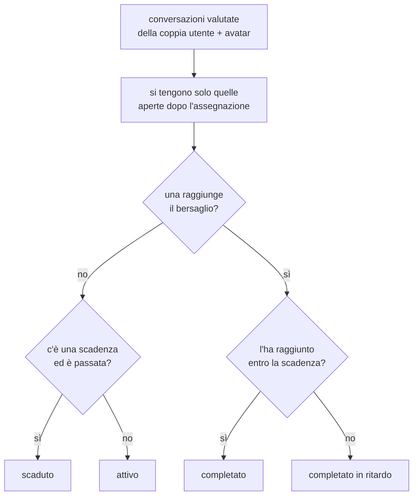

# Percorsi, notifiche e report

Quello che sta attorno all'esercizio: gli obiettivi che un docente assegna, gli
avvisi che ne derivano, il confronto fra i propri tentativi e i cruscotti di
chi guarda una classe.

Tutte queste cose hanno in comune una scelta: **niente stato salvato**. Il
completamento di un obiettivo, le notifiche e i numeri dei cruscotti si
ricalcolano a ogni lettura dalle righe che li descrivono già.

## I percorsi assegnati

Un obiettivo è una frase sola: "raggiungi 7 con Mario Rossi", con una scadenza
facoltativa. Sta in [routers/training.py](../backend/routers/training.py).

**Chi assegna.** Entrambi i ruoli di amministrazione. Un organization admin è
chi insegna davvero ai propri studenti, e far passare ogni obiettivo dal super
admin metterebbe in mezzo un estraneo al corso. A confinarlo è il tenant, come
sempre: parte solo da un avatar della propria organizzazione, e siccome un
obiettivo finisce sempre su utenti dell'organizzazione dell'avatar, i suoi
allievi possono essere solo i suoi.

**Chi può riceverlo.** L'elenco delle persone assegnabili sta accanto alla
creazione, di proposito: il selettore e il controllo che rifiuta una richiesta
sbagliata devono condividere una sola definizione, invece di lasciarne una
copia nel frontend che col tempo si scosta. Sono gli utenti attivi di quel
tenant, super admin escluso perché non appartiene a nessuno.

### Il progresso, ricavato in lettura

Un obiettivo è completato quando **una conversazione valutata, con
quell'avatar, aperta dopo la creazione dell'obiettivo**, raggiunge il
punteggio richiesto.

Due conseguenze volute:

- **l'allenamento fatto prima non completa un obiettivo**. L'obiettivo è
  qualcosa da fare, non un premio per quello che c'era già;
- **niente resta appeso**. Cancellare una conversazione o rifarne il giudizio
  non può lasciare in giro una spunta vecchia, perché non c'è nessuna spunta
  salvata.

Il punteggio usato è quello **finale**, correzione del docente compresa: uno
studente a cui è stato detto 7.5 non deve trovarsi l'obiettivo ancora aperto
perché la macchina aveva detto 6. Vedi [valutazione.md](valutazione.md).

Le letture sono fatte con una query sola per tutta la pagina, e il taglio per
obiettivo (solo le conversazioni successive alla sua creazione) avviene in
Python, perché due obiettivi possono condividere la stessa coppia utente e
avatar.

La derivazione sta in [training_progress.py](../backend/training_progress.py)
e non nel router che la mostra: è una regola, non una risposta HTTP, e da lì
si legge per intero senza attraversare le rotte, i permessi e gli audit che le
stanno attorno.

**Dove si vedono.** Lo studente li trova in cima alla home
([TrainingGoals](../frontend/src/components/TrainingGoals.tsx)), gli
amministratori in `/admin/training`
([TrainingPage](../frontend/src/components/TrainingPage.tsx)).

## Le notifiche

Quattro cose succedono a uno studente mentre non sta guardando: gli viene
assegnato un obiettivo, la scadenza si avvicina, la scadenza passa, un docente
pubblica una revisione di una sua conversazione. Prima venivano scoperte per
caso, al login successivo.

Nessuna di queste è **salvata** come notifica
([notifications.py](../backend/notifications.py)): si ricavano dalle righe che
già le descrivono. Una notifica salvata è una copia che invecchia: sposta una
scadenza e un "scaduto" salvato continua ad annunciare una cosa che non è più
vera; cancella un obiettivo e la sua notifica gli sopravvive. Derivate,
smettono semplicemente di essere prodotte.

| Tipo | Quando |
| --- | --- |
| `assignment.assigned` | Un obiettivo è stato assegnato |
| `assignment.due_soon` | La scadenza è entro tre giorni |
| `assignment.overdue` | La scadenza è passata e l'obiettivo non è raggiunto |
| `review.published` | Un docente ha pubblicato o rivisto una revisione |

L'unica cosa scritta è **cosa è già stato letto** (`notification_reads`), perché
quello è il solo fatto che nessuna query può ricostruire.

Ogni voce porta una chiave stabile che la identifica fra una richiesta e
l'altra, così il segno di lettura continua a corrispondere. La chiave di una
revisione contiene il momento dell'ultima modifica, ed è voluto: un docente che
rivede il proprio verdetto produce una chiave nuova, quindi una notifica non
letta, perché lo studente quella versione non l'ha davvero vista.

## Il confronto fra tentativi

`/confronto` ([ComparisonPage](../frontend/src/components/ComparisonPage.tsx)),
servito da [routers/comparison.py](../backend/routers/comparison.py).

Uno studente vede i propri tentativi e quelli di nessun altro. Un admin sceglie
una persona del proprio ambito e legge i suoi, **una persona alla volta**: non
c'è nessun modo di mettere due studenti fianco a fianco, e non è una mancanza.
Quella schermata esiste per rispondere a "sono migliorato?", e una classifica
fra studenti è una domanda diversa, con conseguenze diverse dentro un'aula.

Un utente normale che passasse l'id di qualcun altro se lo vede **ignorare**,
non rifiutare: la risposta a cui ha diritto è la stessa in entrambi i casi, e
un 403 confermerebbe che quell'id esiste.

Anche qui i punteggi passano da `final_score`, altrimenti il confronto
contraddirebbe la pagella che lo studente ha in mano.

**Anche il confronto ha due linguette**, come la dashboard: le conversazioni
valutate (`GET /api/comparison/attempts`) e i test tecnici
(`GET /api/comparison/simulation-attempts`), una prova per volta. La persona
invece si sceglie **una volta sola, sopra le linguette**: è sempre la stessa di
cui si guardano entrambe, e ripetere il selettore in ciascuna metà sarebbe due
modi di dire la stessa cosa.

| Metà | Componente | Cosa c'è sotto i due voti |
| --- | --- | --- |
| Conversazioni | [ComparisonConversations](../frontend/src/components/ComparisonConversations.tsx) | I sei criteri della valutazione, appaiati per chiave |
| Test tecnici | [ComparisonSimulations](../frontend/src/components/ComparisonSimulations.tsx) | Le domande capitate in tutte e due le prove, appaiate per id: quali sbagli sono stati recuperati e quali persi |

Il dettaglio domanda per domanda **compare solo fra due prove sullo stesso
test**, e le domande si appaiano per id e mai per posizione: una domanda
riscritta dopo il primo tentativo è una domanda diversa, e appaiarla sulla
posizione direbbe che è stata recuperata quando non è nemmeno la stessa. Da
quando ogni tentativo estrae dieci domande a caso dal serbatoio di cinquanta
(vedi [simulatore.md](simulatore.md)), la posizione è anche il posto in una
fila che l'altro tentativo non ha avuto, e **si confrontano solo le domande
capitate in tutte e due**: una vista una volta sola non è né recuperata né
persa, non è stata chiesta, e le due prove possono non averne nessuna in
comune, cosa che la pagina dice invece di mostrare una tabella vuota. Le
risposte viaggiano già con l'elenco dei tentativi invece di aspettare una
seconda chiamata sui due scelti: sono l'unica cosa che rende confrontabili due
prove sullo stesso test, che è il motivo per cui uno lo rifà.

Il selettore delle persone conta **entrambe le prove**: chi ha solo svolto dei
test deve poterci finire, o la metà scritta si aprirebbe su nessuno.

## I cruscotti e i report

Tre schermate per chi amministra, tutte confinate dallo stesso `resolve_admin_scope`:

| Schermata | Endpoint | Cosa mostra |
| --- | --- | --- |
| `/admin/dashboard` | `GET /api/admin/evaluations-report` | I punteggi delle valutazioni, per grafici e medie |
| `/admin/dashboard` | `GET /api/admin/simulations-report` | I test tecnici consegnati, con voto e risposte esatte |
| `/admin/report` | `GET /api/admin/users-report` | Una riga per persona: le due prove svolte, apribili e cancellabili una a una |
| `/admin` | `GET /api/admin/users` | La tabella degli utenti, filtrata e paginata |

**La dashboard e il report rispondono a due domande diverse**, ed è quello che
li tiene separati invece di farne due viste della stessa cosa. La dashboard
guarda un gruppo e cerca una media; il report guarda **una persona alla
volta** e cerca cosa ha fatto. Per questo le medie stanno tutte di là, e di
qua ci sono le prove una per una, ognuna col proprio voto.

**La dashboard ha due linguette**, una per prova: le conversazioni con gli
avatar e le simulazioni tecniche
([DashboardSimulations](../frontend/src/components/DashboardSimulations.tsx)).
Si guarda una prova per volta, e non una sotto l'altra: "come parlano" e "cosa
sanno" sono due domande, e in una colonna sola i grafici della seconda si
leggerebbero come il seguito della prima. Il conteggio sulla linguetta dice
subito da che parte ci sono dati.

Stessi filtri in cima (organizzazione e utente) e stessi disegni
([scoreCharts](../frontend/src/components/scoreCharts.tsx):
andamento nel tempo, righe a barra, card dei KPI), perché la domanda è la
stessa e cambia solo la prova su cui si risponde. Sull'asse orizzontale della
sezione scritta, al posto dei sei criteri di una valutazione, ci sono le
simulazioni svolte: quale test la gente non passa è la cosa che quella metà sa
dire e l'altra no.

Due query separate e non una: chi non usa il simulatore non deve pagare la
scansione dei tentativi dentro la lettura delle valutazioni. I tentativi sono
raccolti per **organizzazione di chi ha svolto il test**, non della simulazione:
la dashboard di un tenant parla della propria gente, e un test preparato
altrove sparirebbe dai suoi numeri.

**Ogni metà ha il proprio selettore di prova**, nello stesso posto della barra
dei filtri e con lo stesso gruppo di pulsanti
([FilterTabs](../frontend/src/components/FilterTabs.tsx), estratto dal
selettore di canale quando è servito il gemello): di là chiamate, chat o
entrambe, di qua scelta multipla, risposta aperta o entrambi. Non può essere
un selettore solo, perché è la stessa domanda ("quale delle due sto
guardando") fatta su due cose diverse.

Le opzioni dei due gruppi non vivono nella dashboard: stanno accanto alla
parola che il badge mostra (`MODE_FILTERS` in `ConversationModeBadge`,
`KIND_FILTERS` in `simulationFormat`), perché anche lo storico del report
attività fa le stesse due domande e due elenchi separati finirebbero per
offrire scelte diverse nelle due schermate. I default invece restano qui, e
sono una decisione di questa pagina.

La scelta **sta a monte di tutto**: KPI, andamento, medie per test e confronto
fra utenti partono dalle righe già ristrette, perché una media che mescola due
prove diverse non risponde alla domanda che il selettore ha appena posto. Il
filtro utente invece continua solo a evidenziare nel confronto fra utenti, e
non a restringerlo: quello è un modo di guardare, il tipo è la prova di cui si
parla. Quando il filtro non lascia niente la sezione lo dice con parole sue,
perché "nessun test ancora consegnato" davanti a un filtro attivo si legge
come un dato sbagliato.

Un default diverso nelle due metà, e non è una svista. Il canale parte da
"Chiamate", perché al telefono e in chat non si è valutati alla pari e
mescolarli di default darebbe una media ambigua. Il tipo parte da "Entrambi",
perché i test a risposta aperta sono arrivati dopo e un default che ne
mostrasse un tipo solo terrebbe nascosta metà della dashboard a chi non sa che
il selettore esiste.

**Ogni riga dice di che prova si tratta**, in tutte e due le metà. Là una
conversazione è al telefono o in chat
([ConversationModeBadge](../frontend/src/components/ConversationModeBadge.tsx)),
qui un test è a scelta multipla o a risposta aperta
([SimulationKindBadge](../frontend/src/components/SimulationKindBadge.tsx)): due
badge gemelli, stessa forma e stessi colori, violetto dove si sceglie o si
parla e ciano dove si scrive. Il motivo è lo stesso nei due casi, cioè che il
voto da solo non dice quale prova era, e nel simulatore pesa anche di più: un
7 preso a crocette in trenta secondi e un 7 preso scrivendo dieci risposte non
sono la stessa notizia. Nella tabella il badge è in forma di sola icona per
non rubare spazio al titolo, e in entrambe le metà **la prova si cerca con la
stessa parola che il badge mostra**, perché quella parola (`kindLabel` di qua,
`conversationModeLabel` di là) finisce nella `matchesSearch` della riga. La riga "Media per simulazione" lo scrive accanto
al conteggio dei tentativi: lì si parla del test, e come ci si risponde è una
sua proprietà quanto quante volte è stato svolto.

Il tipo arriva dal server insieme al tentativo (`simulation_kind` su
`SimulationReportRow` e su `SimulationComparisonAttempt`, letto dalla
simulazione con la join che c'era già), non viene dedotto dalla forma delle
risposte: una fotografia si legge per quello che dice, non indovinando.

Accanto viaggia `simulation_source`, chi aveva scritto quelle domande, e ha una
targhetta sua (`SimulationSourceBadge`) che sta sempre a fianco di quella del
tipo. Quella però non scrive mai la sua parola, in nessuna schermata: è
un'icona con il tooltip, perché appaiata a una pastiglia scritta allungherebbe
ogni riga per dire una cosa che l'icona dice da sola, e perché il colore è già
preso dal tipo e dallo stato. La parola (`sourceLabel`) resta comunque nella
`matchesSearch` della riga: si cerca "manuale" anche se sullo schermo quella
parola non compare.

I voti dei test non passano da `final_score` e non hanno un `has_override`:
nessuno li corregge a mano, e il voto resta quello congelato sul tentativo,
sia che l'abbia deciso il confronto fra due numeri sia un modello che ha letto
delle risposte scritte (vedi [simulatore.md](simulatore.md)).

Il dettaglio di una conversazione vista da un admin
(`GET /api/admin/conversations/{id}`) porta trascrizione, valutazione e
revisione insieme, ed è da lì che parte la correzione descritta in
[valutazione.md](valutazione.md).

Il gesto è lo stesso nella metà scritta: il clic su una riga della tabella dei
test apre il tentativo per intero
([SimulationAttemptModal](../frontend/src/components/SimulationAttemptModal.tsx)),
che ricarica le risposte da `GET /api/simulations/attempts/{id}` perché nel
report ci sono il voto e i conteggi ma non le risposte, e sono quelle il motivo
per cui si apre. La pagina è la stessa che lo studente vede subito dopo aver
consegnato ([SimulationResult](../frontend/src/components/SimulationResult.tsx)),
in terza persona invece che in seconda: chi corregge deve leggere esattamente
quello che leggerà chi ha sbagliato.

**L'esportazione.** `GET /api/admin/evaluations-report/export` produce un foglio
di calcolo con le stesse righe che si vedono a schermo
([exports.py](../backend/exports.py), che genera anche il PDF del referto).
Come ogni altra lettura, i voti sono quelli finali.

## Il report attività

`/admin/report`
([UserReportPage](../frontend/src/components/UserReportPage.tsx)): una riga per
persona, e su quella riga tutto quello che quella persona ha fatto.

Prima la riga diceva **quante conversazioni** e **quanti minuti**, cioè solo
quanto l'app era stata usata. Sono i due numeri che dicono meno: mezz'ora di
chiamate non è una notizia, e chi si allenava solo sul simulatore compariva
come una riga vuota. Ora la riga porta:

| Colonna | Cosa risponde |
| --- | --- |
| Conversazioni | Quante ne ha avute nel periodo |
| Simulazioni | Quante ne ha consegnate nel periodo |
| Durata | Il tempo passato a parlare, che resta ma non comanda più |

**Nella riga non c'è nessuna media.** Il voto appartiene alla singola prova e
si legge lì, nello storico che si apre sotto; una media per persona accanto a
un conteggio farebbe leggere due cose diverse come se fossero una, e una media
sul gruppo la scrive già la dashboard. La riga risponde a quanto e a cosa, il
dettaglio a com'è andata.

Gli obiettivi assegnati non compaiono qui: hanno già la loro schermata in
`/admin/training`, dove si vedono uno per uno con la scadenza e il progresso,
e un "2 su 3" in questa riga sarebbe la stessa cosa detta peggio. L'ultimo
accesso, allo stesso modo, resta nella tabella degli utenti in `/admin`, che è
dove si guarda lo stato di un account e non cosa ci si è fatto dentro.

**I voti dello storico sono quelli finali**, correzione del docente compresa,
come ovunque: un report che mostrasse il numero della macchina
contraddirebbe la pagella che lo studente ha in mano. Una conversazione non
ancora valutata **non è uno zero**: al posto del voto c'è "n.d.", perché uno
zero sarebbe una bocciatura mai data.

**Il periodo** (sempre, 7, 30 o 90 giorni) restringe le prove e i conteggi:
il numero di chi si allena da un anno non dice cosa ha fatto
adesso. Parte da "sempre" e non da un mese, per la stessa ragione per cui il
tipo di test nella dashboard parte da "entrambi": un filtro già acceso mostra
una tabella mezza vuota a chi non sa che esiste, e quella si legge come un
dato sbagliato invece che come una scelta. Il periodo e la durata stanno in
[reportFormat.ts](../frontend/src/components/reportFormat.ts), le date le
scrive [lastAccess.ts](../frontend/src/components/lastAccess.ts), lo stesso
file della tabella degli utenti, così due punti dell'area di amministrazione
non dicono la stessa data in due modi diversi.

**Gli utenti restano tutti in elenco** anche quando il periodo non lascia loro
nessuna prova: una riga a zero è la risposta a "chi non si sta allenando", e
sparendo dalla tabella si porterebbe via la domanda.

**Sotto la riga, due linguette**
([UserReportDetail](../frontend/src/components/UserReportDetail.tsx)): le
conversazioni di qua, le simulazioni di là, come nella dashboard e nel
confronto. "Come parla" e "cosa sa" sono due domande, e in una lista sola la
seconda si leggerebbe come il seguito della prima; il conteggio sulla
linguetta dice da che parte ci sono dati prima di aprirla. Si apre sulla prova
che la persona ha davvero svolto: chi ha solo fatto simulazioni troverebbe
altrimenti una linguetta vuota, e dovrebbe scoprire da sé che l'altra non lo
è.

**Accanto alle linguette, tutto a destra, il filtro e la ricerca della prova
attiva**, e cambiano con lei: di una conversazione si chiede il canale
(chiamate, chat, entrambe), di una simulazione il tipo (scelta multipla,
risposta aperta, entrambi), e sono due domande che all'altra metà non si
possono nemmeno fare. Le opzioni sono le stesse della dashboard e stanno
scritte una volta sola, accanto alla parola che il badge mostra: `MODE_FILTERS`
in [ConversationModeBadge](../frontend/src/components/ConversationModeBadge.tsx)
e `KIND_FILTERS` in
[simulationFormat](../frontend/src/components/simulationFormat.ts). Anche qui
**la prova si cerca con la stessa parola del badge**: chi legge "Chat" su una
riga si aspetta che scrivere "chat" gliela trovi.

**I tre filtri si sommano**, in quest'ordine: il periodo restringe lato server
quello che arriva, il canale (o il tipo) restringe quelle righe, la ricerca
restringe ancora quello che resta. Il conteggio sulla linguetta lo dice:
finché non c'è nessun filtro locale è il totale del periodo ("Conversazioni
(12)"), appena ne accendi uno diventa quante ne restano su quante erano
("Conversazioni (3 di 12)"). Un dodici accanto a tre righe si leggerebbe come
un errore, e un tre da solo nasconderebbe che sotto quel filtro c'è dell'altro.
Il "di" compare anche sulla linguetta che non si sta guardando, perché è la
verità di quella metà e dice che di là un filtro è rimasto acceso. La colonna
della tabella invece resta sul totale del periodo: parla della persona, non
di come si sta guardando il suo storico.

**Filtro e ricerca sono due per metà, non due in comune.** Una ricerca scritta
sulle conversazioni, portata di peso sulle simulazioni, svuoterebbe la lista
senza che sia successo niente, e chi passa di là leggerebbe "nessun risultato"
come se non ci fosse mai stato nulla. Partono entrambe da "tutto", perché il
report serve a vedere cosa una persona ha fatto e un filtro già acceso ne
nasconderebbe una parte. E quando è un filtro a non lasciare niente la lista
lo dice con parole sue ("nessuna conversazione **con questi filtri**"), che è
una notizia diversa da "nessuna nel periodo scelto".

La casella di ricerca è la stessa della tabella, estratta da DataTable in
[SearchInput](../frontend/src/components/SearchInput.tsx) quando è servita
anche fuori da una tabella: due caselle scritte due volte a due centimetri
l'una dall'altra prima o poi non si somigliano più.

**Le due righe si comportano allo stesso modo**: si aprono per leggere com'è
andata e si possono togliere. Il clic su una conversazione apre trascrizione e
valutazione con la stessa
[ConversationDetailModal](../frontend/src/components/ConversationDetailModal.tsx)
della dashboard, pannello di revisione compreso, così da qui si può anche
correggere un voto; il clic su una simulazione apre il tentativo per intero
con la stessa
[SimulationAttemptModal](../frontend/src/components/SimulationAttemptModal.tsx).
In tutti e due i casi il motivo è lo stesso: nella riga c'è il voto ma non
quello che l'ha prodotto, e il voto da solo non dice a chi corregge dove si è
girato male.

Perché la modale della conversazione sia potuta arrivare qui ha smesso di
volere una riga del report valutazioni intera: adesso chiede solo chi ha
parlato con chi e quando (`ConversationDetailTarget`), che è la sua
intestazione, e il resto lo carica dall'id. Il report attività elenca anche le
conversazioni **mai valutate**, e una riga di valutazione per quelle non
esiste proprio.

Le modali stanno **fuori dalla tabella** e non dentro il dettaglio, perché il
riquadro della tabella sfoca lo sfondo, e una schermata intera aperta lì
dentro resterebbe confinata al riquadro. Dentro la riga, il cestino è un
bersaglio separato dal resto: aprire e cancellare sono due gesti sulla stessa
riga, ed è lì che si confondono.

**Anche una simulazione si cancella da qui**
(`DELETE /api/admin/simulation-attempts/{id}`), gemello della cancellazione di
una conversazione e per la stessa ragione: le due prove si tolgono dallo
stesso posto, e una prova cancellabile solo se è una conversazione lascerebbe
lì per sempre il test aperto per sbaglio o svolto da chi non doveva. Sparisce
il **tentativo**, cioè la fotografia di quelle dieci risposte, e la
simulazione resta lì da rifare: la conferma lo scrive, perché è tutta lì la
differenza. Lo scope è l'organizzazione di chi ha svolto il test, come nel
report che lo elenca.

Lato server è una lettura sola ([admin.py](../backend/routers/admin.py)) con
due query separate, una per prova: chi non usa il simulatore non deve pagare
la scansione dei tentativi dentro quella delle conversazioni.

## Le due date di un account

Nella tabella degli utenti compaiono due colonne che sembrano la stessa cosa e
non lo sono:

| Colonna | Cosa dice |
| --- | --- |
| `last_login_at` | L'ultimo accesso vero. Non lo tocca il rinnovo del token, perché ruotare un token non è un accesso |
| `last_activity_at` | L'ultima volta che l'account è stato visto vivo, scritta da qualunque richiesta autenticata |

Servono entrambe perché una sessione si rinnova da sola finché il browser resta
aperto: la data di accesso può essere di settimane fa mentre la persona sta
lavorando adesso. NULL su `last_login_at` vuol dire un invito mandato e mai
accettato, che è un problema diverso da un account dormiente e va visto come
tale.

L'attività si scrive a intervalli, non a ogni richiesta
([activity.py](../backend/activity.py)): una UPDATE per ogni click di ogni
utente collegato sarebbe un prezzo assurdo per un dato che si legge in una
scheda di amministrazione. E le rotte che il browser interroga da solo (le
notifiche, per dire) sono escluse: senza quella lista, una scheda dimenticata
aperta sembrerebbe qualcuno che sta lavorando.
