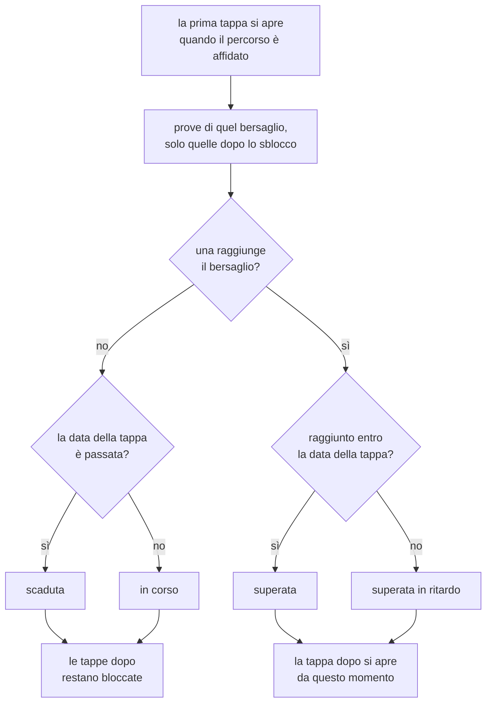

# Percorsi, notifiche e report

Quello che sta attorno all'esercizio: i percorsi che un docente compone e
assegna, gli avvisi che ne derivano, il confronto fra i propri tentativi e i
cruscotti di chi guarda una classe.

Tutte queste cose hanno in comune una scelta: **niente stato salvato**. Il
completamento di una tappa, le notifiche e i numeri dei cruscotti si
ricalcolano a ogni lettura dalle righe che li descrivono già.

## I percorsi

Un percorso è una **sequenza numerata di tappe**, e ogni tappa è un obiettivo
su un avatar oppure su una simulazione tecnica: "arriva a 7 con Mario Rossi,
poi passa il test sulle procedure di cassa con almeno 6". La successiva si
apre solo quando quella prima di lei è stata superata. Sta in
[routers/training.py](../backend/routers/training.py).

Prima era un obiettivo solo, un utente su un avatar. Andava bene finché
allenarsi voleva dire una conversazione; non sapeva dire "prima parla con
questo cliente, poi dimostra di conoscere la procedura", che è come si insegna
davvero un mestiere. Le vecchie righe non sono state convertite: una di quelle
non è un percorso di una tappa, perché non ha né il percorso a cui appartenere
né il tipo di bersaglio, e la migrazione porta via la tabella
([startup_migrations.py](../backend/startup_migrations.py)).

**Un percorso è un modello, non una copia per allievo.** Si compone una volta
e si affida a quante persone si vuole; correggere l'obiettivo di una tappa
vale subito per tutti quelli che lo stanno percorrendo, ed è esattamente il
motivo per cui esiste come riga a sé. Il progresso non ne soffre perché non è
salvato da nessuna parte: si rilegge dalle tappe che ci sono adesso.

Le tre tabelle ([models.py](../backend/models.py)):

| Tabella                     | Cosa tiene                                                                      |
| --------------------------- | ------------------------------------------------------------------------------- |
| `training_paths`            | Il percorso: titolo, descrizione, tenant                                        |
| `training_path_steps`       | Una tappa: posto nella fila, bersaglio, obiettivo, soglie sui criteri, scadenza |
| `training_path_assignments` | Il percorso affidato a una persona, e quando                                    |

Sulla tappa il bersaglio è **una colonna o l'altra**, mai tutte e due e mai
nessuna, e a imporlo è un vincolo sulla tabella: è la stessa forma delle
chiavi di una domanda di simulazione, dove ogni tipo riempie la propria
colonna e lascia stare le altre (vedi [simulatore.md](simulatore.md)).

**Una tappa di conversazione può chiedere anche dei minimi sui singoli
criteri.** Sta in `criteria_targets`, `{chiave del criterio: voto}`, e le
chiavi sono quelle canoniche della valutazione (vedi
[valutazione.md](valutazione.md)). Si scrivono una per una: ci stanno solo i
criteri su cui quella tappa insiste, e sulle altre la colonna resta vuota.

Servono a una cosa che il solo voto complessivo non sa fare. Quel voto è la
media pesata dei sei criteri, quindi un criterio andato male lo coprono gli
altri cinque, e una tappa pensata per allenare l'empatia si supera lo stesso
restando freddi. Una soglia sul criterio è la condizione che la media non può
assorbire.

Le condizioni valgono **tutte insieme e sulla stessa conversazione**: il voto
complessivo e ognuno dei criteri richiesti. Due prove che si completano a
vicenda, una buona sull'empatia e una buona sulla casistica, non fanno una
prova buona. Sui criteri conta il punteggio dell'AI e non esiste un
equivalente della correzione del docente, per la stessa ragione per cui non
esiste nel referto: un docente corregge il verdetto nel suo insieme, non i sei
numeri che ci stanno sotto. Quindi una correzione decide il complessivo, e i
criteri restano quelli della macchina.

Su un test tecnico non ci sono: un test non si valuta per criteri, si
consegna, e il server rifiuta una tappa su simulazione che ne porti.

**La scadenza è una data con l'ora, scritta quando si compone il percorso.**
Sta sul calendario, quindi è la stessa per chiunque percorra quel percorso e
corre anche mentre la tappa è ancora chiusa: si legge da subito, e a dire che
la tappa non si è ancora aperta resta lo sblocco. È facoltativa, e una tappa
senza data non scade mai.

La conseguenza voluta di una data a calendario è che **un percorso vecchio va
ridatato prima di affidarlo di nuovo**: le sue tappe hanno i termini decisi
allora, e per chi lo riceve oggi sono già passati. Il percorso resta un
modello riusabile in tutto il resto, e riscrivere le date è una passata sola
nel form di composizione.

**Chi compone e chi assegna.** Entrambi i ruoli di amministrazione. Un
organization admin è chi insegna davvero ai propri studenti, e far passare
ogni percorso dal super admin metterebbe in mezzo un estraneo al corso. A
confinarlo è il tenant, come sempre: il percorso è di una sola organizzazione,
le sue tappe possono puntare solo agli avatar e ai test di quella, e si affida
solo a utenti di quella.

**Di cosa può essere fatta una tappa** lo dice `GET /assignable-content`: gli
avatar non archiviati e le simulazioni pubblicate del tenant, e i criteri su
cui una tappa di conversazione può porre una soglia. I criteri non dipendono
dall'organizzazione e viaggiano di lì lo stesso, perché è la chiamata con cui
il form scopre di cosa può essere fatta una tappa: le loro etichette e i loro
pesi arrivano dalla lista canonica, così chi compone legge le stesse parole
che leggerà nel referto. Sta accanto alla
validazione che rifiuta una tappa sbagliata, per la stessa ragione per cui ci
sta `assignable-users`: il selettore e il controllo devono condividere una
definizione sola, invece che il frontend ne tenga una copia libera di
divergere. Una bozza o un avatar archiviato prendono **409 e non 404**: quelli
esistono, e chi compone il percorso li sta guardando nel proprio pannello,
solo non sono qualcosa che si possa svolgere. E una tappa che nessuno può
superare non è un dettaglio, perché terrebbe chiuse tutte quelle dopo di lei.

**Chi può ricevere un percorso.** Gli account attivi di quel tenant che hanno
il ruolo `user`, cioè chi si allena. I due ruoli di amministrazione restano
fuori: il super admin perché non appartiene a nessun tenant, l'organization
admin perché la sezione da cui un percorso si svolge non è sua, e affidargliene
uno vorrebbe dire scrivere un incarico che il destinatario non può nemmeno
aprire. La stessa regola vale in `GET /assignable-users`, che alimenta il
selettore, e in `POST /assignments`, che risponde 400 a un id di
amministratore. Le assegnazioni finite su un admin prima di questa regola
restano dove sono, ma non si annunciano più e non si aprono: si ritirano dalla
gestione percorsi come qualsiasi altra. Lo stesso percorso non si
affida due volte alla stessa persona, e chi ce l'ha già viene **lasciato
stare** invece che far fallire la richiesta: selezionare tutta
l'organizzazione e assegnare ai tre nuovi arrivati è il gesto normale, e un
errore su tutto costringerebbe a spuntare a mano chi c'era già.

### Il progresso, ricavato in lettura

Una tappa è superata quando **una prova svolta dopo il suo sblocco** raggiunge
il punteggio richiesto. La prova è una conversazione valutata con l'avatar
della tappa, oppure un test tecnico consegnato se la tappa è una simulazione;
in entrambi i casi il voto è in decimi, che è quello che permette alle due
forme di stare sulla stessa scala e sotto la stessa barra. Dove ci sono anche
delle soglie sui criteri, "raggiunge il punteggio richiesto" vuol dire quella
conversazione lì che raggiunge il complessivo e ognuno dei criteri.

Il JSON della valutazione, da cui escono i voti per criterio, si legge **solo
quando qualche tappa dei criteri li chiede**: è la colonna più pesante della
riga, con commenti, suggerimenti e citazioni dentro, e una pagina di trenta
allievi su percorsi che guardano il solo voto complessivo non se la trascina
dal database per poi buttarla.

**Scaduta e aperta sono due cose diverse.** Il diagramma racconta una tappa
aperta, ma la data corre anche sulle altre: una tappa ancora chiusa il cui
termine è passato risponde `overdue`, e il percorso con lei. Non è un modo di
dire che si può cominciare, perché a dirlo è `unlocked_at`, che resta vuoto:
lo stato dice se la tappa è in tempo, lo sblocco se è il suo turno. Nel
frontend a tenerle separate è
[`isStepLocked`](../frontend/src/components/trainingFormat.ts), che guarda lo
sblocco e non lo stato, così nessuna schermata offre una strada dentro una
tappa che il percorso non ha ancora aperto.

Tre conseguenze volute:

- **l'allenamento fatto prima non supera niente**, né quello precedente
  all'assegnazione né quello fatto mentre la tappa era ancora chiusa. Una
  tappa è qualcosa da fare quando è il suo turno, non un premio per quello che
  c'era già;
- **il blocco vive dentro il percorso, non sulla risorsa**. L'avatar e il test
  restano aperti a tutti dalla galleria e dalla pagina delle simulazioni: il
  percorso decide in che ordine le prove contano, non cosa si può aprire. Un
  lucchetto vero toglierebbe l'allenamento libero su quelle risorse a chi il
  percorso ce l'ha, e lo stesso avatar può stare in due percorsi a due
  posizioni diverse;
- **niente resta appeso**. Cancellare una conversazione o rifarne il giudizio
  non può lasciare in giro una spunta vecchia né una tappa sbloccata da un
  fatto che non è più vero, perché non c'è nessuna spunta salvata.

Il punteggio di una conversazione è quello **finale**, correzione del docente
compresa: uno studente a cui è stato detto 7.5 non deve trovarsi la tappa
ancora aperta perché la macchina aveva detto 6 (vedi
[valutazione.md](valutazione.md)). Quello di un test è il voto congelato sul
tentativo, che nessuno corregge a mano (vedi [simulatore.md](simulatore.md)).

Le letture sono fatte con **due query per tutta la pagina**, una per forma di
prova, e il taglio per tappa avviene in Python: lo sblocco dipende dalla tappa
prima, e due percorsi possono chiedere lo stesso avatar in posizioni diverse.
Restano due query separate come ovunque nell'applicazione, così un percorso di
soli avatar non paga la scansione dei tentativi di simulazione per scoprire
che non ne ha.

La derivazione sta in [training_progress.py](../backend/training_progress.py)
e non nel router che la mostra: è una regola, non una risposta HTTP, e da lì
si legge per intero senza attraversare le rotte, i permessi e gli audit che le
stanno attorno.

**Dove si vedono.** Chi un percorso ce l'ha lo apre da `/app/percorsi`
([MyPathsPage](../frontend/src/components/MyPathsPage.tsx)), che è l'elenco dei
propri, e da lì entra nel singolo
([PathMapPage](../frontend/src/components/PathMapPage.tsx)). La voce in barra è
**del solo ruolo `user`**: comporre e assegnare è un altro mestiere, sta nel
menu di amministrazione, e chi lo fa non riceve percorsi. La chiusura è in
tutti e tre i punti, perché nasconderla in barra non basta: le rotte
`/app/percorsi` chiedono `access="user"` a
[RequireRole](../frontend/src/components/RequireRole.tsx), e
`GET /api/training/assignments/me` passa da `get_current_standard_user`, che a
un admin risponde **403 e non una lista vuota** — "non ne hai" e "non è roba
tua" sono due risposte diverse.

**Con un percorso solo la sezione salta l'elenco** e apre direttamente la sua
mappa ([MyPathsRoute](../frontend/src/components/MyPathsRoute.tsx), che è
l'elemento della rotta `/app/percorsi`). Un elenco di una riga non è una
scelta, è un passaggio in più fra la voce in barra e l'unica cosa che ci sta
dietro, e la scheda intermedia diceva soltanto il titolo che la mappa ripete in
testa. Il salto sostituisce il passo nella cronologia invece di aggiungerlo,
altrimenti "indietro" dalla mappa tornerebbe all'elenco e da lì ripartirebbe
subito in avanti; e finché la richiesta è in volo non si salta niente, perché
la lista vuota di quel momento non dice ancora quanti percorsi ci sono. Nella
mappa, di conseguenza, il ritorno "Tutti i Percorsi" non compare quando quel
percorso è l'unico: rimanderebbe a una pagina che rimbalza subito qui. Da due
in su non cambia niente, l'elenco resta la scelta fra i propri percorsi. La
decisione sta nella rotta e non dentro l'elenco perché sono due mestieri: uno
disegna i percorsi che ci sono, l'altro dice dove porta la voce in barra.

**Ogni percorso porta la firma di chi l'ha affidato**, nome e cognome e data,
in coda alla scheda dell'elenco e sotto il titolo nella mappa
([assignedByLabel](../frontend/src/components/trainingFormat.ts)). Un percorso
che compare da solo non dice a chi chiedere, e la data è quella da cui la prima
tappa conta, quindi le due cose stanno sulla stessa riga. Il nome arriva già
composto dal server (`assigned_by_name`) e manca quando quell'account è stato
cancellato, perché `assigned_by_id` va a NULL: in quel caso resta la sola data,
dato che il percorso è comunque arrivato in un giorno preciso.

Il singolo percorso è disegnato come una **mappa**
([PathTrailMap](../frontend/src/components/PathTrailMap.tsx)): le tappe sono
nodi su un sentiero che scende serpeggiando, e il tratto già camminato è
acceso, mentre il resto della strada è appena accennato. La fila di righe
rispondeva
alla domanda di chi guarda venti assegnazioni in una tabella; qui la domanda è
una sola e diversa, «a che punto sono io», e la risposta è dove finisce la
luce. Sapere cosa viene dopo resta metà del motivo per cui un percorso è una
fila, quindi si vedono tutte le tappe, lucchetti compresi.

**Un tratto si accende quando la tappa a cui porta si sblocca**, cioè
nell'istante in cui si supera quella prima di lei: chiusa la tappa 1 si
illumina la strada dalla 1 alla 2, e non un centimetro oltre. A percorso appena
affidato il sentiero è tutto spento.

A tenere quella promessa è una **maschera che taglia il sentiero a un'altezza**
([litUntil](../frontend/src/components/pathMapLayout.ts)), non una frazione
della sua lunghezza. La differenza non è di stile: la larghezza del disegno è
stirata per riempire la finestra, quindi le distanze lungo la curva valgono una
cosa nel disegno e un'altra sullo schermo, e il primo taglio, fatto con un
tratteggio normalizzato da `pathLength`, ballava fra le due misure al punto che
il fondo del sentiero risultava acceso a percorso appena cominciato. Il
sentiero però scende sempre, e una riga orizzontale lo stiramento non la tocca.

**La mappa ha una finestra sua, e non è la pagina.** Il sentiero scorre dentro
il proprio riquadro, si trascina col mouse, e i comandi in alto lo
rimpiccioliscono fino a farlo stare tutto sotto gli occhi: guardare cosa viene
fra sei tappe è un gesto, non un viaggio in fondo alla pagina che si porta via
anche il pannello. Da qualunque punto si torna alla tappa di adesso con un
bottone solo, e all'apertura la finestra ci è già sopra.

La finestra si sposta da sola due volte soltanto, all'apertura e al cambio di
riduzione, e su quale tappa si centri è quello che c'è in quel momento, letto
da un riferimento e non dalle dipendenze dell'effetto: scegliere un nodo non
deve spostare la mappa, o aprire una tappa lontana porterebbe via il tratto di
sentiero che si sta guardando. Scorrendo cambiano solo le sfumature ai bordi,
che sono quattro combinazioni in tutto e si riscrivono solo quando cambiano
davvero: le posizioni dei nodi e la stringa del tracciato restano quelle, o
ogni fotogramma di un trascinamento rifarebbe da capo il conto dell'intera
mappa.

La riduzione **rifà il conto delle posizioni** invece di rimpicciolire con un
`transform` il disegno già fatto: a stringersi sono le distanze fra le tappe,
mentre la larghezza è una percentuale e resta quella della finestra, che è
l'unica direzione in cui una mappa di questa forma può mostrare più cose. Sotto
una certa misura i nomi sotto ai nodi non ci stanno più e vengono tolti, non
lasciati illeggibili: restano nel tooltip e nell'etichetta che legge lo
screen reader.

Un nodo porta il numero e il nome, perché è quanto serve per capire dove si è;
l'obiettivo, la scadenza, i tentativi e il bottone che apre la chat o il test
stanno nel riquadro della tappa
([PathStepPanel](../frontend/src/components/PathStepPanel.tsx)). **Anche una
tappa bloccata si sceglie**, e il riquadro risponde con il motivo per cui non
si può ancora cominciare invece che con un bottone: quella tappa esiste ed è la
prossima.

Dove la tappa pone anche delle soglie sui criteri, sotto la barra c'è quali
sono e a che punto stanno
([StepCriteriaProgress](../frontend/src/components/StepCriteriaProgress.tsx)),
e la stessa riga compare nella fila delle tappe che legge un amministratore.
Senza, una tappa con la barra piena e lo stato ancora aperto sarebbe una tappa
che non si capisce: il complessivo è arrivato, e a mancare è una condizione
che non si vede. Il numero accanto alla soglia è il **meglio fatto criterio
per criterio**, anche su conversazioni diverse, quindi tutti verdi non vuol
dire tappa superata: quella la supera una conversazione che li raggiunge
insieme.

**La pagina si apre sulla sola mappa, e il riquadro arriva scegliendo un
nodo** ([PathStepDrawer](../frontend/src/components/PathStepDrawer.tsx)). La
domanda con cui si entra in un percorso è dove si è arrivati, e a quella il
sentiero risponde da solo, con la luce che si ferma e l'alone attorno alla
tappa di adesso: il dettaglio è una seconda domanda, e prima che la si faccia
una colonna fissa lasciava al disegno un terzo di schermo senza dire niente in
più. Il riquadro si posa sul bordo destro della mappa invece che al centro
dello schermo, perché non è un discorso a parte, e sceglierne un'altra ne
cambia il contenuto senza chiudere niente. Si toglie di mezzo dal bottone, con
Esc, ricliccando il nodo da cui lo si è aperto, e su schermo stretto, dove
sale dal basso come un foglio, anche toccando fuori.

Aprendolo **la mappa gli fa posto invece di sparirci sotto**: il sentiero si
scosta dal centro fin quasi al bordo, quindi un pannello appoggiato lì
coprirebbe le tappe di destra, cioè metà di quelle che si guardano mentre lo
si legge. Le posizioni sono percentuali della larghezza, e restringere il
riquadro della mappa ricompone il sentiero invece di tagliarlo.

Il riquadro **prende il fuoco appena si apre e lo restituisce al nodo quando si
chiude**. Su schermo stretto è un foglio con un velo dietro, cioè copre tutto
quello che non è lui, e chi naviga da tastiera restava sul nodo appena premuto,
dietro al velo. Non trattiene il fuoco, però, e non è una dimenticanza: un
riquadro che chiude la strada da tastiera è una promessa che vale finché è una
modale, e questo lo è solo sotto una certa larghezza.

Dove il sentiero non ci sta (l'elenco) il percorso si riduce a un anello di
avanzamento
([PathProgressRing](../frontend/src/components/PathProgressRing.tsx)) e a una
fila di trattini colorati
([PathStepDots](../frontend/src/components/PathStepDots.tsx)): quante tappe
sono, in che ordine e a che punto, senza i nomi.

**Da entrambe le schermate si riprende in un colpo solo.** La scheda
dell'elenco e l'intestazione della mappa portano il bottone che va dritto alla
prova della tappa di adesso
([resumableStep](../frontend/src/components/trainingFormat.ts)), saltando il
nodo e il riquadro: la domanda con cui si apre questa sezione è quasi sempre
«cosa devo fare», e la risposta stava a tre clic. Su un percorso chiuso il
bottone non c'è, perché la tappa "di adesso" è l'ultima, cioè una prova già
superata, e invitare a rifarla sarebbe mandare indietro.

**Il termine si legge senza aprire niente**
([StepDeadline](../frontend/src/components/StepDeadline.tsx)): sulla scheda,
per la tappa in corso, e sulla mappa sotto ogni tappa che resta da fare,
lucchetti compresi, perché una tappa che scade fra due giorni ed è ancora
chiusa è il motivo per cui si guarda avanti sul sentiero. Non è la data così
com'è, ma la conclusione: "scade oggi alle 18:00", "scade fra 3 giorni", "il 02
apr", "scaduta il 08 mar"
([deadlineNote](../frontend/src/components/trainingFormat.ts)). L'ora resta
dove cambia qualcosa, cioè oggi e domani; la finestra dentro cui il termine si
accende è la stessa con cui il server manda l'avviso, tre giorni, perché una
scadenza annunciata dalla campanella non può essere scritta come una data
qualunque nella pagina che la mostra. Su un percorso chiuso non compare: è la
data di una corsa già corsa.

L'elenco tiene **i percorsi da chiudere e quelli chiusi in due metà distinte**
([splitByOpen](../frontend/src/components/trainingFormat.ts)), ognuna sotto il
proprio titolo quando esistono entrambe. I chiusi restano perché sono la strada
percorsa, ma l'unica cosa che li distingueva era l'opacità delle schede, e con
più di quattro o cinque percorsi il confine fra il debito e l'archivio andava
cercato scheda per scheda.

**Quale tappa è aperta sta nell'indirizzo**, come `?tappa=<numero>`: è la
seconda cosa che la mappa mostra, e tenuta in uno stato locale spariva a ogni
ricarica e non si poteva mandare a nessuno. Il numero e non l'id, perché è
quello scritto sul nodo, quindi un indirizzo copiato dice già di cosa parla; una
posizione che quel percorso non ha non apre niente. La prima apertura aggiunge
un passo alla cronologia e tutto il resto lo sostituisce, così "indietro"
chiude il riquadro invece di uscire dalla mappa, senza che dieci nodi guardati
di fila diventino dieci passi da rifare per tornare all'elenco.

La home è solo la galleria degli avatar. Prima aveva in cima una striscia con i
percorsi aperti, perché era l'unico posto in cui i percorsi esistevano; adesso
che hanno una sezione loro, quel promemoria è un doppione di ciò che sta a un
clic nella barra, e chi arriva in home ci arriva per scegliere un avatar.

Gli amministratori stanno in `/app/admin/training`
([TrainingPage](../frontend/src/components/TrainingPage.tsx)), **due linguette
perché sono due domande**: di cosa sono fatti i percorsi, e a che punto è la
propria gente. Prima era una schermata sola, dove il form di assegnazione
stava sopra la tabella e ogni assegnazione ricominciava dalla scelta
dell'avatar; comporre e seguire sono due lavori, e si fanno in due momenti
diversi della settimana. Nella tabella la riga dice quante tappe sono chiuse e
qual è quella aperta, e la fila intera si apre solo sulla riga che interessa:
sei tappe per venti persone tutte insieme sono una tabella che non si legge. La
riga si apre col mouse e col fuoco, perché è `onActivate` di
[DataTable](../frontend/src/components/DataTable.tsx) ad aprirla e non un
`onClick` scritto a mano: era l'ultima tabella dell'applicazione a rispondere
al solo clic, e chi naviga col Tab aveva la sola freccia in fondo alla riga.

**Le due linguette non sono due schermate separate.** Sulla scheda di un
percorso il numero di chi lo sta percorrendo è un collegamento: porta alla
linguetta accanto già ristretta su quel percorso, che è la domanda che quel
numero fa venire («chi sono, e a che punto»). Il filtro sta nella fascia della
tabella, accanto alla ricerca, e non in cima alla pagina insieme a quello per
organizzazione: quello vale per entrambe le linguette, questo parla delle sole
righe sotto. Lavora sulle righe già scaricate invece di richiedere al server le
assegnazioni di un percorso, perché sono un sottoinsieme di quelle che si
stanno già guardando; la rotta col `path_id` resta quella che serve alla
finestra di assegnazione, che di quel percorso ha bisogno da sola. Cambiando
organizzazione il filtro se ne va, perché quel percorso non è più fra quelli
che la tendina offre.

La finestra che affida il percorso
([AssignPathModal](../frontend/src/components/AssignPathModal.tsx)) elenca le
persone del tenant con la spunta già messa a chi il percorso ce l'ha, e
**togliere quella spunta lo ritira**: la casella dice chi lo sta percorrendo,
quindi deve poterlo dire anche al contrario.

Per questo **aspetta tutte e due le letture** prima di mostrare l'elenco: le
persone arrivano da una richiesta e chi il percorso ce l'ha già da un'altra, e
mostrando la prima da sola, nella finestra fra le due, chi ce l'ha compariva
non spuntato come chiunque altro. In quell'istante «seleziona tutti» lo
rimetteva in fila per un'assegnazione che ha già, e una spunta tolta si
registrava come una spunta messa: la casella dice due cose diverse a seconda di
come stava prima, quindi finché non si sa come stava non si può mostrare.

Una passata scrive più volte, una richiesta per le assegnazioni e una per ogni
ritiro, e **rilegge una volta sola alla fine**
([useInvalidateTraining](../frontend/src/hooks/useTraining.ts)). Con
l'invalidazione attaccata a ogni mutation, togliere il percorso a cinque
persone voleva dire cinque giri di rilettura dei percorsi e delle assegnazioni,
che sono le due query più costose della sezione, mentre la passata era ancora
in corso. La rilettura c'è anche quando qualcosa si rompe a metà: quello che è
stato scritto prima dell'errore è nel database, e la pagina dietro deve
raccontarlo. Prima era spenta, e il ritiro
viveva solo nel cestino della tabella accanto, che è un posto in cui chi
apriva questa finestra per togliere una persona non veniva mandato da niente.
I ritiri però non partono dal clic sulla casella: si accumulano, e prima di
salvare una conferma li nomina uno per uno con il punto a cui ognuno è
arrivato («3 tappe superate su 5»), perché togliere una spunta è un gesto
piccolo mentre quello che fa è far sparire un percorso dalla home di qualcuno
che magari lo ha quasi finito. Le conversazioni e i test già svolti restano
dove sono, qui come nel ritiro dalla tabella. Il bottone di massa invece non
ritira nessuno: «seleziona tutti» aggiunge chi manca fra quelli che la ricerca
lascia vedere, «deseleziona tutti» annulla soltanto quella scelta, perché
premuto per abitudine toglierebbe il percorso a un'organizzazione intera con
un clic solo.

Anche la linguetta dei percorsi si cerca e si sfoglia, come la tabella
accanto: la casella guarda titolo, descrizione, organizzazione e nomi delle
tappe, perché chi cerca un avatar sta cercando i percorsi che lo attraversano,
e sotto stanno una griglia di due schede per riga e la barra condivisa
([Pagination](../frontend/src/components/Pagination.tsx)). Un elenco che
cresce di una scheda a settimana era diventato un muro da scorrere, e chi
apre questa pagina di solito sa già quale percorso vuole toccare. Riscrivendo
la ricerca o cambiando organizzazione si torna alla prima pagina, in tutti e
due gli elenchi: restare alla terza pagina di una domanda a cui si è appena
smesso di rispondere vuol dire guardare delle schede in mezzo a un elenco di
cui non si è ancora visto l'inizio. Sulla scheda
([TrainingPathCard](../frontend/src/components/TrainingPathCard.tsx)) si
leggono le prime tre tappe e le altre si contano in coda, con i loro nomi nel
tooltip: in una griglia sono le schede a doversi somigliare, e una da otto
tappe sarebbe alta il triplo di quella di fianco.

La fila di tappe della tabella
([PathStepsTrail](../frontend/src/components/PathStepsTrail.tsx)) non apre
niente, e non è una limitazione tecnica: la chat e il test sono di chi il
percorso lo sta facendo, e lui li apre dalla propria mappa. Finché i due posti
condividevano questa fila, la differenza era una proprietà che ne spegneva
metà. A che punto è una tappa lo dice la stessa targhetta
([AssignmentStatusBadge](../frontend/src/components/AssignmentStatusBadge.tsx)),
che vive in un file suo: la pagina di amministrazione si scarica solo
entrandoci (vedi [frontend.md](frontend.md)), e una targhetta presa da lì se la
sarebbe riportata dietro tutta sulla home di chiunque.

### La bozza scritta dal modello

Comporre un percorso vuol dire aprire la galleria, ricordarsi quali avatar
esistono e cosa mettono alla prova, scegliere quali servono a questo corso,
decidere in che ordine vanno affrontati e mettere sei soglie. Le cose che
contano davvero sono l'obiettivo del corso e l'ordine, e si dicono in due
righe; il resto è ricostruire a memoria un catalogo che il server conosce già.

Da `POST /api/training/paths/draft`
([path_draft.py](../backend/path_draft.py)) si ottiene un percorso intero a
partire da un obiettivo raccontato a parole. **È lo stesso giro della scheda
persona e del serbatoio di domande**: una fonte scritta da una persona, una
passata del modello di ragionamento, una revisione umana, e solo dopo il
salvataggio (vedi [avatar-e-persona.md](avatar-e-persona.md)). Passa da
`eval_json_completion`, quindi si porta dietro i modelli di riserva e il tempo
lungo, e ha il tetto della bozza di scheda, trenta all'ora
([llm_limits.py](../backend/llm_limits.py)): non difende da chi genera, che è
chi amministra, difende da una pagina lasciata a ripetere la stessa richiesta.

**Qui non si salva niente.** La rotta non tocca il database: entra un
obiettivo, esce una proposta che torna al form di chi l'ha chiesta. Un
percorso proposto diventa un percorso solo con la creazione, che è un'altra
richiesta, esattamente come una scheda generata diventa un avatar solo con il
salvataggio.

**Il catalogo è quello vero**, cioè la stessa `_assignable_catalog` che
alimenta `/assignable-content`. Non è un dettaglio di implementazione: una
bozza che proponesse prove che il selettore non offre sarebbe una proposta
che chi la riceve non può nemmeno salvare, e il server la rifiuterebbe al
primo tentativo. Su un'organizzazione senza avatar attivi né test pubblicati
la risposta è **409**, perché non c'è niente di cui comporre un percorso e
chiedere comunque vorrebbe dire pagare una risposta che può solo essere
inventata.

**Il modello non vede nessun UUID.** Il catalogo gli arriva numerato con
sigle corte, `A1` per il primo avatar e `T1` per il primo test, e le tappe le
indica con quelle. Un id di trentasei caratteri ricopiato da un modello
linguistico è un id sbagliato prima o poi, e sarebbe sbagliato **in
silenzio**: la tappa punterebbe a un avatar che esiste, solo non quello. Con
le sigle una citazione storta non corrisponde a niente e cade.

**Di un avatar escono solo i campi della galleria**: nome, categoria e
descrizione. La scheda persona no, e a garantirlo non è l'attenzione di chi
scrive il prompt ma la forma del dato: il catalogo passa per una dataclass di
tre campi (`CatalogAvatar`), quindi la vera causa del problema e l'obiettivo
nascosto non arrivano nemmeno alla funzione che compone il testo. Per mettere
in fila delle tappe basta sapere cosa mette alla prova un avatar.

**Cosa il modello non può scrivere.** Una sigla che non esiste nel catalogo
cade, e cade la tappa e non tutto il percorso, come per una domanda storta
del serbatoio; la stessa prova nominata due volte entra una volta sola,
perché ripeterla è una tappa che si supera due volte con lo stesso lavoro;
le tappe oltre le otto non entrano; una soglia fuori scala o illeggibile
torna al 7, perché la scelta che conta è quale prova e in che posizione,
mentre una soglia sbagliata è l'unica cosa di una bozza che si corregge con
un clic. Se non resta nessuna tappa, o manca il titolo, la risposta è
**fallita** e si passa al modello di riserva come per un JSON illeggibile:
un percorso di sole sigle inventate è esattamente il caso in cui ritentare
serve.

**Le scadenze non le scrive il modello.** Una data sta sul calendario e
dipende da quando il corso comincia, che è la cosa che il modello non può
sapere. Le tappe nascono senza, e le mette chi compone.

Ogni tappa proposta porta con sé **perché sta lì e perché in quel punto della
fila**. Non è un campo della tappa e non viene mai salvato: vive finché la
proposta sta nel form, che è il solo momento in cui a qualcuno serve saperlo.

#### Come la bozza entra nel form

La proposta si chiede da una finestra che si apre sopra quella di
composizione ([PathDraftModal](../frontend/src/components/PathDraftModal.tsx)),
come il gemello della scheda persona: si scrive l'obiettivo, la finestra
consegna la proposta al form e si chiude, perché quello che c'è da rileggere
sta lì dietro. Il bottone che la apre **c'è solo su un percorso nuovo**: su
uno che esiste già le tappe le stanno percorrendo delle persone, e
rigenerarle non sarebbe una bozza, sarebbe buttare il lavoro di qualcuno
insieme al loro progresso.

Titolo e descrizione seguono la regola di `applyDraft`, la stessa della scheda
persona: **si scrivono nei campi vuoti e in quelli che aveva scritto la bozza,
mai in quelli scritti a mano**. Senza la prima metà, riprovare con un
obiettivo scritto meglio non cambierebbe niente perché il titolo è già pieno;
senza la seconda, una seconda proposta porterebbe via la correzione appena
fatta, cioè la parte per cui la revisione esiste. Toccare un campo lo fa
uscire da quell'elenco, e da quel momento è intoccabile.

**Le tappe invece si sostituiscono tutte**, ed è la sola cosa che si possa
fare: sono una fila ordinata, e infilare una proposta dentro quello che c'è
darebbe un percorso che non ha composto né il modello né la persona. La
finestra lo scrive prima di far premere, non dopo.

**Le motivazioni stanno sotto la tappa che spiegano**
([PathStepEditor](../frontend/src/components/PathStepEditor.tsx)), e non in un
elenco a parte: si leggono accanto alla cosa di cui parlano, mentre si decide
se tenerla. Ognuna sparisce appena il tipo o il bersaglio di quella tappa
cambiano, perché da quel momento sarebbe la didascalia di una tappa che
nessuno ha proposto. Viaggiano dentro `PathStepDraft`, che al salvataggio non
le manda: il server di quel campo non sa niente.

**Una tappa si compone in due file dentro la propria scheda**
([PathStepEditor](../frontend/src/components/PathStepEditor.tsx)): sopra chi è
la tappa, cioè il numero, il tipo di prova e il bersaglio; sotto cosa chiede,
cioè l'obiettivo, i criteri e la scadenza. Era una riga di tabella a sette
colonne e non ci stava: la finestra è larga 860px e le colonne fisse ne
prendevano seicento, quindi al bersaglio, che è la cosa più importante della
tappa, ne restavano meno di duecento e i nomi ci finivano dentro a capo.
Adesso il bersaglio ha una fila tutta sua e i campi corti stanno insieme
sotto, dove la larghezza che serve loro è quella che hanno.

Con le due file tornano le etichette accanto ai campi, e se ne va
l'intestazione di colonne che stava in cima all'elenco: una fila di campi che
va a capo non si allinea a nessuna intestazione, e leggere "Obiettivo" accanto
al campo costa meno che risalire in cima a cercarlo. Se ne va anche il doppio
impaginato, uno per schermo largo e uno per schermo stretto, perché una scheda
che manda i campi a capo regge tutte e due da sola.

**Le soglie sui criteri stanno dietro un bottone accanto all'obiettivo**
([PathStepCriteria](../frontend/src/components/PathStepCriteria.tsx)), che
porta il numero di quelle scritte così una tappa con delle condizioni si
riconosce anche a pannello chiuso. Chiuso e non aperto perché quasi nessuna
tappa ne pone: sei campi in più su ogni tappa direbbero che vanno riempiti.
Dentro, i criteri stanno uno per riga col nome per esteso: qui si decide una
condizione su un percorso, e un nome accorciato lo riconosce solo chi ha già
imparato l'elenco. Il peso che il criterio ha nella media accanto al nome non
c'è: è un numero che parla di un'altra cosa, e su una riga dove se ne scrive
un altro i due si fanno confondere. Accorciati restano nelle
intestazioni della tabella delle valutazioni, che è l'unico posto dove una
riga intera non ci sta
([evaluationCriteria](../frontend/src/components/evaluationCriteria.ts)).
Un campo vuoto e uno zero sono due cose diverse e il form non le confonde,
perché svuotarlo toglie la soglia mentre uno zero sarebbe una condizione che
chiunque soddisfa. Su una tappa su un test il bottone non c'è affatto.

**Cosa impedisce di salvare si legge, invece di restare sottinteso.** Il
bottone resta acceso anche su un percorso incompleto, e a fermarlo è un
messaggio che nomina la tappa e cosa le manca: «Tappa 2: scegli l'avatar con
cui si parla». Spento non diceva niente, e le tappe di un percorso si
somigliano: chi ne aveva lasciata una senza bersaglio si trovava davanti un
bottone morto, con la cosa da correggere in mezzo a una fila di schede uguali.
Il motivo lo scrive `draftProblem`
([pathStepDraft](../frontend/src/components/pathStepDraft.ts)), che è anche la
definizione di tappa finita: `isDraftComplete` vuol dire «non c'è niente da
dire».

**L'obiettivo può restare vuoto mentre lo si riscrive**, e nella bozza è `null`
e non zero: per cambiare il numero lo si cancella, e in quel momento la tappa
un obiettivo non ce l'ha. Scritto come zero il form la credeva a posto e
lasciava premere, e quello che tornava indietro era il rifiuto di Pydantic, che
arriva come elenco di errori e non come frase da leggere.

**Una scadenza già passata la tappa la scrive sotto il campo.** Non è un errore
e non ferma il salvataggio: la data vale per chiunque riceva il percorso e
corre anche mentre la tappa è chiusa, quindi un modello dell'anno prima
riaffidato oggi nasce con le tappe già scadute. Questo è il momento in cui si
può ancora correggere, e dopo la scopre solo chi il percorso se lo ritrova
scaduto.

**Il percorso nuovo nasce nell'organizzazione che si sta guardando.** Il super
admin che ha filtrato su un tenant compone per quello: partendo dalla prima
organizzazione dell'elenco, il percorso appena creato sarebbe nato altrove e
sarebbe sparito dalla schermata da cui lo si è composto. Senza filtro la scelta
resta da fare nella tendina del form, perché un percorso di «tutte le
organizzazioni» non esiste.

**Assegnare fa una domanda sola**
([AssignPathModal](../frontend/src/components/AssignPathModal.tsx)): chi deve
percorrerlo. Le persone si cercano per nome o per email e si spuntano tutte
insieme, e il "seleziona tutti" segue la ricerca, perché è l'unico modo in cui
quel bottone risponde a quello che si sta guardando.

## La tappa dentro la prova

La chat e il simulatore non sapevano niente dei percorsi: si usciva dalla mappa
sapendo che serviva un 7,5 e si arrivava su una schermata che quel numero non
lo nominava, quindi l'obiettivo andava tenuto a mente per tutta la
conversazione, e per tornare al percorso si premeva indietro. Adesso le due
schermate portano in testa una striscia
([PathStepNotice](../frontend/src/components/PathStepNotice.tsx)) con la tappa,
il percorso, il voto che serve, le eventuali soglie sui criteri contate, il
termine, e il ritorno alla propria tappa già aperta sulla mappa.

**Lo dicono i dati e non da dove si arriva.** Non è uno stato passato dal
collegamento della tappa: la striscia c'è quando la tappa di adesso di un
percorso aperto punta proprio a quell'avatar o a quel test
([stepInProgressFor](../frontend/src/components/trainingFormat.ts)). Con lo
stato del collegamento sarebbe comparsa venendo dalla mappa e sparita entrando
dalla galleria, pur essendo la stessa prova che conta allo stesso modo, e
sarebbe sparita anche solo ricaricando la pagina. Guarda la sola tappa di
adesso, perché una prova fatta prima del turno di una tappa non conta per
quella tappa: annunciare l'obiettivo di una tappa futura prometterebbe un
avanzamento che non arriva.

Nel simulatore compare sulle regole e sull'esito, non fra le domande, dove
sarebbe una cosa in più da guardare a cronometro acceso. A chi amministra non
compare mai, e la domanda non gliela facciamo nemmeno: `useMyAssignments` resta
spento fuori dal ruolo `user`, che è la stessa cosa che il server direbbe con
un 403.

**Accanto all'obiettivo c'è quanto ci si è andati vicino**, cioè il meglio
fatto sulla tappa e quante delle soglie sui criteri sono state raggiunte
([criteriaMet](../frontend/src/components/trainingFormat.ts)) — che è la
ragione per cui una tappa con il voto già preso può restare aperta. Non è il
voto della conversazione a schermo, che la testata mostra già nella propria
pastiglia: la domanda a cui la striscia risponde è un'altra, se quel voto
basta, e la risposta la dà il server insieme all'obiettivo.

Perché i due numeri si parlino davvero, **la valutazione di una conversazione
fa rileggere i propri percorsi e le notifiche**
([useEvaluateConversation](../frontend/src/hooks/useEvaluation.ts)): il
progresso di una tappa lo deriva il server dalle prove svolte, quindi è quel
voto a farlo cambiare, e senza l'invalidazione la striscia mostrerebbe il
numero di un minuto fa proprio nell'istante in cui l'obiettivo si è appena
raggiunto.

**Superata la tappa la striscia resta e cambia parola**, verde, con la spunta e
il ritorno al percorso. La tappa di adesso a quel punto è la successiva, quindi
la ricerca per bersaglio non troverebbe più niente e la striscia sparirebbe
nell'unico momento in cui c'è una bella notizia da dare: quella vista in corso
su quella schermata resta ricordata e si ritrova per id
([stepById](../frontend/src/components/trainingFormat.ts)). La memoria vale per
la schermata che si sta guardando e non oltre: su un avatar la cui tappa è
chiusa da settimane, aperto dalla galleria, non compare niente.

## Le notifiche

Cose che succedono a uno studente mentre non sta guardando: gli viene
assegnato un percorso, una tappa si apre, la sua scadenza si avvicina, la
scadenza passa, l'ultima tappa si chiude, un docente pubblica una revisione di
una sua conversazione. Prima venivano scoperte per caso, al login successivo.

Nessuna di queste è **salvata** come notifica
([notifications.py](../backend/notifications.py)): si ricavano dalle righe che
già le descrivono. Una notifica salvata è una copia che invecchia: sposta
in avanti la data di una tappa e un "scaduto" salvato continua ad annunciare
una cosa che non è più vera; ritira un percorso e la sua notifica gli
sopravvive. Derivate,
smettono semplicemente di essere prodotte.

| Tipo                   | Quando                                            |
| ---------------------- | ------------------------------------------------- |
| `assignment.assigned`  | Un percorso è stato assegnato                     |
| `assignment.unlocked`  | Una tappa si è aperta                             |
| `assignment.due_soon`  | La scadenza della tappa aperta è entro tre giorni |
| `assignment.overdue`   | La scadenza è passata e la tappa non è superata   |
| `assignment.completed` | L'ultima tappa è stata superata                   |
| `review.published`     | Un docente ha pubblicato o rivisto una revisione  |

**Le tappe già chiuse non annunciano niente**, e nemmeno quelle bloccate
finché sono in tempo: una scadenza che deve ancora arrivare, per qualcosa a
cui non si è arrivati, sarebbe una data da temere senza motivo. Quando invece
la data di una tappa bloccata è passata il ritardo c'è davvero e viene detto,
con la differenza che al posto di "puoi ancora riprovare" si legge quale tappa
va superata per aprirla. Anche la prima tappa non annuncia il proprio sblocco:
l'ha già detto l'assegnazione, nello stesso istante.

L'unica cosa scritta è **cosa è già stato letto** (`notification_reads`), perché
quello è il solo fatto che nessuna query può ricostruire.

**Ogni voce porta alla mappa del percorso di cui parla**, non alla home: una
notifica dice qualcosa di preciso ("la tappa 3 si è aperta"), e lasciare a chi
la legge il compito di ritrovare quale percorso fosse è metà del motivo per cui
esiste.

Ogni voce porta una chiave stabile che la identifica fra una richiesta e
l'altra, così il segno di lettura continua a corrispondere. La chiave di una
revisione contiene il momento dell'ultima modifica, ed è voluto: un docente che
rivede il proprio verdetto produce una chiave nuova, quindi una notifica non
letta, perché lo studente quella versione non l'ha davvero vista.

### La rilettura che non cambia niente

La campanella ricontrolla **ogni due minuti** finché una scheda resta aperta,
ed è la richiesta più frequente di tutta l'applicazione. Quasi sempre la
risposta è identica a quella di prima: fra una tappa che si apre e una
revisione che arriva passano ore, non minuti.

La risposta porta quindi un **ETag**, cioè l'impronta del corpo che la
compone, e una rilettura che presenta la stessa impronta torna indietro come
304 senza corpo: il browser rimette in mano all'applicazione quello che ha già,
e sulla rete non passa nessun JSON. L'impronta si calcola **sul corpo già
serializzato** e non su una chiave ricavata a parte, perché una chiave a parte
sarebbe una seconda definizione di "cosa fa cambiare una notifica", da tenere
allineata a mano con quella vera. Il segno di lettura sta dentro la risposta,
quindi anche marcare come letto cambia l'impronta.

**Quello che l'ETag non risparmia è il lavoro del database**, ed è giusto
saperlo: l'impronta si calcola sulla risposta, e la risposta va comunque
prodotta, cioè le notifiche vanno derivate a ogni richiesta come prima. A
risparmiare quello servirebbe una domanda più corta da fare prima ("è cambiato
qualcosa da allora?"), che è di nuovo una seconda definizione della stessa
cosa, e sarebbe fatta delle stesse tabelle: le notifiche esistono derivate
proprio per non avere copie che invecchiano.

La risposta viaggia `private, no-cache`: conservabile dal browser, mai riusata
senza chiedere. Non esiste un intervallo in cui darla per buona senza passare
di qui, perché cambia anche **senza che nessuno scriva niente**, cioè quando
una scadenza si avvicina o passa.

## Il confronto fra tentativi

`/app/confronto` ([ComparisonPage](../frontend/src/components/ComparisonPage.tsx)),
servito da [routers/comparison.py](../backend/routers/comparison.py).

Uno studente vede i propri tentativi e quelli di nessun altro. Un admin sceglie
una persona del proprio ambito e legge i suoi, **una persona alla volta**: non
c'è nessun modo di mettere due studenti fianco a fianco, e non è una mancanza.
Quella schermata esiste per rispondere a "sono migliorato?", e una classifica
fra studenti è una domanda diversa, con conseguenze diverse dentro un'aula.

Un utente normale che passasse l'id di qualcun altro se lo vede **ignorare**,
non rifiutare: la risposta a cui ha diritto è la stessa in entrambi i casi, e
un 403 confermerebbe che quell'id esiste.

Anche qui i punteggi passano da `final_score`, altrimenti il confronto
contraddirebbe la pagella che lo studente ha in mano.

**Anche il confronto ha due linguette**, come la dashboard: le conversazioni
valutate (`GET /api/comparison/attempts`) e i test tecnici
(`GET /api/comparison/simulation-attempts`), una prova per volta. La persona
invece si sceglie **una volta sola, accanto al titolo**: è sempre la stessa di
cui si guardano entrambe, ripetere il selettore in ciascuna metà sarebbe due
modi di dire la stessa cosa, e un riquadro suo sopra i filtri faceva tre
pannelli da attraversare prima di arrivare a un voto.

Si sceglie **cercando**, con lo stesso `SearchSelect` della dashboard e non con
una tendina: un'aula intera si scorreva voce per voce, mentre il nome che si
cerca lo si sa già. Sotto a ciascuno **solo l'email**, che è quello che
distingue due omonimi: quante prove ha si legge nelle linguette appena scelto,
e accanto all'indirizzo allungava ogni voce con un numero che non cambia chi si
sta cercando.

**In ordine alfabetico sul nome che si legge**, come nella dashboard: è lo
stesso campo sulla stessa aula, e chi lo scorre a occhio invece di digitare
cerca due volte nello stesso posto. L'ordine si dà nella pagina e non nel
server, perché deve seguire la label, che per chi non ha nome è l'email.

**Le due metà si caricano ognuna per conto suo.** Le due chiamate partono
insieme, ma la linguetta aperta aspetta solo i propri dati: legarle faceva
attendere alle conversazioni l'elenco dei test, che in quel momento nessuno sta
guardando. Per la stessa ragione il numero fra parentesi compare **quando è
quello vero**, e non prima: durante il caricamento le due liste sono vuote, e
un "(0)" che diventa poi "(12)" ha detto una cosa falsa proprio mentre si
decideva dove andare.

**La persona e la linguetta stanno nell'indirizzo** (`?persona=&prova=`). Un
confronto è una cosa che un docente tiene aperta accanto a un'altra scheda o
riapre dopo essere andato a leggere una trascrizione, e il tasto indietro deve
riportarlo sulla persona di prima invece di farlo uscire dalla pagina. La
linguetta **sostituisce** il passo invece di aggiungerne uno, perché passare da
una prova all'altra è guardare la stessa pagina da un'altra parte, mentre la
persona è un'altra pagina. I filtri e la coppia restano invece locali: si
cambiano di continuo mentre si guarda, e riempirebbero la cronologia di passi
che nessuno vuole rifare a ritroso. A uno studente la persona nell'indirizzo
non serve a niente ed è ignorata: il server gli risponderebbe comunque con le
proprie prove, e la pagina intanto si scriverebbe accanto al titolo il nome di
qualcun altro.

Le due card in fondo, una per prova, sono la stessa card
([ComparisonAttemptCard](../frontend/src/components/ComparisonAttemptCard.tsx)):
la targhetta del posto, il titolo, le targhette della specie, il voto in
piccolo, la riga di contorno e il comando per aprire erano scritti due volte, e
cambia solo quello che sta in mezzo, cioè le parole della valutazione da una
parte e quante risposte sono andate a segno dall'altra.

| Metà          | Componente                                                                        | Cosa c'è sotto il verdetto                                                                                     |
| ------------- | --------------------------------------------------------------------------------- | -------------------------------------------------------------------------------------------------------------- |
| Conversazioni | [ComparisonConversations](../frontend/src/components/ComparisonConversations.tsx) | I sei criteri della valutazione, appaiati per chiave                                                           |
| Test tecnici  | [ComparisonSimulations](../frontend/src/components/ComparisonSimulations.tsx)     | Le domande capitate in tutte e due le prove, appaiate per id: quali sbagli sono stati recuperati e quali persi |

### Il verdetto prima del dettaglio

La pagina risponde a "sono migliorato", e quella risposta è un numero solo: in
cima ai risultati c'è
[ComparisonVerdict](../frontend/src/components/ComparisonVerdict.tsx), cioè da
quanto a quanto e di quanto, con sotto una riga che dice **cosa** è cambiato
(quanti criteri sono migliorati, peggiorati e rimasti fermi, o quante domande
sono state recuperate e perse). Prima la sottrazione la faceva chi guardava,
fra due voti che stavano in due card distanti e una targhetta piccola
nell'angolo della seconda.

Da lì in giù l'ordine è quello delle domande che ci si fa: **di quanto**, poi
**su cosa** (i criteri o le domande), e infine **quali erano le due prove**, che
è il contesto in fondo. Il voto di ciascuna prova resta scritto in piccolo
accanto al suo titolo: in grande, ripetuto, faceva cercare la differenza fra le
due card proprio dove è già calcolata.

Le quattro parti si chiamano allo stesso modo, **"prima" e "dopo"**: i comandi
della fila da cui si sceglie, il verdetto, le intestazioni dei criteri e le due
card in fondo. Sono anche i due posti fra cui si distribuiscono le prove, quindi
chi tocca "prima" su una prova sa già dove la vedrà comparire.

### Le prove si aprono, non si affiancano

In fondo a ciascuna metà le due card portano un comando
([ComparisonOpenButton](../frontend/src/components/ComparisonOpenButton.tsx),
uno solo per tutte e due, perché è lo stesso gesto) che apre la prova per intero
nella schermata che la sa già mostrare:

| Metà          | Cosa apre                                                                         | Cosa ci si trova                                                                                                          |
| ------------- | --------------------------------------------------------------------------------- | ------------------------------------------------------------------------------------------------------------------------- |
| Conversazioni | [ConversationDetailModal](../frontend/src/components/ConversationDetailModal.tsx) | La trascrizione, i momenti citati dalla valutazione, la registrazione della chiamata, le note del docente                 |
| Test tecnici  | [SimulationAttemptModal](../frontend/src/components/SimulationAttemptModal.tsx)   | Le domande come sono state viste, cosa è stato risposto e il passaggio del documento che dice qual era la risposta giusta |

Sul test tecnico serve più che sulle conversazioni: il dettaglio domanda per
domanda dice **se** una domanda è andata bene o male, e solo per quelle capitate
in tutte e due le prove, mentre cosa fosse stato risposto sta nel tentativo.

**Affiancarle nella pagina no**, ed è una scelta. I criteri e le domande stanno
uno accanto all'altro perché hanno una chiave su cui appaiarsi, e si legge la
stessa riga da due parti; due trascrizioni non ce l'hanno, i turni sono diversi
di numero, di ordine e di lunghezza, quindi sarebbero due colonne che scorrono
per conto loro sotto il verdetto, che è quello che si vuole leggere per primo. E
sarebbe una seconda trascrizione, più povera di quella che esiste, destinata a
divergerne alla prima modifica.

Da chi guarda dipende **da dove si legge**, e le due metà non si assomigliano su
questo. Una conversazione propria arriva da `GET /api/chat/conversation/{id}` e
quella di un'altra persona da `GET /api/admin/conversations/{id}`, quindi la
pagina passa alla metà parlata chi ha svolto le prove e se è chi sta guardando
(`scope`). Un tentativo invece si legge da `GET /api/simulations/attempts/{id}`
in tutti e due i casi, perché quell'endpoint serve già sia chi l'ha svolto sia
l'admin del suo tenant: lì `isOwn` cambia solo l'intestazione, che a chi rilegge
il proprio test porta il suo nome.

In nessuna delle due il cestino compare, perché il confronto non passa
`onDeleted`: non è una schermata di amministrazione delle prove. Le due
schermate si comportano allo stesso modo anche quando il caricamento cade: il
motivo e accanto il comando per richiederlo
([LoadError](../frontend/src/components/LoadError.tsx)), invece del solo
messaggio, perché l’alternativa era chiudere quello che si stava leggendo e
riaprirlo. Una revisione
scritta dalla trascrizione ricarica invece i tentativi, o il docente
correggerebbe un voto continuando a leggere il precedente.

### Prima si restringe, poi si sceglie

Due prove si affiancano per capire se una persona è migliorata, e quella lettura
regge solo fra prove della stessa specie: una telefonata e una chat scritta non
si giudicano allo stesso modo, e nemmeno un test a crocette e uno a risposta
aperta, che sono corretti da due scale diverse. Senza filtri la fila delle prove
mostra tutto quello che quella persona ha fatto, e la prima cosa che capita di
scegliere è proprio il paio che non si legge.

Sopra la fila sta quindi una barra di filtri,
[ComparisonFilterBar](../frontend/src/components/ComparisonFilterBar.tsx), uguale
nelle due metà e sempre con le stesse due voci: **la specie della prova** a
linguette, perché ha poche voci fisse e la scelta corrente va letta senza aprire
niente, e **il bersaglio** in una tendina, perché è un elenco lungo quanto le
cose fatte da quella persona.

| Metà          | Linguette                           | Tendina                    |
| ------------- | ----------------------------------- | -------------------------- |
| Conversazioni | Il canale, con `MODE_FILTERS`       | Lo scenario, cioè l'avatar |
| Test tecnici  | Il tipo di test, con `KIND_FILTERS` | Il test                    |

I due elenchi di linguette sono gli stessi che filtrano la dashboard e lo
storico di una persona, non due gemelli scritti a parte: le tre schermate
offrono così le stesse scelte con le stesse parole.

I due filtri non si comportano però allo stesso modo, e la differenza è quanto
pesa mescolare. **Le linguette hanno la voce "tutti" e la tengono**: guardare le
chiamate e le chat insieme è una lettura legittima di cosa una persona ha fatto,
e affiancare due prove di canali diversi si può, con un avviso che dice cosa si
sta guardando. **La tendina non ce l'ha più**: i sei criteri sono tarati su
quello che quel cliente chiede, quindi due conversazioni con clienti diversi non
hanno nessun confronto da mostrare, e due tentativi su test diversi non hanno
nemmeno le stesse domande. "Tutti gli scenari" non era un filtro aperto, era una
combinazione che non porta da nessuna parte: la pagina si apriva lì sopra,
proponeva la prima prova contro l'ultima e poi spiegava con un avviso che quei
due punteggi non sono comparabili. Un avviso che scusa quello che si sta
guardando è il segno che quella scelta non doveva esserci.

Le tre regole che il filtro applica stanno in
[comparisonFilters.ts](../frontend/src/components/comparisonFilters.ts), perché
le due metà le condividono e scritte due volte prima o poi divergono:

- **le voci del bersaglio si ricavano dalle prove che esistono davvero**, e solo
  da quelle già passate per il primo filtro (`filterOptions`): uno scenario
  affrontato unicamente al telefono, offerto mentre si guardano le chat, porta a
  una lista vuota e a nient'altro, e da quando la scelta è obbligatoria a una
  pagina che si apre su niente;
- **il bersaglio di partenza è il più recente su cui un confronto esiste
  davvero** (`defaultFilter`), cioè lo scenario affrontato almeno due volte
  sullo stesso canale, o il test consegnato almeno due volte: la pagina si apre
  così su una risposta invece che su un riquadro che chiede una seconda prova.
  Lo stesso valore torna quando la scelta di chi guarda non ha più prove dentro
  (`chosenFilter`), perché aperto non è uno stato che il bersaglio ha:
  restringere il canale può portare via l'ultima prova su quello scenario, e
  cambiare persona le porta via tutte;
- **la coppia proposta è l'ultima prova contro la precedente sullo stesso
  canale** (`resolvePair`), che è la domanda con cui si arriva qui e una coppia
  che non ha bisogno di avvisi: lo scenario è già uno solo, il canale no, e la
  prima contro l'ultima poteva quindi essere mista. La scelta di chi guarda
  vale finché appartengono entrambe alla lista: quando una non ci appartiene
  più, perché si è cambiata persona o si è stretto un filtro, si torna alla
  coppia proposta invece di mostrare mezzo confronto senza dire perché.

### La coppia si sceglie dalla fila delle prove

Le due prove si sceglievano da due tendine, e per cambiarne una bisognava aprire
un elenco di righe tutte uguali fatte di data, titolo e voto, ricordandosi cosa
c'era nell'altra tendina: la coppia che si stava componendo non era mai visibile
per intero. Adesso c'è
[ComparisonTimeline](../frontend/src/components/ComparisonTimeline.tsx): tutte
le prove rimaste, in ordine di tempo, con la data, il titolo, il voto e la
targhetta della specie.

**Ogni prova porta i due posti del confronto**, "prima" e "dopo", e si tocca
quello che le si vuole dare (`assignRole`). I due comandi accesi nella fila sono
la coppia che si sta guardando, quindi lo stato del confronto si legge dove lo
si cambia.

Il posto lo dice chi sceglie, e non una regola: una carta sola da toccare
avrebbe avuto bisogno di decidere per conto suo quale delle due prove in corso
lasciava il posto, e una regola del genere non si vede, va indovinata al primo
tocco e ricordata a ogni tocco successivo. Una selezione a due passi, "scegli la
prima e poi la seconda", avrebbe invece lasciato una prova scelta, l'altra in
attesa e la pagina a metà.

L'unico caso in cui la coppia si muove da sola è spostare la prova che sta già
nell'altro posto: i due **si scambiano**, perché con due prove sole metterne una
fuori lascerebbe mezzo confronto e tenerla dov'è significherebbe confrontare una
prova con se stessa. I comandi restano visibili sempre e non al passaggio del
mouse, che su un telefono non avviene mai. Con molte prove la fila scorre invece
di allungare la pagina, perché quello che conta sta sotto.

Le linguette **partono aperte**. Chi arriva qui vuole vedere cosa ha fatto, e
nascondergli metà delle proprie prove per prudenza sarebbe una risposta
incompleta. Affiancare due conversazioni di canali diversi resta quindi
possibile, e in quel caso la pagina lo dice con un avviso invece di impedirlo.
È l'unico rimasto: due scenari e due test diversi non si affiancano più, e i due
tentativi di uno stesso test hanno per forza lo stesso tipo. All'apertura non ne
compare comunque nessuno, perché la coppia proposta è dello stesso canale.

Quando i filtri lasciano meno di due prove la barra resta a schermo e il
riquadro dice cosa è successo, non che non c'è niente
([ComparisonEmpty](../frontend/src/components/ComparisonEmpty.tsx) distingue le
ragioni per cui un confronto non si può fare): niente prove valutate, una prova
sola in tutto, un canale su cui non si è mai parlato, o uno scenario affrontato
una volta sola. Le ultime due sono quelle a cui chi guarda può rimediare sul
momento, cambiando scelta, e i filtri devono restare a portata di mano.

Al riquadro vuoto si aggiunge, **solo per chi può scegliere una persona**, cosa
fare: un admin atterra sulle proprie prove, che sono quasi sempre zero, e
leggeva soltanto che non c'è niente da confrontare mentre le prove della sua
gente erano a un gesto di distanza, dall'altra parte della pagina. Il
suggerimento non compare se non c'è ancora nessuno da scegliere, o manderebbe a
un elenco vuoto.

Il dettaglio domanda per domanda riguarda **due prove sullo stesso test**, che
da quando il test è una scelta obbligatoria è l'unica coppia componibile, e le
domande si appaiano per id e mai per posizione: una domanda
riscritta dopo il primo tentativo è una domanda diversa, e appaiarla sulla
posizione direbbe che è stata recuperata quando non è nemmeno la stessa. Da
quando ogni tentativo estrae dieci domande a caso dal serbatoio di cinquanta
(vedi [simulatore.md](simulatore.md)), la posizione è anche il posto in una
fila che l'altro tentativo non ha avuto, e **si confrontano solo le domande
capitate in tutte e due**: una vista una volta sola non è né recuperata né
persa, non è stata chiesta, e le due prove possono non averne nessuna in
comune, cosa che il verdetto dice invece di lasciare una tabella vuota. Le righe
il cui esito è **cambiato stanno in cima**: sono la ragione per cui un test si
rifà, e nell'ordine del primo tentativo, che è comunque l'ordine di una fila che
l'altro non ha avuto, finivano sparse fra quelle che ripetono un esito già
noto. Le
risposte viaggiano già con l'elenco dei tentativi invece di aspettare una
seconda chiamata sui due scelti: sono l'unica cosa che rende confrontabili due
prove sullo stesso test, che è il motivo per cui uno lo rifà. Ridotte però a
**tre campi**, l'id della domanda, il testo e l'esito, che è quello che il
confronto disegna: cosa fosse stato scelto e cosa fosse giusto si leggono
aprendo il tentativo, e viaggiavano non letti per ognuno dei tentativi di un
elenco che cresce con tutto quello che quella persona ha consegnato.

Il selettore delle persone conta **entrambe le prove**: chi ha solo svolto dei
test deve poterci finire, o la metà scritta si aprirebbe su nessuno.

## I cruscotti e i report

Tre schermate per chi amministra, tutte confinate dallo stesso `resolve_admin_scope`:

| Schermata              | Endpoint                            | Cosa mostra                                                    |
| ---------------------- | ----------------------------------- | -------------------------------------------------------------- |
| `/app/admin/dashboard` | `GET /api/admin/evaluations-report` | I punteggi delle valutazioni, per grafici e medie              |
| `/app/admin/dashboard` | `GET /api/admin/simulations-report` | I test tecnici consegnati, con voto e risposte esatte          |
| `/app/admin/report`    | `GET /api/admin/users-report`       | Una riga per persona: quanto ha fatto nel periodo, in conteggi |
| `/app/admin/report`    | `GET /api/admin/users-report/{id}`  | Le prove di quella persona, quando la sua riga si apre         |
| `/app/admin`           | `GET /api/admin/users`              | La tabella degli utenti, filtrata e paginata                   |

**Le due letture della dashboard sono le più pesanti dell'applicazione**, e la
forma della risposta è quello che le tiene in piedi.

I criteri di una valutazione viaggiano come **mappa chiave/punteggio**, e le
etichette per esteso stanno una volta sola sulla risposta
(`criteria_labels`) invece che su ogni riga: sono le stesse sei parole per
ogni conversazione, e ripeterle riga per riga era il grosso di quel payload.
Restano comunque del server, come sono sempre state: il frontend non ne tiene
una copia, perché una lista ricopiata a mano col tempo racconta criteri
diversi da quelli su cui il giudizio è stato dato (vedi il commento in testa a
[evaluationCriteria](../frontend/src/components/evaluationCriteria.ts)). Sono
lette dalle valutazioni stesse mentre si costruiscono le righe, non da un
elenco fisso: una valutazione di un anno fa può avere avuto altri criteri.

Le due query **selezionano colonne e non entità**: di una conversazione
servono il titolo, il canale e due date, e caricarne l'oggetto ORM intero
significa costruire in memoria anche tutto quello che nessuno guarda, riga per
riga, su migliaia di righe. Il voto di un tentativo si ricava dai punti con
`attempt_score`, perché sul modello è una property e il database non sa
darlo; quello di una conversazione passa da `reviews.grade`, che è la stessa
definizione di sempre presa dai due numeri invece che dall'oggetto della
revisione, così chi legge a colonne non deve riscriversi la regola che decide
che voto ha preso una persona.

Sopra tutto c'è **`REPORT_ROW_CAP`**, cinquemila righe. Il periodo di
default è "Sempre" per una ragione che resta valida (un filtro già acceso
mostrerebbe una pagina mezza vuota a chi non sa che esiste), ma "sempre" su un
tenant di tre anni è tutto lo storico a ogni apertura, e da un certo punto in
poi non è più una pagina lenta, è una pagina che non arriva. Quando il tetto
scatta si tengono le **più recenti**, che sono quelle di cui si sta parlando,
e la risposta lo dice con `truncated`: la dashboard mostra allora un
`Notice` che invita a restringere il periodo. Dirlo è la differenza fra una
pagina che si sa incompleta e delle medie parziali lette come le medie di
tutto.

**La dashboard e il report rispondono a due domande diverse**, ed è quello che
li tiene separati invece di farne due viste della stessa cosa. La dashboard
guarda un gruppo e cerca una media; il report guarda **una persona alla
volta** e cerca cosa ha fatto. Per questo le medie stanno tutte di là, e di
qua ci sono le prove una per una, ognuna col proprio voto.

**La dashboard ha due linguette**, una per prova: le conversazioni con gli
avatar e le simulazioni tecniche
([DashboardSimulations](../frontend/src/components/DashboardSimulations.tsx)).
Si guarda una prova per volta, e non una sotto l'altra: "come parlano" e "cosa
sanno" sono due domande, e in una colonna sola i grafici della seconda si
leggerebbero come il seguito della prima. Il conteggio sulla linguetta dice
subito da che parte ci sono dati.

Stessi filtri in cima (periodo, organizzazione e utente) e stessi disegni
([scoreCharts](../frontend/src/components/scoreCharts.tsx):
andamento nel tempo, righe a barra, card dei KPI), perché la domanda è la
stessa e cambia solo la prova su cui si risponde.

**Le due metà non si aspettano a vicenda.** La linguetta che si sta guardando
disegna appena i suoi dati sono pronti, e il conteggio dell'altra compare
quando arriva: prima la pagina restava ferma dietro la più lenta delle due
letture, cioè si guardava una scansione che non si stava nemmeno leggendo. Sull'asse orizzontale della
sezione scritta, al posto dei sei criteri di una valutazione, ci sono le
simulazioni svolte: quale test la gente non passa è la cosa che quella metà sa
dire e l'altra no.

Due query separate e non una: chi non usa il simulatore non deve pagare la
scansione dei tentativi dentro la lettura delle valutazioni. I tentativi sono
raccolti per **organizzazione di chi ha svolto il test**, non della simulazione:
la dashboard di un tenant parla della propria gente, e un test preparato
altrove sparirebbe dai suoi numeri.

**Il periodo è l'unico filtro, con l'organizzazione, che il server capisce.**
Gli altri restringono righe già arrivate; `days` decide quante ne arrivano, ed
è lo stesso parametro del report attività (`_since` in
[admin.py](../backend/routers/admin.py) è scritto una volta per tutte e tre le
letture). Senza, la pagina si portava dietro **ogni valutazione di sempre**, i
criteri di ognuna compresi, a ogni apertura: la sola lettura dell'app che
cresceva senza limite con l'uso. Parte da "Sempre", come nel report attività,
perché un filtro già acceso mostrerebbe una pagina mezza vuota a chi non sa che
esiste, e quella si legge come un dato sbagliato invece che come una scelta.

**I filtri stanno nell'indirizzo** (`?periodo=30&organizzazione=…&persona=…&canale=text&prova=simulazioni&tipo=open`),
che ne è l'unica copia: tenerli anche in memoria vorrebbe dire due verità da
riallineare a ogni passo indietro del browser. Una dashboard è la schermata che
si guarda in due davanti allo stesso schermo, e senza questo un ricaricamento
riportava tutti al punto di partenza e un collegamento mandato a qualcuno gli
apriva un'altra pagina. I valori di partenza non si scrivono, e uno inventato a
mano viene ignorato in favore del proprio default. Ogni scelta **sostituisce**
il passo di cronologia invece di aggiungerne uno: qui si cambia filtro di
continuo, e un tasto indietro che riporta al canale di prima invece che alla
pagina di prima non è quello che nessuno si aspetta.

**Ogni metà ha il proprio selettore di prova**, nello stesso posto della barra
dei filtri e con lo stesso gruppo di pulsanti
([FilterTabs](../frontend/src/components/FilterTabs.tsx), estratto dal
selettore di canale quando è servito il gemello): di là chiamate, chat o
entrambe, di qua uno dei quattro tipi di test o tutti. Non può essere
un selettore solo, perché è la stessa domanda ("quale delle due sto
guardando") fatta su due cose diverse.

**Nel simulatore i tipi hanno una voce ciascuno**, e non ce n'è una che ne
raccoglie più d'uno: si correggono con scale diverse, quindi tenerne due
insieme in un filtro vorrebbe dire mettere sulla stessa media un voto preso a
crocette col cronometro che scorre e uno preso disponendo sei passi senza
fretta. "Tutti" resta in fondo perché è il punto di partenza, non una quinta
scelta, e
l'ordine delle voci è quello in cui i tipi sono nati, che è anche quello dal
più usato al meno.

Le opzioni dei due gruppi non vivono nella dashboard: stanno accanto alla
parola che il badge mostra (`MODE_FILTERS` in `conversationMode`,
`KIND_FILTERS` in `simulationFormat`), perché anche lo storico del report
attività e la barra del confronto fanno le stesse due domande, e tre elenchi
separati finirebbero per offrire scelte diverse nelle tre schermate. I default
invece restano qui, e sono una decisione di questa pagina: la dashboard parte
dalle chiamate perché una media che mescola i due canali è ambigua, il confronto
parte da tutto perché lì si guarda cosa una persona ha fatto.

La scelta **sta a monte di tutto**: KPI, andamento, medie per test e confronto
fra utenti partono dalle righe già ristrette, perché una media che mescola due
prove diverse non risponde alla domanda che il selettore ha appena posto. Il
filtro utente invece continua solo a evidenziare nel confronto fra utenti, e
non a restringerlo: quello è un modo di guardare, il tipo è la prova di cui si
parla. Quando il filtro non lascia niente la sezione lo dice con parole sue,
perché "nessun test ancora consegnato" davanti a un filtro attivo si legge
come un dato sbagliato.

Un default diverso nelle due metà, e non è una svista. Il canale parte da
"Chiamate", perché al telefono e in chat non si è valutati alla pari e
mescolarli di default darebbe una media ambigua. Il tipo parte da "Tutti",
perché i tipi sono quattro e tre di loro sono arrivati dopo il primo: un
default che ne mostrasse uno solo terrebbe nascosta la maggior parte della
dashboard a chi non sa che il selettore esiste.

**Ogni riga dice di che prova si tratta**, in tutte e due le metà. Là una
conversazione è al telefono o in chat
([ConversationModeBadge](../frontend/src/components/ConversationModeBadge.tsx)),
qui un test è di uno dei quattro tipi
([SimulationKindBadge](../frontend/src/components/SimulationKindBadge.tsx)): due
badge gemelli, stessa forma e stessi colori, violetto dove si sceglie fra cose
già scritte e ciano dove si compone una risposta. I colori restano due anche
con quattro tipi, e a distinguerli dentro la famiglia è il disegno: quattro
tinte in fila su una riga di tabella sarebbero un arcobaleno da decifrare. Il
motivo del badge è lo stesso nei due casi, cioè che il voto da solo non dice
quale prova era, e nel simulatore pesa anche di più: un 7 preso a crocette col
cronometro che scorre e un 7 preso scrivendo dieci risposte non sono la stessa
notizia. Nella tabella il badge è in forma di sola icona per
non rubare spazio al titolo, e in entrambe le metà **la prova si cerca con la
stessa parola che il badge mostra**, perché quella parola (`kindLabel` di qua,
`conversationModeLabel` di là) finisce nella `matchesSearch` della riga. La riga "Media per simulazione" lo scrive accanto
al conteggio dei tentativi: lì si parla del test, e come ci si risponde è una
sua proprietà quanto quante volte è stato svolto.

Il tipo arriva dal server insieme al tentativo (`simulation_kind` su
`SimulationReportRow` e su `SimulationComparisonAttempt`, letto dalla
simulazione con la join che c'era già), non viene dedotto dalla forma delle
risposte: una fotografia si legge per quello che dice, non indovinando.

Accanto viaggia `simulation_source`, chi aveva scritto quelle domande, e ha una
targhetta sua (`SimulationSourceBadge`) che sta sempre a fianco di quella del
tipo. Quella però non scrive mai la sua parola sullo schermo, in nessuna
schermata: è un'icona con il tooltip che la nomina, perché appaiata a una
pastiglia scritta allungherebbe ogni riga per dire una cosa che l'icona dice
da sola, e perché il colore è già preso dal tipo e dallo stato. La parola (`sourceLabel`) resta comunque nella
`matchesSearch` della riga: si cerca "manuale" anche se sullo schermo quella
parola non compare.

I voti dei test non passano da `final_score` e non hanno un `has_override`:
nessuno li corregge a mano, e il voto resta quello congelato sul tentativo,
sia che l'abbia deciso il confronto fra due numeri sia un modello che ha letto
delle risposte scritte (vedi [simulatore.md](simulatore.md)).

Il dettaglio di una conversazione vista da un admin
(`GET /api/admin/conversations/{id}`) porta trascrizione, valutazione e
revisione insieme, ed è da lì che parte la correzione descritta in
[valutazione.md](valutazione.md). In testa alla modale c'è il referto in PDF
(`GET /api/admin/conversations/{id}/evaluation/pdf`), lo stesso file che scarica
chi ha tenuto la conversazione, nella posizione che ha nel dettaglio di un test
consegnato: in fondo alla valutazione si vedrebbe solo arrivando in fondo a
leggerla. Il posto lo ha lasciato la registrazione, che è salita sopra la
trascrizione perché è la stessa conversazione detta a voce.

Il gesto è lo stesso nella metà scritta: il clic su una riga della tabella dei
test apre il tentativo per intero
([SimulationAttemptModal](../frontend/src/components/SimulationAttemptModal.tsx)),
che ricarica le risposte da `GET /api/simulations/attempts/{id}` perché nel
report ci sono il voto e i conteggi ma non le risposte, e sono quelle il motivo
per cui si apre. Anche da lì il referto si scarica in PDF, come dal dettaglio
di una conversazione. La pagina è la stessa che lo studente vede subito dopo aver
consegnato ([SimulationResult](../frontend/src/components/SimulationResult.tsx)),
in terza persona invece che in seconda: chi corregge deve leggere esattamente
quello che leggerà chi ha sbagliato.

**La tabella delle valutazioni sta dentro la pagina, e per starci ha le
colonne strette.** È l'unica tabella dell'app le cui colonne non sono note in
anticipo, perché i criteri arrivano dal server e ognuno porta la sua: undici
colonne in tutto, e alle misure di prima ne chiedevano quasi milleseicento di
pixel contro i millecentocinquanta che la pagina ha. Il riquadro scorreva di
lato su qualunque schermo, che qui è il modo peggiore di leggere una riga:
arrivati all'ultimo criterio si è perso di vista di quale conversazione si sta
guardando il voto. Adesso la somma fa 1130px e ci sta, con il padding stretto
su tutte le colonne e non solo su quelle dei numeri. A pagare sono i titoli
lunghi, che vanno a capo su due righe, ed è il verso giusto dello scambio: una
riga alta il doppio si legge, una tabella che scappa a destra no.

L'ordine delle colonne è lo stesso nelle due tabelle, valutazioni e test: la
prova, chi l'ha svolta, quando. L'utente sta prima della data perché è la
domanda che si fa guardando questa pagina, e la data serve dopo, per collocare
una riga già trovata. Del nome non si scrive l'email sotto: chi legge la
dashboard cerca una persona e non un indirizzo, e la stessa persona con due
righe di testo in colonna alzava ogni riga della tabella. I valori della prima
colonna sono allineati a sinistra, le intestazioni restano al centro come in
tutte le tabelle dell'app.

Le colonne dei criteri sono larghe novanta pixel, e il nome accorciato ci deve
stare: per questo `identificazione_cliente` in intestazione è "Cliente" e non
"Identificazione", che da sola ne chiedeva centotrenta. Il nome intero resta
nel tooltip dell'intestazione, dove è sempre stato. Nel foglio Excel invece i
nomi accorciati sono quelli di `CRITERION_SHORT_LABELS` in
[exports.py](../backend/exports.py), che sono una lista a parte e restano più
lunghi: là la colonna è larga quanto serve.

**L'esportazione.** `GET /api/admin/evaluations-report/export` produce un foglio
di calcolo con le stesse righe che si vedono a schermo
([exports.py](../backend/exports.py), che genera anche i due PDF, quello di una
valutazione e quello di un test consegnato, vestiti da
[pdf_kit.py](../backend/pdf_kit.py)). Come ogni altra lettura, i voti sono
quelli finali.

Prende **gli stessi due parametri della pagina**, organizzazione e periodo: il
foglio è quello che si sta guardando, e un file che ignorasse il periodo scelto
risponderebbe a una domanda diversa da quella sullo schermo. Le fette più fini
(la persona, il canale) restano all'autofiltro del foglio, e il tooltip del
bottone lo dice invece di lasciarlo scoprire aprendo il file. Se l'esportazione
cade, il messaggio compare **accanto al bottone che l'ha chiesta** e i grafici
restano dove sono: un file non prodotto non è una pagina senza dati, e
mescolare i due errori faceva sembrare rotta una dashboard che funzionava.

## Il report attività

`/app/admin/report`
([UserReportPage](../frontend/src/components/UserReportPage.tsx)): una riga per
persona, e sotto quella riga tutto quello che quella persona ha fatto.

Prima la riga diceva **quante conversazioni** e **quanti minuti**, cioè solo
quanto l'app era stata usata. Sono i due numeri che dicono meno: mezz'ora di
chiamate non è una notizia, e chi si allenava solo sul simulatore compariva
come una riga vuota. Ora la riga porta:

| Colonna       | Cosa risponde                                            |
| ------------- | -------------------------------------------------------- |
| Conversazioni | Quante ne ha avute nel periodo                           |
| Simulazioni   | Quante ne ha consegnate nel periodo                      |
| Durata        | Il tempo passato a parlare, che resta ma non comanda più |

**Nella riga ci sono i conteggi, e nient'altro.** Le prove una per una arrivano
da una seconda lettura (`GET /api/admin/users-report/{user_id}`), che parte
quando quella riga si apre. Stavano dentro l'elenco, cioè ogni conversazione e
ogni tentativo di ogni persona: su un tenant avviato sono decine di migliaia di
righe scaricate a ogni apertura della pagina e a ogni cambio di periodo, per
aprirne una alla volta. Il periodo viaggia anche su questa lettura, così i
conteggi della riga e le prove che si aprono sotto sono la stessa cosa contata
due volte.

**Nella riga non c'è nessuna media.** Il voto appartiene alla singola prova e
si legge lì, nello storico che si apre sotto; una media per persona accanto a
un conteggio farebbe leggere due cose diverse come se fossero una, e una media
sul gruppo la scrive già la dashboard. La riga risponde a quanto e a cosa, il
dettaglio a com'è andata.

I percorsi assegnati non compaiono qui: hanno già la loro schermata in
`/app/admin/training`, dove si vedono tappa per tappa con la scadenza e il
progresso, e un "2 su 3" in questa riga sarebbe la stessa cosa detta peggio. L'ultimo
accesso, allo stesso modo, resta nella tabella degli utenti in `/app/admin`, che è
dove si guarda lo stato di un account e non cosa ci si è fatto dentro.

**I voti dello storico sono quelli finali**, correzione del docente compresa,
come ovunque: un report che mostrasse il numero della macchina
contraddirebbe la pagella che lo studente ha in mano. Una conversazione non
ancora valutata **non è uno zero**: al posto del voto c'è "n.d.", perché uno
zero sarebbe una bocciatura mai data.

**Il periodo** (sempre, 7, 30 o 90 giorni) restringe le prove e i conteggi:
il numero di chi si allena da un anno non dice cosa ha fatto
adesso. Parte da "sempre" e non da un mese, per la stessa ragione per cui il
tipo di test nella dashboard parte da "entrambi": un filtro già acceso mostra
una tabella mezza vuota a chi non sa che esiste, e quella si legge come un
dato sbagliato invece che come una scelta. Il periodo e la durata stanno in
[reportFormat.ts](../frontend/src/components/reportFormat.ts), le date le
scrive [dateFormat.ts](../frontend/src/components/dateFormat.ts), lo stesso
file di tutta l'applicazione, così due punti dell'area di amministrazione non
dicono la stessa data in due modi diversi.

**Cambiando periodo o organizzazione le righe di prima restano**, attenuate e
non cliccabili, finché non arrivano quelle nuove (`placeholderData` in
[useReports](../frontend/src/hooks/useReports.ts)): ogni periodo è una voce di
cache a sé, e senza, al loro posto compariva una rotella, cioè la pagina si
svuotava di tabella, ricerca e filtri per tutto il tempo della lettura più
lenta dell'applicazione. La ricerca aspetta la fine della digitazione
(`useDebouncedValue`, la stessa attesa della gestione utenti), e ogni cambio
fra i tre filtri riporta alla prima pagina (`pageResetKey`): restare alla terza
pagina di un elenco che non è più quello vuol dire guardare righe che non
rispondono a niente.

**Una lettura caduta non è una tabella vuota.** Al posto delle righe c'è il
motivo e il comando per richiederla
([LoadError](../frontend/src/components/LoadError.tsx)), come nelle finestre
che questa pagina apre: prima sotto la fascia rossa restava la tabella con
scritto "Nessun utente trovato", che si legge come un'organizzazione senza
nessuno dentro, e per riprovare bisognava ricaricare la pagina. Vale anche per
le prove che si aprono sotto una riga, che si riprovano senza richiuderla.

**Gli utenti restano tutti in elenco** anche quando il periodo non lascia loro
nessuna prova: una riga a zero è la risposta a "chi non si sta allenando", e
sparendo dalla tabella si porterebbe via la domanda.

**I comandi stanno tutti sulla stessa barra**, quella sopra le righe: la
ricerca a sinistra, il periodo e l'organizzazione a destra. Prima il periodo e
l'organizzazione stavano sotto il titolo, ciascuno con la sua etichetta
scritta sopra, e la ricerca una fascia più giù: sono tre modi di restringere
lo stesso elenco, e su due fasce diverse si leggevano come i comandi di due
schermate diverse. Le etichette sono cadute con lo spostamento, perché
"sempre, 7, 30, 90 giorni" e "tutte le organizzazioni" dicono già di cosa
parlano, e restano solo per chi legge con uno screen reader. La pagina è larga
come il registro attività, perché la riga di una persona ha sette colonne e
quello che si apre sotto ne ha altrettante.

Perché la barra potesse ospitare una tendina è uscita dal contenitore che
ritaglia la tabella
([DataTable](../frontend/src/components/DataTable.tsx)): là dentro l'elenco
delle organizzazioni si sarebbe aperto contro il bordo e sarebbe stato
tagliato. È lo stesso motivo per cui il piede con le righe per pagina stava
già fuori.

**Sotto la riga, tre linguette**
([UserReportDetail](../frontend/src/components/UserReportDetail.tsx)): le
conversazioni di qua, le simulazioni di là, come nella dashboard e nel
confronto, e in fondo il quadro d'insieme. "Come parla" e "cosa sa" sono due
domande, e in una lista sola la seconda si leggerebbe come il seguito della
prima; il conteggio sulla linguetta dice da che parte ci sono dati prima di
aprirla. Si apre sulla prova che la persona ha davvero svolto: chi ha solo
fatto simulazioni troverebbe altrimenti una linguetta vuota, e dovrebbe
scoprire da sé che l'altra non lo è.

La terza è arrivata dopo, sta **accanto** alle altre due e non sopra, ed è
l'unica senza conteggio: "cosa devo dirgli" è una domanda dello stesso ordine
delle prime due, non una conclusione che vale più degli elenchi da cui viene,
e non elenca niente, quindi o c'è o non è ancora stata scritta. Ha una sezione
sua più sotto.

**La ricerca e il filtro della prova attiva stanno nella barra della tabella
dello storico**, cioè dove stanno in ogni altra schermata, e cambiano con la
linguetta: di una conversazione si chiede il canale (chiamate, chat,
entrambe), di una simulazione il tipo (uno dei quattro, o tutti), e sono due
domande che all'altra metà non si possono nemmeno fare. Prima stavano accanto
alle linguette, tutte e tre le cose sulla stessa riga: le linguette, cinque
pastiglie con dentro "scelta multipla" e "risposta aperta", e la casella di
ricerca. Ora la linguetta sceglie da sola cosa si guarda, e chi restringe sta
una riga più sotto, dove ci sono le righe da restringere.

Il filtro è **una tendina e non più una fila di pulsanti**: quattro tipi più
"tutti" scritti per esteso erano più larghi delle linguette che dovevano
accompagnare. Le opzioni restano quelle della dashboard, scritte una volta
sola accanto alla parola che il badge mostra (`MODE_FILTERS` in
[conversationMode](../frontend/src/components/conversationMode.ts),
`KIND_FILTERS` in
[simulationFormat](../frontend/src/components/simulationFormat.ts)), con
"tutto" spostato in cima: fra i pulsanti sta in fondo perché è il punto di
partenza da cui ci si allontana, in una tendina è la prima voce che si cerca
quando si vuole tornare indietro. Anche qui **la prova si cerca con la stessa
parola del badge**: chi legge "Chat" su una riga si aspetta che scrivere
"chat" gliela trovi.

**Le prove sono righe di tabella, con le colonne intestate.** Erano righe
libere, con la targhetta, il titolo, l'avatar, la data, i conteggi, la durata
e il voto uno dietro l'altro: a seconda di quanto era lungo il titolo ogni
riga li metteva altrove, e per confrontare due prove bisognava rileggerle una
a una invece di scorrere una colonna. Una conversazione ha canale,
conversazione, avatar, data, messaggi, durata e voto; una simulazione tipo,
simulazione, data, corrette e voto. L'intestazione è anche l'unico posto dove
dire una volta sola cosa sono quei numeri, che è quello che "8/10" e "12" da
soli non dicono.

È la stessa tabella della pagina che la contiene, e si impagina **solo oltre
le dieci prove**: sotto, il piede direbbe "da 1 a 3 di 3" e offrirebbe due
frecce spente, cioè comandi che non servono dentro una riga appena aperta.
La categoria dell'avatar ha smesso di essere una pastiglia ed è un pallino
colorato con la parola sotto il nome
([categoryStyles](../frontend/src/components/categoryStyles.ts)): la riga ha
già la targhetta del canale, e due pastiglie di fila si contendono lo stesso
sguardo mentre la categoria è un'informazione di contorno.

**I tre filtri si sommano**, in quest'ordine: il periodo restringe lato server
quello che arriva, il canale (o il tipo) restringe quelle righe, la ricerca
restringe ancora quello che resta. Il conteggio sulla linguetta lo dice:
finché non c'è nessun filtro locale è il totale del periodo ("Conversazioni
(12)"), appena ne accendi uno diventa quante ne restano su quante erano
("Conversazioni (3 di 12)"). Un dodici accanto a tre righe si leggerebbe come
un errore, e un tre da solo nasconderebbe che sotto quel filtro c'è dell'altro.
Il "di" compare anche sulla linguetta che non si sta guardando, perché è la
verità di quella metà e dice che di là un filtro è rimasto acceso. La colonna
della tabella invece resta sul totale del periodo: parla della persona, non
di come si sta guardando il suo storico.

**Filtro e ricerca sono due per metà, non due in comune.** Una ricerca scritta
sulle conversazioni, portata di peso sulle simulazioni, svuoterebbe la lista
senza che sia successo niente, e chi passa di là leggerebbe "nessun risultato"
come se non ci fosse mai stato nulla. Partono entrambe da "tutto", perché il
report serve a vedere cosa una persona ha fatto e un filtro già acceso ne
nasconderebbe una parte. E quando è un filtro a non lasciare niente la lista
lo dice con parole sue ("nessuna conversazione **con questi filtri**"), che è
una notizia diversa da "nessuna nel periodo scelto".

La casella di ricerca è quella della tabella, e da quando anche lo storico è
una tabella arriva da lì senza che nessuno debba metterla: vive in
[SearchInput](../frontend/src/components/SearchInput.tsx) per i posti dove
serve fuori da una tabella, come la colonna delle conversazioni nella chat.

**Le due righe si comportano allo stesso modo**: si aprono per leggere com'è
andata e si possono togliere. Il clic su una conversazione apre trascrizione e
valutazione con la stessa
[ConversationDetailModal](../frontend/src/components/ConversationDetailModal.tsx)
della dashboard, pannello di revisione compreso, così da qui si può anche
correggere un voto; il clic su una simulazione apre il tentativo per intero
con la stessa
[SimulationAttemptModal](../frontend/src/components/SimulationAttemptModal.tsx).
In tutti e due i casi il motivo è lo stesso: nella riga c'è il voto ma non
quello che l'ha prodotto, e il voto da solo non dice a chi corregge dove si è
girato male.

Perché la modale della conversazione sia potuta arrivare qui ha smesso di
volere una riga del report valutazioni intera: adesso chiede solo chi ha
parlato con chi e quando (`ConversationDetailTarget`), che è la sua
intestazione, e il resto lo carica dall'id. Il report attività elenca anche le
conversazioni **mai valutate**, e una riga di valutazione per quelle non
esiste proprio.

Le modali stanno **fuori dalla tabella** e non dentro il dettaglio, perché il
riquadro della tabella sfoca lo sfondo, e una schermata intera aperta lì
dentro resterebbe confinata al riquadro. Dentro la riga, il cestino è un
bersaglio separato dal resto e il suo clic si ferma lì, senza arrivare alla
riga che aprirebbe la prova: aprire e cancellare sono due gesti sulla stessa
riga, ed è lì che si confondono.

**Ogni riga che si apre si apre anche da tastiera**, sia quella della persona
sia quelle delle sue prove: lo dichiarano con `onActivate`
([DataTable](../frontend/src/components/DataTable.tsx)), che porta insieme il
puntatore a manina, il fuoco, Invio e Spazio, e la riga della persona dice
anche se è aperta (`aria-expanded`). Erano `onClick` scritti a mano, cioè il
solo mouse, e aprire una riga è l'unica cosa che questa pagina fa: la freccia
in fondo è un disegno, non un comando. Il titolo di una prova ha smesso di
essere un pulsante nel momento in cui la riga ne è diventata uno: era
l'appiglio da tastiera di prima, e adesso sarebbe una seconda fermata del Tab
per lo stesso gesto.

**Le due prove si buttano anche da aperte.** Il cestino non è solo sulla riga:
sta anche in testa alla schermata che apre una prova per intero, accanto al
referto in PDF, e sono le due sole cose che si fanno a una prova già chiusa.
Chi ha appena letto una trascrizione fino in fondo è già dentro la
conversazione che vuole togliere, e chiuderla per andare a cercarne la riga è
il modo in cui si finisce per cancellare quella sbagliata. Il cestino compare
solo a chi è arrivato lì da una schermata di amministrazione: chi rilegge una
prova sua non lo vede, e non avrebbe l'endpoint per usarlo.

La conferma è **la stessa da tutti e due i posti**
([DeleteConversationDialog](../frontend/src/components/DeleteConversationDialog.tsx)
e [DeleteAttemptDialog](../frontend/src/components/DeleteAttemptDialog.tsx)):
dentro c'è la chiamata, quello che va detto prima di premere e l'errore se il
server rifiuta, quindi la frase che spiega cosa sparisce esiste una volta
sola. Da dentro una modale la conferma si apre `elevated`, cioè sopra: è
l'ultima cosa comparsa, e la prova da cancellare resta lì dietro da rileggere
finché non si preme.

Perché una modale possa aprirsi da dentro un'altra,
[ModalShell](../frontend/src/components/ModalShell.tsx) esce in fondo alla
pagina attraverso un portal: il pannello che la ospita sfoca lo sfondo, e un
antenato che sfoca diventa il riferimento di tutto quello che sta dentro,
quindi è lo stesso motivo per cui le modali della tabella stanno fuori dal
dettaglio. Chi le montava già a livello di pagina non se ne accorge, era già
lì che finivano.

**Anche una simulazione si cancella da qui**
(`DELETE /api/admin/simulation-attempts/{id}`), gemello della cancellazione di
una conversazione (`DELETE /api/admin/conversations/{id}`) e per la stessa
ragione: le due prove si tolgono dallo stesso posto, e una prova cancellabile
solo se è una conversazione lascerebbe lì per sempre il test aperto per
sbaglio o svolto da chi non doveva. Sparisce il **tentativo**, cioè la
fotografia di quelle dieci risposte, e la simulazione resta lì da rifare: la
conferma lo scrive, perché è tutta lì la differenza. Lo scope è
l'organizzazione di chi ha svolto il test, come nel report che lo elenca.

**Eliminare è degli amministratori**, tutti e due gli endpoint: il super admin
su tutte le organizzazioni, l'organization admin sulla propria, e fuori dal
proprio tenant la prova non esiste, cioè risponde 404 come per un id
inventato. Un utente normale prende 403 e non ha nessun endpoint per
cancellarsi lo storico: cancellare le proprie prove male non è un modo di
allenarsi, e quello che l'interessato può ottenere sui propri dati passa dalle
strade del GDPR (vedi [gdpr.md](gdpr.md)). Di una conversazione se ne va anche
tutto quello che le sta attaccato, cioè trascrizione, valutazione e revisione:
il commento di un docente su qualcosa che non si può più rileggere non
servirebbe a nessuno.

Lato server sono **due letture** ([admin.py](../backend/routers/admin.py)),
l'elenco e il dettaglio di una persona, e ciascuna tiene le due prove in query
separate: chi non usa il simulatore non deve pagare la scansione dei tentativi
dentro quella delle conversazioni.

I conteggi dell'elenco li fa il database, non Python: `conversation_count`,
`simulation_count` e `total_duration_seconds` escono da due `GROUP BY`, e la
durata è la stessa espressione SQL che scrive quella della singola prova
(`_duration_seconds`), così la somma della riga e le durate che si aprono sotto
tornano. Prima si materializzava ogni prova di ogni persona per contarle in
memoria, cioè la stessa somma fatta due volte, una dal server per costruire le
liste e una da chi le riceveva per non guardarle.

Anche il confine del tenant è sceso dentro il database: era una lista di id
letta prima e legata a ogni query come `IN (...)`, che cresce con il tenant fino
a diventare migliaia di parametri per interrogazione, ed è una sottoquery
(`_tenant_user_ids`). Nella stessa direzione, l'aggregato dei messaggi porta
adesso dentro di sé i filtri delle conversazioni (`_message_stats`): stavano
fuori, quindi il raggruppamento girava su tutta la tabella dei messaggi e si
scartava dopo, anche quando a guardare era un org admin o il periodo era una
settimana. Adesso il raggruppamento vede solo le conversazioni in vista, e
quando si guarda una persona sola sono le sue.

Il dettaglio è confinato come tutto il resto: fuori dal proprio tenant la
persona **non esiste**, cioè risponde 404 come per un id inventato, e un utente
normale prende 403 anche sul proprio.

## Il quadro d'insieme su una persona

La terza linguetta del report attività, e l'unica cosa nell'applicazione che
guarda **più prove insieme**.

Tutto il resto ragiona su una prova per volta: la valutazione giudica una
conversazione, il confronto ne affianca due e fa una sottrazione, la
dashboard fa medie su un gruppo, una tappa di un percorso è una soglia
superata o no. Nessuna di queste risponde alla domanda con cui un docente
apre la riga di una persona, che è **cosa devo dirgli**: quella richiede di
vedere che lo stesso errore è tornato quattro volte su quattro scenari
diversi, e non c'era nessuna schermata da cui quel fatto si leggesse.

I file sono tre, e la divisione è quella di sempre:

| File                                                                    | Cosa fa                                                                                               |
| ----------------------------------------------------------------------- | ----------------------------------------------------------------------------------------------------- |
| [debriefing_source.py](../backend/debriefing_source.py)                 | Cosa il modello ha davanti: quali prove entrano, come vengono neutralizzate, e i numeri calcolati qui |
| [user_debriefing.py](../backend/user_debriefing.py)                     | Il prompt e la chiamata sola, con la normalizzazione della risposta                                   |
| [routers/admin_debriefings.py](../backend/routers/admin_debriefings.py) | Le due rotte, il confine del tenant, il salvataggio, gli scarti fra una versione e quella prima       |

### Il giro è quello che si conosce già

Una fonte scritta da qualcuno, una passata del modello di ragionamento, una
persona che rilegge. È il terzo posto in cui succede, dopo la bozza di scheda
persona e il serbatoio di domande di una simulazione (vedi
[avatar-e-persona.md](avatar-e-persona.md) e
[simulatore.md](simulatore.md)); qui cambia cosa entra e per chi esce. Là la
fonte è un caso o un documento aziendale e il destinatario è chi prepara
l'esercizio, qui la fonte sono le prove che una persona ha svolto e il
destinatario è chi deve sedersi davanti a lei.

La chiamata passa da `eval_json_completion` come tutte le altre, quindi si
porta dietro i modelli di riserva, il tempo lungo e il JSON forzato, e ha il
suo tetto per persona, **dieci all'ora**
([llm_limits.py](../backend/llm_limits.py)). Il tetto è quello della
valutazione e non quello delle operazioni di amministrazione, per la stessa
ragione: è una chiamata cara, e su una persona la si può chiedere ogni volta
che ha svolto una prova nuova.

### Cosa il modello legge

Da **cinque a dodici conversazioni valutate**, altrettanti tentativi, e dalla
seconda volta in poi il **quadro precedente**.

La finestra non è un numero fisso, e il motivo è un buco che una finestra
fissa lasciava aperto in silenzio. Con cinque conversazioni fisse, una persona
che fra un debriefing e il successivo ne svolge sette se ne vedrebbe leggere
cinque, e le altre due non le guarderebbe **nessuno mai**: il quadro
precedente non poteva vederle perché non esistevano, e quello nuovo le ha
scartate perché troppo vecchie per la finestra.

Quindi la finestra parte da cinque, che è quante prove servono perché uno
schema si veda ripetere, e si allarga fino a contenere tutte quelle svolte
dopo `covered_until` del quadro precedente. Il tetto è dodici per forma: oltre
quello si ferma, e quel che resta fuori è il più vecchio, cioè roba che è già
passata dal quadro precedente sotto forma di temi e di medie.

Il conto è una riga sola (`_window`): il massimo fra le prove nuove e la base,
poi il minimo con il tetto. Le prove nuove sono anche le più recenti, quindi
prendere le ultime N con N grande almeno quanto loro le prende tutte, senza
bisogno di un secondo filtro sulle date.

Una conversazione **senza valutazione non allarga la finestra**, come non
entra nel dossier: dentro non c'è niente da leggere, quindi non è una prova
che il debriefing possa mancare di guardare.
Solo le conversazioni con un giudizio: una senza non porta niente da leggere
e occuperebbe il budget delle trascrizioni al posto di una che parla.

Di ogni conversazione entrano i sei criteri con voto, commento e suggerimenti
già scritti dal valutatore, la revisione e le note del docente, e la
**trascrizione intera**. I criteri sono anche il motivo per cui questa
funzione costa poco rispetto a quello che restituisce: il lavoro di leggere
una conversazione criterio per criterio lo ha già fatto il valutatore, e qui
si rilegge invece di rifarlo.

Di ogni tentativo entrano il voto e **solo le domande sbagliate**. Le giuste
occuperebbero la maggior parte dello spazio per dire una cosa che il voto dice
già, mentre gli sbagli sono l'unica parte da cui si capisce _cosa_ una persona
non sa, ed è la stessa ragione per cui il confronto fra due tentativi mette in
cima le domande il cui esito è cambiato.

Quattro regole reggono la raccolta.

**Il quadro precedente è materiale quanto le prove.** Entra il suo testo con i
numeri di allora accanto, dentro lo stesso recinto del resto, e non le
trascrizioni che quel quadro aveva letto: quelle o sono già nel dossier di
adesso, o sono vecchie abbastanza da essere uscite dalla finestra. Le prove
non sono **solo** quelle nuove dall'ultima volta, e non è un dettaglio di
costo: leggere le sole nuove darebbe un confronto più netto, ma dopo una prova
sola non si vede nessun tema ricorrente, e un tema ricorrente è l'unica cosa
che questo strumento aggiunge. Ci sono tutte le nuove, più le vecchie che
servono ad arrivare a cinque.

**Le trascrizioni entrano intere o non entrano.** Il tetto è sui caratteri
(`TRANSCRIPT_BUDGET_CHARS`) e si spende dalla conversazione più recente: quella
che non ci sta per intero perde la trascrizione e tiene il resto, invece di
entrare a metà. Una trascrizione tagliata racconta una chiamata che finisce a
metà, e quella è una cosa che il debriefing scriverebbe come un difetto. È il
secondo freno alla spesa e lavora su un asse diverso dal tetto sul numero:
quello dice quante prove si guardano, questo quante se ne leggono per intero.
In una finestra larga le più vecchie perdono le battute e tengono giudizio,
criteri e note del docente, che è la parte da cui uno schema si vede.

**I numeri non li calcola il modello.** Media dei voti, media per criterio e
conteggi si contano in Python, arrivano nel prompt già fatti sotto
un'intestazione che dice di non rifarli, e i voti passano da `final_score`
come ovunque. Un debriefing che dicesse una media diversa da quella della
dashboard contraddirebbe la pagella che lo studente ha in mano, ed è il modo
più rapido perché uno strumento del genere smetta di essere creduto.

**Metà di questo materiale lo ha scritto la persona di cui parla.** Vale la
regola della valutazione ([untrusted_text.py](../backend/untrusted_text.py)):
battute, risposte aperte e perfino il **titolo** della conversazione, che chi
si allena può riscrivere, perdono la forma con cui una riga si dichiara, e il
dossier intero viaggia dentro un recinto che cambia a ogni chiamata e che il
prompt nomina. Qui il rischio è più diretto che nella valutazione: là si
sposta un voto, qui si detta a chi insegna cosa pensare di una persona.

### Cosa il modello scrive

Un JSON con la sintesi, fino a **quattro temi ricorrenti** con il loro
dettaglio e le prove su cui poggiano, cosa sta migliorando e il passo
successivo. Il tetto sui temi non è prudenza: a un modello a cui si chiedono i
temi ricorrenti di dodici prove senza dire quanti, escono otto voci in cui le
ultime quattro sono le prime quattro riscritte più deboli.

Dalla seconda volta in poi si aggiungono **la direzione** (`up`, `stable`,
`down`) e due o tre frasi su cosa è cambiato. Il prompt insiste su un punto:
_stabile è una risposta legittima e spesso è quella giusta_, perché fra due
quadri passano poche prove e in poche prove un modo di lavorare cambia
raramente. Mezzo punto di media in più non è un miglioramento, un errore che
tornava sempre e adesso non torna più lo è.

Di quanto si sono mosse le medie **non lo scrive il modello**: quella è una
sottrazione fra due fotografie ferme, e la fa `debriefing_source.deltas` in
lettura. Le due cose stanno vicine e possono non coincidere, ed è voluto: la
direzione è una lettura del modo di lavorare, lo scarto è un numero.

Il prompt insiste su una distinzione sola, che è tutto il senso della
funzione: **quello che si ripete attraverso prove diverse è un modo di
lavorare, quello che è successo una volta è un episodio**. E chiede che ogni
tema nomini le prove su cui è stato visto, perché un tema senza evidenze è
un'impressione, e chi lo porta in un colloquio deve poter rispondere a «da
dove lo hai preso».

Della risposta si scarta poco e per motivi precisi: un tema senza titolo cade
da solo, come una domanda storta del serbatoio di una simulazione, mentre una
risposta **senza sintesi o senza il passo successivo è fallita** e fa
ritentare sul modello di riserva, esattamente come un JSON troncato. Lo stesso
vale per una **direzione irriconoscibile**, quando la direzione era stata
chiesta: metterci "stabile" al suo posto vorrebbe dire dire a un docente che
una persona è ferma senza averlo letto da nessuna parte. Una direzione scritta
in italiano invece viene tradotta, perché è una risposta giusta con
l'etichetta sbagliata. Il miglioramento invece può mancare, ed è un esito e
non un dato che non è arrivato: inventarne uno per chiudere in positivo
renderebbe inutile anche quello vero, quindi vuoto resta vuoto e la schermata
non mostra la sezione.

Sul **primo** quadro di una persona la direzione non viene chiesta, e se il
modello la scrive lo stesso viene buttata: lì un prima non c'è, e una
direzione rispetto a niente è inventata.

### Perché è salvato, e come ammette di essere vecchio

Il progresso di un percorso e le notifiche si derivano in lettura per non
tenere copie che invecchiano. Questo no, e la differenza è che quelle si
ricavano da righe che già le descrivono, mentre qui il testo esiste solo
perché un modello lo ha scritto una volta: riderivarlo vuol dire ripagarlo e
riscriverlo diverso.

La riga porta quindi con sé **cosa il modello aveva davanti**: `covered_until`,
cioè la prova più recente che ha letto, quante ne erano per forma, e le medie
di allora. È la stessa idea di `ai_score_at_review` sulle revisioni, e serve
alla stessa cosa: quando la persona svolge altre prove, il confronto fra
`covered_until` e quello che c'è adesso fa comparire il segnale **da
aggiornare**, invece di presentare come attuale un quadro che non ha mai visto
le ultime tre conversazioni.

Lo stato non è salvato, si ricava in lettura (`debriefing_source.is_stale`), e
guarda **le prove e non le revisioni**: una nota scritta dal docente dopo il
debriefing non lo invecchia, perché è già il giudizio di chi lo sta leggendo,
e vedersi dire che il proprio quadro è vecchio per una riga scritta da sé
sarebbe un segnale che nessuno guarderebbe più. Vale solo sul più recente: su
una versione vecchia dello storico "non ha visto le ultime prove" è ovvio,
perché quello che non ha visto è il quadro che l'ha sostituita.

Non si aggiorna mai da solo. Un debriefing che si rigenerasse all'arrivo di
una conversazione sarebbe una chiamata a pagamento fatta da nessuno.

### Una riga per volta che è stato chiesto, non una per persona

`user_debriefings` ha una riga per **generazione**, e nessuna sostituisce
quella di prima. La differenza non è archivistica: un quadro d'insieme dice a
che punto è una persona, e a che punto è una persona si sa soltanto rispetto a
dove era. Senza la versione precedente sul disco, "sta migliorando" è una cosa
che nessuno può né scrivere né verificare, e chi insegna si ritrova ogni volta
la stessa fotografia senza il prima.

Ogni riga resta esattamente com'era quando è stata scritta, medie comprese, e
non viene mai riscritta. A dire quale vale adesso è `created_at`: il più
recente è quello che si legge, gli altri sono la storia.

Da qui vengono due conseguenze:

- **senza prove nuove non si rigenera.** Stesso materiale e stesso prompt
  darebbero il quadro di prima riscritto con altre parole, che nello storico
  entrerebbe come una versione da confrontare con sé stessa. La risposta è
  409, e la schermata spegne il bottone dicendo il motivo prima di far partire
  una richiesta che tornerebbe indietro;
- **la retention accorcia lo storico dal fondo.** Il debriefing non ha un
  orologio proprio e si misura su `covered_until` contro la finestra delle
  conversazioni: le versioni vecchie sono quelle che hanno letto le prove più
  vecchie, quindi se ne vanno per prime (vedi
  [sicurezza-e-privacy.md](sicurezza-e-privacy.md)).

### Chi lo chiede, e cosa serve perché esista

|                                   | Super admin | Organization admin        | Chi si allena        |
| --------------------------------- | ----------- | ------------------------- | -------------------- |
| Lo legge e lo fa scrivere         | Su chiunque | Sulla propria gente       | Mai: 403 sulla rotta |
| Su una persona di un altro tenant | La vede     | 404, come se non ci fosse |                      |

Il confine viene da `resolve_admin_scope` come ogni altra lettura di
amministrazione, e il 404 è quello di sempre: chi non ha diritto di leggere
quella riga non ha diritto di sapere che c'è.

**Servono almeno tre prove svolte**, altrimenti la risposta è 409 e dice
quante ne servono e quante ce ne sono, come una simulazione che non si
pubblica finché il serbatoio non è pieno. Con una prova sola il debriefing
sarebbe la valutazione riscritta con altre parole, con due sarebbe il
confronto, che esiste già e non costa niente: quello che questo strumento
aggiunge comincia quando le prove sono tante abbastanza da avere qualcosa in
comune. Sotto la soglia la schermata non offre il bottone e al suo posto
scrive il motivo, perché un bottone spento senza spiegazione manda a cercare
cosa si è sbagliato.

La soglia però la controlla il server, che le prove le conta **tutte**, mentre
il report guarda un periodo: per questo il conto arriva al pannello solo quando
il periodo è "Sempre", e negli altri casi è sconosciuto, cioè il bottone si
offre e a rispondere di no è il 409. Con il conto della settimana in mano la
schermata negava il quadro a chi aveva venti prove in un anno.

**Chi si allena non lo vede**, ed è una scelta: il debriefing dice a un
docente cosa ripetere a voce, non è la pagella, che invece è la valutazione e
la revisione, e quelle lo studente le legge già entrambe. Nell'esportazione
dei propri dati personali però c'è (vedi [gdpr.md](gdpr.md)): chi può
sfogliarlo in una schermata e chi ha diritto a una copia di quello che la
piattaforma tiene su di sé sono due domande diverse, ed è lo stesso
ragionamento che porta nell'archivio le righe di audit, che a schermo sono del
solo super admin.

La generazione finisce **nel registro delle azioni** (`user.debriefing`), la
lettura no: è una chiamata a un fornitore esterno che costa e un testo su una
persona scritto da una macchina, quindi sapere chi lo ha fatto scrivere, su
chi e quando è esattamente quello per cui il registro esiste.

### La schermata

[UserDebriefingPanel](../frontend/src/components/UserDebriefingPanel.tsx)
sceglie quale versione mostrare e comanda la generazione;
[DebriefingVersion](../frontend/src/components/DebriefingVersion.tsx) disegna
un quadro per intero e
[DebriefingHistory](../frontend/src/components/DebriefingHistory.tsx) l'elenco
delle versioni.

La promessa è sempre quella: **non mostra mai un giudizio senza dire, accanto,
su cosa poggia**. In testa quante prove sono entrate e fino a quando, le medie
di allora con lo scarto da quelle del quadro prima, e da quanto il testo è lì.
Poi la sintesi, come la persona si è mossa dal quadro precedente, i temi con
le loro evidenze, il miglioramento se c'è, il passo successivo, e in fondo le
medie per criterio **ordinate dalla più bassa**, che è l'ordine in cui si
guardano.

**Aperto c'è sempre un quadro solo, e di default è l'ultimo.** Le versioni
precedenti stanno sotto in righe da una riga, con data, direzione e media, e
si aprono al posto suo invece che sotto: mezze pagine aperte una sotto l'altra
sono il modo di non leggerne nessuna, e due quadri interi nella stessa
schermata obbligherebbero a decidere a quale credere. Quando quello aperto non
è il più recente lo dice una fascia in cima, con dentro il comando per tornare
all'attuale, perché leggere per attuale un testo scritto tre mesi fa è l'unico
modo in cui questa schermata può ingannare. Con una versione sola l'elenco non
compare affatto.

L'attesa è la più lunga dell'area di amministrazione dopo la generazione di un
serbatoio di domande, perché il modello legge cinque trascrizioni prima di
scrivere: la schermata lo dice mentre gira, e dirlo è l'unica cosa che
impedisce di premere il bottone una seconda volta credendo che non abbia
funzionato.

Lato server la connessione al database **torna al pool prima dell'attesa**,
come per la valutazione di una conversazione: per tutti quei secondi il
database non serve, e il materiale raccolto è già fatto di soli valori
staccati dalla sessione, quindi sopravvive alla scadenza degli oggetti.

## Le due date di un account

Nella tabella degli utenti compaiono due colonne che sembrano la stessa cosa e
non lo sono:

| Colonna            | Cosa dice                                                                                          |
| ------------------ | -------------------------------------------------------------------------------------------------- |
| `last_login_at`    | L'ultimo accesso vero. Non lo tocca il rinnovo del token, perché ruotare un token non è un accesso |
| `last_activity_at` | L'ultima volta che l'account è stato visto vivo, scritta da qualunque richiesta autenticata        |

Servono entrambe perché una sessione si rinnova da sola finché il browser resta
aperto: la data di accesso può essere di settimane fa mentre la persona sta
lavorando adesso. NULL su `last_login_at` vuol dire un invito mandato e mai
accettato, che è un problema diverso da un account dormiente e va visto come
tale.

L'attività si scrive a intervalli, non a ogni richiesta
([activity.py](../backend/activity.py)): una UPDATE per ogni click di ogni
utente collegato sarebbe un prezzo assurdo per un dato che si legge in una
scheda di amministrazione. E le rotte che il browser interroga da solo (le
notifiche, per dire) sono escluse: senza quella lista, una scheda dimenticata
aperta sembrerebbe qualcuno che sta lavorando.
